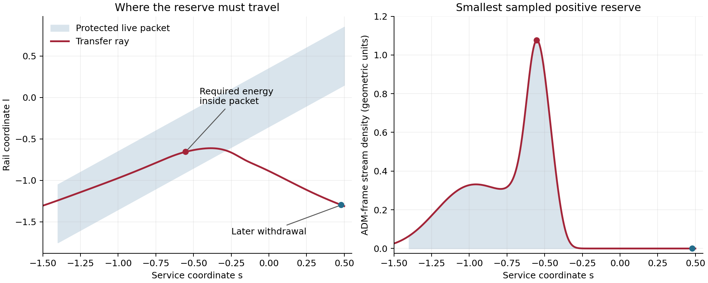

# Active endpoint exchange with a preloaded radial transfer sector

Date: 9 September 2026.

The tested freely radial transfer sector fails its non-live support assignment.
The endpoint's prescribed exchange requires a positive radiation reserve along
a characteristic that passes through the protected packet. A direct-metric
calculation confirms the witness before the ray reaches either the outer
medium taper or the exterior completion. This establishes a routing constraint
for this reservoir specialization. The bounded attempt ends at that gate;
localized material storage and jointly evolving endpoint histories remain open.

## Construction and scope

This bounded investigation uses the scheduled, repaired beta075 V5 metric.
The carrying shift, lapse, radial stretch, and angular capacity retain their
time dependence. The prepared substrate, endpoint medium, and transfer sector
have separate responsibilities. The calculation tests whether a positive,
preloaded radial radiation sector can supply the endpoint medium's opposite
exchange while respecting the protected live corridor.

The initial timing reconnaissance evaluates nine angular-jacket/receiver
schedules at seven previously established active witnesses. Every schedule
retains Type IV witnesses. Individual improvements accompany worsening at
other locations. This result ends that timing-only comparison and motivates
an explicit source and exchange construction.

The endpoint input is its archived regulated orthonormal tensor. Cubic
interpolation fills absent table cells with zero. An explicit C2 taper reaches
zero between absolute rail coordinates 1.9 and 2.1, and a C2 exclusion window
rises from zero to one between packet offsets 0.35 and 0.45. This defines a
continuous candidate medium for the transfer test. It modifies the archived
edge representation; its difference from the archived fitted tensor and the
geometric target remains a separate source-accounting quantity.

The complete geometric tensor continues to require its other assigned source
roles. This calculation supplies a candidate transfer tensor on a fixed active
background. A successful exchange calculation would precede tests of its
microscopic interaction, other component stresses, and metric backreaction.

## Causal transfer equations

Write the active metric as
\(ds^2=-\alpha^2dt^2+B^2(dx+\beta dt)^2+R^2d\Omega^2\).
Let \(n\) and \(e\) be its ADM time and radial unit vectors. The candidate is

\[
T_{\rm tr}^{ab}=\mu_+ k_+^a k_+^b+\mu_- k_-^a k_-^b,
\qquad k_\pm=n\pm e,\qquad \mu_\pm\geq0.
\]

It has density and radial pressure \(\mu_++\mu_-\), radial current
\(\mu_+-\mu_-\), and zero angular pressure. Angular response remains in the
endpoint medium and jacket. Its four-force is the opposite of the freshly
evaluated medium divergence on the same active metric.
The transfer tensor is distinct from the core residual role denoted by
\(R\) in the component ledger.

For medium divergence projections \(P=-n_b\nabla_aT_J^{ab}\) and
\(F=e_b\nabla_aT_J^{ab}\), define \(D_\pm=BR^2\mu_\pm\). Then

\[
\partial_t D_\pm+\partial_x(v_\pm D_\pm)
=\left(\alpha K^x{}_x\mp\frac{\partial_x\alpha}{B}\right)D_\pm
-\frac{\alpha BR^2}{2}(P\pm F),\qquad
v_\pm=-\beta\pm\frac\alpha B.
\]

These are spherical covariant radiation balance equations. Their conservative
organization follows the general relativistic transport formulation described
in the [Einstein Toolkit GRHydro documentation](https://einsteintoolkit.org/thornguide/EinsteinEvolve/GRHydro/documentation.html).
The implemented medium energy and momentum equations receive an independent
four-dimensional covariant-divergence check.

Along each characteristic the solution has the form
\(D=g(D_0+I)\), with positive homogeneous factor \(g\) and integrated forcing
\(I\). Positivity over the tested interval requires

\[
D_0\geq\max\{0,-\min_t I(t)\}.
\]

Thus the forcing determines a minimum preloaded energy for each ray. Any
additional positive initial or incident radiation increases its density
throughout that characteristic. A positive lower bound inside the packet
therefore supplies a direct obstruction to this freely propagating radial
completion, independent of choosing a larger reservoir reserve.

## Registered bounded calculation

The interval is service time \([-1.5,3]\): it includes live entry, carry,
release, and the first reset, with the original live interval retained. Rays
start over \([-9,9]\); the medium acts only inside \(|x|<2.1\). Metric
interpolation covers \([-6,6]\), with a C2 blend over \(5<|x|<6\) to the
specified unit-lapse analytic tails. The exterior representation error is
measured against the source evaluator. Edge preload and characteristic
coverage are monitored.

Four comparisons separate metric, transport, and archived-medium sensitivity:

| Comparison | Metric time/radial spacing | Medium input | Initial rays per direction | Time step |
| --- | --- | --- | ---: | ---: |
| Coarse | 0.025 / 0.05 | Baseline interpolant | 401 | 0.01 |
| Refined | 0.0125 / 0.025 | Same baseline interpolant | 801 | 0.005 |
| Time refinement | Same fine metric | Same baseline interpolant | 801 | 0.0025 |
| Source sensitivity | Same fine metric | Dense archived interpolant | 801 | 0.005 |

The dense archived medium has its own fit coefficients. It is a source
sensitivity comparison; transport convergence uses the pinned baseline
interpolant. Minimum preload obtained from sampled times is a lower bound,
since any missed intermediate minimum could only increase the required
reserve. Numerical integration errors receive the separate refinement checks.

The first physical gate requires nonnegative streams and zero transfer-sector
stress in the live packet. An interior witness uses an additional 0.05 radial
margin from the packet edge. A stable positive lower bound there ends this
candidate before attempting an Einstein-source repair. The calculation uses
up to four workers, with a 50 MB evidence allowance. The main disclosure stays
unchanged.

Implementation:
[`active_transfer_reservoir.py`](../toolkit/adm_harness_cli/adm_harness/active_transfer_reservoir.py)
and [`run_active_transfer_reservoir.py`](../toolkit/adm_harness_cli/scripts/run_active_transfer_reservoir.py).

## Results on the scheduled metric

The [timing reconnaissance](data/active_transfer_reservoir/timing_reconnaissance.csv)
retains six or seven Type IV witnesses in each of its nine schedules. The late
jacket plus late receiver reduces the principal reset frame-margin deficit
from 0.03869 to 0.01134, while increasing another sampled deficit from 0.00405
to 0.01322. Thus these particular timing changes move the mismatch between
locations. The underlying full active tensor still requires a source class
capable of its measured current and enthalpy combination. These seven-point
checks establish surviving witnesses, with broader timing optimization outside
the registered comparison.

The [four transfer runs](data/active_transfer_reservoir/reservoir_summary.csv)
all produce positive necessary radiation density in the packet interior:

| Comparison | Positive radial stream | Negative radial stream |
| --- | ---: | ---: |
| Coarse | 0.0135164 | 1.0758797 |
| Refined | 0.0135613 | 1.0754917 |
| Time refinement | 0.0135652 | 1.0755795 |
| Dense medium sensitivity | 0.0087919 | 1.1668688 |

Entries are the largest sampled interior witnesses of each stream's necessary
ADM-frame density, in the source harness's geometric units. The two maxima
occur at different events. Their positivity already violates the transfer
sector's zero-live-stress assignment. This assignment preserves the existing
separation between non-live support and designated live packet/collar roles.

The negative-direction ray gives a particularly local explanation. It starts
at \(\ell=-1.305\) at service coordinate \(s=-1.5\). At
\(s=-0.5525\), it lies at \(\ell\simeq-0.655398\), inside the
protected packet by 0.2471 coordinate units. Both the medium power and force
vanish there. Later, at \(s=0.48\), the same ray reaches
\(\ell\simeq-1.296437\), where its accumulated exchange requires
\(D_0\geq1.50535\). Its earlier source integral is zero, so that later
requirement forces a packet density of at least 1.075447 along this ray.
Larger initial reserve raises the earlier density further.

Consequently the intrusion comes from transporting stored energy along the
chosen null route. It persists even though the prescribed medium itself has
zero tensor and zero exchange inside the packet. The complete segment through
the later withdrawal stays within \(|\ell|\leq1.305\); the outer taper
begins at 1.9 and the metric completion begins at 5. This witness therefore
has no dependence on those outer modifications.



The figure uses the time-refined characteristic record. Blue shading identifies
the protected packet on the left and the in-packet portion of the required
stream density on the right. The later withdrawal fixes a positive reserve on
the earlier packet segment. The coordinate trajectory retains the active
carrying shift throughout.

## Verification and representation limits

The [direct-metric audit](data/active_transfer_reservoir/direct_metric_witness_audit.csv)
reintegrates this same initial ray, replacing metric interpolation with fresh
evaluations of all four scheduled fields. Its positivity bound uses only the
specified future event at \(s=0.48\): later reset or outer-tail behavior
cannot remove that already accumulated requirement.

| Same-ray calculation | Required packet density |
| --- | ---: |
| Fine metric interpolant, step 0.00125 | 1.07558072 |
| Direct metric, step 0.0025, derivative step 0.00002 | 1.07544566 |
| Direct metric, step 0.00125, derivative step 0.00001 | 1.07544665 |
| Direct metric with dense medium, step 0.0025 | 1.06743446 |

The two direct baseline calculations differ by about one part per million.
The dense fit changes the same-ray density by less than one percent and
retains the positive bound. Its larger all-ray maximum in the preceding table
occurs on a different initial ray.

The [medium representation audit](data/active_transfer_reservoir/medium_representation_audit.csv)
measures the taper and packet-window changes at archived knots. Over the
tested interval they remove 6.51% of the baseline and 6.70% of the dense
coordinate-spacetime integral of the sum of absolute moments. Individual
moment changes range from about 6% to 9%. This measure describes the selected
continuous input history. Source replacement and proper-volume weighted
Einstein residuals remain separate quantities. In particular the present
trial applies to this pinned medium representation; a material evolution
that changes its exchange history changes the transfer problem.

The initial interpolation check has maximum fine-grid errors of 0.181% in
lapse, 0.482% in shift using the recorded unit-floor normalization, 0.0235%
in radial metric, and \(5.22\times10^{-7}\) relative error in angular
metric. The subsequent [C2 exterior audit](data/active_transfer_reservoir/exterior_completion_audit.csv)
finds a maximum angular-metric difference of \(3.04\times10^{-6}\) on
its exterior sample; other field differences are below
\(5\times10^{-11}\). The direct witness bypasses both approximations.
The audit manifest distinguishes the original raw-grid preparation metadata
from the C2-completed evaluation used by the transfer runs.

The characteristic ordering remains positive on all four runs, and the two
outermost initial rays in each direction require zero preload. Strong
focusing nevertheless leaves the initial-energy quadrature unresolved: the
positive-direction coarse estimate is about 162, while the finer seed grid
gives about 39,023 in the same proper-energy units. The raw column named
`minimum_initial_proper_energy` is this sampled quadrature estimate. A reliable
total reservoir energy would require additional refinement in initial-ray
position. The local packet obstruction is independently verified on a fixed
ray, so that unresolved energy integral supplies no selection verdict here.

The focused test suite passes 36 tests, including independent 4D divergence,
stationary gravitational redshift and spherical dilution, manufactured
transport convergence, positivity bounds, packet exclusion, C2 exterior
matching, and the existing geometric/classifier and metric-regularity checks.
The four transport comparisons use four workers and finish in about 95
seconds after about 120 seconds of metric preparation. Retained evidence is
under 10 MB.

## Construction consequence

This trial converts a fitted opposite exchange current into explicit causal
transfer equations, counted initial energy, and a pointwise stress tensor
subject to positivity. Its new obstruction is specific: a freely radial
radiation reservoir cannot realize the prescribed endpoint exchange while
remaining in its assigned non-live support region. Microscopic emission and
absorption laws and complete Einstein-source matching would be further
requirements even if that gate passed.

The architecture's localized reservoir can instead retain energy and momentum
in material storage, stress, and controlled exchange. Realizing that option
requires an independently supplied tensor with the actual storage and reaction
forces, or a jointly evolved endpoint history whose exchange is compatible
with permitted transport paths. The existing director/support-stroke framework
specifies response variables for that task; its physical tensor remains open.
The present calculation establishes a concrete route constraint for such work
and ends the freely radial specialization at its registered barrier.

The standing substrate, radial backbone, angular jacket, packet trims, and
remaining geometric replacement residual retain their separate obligations.
The Le boundary question still concerns their complete supplied sum against
the active demanded tensor. A complete coupled An–T–Le construction remains
unresolved.

## Reproduction

From the repository root, use `PYTHONPATH=toolkit/adm_harness_cli` and one BLAS
thread per worker:

```sh
python toolkit/adm_harness_cli/scripts/run_active_transfer_reservoir.py --prepare --workers 4
python toolkit/adm_harness_cli/scripts/run_active_transfer_reservoir.py --workers 4
python toolkit/adm_harness_cli/scripts/audit_active_transfer_reservoir.py --workers 4
python toolkit/adm_harness_cli/scripts/plot_active_transfer_witness.py
```

The [input](data/active_transfer_reservoir/input_manifest.json),
[run](data/active_transfer_reservoir/run_manifest.json), and
[audit](data/active_transfer_reservoir/audit_manifest.json) manifests record
parameters, archived source hashes, execution settings, software hashes, and
the representation used. Regenerating preparation with the final code records
the C2 exterior directly in its metadata. The retained original preparation
manifest preserves the provenance of these archived runs.
