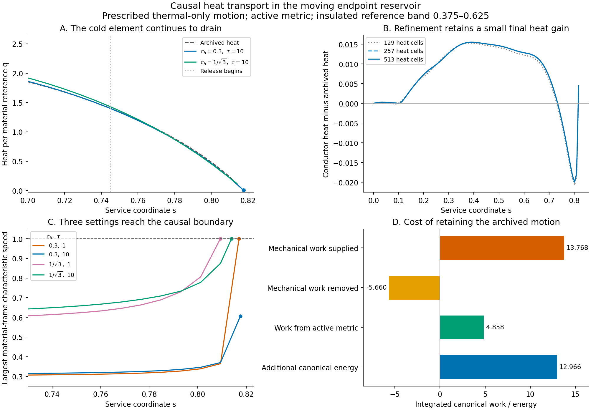

# Causal heat delivery to the active endpoint reservoir

Date: 10 September 2026.

Finite-speed conduction supplies a small, refinement-stable thermal gain
on the prescribed active reservoir motion. The surviving registered
setting retains heat 0.004462 at the original depletion event, with an
instantaneous drain of 25.39 per service-coordinate unit. Its heat
current also requires additional mechanical work and changes the local
normal-frame energy density by up to 12.6%. The result supports early
charging of distributed buffers and an explicit mechanical response to
their heat current. Sustained release service and the compliant end
couplings remain open construction requirements.

The [reservoir refinement](ACTIVE_RESERVOIR_ENSEMBLE_REFINEMENT.md) preserves
local heat and accounts for field and strain conversion, while its tested
allocations reach local depletion during release. The body's thermal
inventory grows over the same interval. This calculation tests whether a
conducting support can deliver some of that energy to the material
undergoing withdrawal before the recorded depletion event.

Heat/current routing remains an existing responsibility of the
[endpoint plant](../component_design/constraints/006_regulated_heat_current_medium_support_reservoir.md).
This investigation examines its missing connection to the reservoir's
moving material. The standing backbone, angular jacket, and other rail
components retain their assignments. The main disclosure and PDF retain
their existing design content.

## Registered causal-access screen

The input histories are the relaxing mixed reservoir at 32 and 64 cells,
and the relaxing thermal-only reservoir at 64 cells. Their final positive
states identify the first depleted material element. For each event,
trace signals backward through the full active metric, within the body
\(-2.1\leq\ell\leq-0.5\). The saved histories cover the interval
from \(s=0\) to their respective stopping times. Earlier preparation
remains a separate extension.

Let \(v\) be the local normal-frame material velocity and \(c_h\) a
signal-speed bound in that material's rest frame. The two characteristic
edges obey

\[
\frac{d\ell_\pm}{ds}=-\beta+\frac{\alpha}{B}
\frac{v\pm c_h}{1\pm v c_h}.
\]

The registered speeds are 0.1, 0.3, \(1/\sqrt3\), 0.9, 0.99, and
the null bound 1. These values characterize candidate signal cones. A
physical heat conductor still requires its own energy, momentum, entropy,
and constitutive response. In particular, a signal characteristic speed
alone specifies neither transported power nor available energy.

For a null ray, the material velocity cancels from its coordinate speed.
Its frequency measured by the normal observer evolves as

\[
\frac{d\log\omega}{ds}=\alpha K_\ell
 \mp\frac{\partial_\ell\alpha}{B}.
\]

Emitter and receiver energies include the additional factors
\(\Gamma(1\mp v)\). This supplies a counted null-packet frequency
comparison on the active background. Photon redshift is evaluated only
for the null controls. Emission, absorption, recoil, and the associated
material response remain physical transport duties.

The screen records the reachable material interval at selected service
coordinates and the latest emission time from eight material labels.
The large thermal reserve on the higher-label side receives particular
attention because the depleted element approaches negative normal-frame
velocity \(-0.9995\). A signal emitted behind that material must catch
its moving worldline.

The metric is evaluated directly from the archived active interpolants.
Saved positions and timelike material velocities use convex interpolation
between snapshots. Refinement compares the two material resolutions and
the integration step. A reachable edge that encounters a timelike body
end follows that end at earlier times; all counted routes remain within
the declared body. Five analytic controls verify relativistic velocity
addition, the null limit, flat moving-worldline emission deadlines, static
lapse redshift, and waiting at a confined timelike end.

## Constitutive basis for a possible continuation

Separately evolving material and entropy currents provide a suitable
starting point for finite heat propagation and reciprocal exchange.
[Comer, Andersson, Celora, and Hawke](https://arxiv.org/html/2606.17686v1)
derive such equations from dissipative relativistic actions. Their
small-drift reductions recover Cattaneo heat transport and permit an
explicit entropy-production analysis. The general nonlinear entropy
condition requires additional restrictions on the chosen constitutive
model. This distinction matters for the rapid motion and strongly
inhomogeneous temperature of the present reservoir.

## Causal-access results

The material label \(f\) is the enclosed reference coordinate divided by
its total span. All three histories first deplete at \(f=0.5\). For the
nearby warmer material at \(f=0.53125\), the latest emission times are:

| Rest-frame signal speed | Mixed, 32 cells | Mixed, 64 cells | Thermal, 64 cells |
|---|---:|---:|---:|
| 0.1 | Earlier preparation required | Earlier preparation required | Earlier preparation required |
| 0.3 | 0.041390 | 0.036089 | 0.039252 |
| \(1/\sqrt3\) | 0.144687 | 0.140174 | 0.142990 |
| 0.9 | 0.191709 | 0.187328 | 0.190081 |
| 0.99 | 0.199960 | 0.195587 | 0.198366 |
| 1 | 0.200802 | 0.196428 | 0.199202 |
| Arrival at depletion | 0.781846 | 0.764007 | 0.817564 |

For the mixed 64-cell history, halving the ray integration step from
0.002 to 0.001 changes the 0.3-speed deadline by \(1.1\times10^{-7}\)
and the null deadline by less than \(4\times10^{-15}\). The material
resolution comparison retains an approximately 0.004 shift in the
deadline and a 0.018 shift in depletion time.

The direction of delivery matters. At the mixed 64-cell event, a null
signal from \(f=0.46875\), on the lower-label side, can leave at 0.717317.
A 0.3-speed signal from that same element must leave by 0.083789. The
null cone's upper material edge contracts from \(f=0.61477\) at startup
to 0.501214 at \(s=0.5\), and to 0.5000053 at release entry
\(s=0.745\). Consequently, charging buffers from the higher-label side
requires early delivery. The large warm peak near \(f=0.75\) lies
outside this event's post-startup null access region.

For the limiting ray from \(f=0.53125\), the mixed 64-cell receiver
measures 0.24490 times the emitted comoving photon energy. From
\(f=0.46875\), the corresponding ratio is 2.5512. These directional
frequency changes accompany recoil and work exchanged with the moving
material and active geometry. Their incorporation into a supplied
transport tensor remains part of the energy accounting.

The numerical records are in
[the causal transport data directory](data/causal_reservoir_transport/).

## Registered entropy-current conductor replay

The next bounded calculation uses the archived thermal-only 64-cell
material motion and local heat source. A conductor acts over the central
material band \(0.375\leq f\leq0.625\), with insulated moving ends.
This band includes the depleted element and nearby donors, while the
external anchor compressions retain their separate mechanical
verification requirement. The initial temperature equals the archived
temperature and the initial relative heat current is zero.

This calculation evaluates transport and the additional force required
to retain the prescribed motion. A subsequent coupled material solution
would have to supply that force and update the endpoint interaction.
The archived thermal-only case provides the first replay because its
electrical conversion source vanishes. The remaining local heat source
is prescribed at its archived value.

Let \(a\) denote the dimensional reference coordinate used by the
numerical material model, with total span 1.6. Set \(T=q\), corresponding
to the existing unit heat capacity per material reference, and define
the rest-frame line heat flux \(J=nqr\). Its physical tensor is

\[
 T_{\rm heat}^{ab}=\frac{A}{R^2}J(u^as^b+s^au^b),
 \qquad A=0.4.
\]

Here \(s^a\) denotes the radial unit vector orthogonal to the material
four-velocity. The thermal conductivity is chosen as
\(\kappa=\tau c_h^2 n_{\rm phys}\), with
\(n_{\rm phys}=An/R^2\). Keeping the coefficient-derivative term in
the full Israel–Stewart heat equation gives the specialization

\[
 D r+\frac{r}{\tau}=-c_h^2(s^a\nabla_a\log q+a_s).
\]

The acceleration term permits gravitational thermal equilibrium. The
entropy current and its internal production are

\[
 S^a=n_{\rm phys}\left[
 \left(\log q-\frac{r^2}{2c_h^2}\right)u^a+rs^a\right],
 \qquad \nabla_a S^a\big|_{\rm internal}
 =\frac{n_{\rm phys}r^2}{\tau c_h^2}\geq0.
\]

This specialization follows the full heat equation and quadratic entropy
current reviewed by
[Maartens](https://arxiv.org/pdf/astro-ph/9609119). The underlying
hydrodynamic approximation requires a constitutive validity assessment
as the heat current grows. The positive production identity above is
an explicit property of the selected model; the combined elastic and
thermal characteristic spectrum remains a further coupled-system check.

With \(g=\alpha/\Gamma\), \(H=gn\),
\(C=\alpha a_s/\Gamma\), and prescribed local rate \(Q\), evolve

\[
 E=q(1+vr),\qquad Z=r+c_h^2v\log q,
\]
\[
 \partial_s E+\partial_a(Hqr)=Q-Cqr,
\]
\[
 \partial_s Z+\partial_a(c_h^2H\log q)
 =-\frac{gr}{\tau}-c_h^2C
  +c_h^2(\partial_s v+\partial_aH)\log q.
\]

The independently monitored entropy identity is

\[
 \partial_s\left(\log q-\frac{r^2}{2c_h^2}+vr\right)
 +\partial_a(Hr)=\frac{Q}{q}+\frac{gr^2}{\tau c_h^2}.
\]

The material-frame characteristic speeds are
\(w_\pm=(r\pm\sqrt{r^2+4c_h^2})/2\). The evolution stops at
\(q=10^{-8}\), at the causal boundary \(|r|=1-c_h^2\), or upon
loss of the combined material/current stress's Type-I or dominant-energy
domain. The transport-only zero-speed control retains \(r=0\).

The additional force per material reference is evaluated as

\[
 f_{\rm add}=(q-q_{\rm archive})a_s+D(qr)+\theta_\ell qr.
\]

Its canonical power density is
\(\alpha(\alpha v-B\beta)f_{\rm add}\). The diagnostic integrates
positive and negative mechanical work separately and also evaluates the
additional metric work directly from the changed stress tensor. Their
sum is compared with the change in canonical energy, independently of
the heat equation's conservative balance. All reference integrals carry
the measure \(4\pi A\,da\).

Five registered cases use \((c_h,\tau)=(0,1),(0.3,1),(0.3,10),
(1/\sqrt3,1),(1/\sqrt3,10)\). A larger \(\tau\) increases the
conductivity at fixed equilibrium signal speed while slowing relaxation.
The first mesh has 129 heat cells, including a center at \(f=0.5\),
with active background tabulation and maximum integration step 0.0005.
Refinement to 257 cells is reserved for cases that clarify a surviving
transport mechanism or a limiting gate.

Seven additional analytic controls exercise primitive inversion under
large boosts, characteristic transformation, the entropy identity,
closed-system conservation, the linear telegraph solution, Tolman
equilibrium through the insulated ends, and mechanical work for a moving
conductor. Together with the five ray controls, all 12 tests pass before
the active replay.

## First replay and numerical refinement

The first five runs retain a small positive temperature at the archived
depletion time only for \((c_h,\tau)=(0.3,10)\). Its minimum is
0.003847, its maximum characteristic speed is 0.6167, and its additional
positive mechanical work is 13.76. The initial heat inventory of the
conducting band is 6.873 in the stated reference measure. Canonical
mechanical work and this unweighted thermal inventory are distinct
quantities; both enter the subsequent accounting.

The three other finite-speed runs stop at a primitive-inversion limit
with a characteristic already close to unity. Their final states still
lie inside the analytic causal boundary. This identifies a numerical
conditioning check before a physical classification. The monotone
inversion now allows 64 safeguarded iterations, and an additional
analytic control recovers admissible states within \(2\times10^{-8}\)
of the constitutive boundary at material speed 0.99999. All 13 controls
pass. The initial runs retain their original implementation hashes in
the data directory.

The zero-speed replay reaches its heat floor about
\(7.9\times10^{-7}\) before the archived event. Its spurious
canonical-energy change is 0.00262, and the successful finite-speed
run has an independent canonical balance error of 0.00462. The next
comparison therefore repeats the registered cases with the resolved
inversion, then halves the background and time steps and doubles the
heat resolution for the zero control and the informative finite-speed
cases. This comparison tests whether the small thermal gain survives
both interpolation error and spatial refinement.

## Refined transport result

Resolving primitive inversion takes the three limited finite-speed cases
to their analytic heat-current causal boundary. Their temperatures and
combined material/current Type-I stresses remain admissible at the last
accepted state. The limit belongs to the chosen constitutive propagation
law.

| Equilibrium speed \(c_h\) | Proper relaxation \(\tau\) | Heat cells | Final \(s\) | Minimum \(q\) | Limiting gate |
|---|---:|---:|---:|---:|---|
| 0 | 1 | 513 | 0.817563623 | \(1.62\times10^{-8}\) | Positive-temperature floor |
| 0.3 | 1 | 257 | 0.817004176 | \(2.43\times10^{-5}\) | Heat characteristic reaches unity |
| 0.3 | 10 | 513 | 0.817563670 | 0.00446190 | Archived motion ends |
| \(1/\sqrt3\) | 1 | 129 | 0.809327883 | 0.103304 | Heat characteristic reaches unity |
| \(1/\sqrt3\) | 10 | 257 | 0.813925127 | 0.120161 | Heat characteristic reaches unity |

For the surviving \((0.3,10)\) setting, the temperature benefit changes
by 2.2% between the last two spatial levels. A separate 129-cell run
with the finest time tabulation changes its final heat by 0.50%, which
separates this temporal effect from the larger spatial correction.

| Heat cells | Background / maximum time step | Final minimum heat | Maximum independent canonical error |
|---:|---:|---:|---:|
| 129 | 0.0005 | 0.00384673 | 0.00461821 |
| 129 | 0.000125 | 0.00386582 | 0.0017201 |
| 257 | 0.00025 | 0.00436219 | 0.00120892 |
| 513 | 0.000125 | 0.00446190 | 0.00028192 |

The fine zero-speed control reaches the heat floor only
\(4.70\times10^{-8}\) before the reference event, with a local
temperature discrepancy of \(1.62\times10^{-6}\). This error is
approximately 0.036% of the surviving conductor's final temperature.
Its canonical error falls from 0.002581 at the first resolution to
0.0001534 at the finest. The heat equation's conservative ledger closes
within \(5\times10^{-15}\) across the reported comparisons. The
surviving conductor's excess over the continuum entropy balance falls
from \(1.20\times10^{-4}\) to \(1.02\times10^{-6}\) under
refinement, alongside its nonnegative constitutive entropy production.
These controls establish a resolved small thermal effect on the
specified material history.

At the depleted material label, the surviving conductor retains 0.153%
of its initial heat 2.91448. Its final heat rate is \(-25.3927\),
compared with the prescribed local rate \(-34.6513\). The current
and its coupling to the accelerating material therefore reduce the
instantaneous drain by 26.7%. The remaining heat divided by that drain
is \(1.76\times10^{-4}\) in service-coordinate units. This local
scale measures the small margin at the endpoint; the archive supplies
motion only through \(s=0.817564\), so further evolution requires a
new mechanical trajectory. The carrying-flow fade ends at 1.285 and
reset at 3.

The current remains subluminal in this prescribed-motion subsystem:
its largest material-frame characteristic speed is 0.60598. The
combined stress has \(2|J|/(\epsilon+p)=0.06172\) at its largest
final ratio. Over the run, the largest added normal-frame energy density
relative to the archived material density is 12.603%. The conducting
band's minimum coordinate clearance from the packet is 0.75039, with
the full declared body retaining its earlier minimum clearance 0.15.

## Required reciprocal force and work

Maintaining the archived motion under this current has the following
integrated budget, including the full \(4\pi A\) reference measure:

| Quantity | Canonical work / energy |
|---|---:|
| Positive mechanical work required | 13.768264 |
| Negative mechanical work required | −5.659962 |
| Net mechanical work required | 8.108301 |
| Additional work from the active metric | 4.857942 |
| Additional canonical energy | 12.965961 |
| Final independent balance residual | −0.000282 |

The maximum additional force per material reference reaches 36.13 at
the cold element. This force is the residual necessary to preserve the
prescribed motion after including the added heat tensor. A responding
support and endpoint contact law would have to produce it, or change
the material motion and hence the heat-delivery paths. The measured
work is a required port budget whose physical supplier remains to be
constructed.

The unweighted thermal inventory of the conducting band ends 0.11931
below its archived value. Consequently the local improvement comes
with redistribution and active mechanical/geometric exchange. The
complete conservation calculation retains these contributions through
the canonical budget above.

The same figure is available as a
[standalone PDF](figures/active_reservoir_causal_transport.pdf).

## Construction direction and bounded stopping point

The causal screen and conductor replay give compatible selection
criteria. Delivery from the warmer higher-label material requires early
charging of the receiver's buffer, while donors and receivers still
share a sufficiently wide causal access region. The closest
higher-label donor's deadline is about
0.20 even for light, and about 0.04 for a signal bounded by 0.3 in
the material rest frame. A conductor's evolving current can change
its characteristic speeds, so the separate null deadline supplies the
absolute comparison for this trajectory.

The lower-label null routes retain later access, as quantified above.
Their useful supplied power and reciprocal material response remain
separate transport questions.

Within the registered laws, extending heat-current memory provides a
small surviving margin. Increasing the equilibrium signal speed reaches
the constitutive causal boundary during release. These results favor
scheduled local preparation followed by counted transport and support
response. They supply a concrete requirement for the existing endpoint
heat/current plant's coupling to its reservoir.

The present calculation ends at this constitutive and reciprocal-force
checkpoint. The next coupled construction would need to evolve material
momentum, heat current, local buffer state, and endpoint exchange
together, including the complete characteristic spectrum. The earlier
fixed-anchor stress convergence problem retains its separate requirement
for finite compliant/dissipative end contacts. Sustained heat supply,
those contact tensors, and the complete active source closure remain
unsatisfied gates. The useful result of this round is the quantitative
timing, thermal-margin, and force budget that such a construction must
meet.

## Reproduction and evidence

The causal-access screen, conductor runner, local force audit, and figure
script reside in `toolkit/adm_harness_cli/scripts/`. The corresponding
two kernel modules and their 13 analytic tests are in `adm_harness/`
and `tests/`. Independent runs use at most four workers with a single
BLAS thread per process.

The data directory retains four causal-access screens and eighteen
conductor runs, including the initial inversion-limited evidence and
the subsequent resolution controls. Each input and software manifest
identifies its implementation by SHA-256. The
[integrity audit](data/causal_reservoir_transport/integrity.json) verifies
all 161 source references against current files or the recorded stage's
committed implementation. The local audits retain
sampled heat rates, force maxima, locations, and signed work rates.
The figure derives from those archived numerical records. Narrative
findings in this supporting report were written manually.
