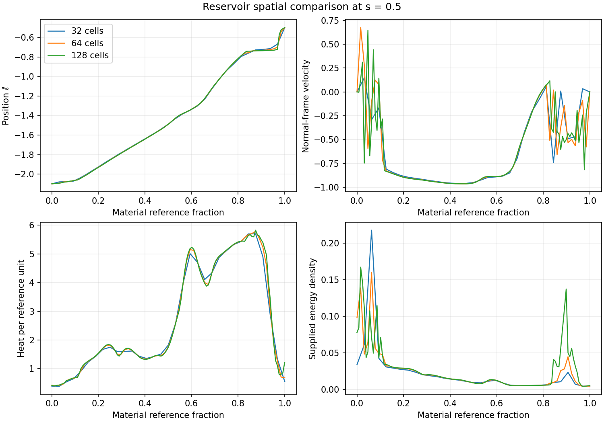

# Refinement of the active endpoint reservoir ensemble

Date: 10 September 2026.

The proposed reservoir combines elastic mechanical support, local thermal
storage, and a confined electromagnetic store with passive heat conversion.
Its endpoint partner remains the reconstructed heat/current medium on the
full scheduled rail metric. The present refinement first resolves the
internal-heat verification barrier identified in the
[electromagnetic comparison](ELECTROMAGNETIC_ENDPOINT_STORAGE_INVESTIGATION.md),
then tests the resulting response against its operating interval and source
accounting requirements.

The variational formulation resolves the earlier numerical loss of internal
heat, and the finite-relaxation extension supplies counted mechanical
heating with a causal longitudinal response. The registered allocations
still exhaust a local thermal element during release, while the total
thermal inventory grows. Spatial refinement also leaves unresolved
compressional stress near the fixed ends. These results identify heat
delivery along moving material and support-contact response as the next
joint-coupling requirements.

## Component responsibilities and operating gates

| Duty | Supplied variables and tensor | Required check |
| --- | --- | --- |
| Longitudinal support | Conserved material labels, deformation, and momentum; the existing positive-energy elastic law | Timelike material motion, positive ordered strain, causal longitudinal response, and counted end reactions |
| Thermal buffer | Heat per material reference unit, with positive heat capacity | Positive local heat throughout the required interval, with its complete power/work balance |
| Electromagnetic store | Radial electric flux and the Maxwell tensor, including angular pressure | Finite counted field energy, confined charge arrangement, reciprocal Lorentz work, and nonnegative Ohmic heating |
| Endpoint heat/current medium | The archived active fitted tensor and its power and force divergence | Opposite reservoir exchange on the prescribed history; a responding microscopic contact law remains required for a complete plant |
| Thermal redistribution | Existing endpoint routing plus an eventual material transport law | A local heat buffer supplies capacity. Any added internal heat current requires its own energy, momentum, propagation law, and exchange budget. |
| External support | Reaction forces at the two fixed material ends | Explicit force and power ports; their anchor material tensors remain a separate construction |

The first worldtube remains \(-2.1\leq\ell\leq-0.5\), starting at
service coordinate \(s=0\). The first verification interval ends at 0.5.
Successful candidates can then be tested through release at 0.745, the
carrying-flow fade ending at 1.285, and reset through 3. The earlier
preparation interval remains an additional spatial and causal matching task.
This late patch carries 35.75% of the previously measured full-interval
exchange weight. The original standing backbone, angular jacket, and live
handoff components retain their own duties.

## Material-coordinate energy formulation

Let \(a\) denote conserved material reference length and \(x(s,a)\) the
material position. With radial metric scale \(B\), lapse \(\alpha\),
shift \(\beta\), and areal radius \(R\),

\[
v=\frac{B}{\alpha}(\partial_sx+\beta),\qquad
\Gamma=(1-v^2)^{-1/2},\qquad
n=\frac{1}{B\Gamma\partial_a x}.
\]

The elastic line energy and pressure retain their previous definitions:

\[
\epsilon=n(m+q)+\frac K2(n-1)^2,\qquad
p=\frac K2(n^2-1),\qquad K=0.1,\quad m=1,\quad A=0.4.
\]

The reversible matter action is
\(-A\int\alpha B\epsilon\,dx\,ds\). The material-coordinate
description of relativistic elasticity and its variational stress are
developed in [Brown's review](https://arxiv.org/abs/2004.03641).
The discretization and electromagnetic specialization below are the present
calculation's choices.

Material cell \(i\) has conserved reference length \(\mu_i\), width
\(h_i=x_{i+1}-x_i\), and endpoint quadrature stretches
\(n_{i,j}=\mu_i/(B_j\Gamma_jh_i)\). Each cell contributes half its
action at each end, with that end's velocity and heat. This keeps the
canonical momentum inversion local while retaining a strain energy that
responds to each individual cell width.

Define nodal weights
\(M_j=(\mu_{j-1}+\mu_j)/2\), with one-sided half weights at the body
ends, and \(V_j=(h_{j-1}+h_j)/2\). A useful form of the matter Lagrangian
at node \(j\) is

\[
L_j=-A\alpha_j\left[
\frac{M_j(m+q_j-K)}{\Gamma_j}
+\frac{a_j}{\Gamma_j^2}+b_j\right],\qquad
a_j=\frac{K}{4B_j}\sum_{i\sim j}\frac{\mu_i^2}{h_i},\quad
b_j=\frac{KB_j}{4}\sum_{i\sim j}h_i.
\]

Its canonical momentum is

\[
\pi_j=AB_jv_j\left[M_j(m+q_j-K)\Gamma_j+2a_j\right].
\]

The electric variable \(Q_j=R_j^2E_j\) follows the same material label.
The discrete field energy is
\(U_{{\rm em},j}=B_jV_jQ_j^2/(2R_j^2)\), and the canonical energy is

\[
H=\sum_j\left[\alpha_j(U_{{\rm mat},j}+U_{{\rm em},j})
-\beta_j\pi_j\right].
\]

Material velocities and forces are derivatives of this same energy. Its
explicit temporal dependence supplies the geometric-work ledger. Therefore
the active lapse, shift, radial stretch, and angular evolution enter the
motion and energy balance together. The independently reported ADM-slice
energy is \(4\pi\sum_j(U_{{\rm mat},j}+U_{{\rm em},j})\); the canonical
energy has different lapse and shift weights.

The effective nodal number density is
\(n_j=M_j/(B_j\Gamma_jV_j)\). The material heat and electric flux obey

\[
\dot q_j=-\frac{\alpha R^2}{An}(P-vF)
+\frac{\alpha R^2}{An\Gamma}\sigma E^2,
\qquad
\dot Q_j=-\frac{\alpha\sigma}{\Gamma}Q_j.
\]

The conductivity remains the local passive switch from the preceding trial.
Because \(\partial H/\partial q_j=AM_j\alpha_j/\Gamma_j\), the heat
gain from Ohmic conversion cancels the field-energy loss in \(\dot H\).
For an ideal field and zero endpoint exchange, every \(q_j\) and \(Q_j\)
is constant under this material evolution. A thermal floor is a stopping
condition, with no heat injection or energy correction at that floor.

The endpoint momentum source is
\(-\alpha B^2R^2V_jF\). Together with the heat term it gives the
canonical power
\(-\alpha BR^2V_j(\alpha P-\beta BF)\). The constrained end momenta
have reaction forces derived from their required motion. Their canonical
work vanishes for fixed coordinate ends; their physical force and
shift-dependent ADM work remain counted ports.

## Registered comparison and verification

The total additional reserve uses the preceding ratio-4 prescription and the
capacitor flux profile. The main ensemble places three quarters of that
additional initial ADM energy into material heat and one quarter in the
field. Controls allocate the whole reserve to either store, remove the
reserve, disable resistance, or disable endpoint exchange. Initial material
positions, reference amounts, and coordinate-rest velocities are shared.
Adding heat at those velocities changes the initial canonical momentum by
its specified inertia contribution; this preparation differs from the
previous cellwise fixed-momentum allocation control.

Seven initial tests check Hamiltonian force and velocity derivatives, explicit
metric work, reciprocal Ohmic conversion, ideal preservation of material heat
and electric flux, resistive energy balance, and a controlled physical
heat-depletion event, and convergence of the discrete electromagnetic force
to the covariant Lorentz force. The old numerical method and evidence remain available
for comparison.

Active controls begin at 64 material cells and four workers. Spatial
refinement and time-step refinement distinguish continuum response from
integration error. The canonical energy is recomputed from positions,
momenta, heat, and field at each output; it is compared with independently
integrated geometric and endpoint power. The thermal ledger verifies the
implemented heat equation, while the recomputed energy checks whether that
heat was paid for by the combined system. A numerical limit receives its own
classification before any source-family conclusion.

The main disclosure and its PDF retain their existing design content. This
supporting report records the bounded research construction and its tests.

## First active verification milestone

The material-coordinate ideal-field control completes \(s=0.5\), preserving
every material heat value and electric flux. The previously observed
zero-exchange temperature collapse is removed. The forced field-only case
also reaches 0.5, with minimum heat 0.09118 and integrated Ohmic heat 0.03287
per solid angle. The mixed ensemble and thermal-only control retain minimum
heat 0.25 through the same interval. Their initial reserve follows the
registered fixed-energy allocation; the mixed ensemble's conductivity remains
inactive over this first interval because its thermal preparation covers
the withdrawal.

The original elastic-only control retains a physical heat stop, moving from
\(s=0.38387\) at 64 cells to 0.37998 at 128 cells. This approaches the
earlier refined depletion time while using explicit material heat evolution.

The first electromagnetic runs have recomputed canonical-energy errors near
0.5 against initial energies around 34,700. Direct directional derivatives
of the actual active states reproduce the registered energy-power identity;
the remaining error is accumulated time integration during strong compression.
Reducing the maximum step alone leaves much of it because the material-wave
step restriction is already controlling. The next verification therefore
also refines that restriction, from a Courant factor of 0.2 to 0.05, before
using the electromagnetic response for longer-interval conclusions.

## Time accuracy, spatial response, and release

The tighter Courant factor reduces the mixed ensemble's maximum canonical
energy error to 0.009092 through 0.5, a reduction of approximately sixtyfold.
At the final time, temporal refinement changes material positions by an RMS
of \(2.98\times10^{-5}\), velocities by \(3.04\times10^{-4}\), and heat by
\(2.23\times10^{-7}\). Relative RMS changes in density and radial stress
are \(5.42\times10^{-5}\) and \(7.24\times10^{-5}\), respectively.

Spatial refinement exposes a different limitation. At the last common
64/128-cell output, \(s=0.415\), the mixed ensemble has RMS position
and velocity differences of 0.00320 and 0.218. Its density and radial stress
differ by 55.5% and 47.6% in relative RMS. The thermal-only comparison at
0.5 gives 58.0% and 91.7% differences in those tensor components. The
undamped material develops short compressional waves whose supplied stress
requires further resolution or a physically specified dissipative response.
These comparisons use the same normalized material labels, with stress
evaluated on their respective trajectories.

The tight 128-cell electromagnetic run reaches its wall-time budget at
0.41921 with positive heat. The longer 64-cell runs instead reach the
positive-temperature stopping boundary: the mixed ensemble at 0.765334 and
thermal-only at 0.819701. Their maximum canonical-energy errors are 0.01169
and 0.0004932. Both stops occur during release, which begins at 0.745.
Consequently the original allocation provides a verified early heat buffer,
while the release heat duty remains open alongside spatial stress convergence.

## Registered internal-strain relaxation

The next bounded comparison adds one local mechanical relaxation variable
\(z\). Relativistic viscoelastic theories supply an established framework
for finite relaxation and entropy production; see
[Fukuma and Sakatani](https://arxiv.org/abs/1104.1416). Their results motivate
this component. The following energy law and its discretization are a
separate specialization derived for the present reservoir.

With physical rest mass \(m=1\), baseline stiffness \(K_0=0.1\), and
additional stiffness \(\kappa=0.1\), choose

\[
\epsilon=n(m+q)+\frac{K_0}{2}(n-1)^2
 +\kappa n\{\cosh(\log n-z)-1\},\qquad
p=\frac{K_0}{2}(n^2-1)+\kappa n\sinh(\log n-z).
\]

The added energy is nonnegative. At fixed heat and internal strain, define
\(c=m+q-K_0-\kappa>0\) and \(k=K_0+\kappa e^{-z}\). Then

\[
\epsilon_n=c+kn,\qquad p_n=kn,\qquad
c_L^2=\frac{kn}{c+kn}\in(0,1),\qquad
\epsilon-p=nc+K_0+\kappa e^z>0,\qquad
\epsilon+p=n(c+kn)>0.
\]

These inequalities give the material's positive energy, dominant-energy
margin, and causal frozen-strain longitudinal characteristic throughout
\(n,q>0\), \(z\in\mathbb R\), and \(K_0+\kappa<m\).
They concern the longitudinal constitutive system on the prescribed
background. Full transverse and coupled gravitational stability retain
their separate tests.

Let \(\delta=\log n-z\). The continuum relaxation law, in material proper
time, is

\[
\frac{dz}{d\tau}=\frac{\delta}{\tau_r},\qquad
\left.\frac{dq}{d\tau}\right|_{\rm rel}
=\frac{\kappa\delta\sinh\delta}{\tau_r}\geq0,
\qquad \tau_r=1.
\]

The heat gain exactly equals the loss from internal-strain relaxation.
It therefore supplies damping with counted energy and nonnegative entropy
production for the unit-heat-capacity choice \(S=\log q\). The reference
strain evolves locally with finite proper relaxation time.

For the existing two-endpoint quadrature, each node uses
\(n_{\rm rms}=\sqrt{\tfrac12\sum\mu_i^2/h_i\,/V_j}/(B\Gamma)\)
and \(n_{\rm eff}=M_j/(B\Gamma V_j)\). The nodal rates replace
\(\delta\) by \(\log n_{\rm rms}-z\) and multiply the heat rate by
\(n_{\rm rms}/n_{\rm eff}\). This preserves exact cancellation in the
discrete canonical energy. The action coefficients acquire
\(K_0+\kappa e^{-z}\) and \(K_0+\kappa e^z\) in their quadratic
and constant terms, while their linear term contains \(m-\kappa\).
That linear coefficient is the algebraic expansion of the displayed
positive energy; the physical rest mass remains one.

Initialization sets \(z=\log n_{\rm rms}\), minimizing the nodal
internal-strain energy. Neighboring quadrature densities can differ, so
their finite-grid minimum has a small positive energy that remains in the
reported initial inventory. The same reserve allocation and active endpoint
history are retained. Four 32-cell controls compare the mixed ensemble,
thermal-only storage, a frozen internal strain with identical initial
elastic energy, and an unforced mixed ensemble. The single registered
choice \(\kappa=0.1,\tau_r=1\) precedes any active result. Spatial
refinement, release survival, and independent canonical-energy balance
determine whether this refinement is useful.

Six constitutive and evolution tests cover the energy-derived pressure and
wave speed, the zero-modulus limit, reciprocal relaxation heating,
Hamiltonian forces, and energy and anchor-momentum balances in both a
flat control and a metric with active lapse, shift, radial scale, and radius.

## Active relaxation results

All four 32-cell controls reach the early checkpoint. The relaxing mixed
ensemble has minimum heat 0.38475 at \(s=0.5\), while the thermal-only
case has 0.39316. At 64 cells these values become 0.40243 and 0.40512;
the mixed 128-cell result is 0.40010. The minimum across each complete
early history remains the prepared value of 0.25. The frozen-strain
control retains 0.25 through this interval.

The mixed 64-cell initial ADM-slice energy is 122.12969, including
thermal inventory 21.11821 and field energy 5.19065. Its initial canonical
energy is 34,688.60419. The thermal-only allocation has the same initial
slice energy and thermal inventory 26.30272. For this prepared reference
profile, the added strain branch starts at its zero-energy minimum to
roundoff. Thus the initial comparison includes a different constitutive
response at the same measured initial energy.

The relaxation extension improves the independent canonical-energy balance:
the mixed 64-cell error through 0.5 is \(4.40\times10^{-6}\), and the
128-cell error is \(2.06\times10^{-5}\). Its 64-cell release run has
maximum error \(2.41\times10^{-5}\), approximately
\(7.0\times10^{-10}\) of initial canonical energy. The corresponding
thermal-only error is \(5.32\times10^{-5}\). Direct directional
derivatives of the saved active states reproduce the instantaneous energy
identity to relative errors below \(6.4\times10^{-8}\) in these two
release cases. Their momentum derivatives, including end reactions, agree
to below \(4.4\times10^{-7}\). These derivative checks are independent
of the accumulated power ledger.

### Release remains limited by local heat delivery

| Material and allocation | Cells | Local heat stopping coordinate |
| --- | ---: | ---: |
| Original elastic law, mixed reserve | 64 | 0.765334 |
| Relaxing strain, mixed reserve | 32 | 0.781846 |
| Frozen strain, mixed reserve | 32 | 0.781294 |
| Relaxing strain, mixed reserve | 64 | 0.764007 |
| Original elastic law, thermal-only reserve | 64 | 0.819701 |
| Relaxing strain, thermal-only reserve | 32 | 0.836577 |
| Relaxing strain, thermal-only reserve | 64 | 0.817564 |

The close frozen/relaxing pair isolates the limited effect of relaxation on
this depletion event. Moreover, the same-resolution comparison with the
original elastic law shows that the extension supplies essentially the
same release reach. The resolution spread limits the precision assigned
to each continuum event time; the repeated local depletion during release
is the common result.

In the relaxing mixed 64-cell run, the depleted element has material
reference fraction 0.5 and position \(\ell=-1.63594\). Its normal-frame
velocity is \(-0.999484\), and its effective number density is
\(1.0522\times10^{-3}\). The local heat rates per reference unit and
service coordinate are

\[
\dot q_{\rm endpoint}=-31.04070,\qquad
\dot q_{\rm electrical}=0.21650,\qquad
\dot q_{\rm relaxation}=0.06596.
\]

Together the two local conversion channels replace 0.91% of the imposed
instantaneous withdrawal. Meanwhile, the whole body's thermal inventory
has increased from 21.11821 to 23.94205. The thermal-only run similarly
grows from 26.30272 to 27.93968 before its first element runs cold.
Thus the tested body has available stored heat elsewhere while the
withdrawal concentrates on a dilute, rapidly moving material element.

The heat equation displays the mechanism explicitly:
\(\dot q_{\rm endpoint}=\alpha R^2(-P+vF)/(A n_{\rm eff})\).
The prescribed endpoint exchange acts on the evolving material density
and velocity; local conversion depends on the field and strain energy
available at that same element. Causal heat redistribution, preparation
matched to material trajectories, or responding endpoint exchange could
alter this balance. Each requires its counted transport or preparation law.
The present evidence constrains the registered allocation and passive local
conversion law; it leaves those further constructions open.

### Supplied stress requires a resolved end-region response

At \(s=0.5\), the mixed 64/128-cell comparison has whole-body relative
RMS differences of 46.5% in density and 56.3% in radial stress. Its velocity
RMS difference is 0.176. The reference intervals adjoining the two ends,
\([0,0.15]\) and \([0.85,1]\), contain 97.6% of the squared density
error and 99.6% of the squared radial-stress error.



The central trajectories and heat profiles show useful agreement, while
the end regions contain sharp compressions and oscillatory velocity.
An additional comparison at fixed spatial coordinates, weighted by proper
volume, gives density L1 differences of 8.41% for 32/64 cells and 8.54%
for 64/128 cells. The corresponding radial-stress differences decrease
from 8.48% to 5.34%. Consequently the present discretization has yet to
establish a converged complete supplied tensor. The end-region partition
locates the difficulty; all body regions remain in the acceptance scope.

Finite local strain relaxation preserves the counted energy and entropy
exchange, but its present implementation leaves those compression fronts
unresolved. Further numerical work requires an entropy-consistent treatment
of steep material fronts, with the associated mechanical heating, and
verification against resolved controls. A physical support completion also
requires a responding contact and anchor tensor in place of the prescribed
position constraints. Increasing grid size alone has yet to establish that
completion on the tested resource budget.

## Requirement disposition and bounded stopping point

| Requirement | Result of this investigation |
| --- | --- |
| Full active metric and protected packet separation | Retained; lapse, shift, both metric scales, and temporal derivatives remain active. The tested body stays outside the packet, with initial gap 0.15 and increasing separation. |
| Positive material energy and causal longitudinal response | Established for the registered constitutive domain; all completed portions retain positive heat, ordered cells, timelike motion, and subluminal longitudinal characteristics. |
| Reciprocal field/strain conversion and independent energy accounting | Verified in constitutive tests, controlled evolutions, and active-state derivative audits. Ideal material heat and electric flux are preserved. |
| Early thermal-buffer duty through 0.5 | Completed by the mixed and thermal-only allocations, including the mixed 128-cell run. |
| Local heat throughout release, fade, and reset | Open: both allocations deplete locally during release, before the fade ends at 1.285 or reset reaches 3. |
| Converged supplied stress across the body | Open: compression fronts near the constrained ends remain sensitive to spatial resolution. |
| Complete physical endpoint and anchor coupling | Open: the endpoint fitted tensor imposes the exchange, while end reactions are counted ports. The responding endpoint/contact laws and anchor tensors remain to be supplied. |
| Complete rail source and earlier preparation | Beyond this late-patch construction, which carries 35.75% of the archived full-interval exchange weight. Earlier preparation, the other rail components, and joint gravitational closure retain their own duties. |

The bounded investigation stops at local heat-delivery and stress-resolution
barriers. It establishes a more complete thermodynamic reservoir model and
an explicit failure mechanism. The useful continuation keeps the existing
role separation: heat/current routing must track the material receiving
the withdrawal, mechanical support must supply a resolved contact response,
and the store must pay for every transfer. A responding endpoint law would
change its trajectory, so that partner's tensor and service gates would
then be recomputed with the reservoir.

## Evidence and reproduction

The [numerical evidence directory](data/material_ensemble/) contains case
summaries, full saved material states, histories, input and software hashes,
regional comparisons, local-port audits, and the plotted profiles. Scripts
produce numerical evidence; this report is manually authored. The focused
constitutive and reservoir suite passes 35 tests. Production controls use
four concurrent workers, with one BLAS thread per worker. The complete
evidence set occupies approximately 8 MB.

The [integrity audit](data/material_ensemble/evidence_integrity.json) checks
all 30 saved runs, their input hashes, and their production-software hashes
against the current files or recorded Git versions. Eighteen runs complete
their requested interval, nine reach a material-domain boundary, and three
reach their computation budget. It also records numerical-file checksums
and verifies positive saved heat, finite states, ordered material cells,
and agreement between each stopping status and final stored time.

Representative reproduction commands, from the repository root, are:

```bash
export OPENBLAS_NUM_THREADS=1 OMP_NUM_THREADS=1 MKL_NUM_THREADS=1
export PYTHONDONTWRITEBYTECODE=1 PYTHONPATH=toolkit/adm_harness_cli
python toolkit/adm_harness_cli/scripts/run_material_ensemble.py --workers 4 --cells 64 --duration .5 --cases ideal_control field_only ensemble thermal_only
python toolkit/adm_harness_cli/scripts/run_material_ensemble.py --workers 2 --cells 64 --duration 3 --snapshots 601 --max-step .0005 --cfl .05 --deadline 600 --cases ensemble thermal_only
python toolkit/adm_harness_cli/scripts/run_relaxing_ensemble.py --workers 4 --cells 32 --duration .5 --deadline 300
python toolkit/adm_harness_cli/scripts/run_relaxing_ensemble.py --workers 2 --cells 64 --duration .5 --cases ensemble thermal_only
python toolkit/adm_harness_cli/scripts/run_relaxing_ensemble.py --workers 2 --cells 64 --duration 3 --snapshots 601 --deadline 540 --cases ensemble thermal_only
python toolkit/adm_harness_cli/scripts/run_relaxing_ensemble.py --workers 1 --cells 128 --duration .5 --deadline 480 --cases ensemble
python toolkit/adm_harness_cli/scripts/audit_material_ensemble.py relaxing/ensemble_baseline_n64_end0.5_dt0.0005_snap101_cfl0.05 relaxing/ensemble_baseline_n128_end0.5_dt0.0005_snap101_cfl0.05 --name relaxing/ensemble_space_regional_64_128
python toolkit/adm_harness_cli/scripts/audit_material_ensemble_ports.py relaxing/ensemble_baseline_n64_end3_dt0.0005_snap601_cfl0.05
python toolkit/adm_harness_cli/scripts/verify_material_ensemble_evidence.py
```

Each case manifest identifies its code and input versions. Wall-time budgets
are machine-dependent; the saved status distinguishes a compute limit from
a constitutive-domain stop. The release cases listed above finish at the
registered heat boundary with positive stored heat approaching the floor,
and their states receive no floor correction or external heat injection.
