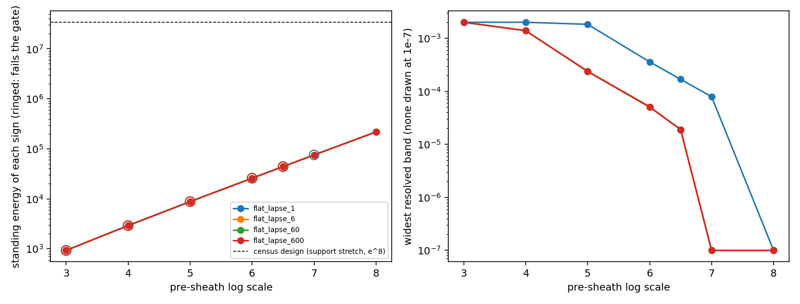

# Amplitude Pass: Flat Support and Minimum Pre-Sheath

Date: 2026-09-23. Context: the [demand census](DEMAND_CENSUS.md) found that
the standing energy follows the stretch alone and grows with the largest
stretch in the geometry. In the census design that stretch is the support's
630 times the conformal pre-sheath's \(e^{8}\). This pass removes the
support stretch and lowers the pre-sheath to the smallest scale the gate
allows. Code: `scripts/run_amplitude_pass.py`, with data in
[data/amplitude_pass](data/amplitude_pass/).

## Result

The support needs no stretch. The gate sets the pre-sheath at \(e^{7}\),
and the resulting design demands 450 times less energy than the census
design, while the service stays unchanged.

- **Design.** The support is flat: \(C_0=B_0=1\), so the stretch is one
  everywhere in the service region. A support lapse of 6 remains. The
  boundary layer is the wide stack with a conformal pre-sheath of
  \(e^{7}\). The 2.1c lane, the path choreography and the packet lapse
  envelope are those of the [choreography pass](CHOREOGRAPHY_PASS.md).
- **Service.** The packet reaches \(\ell=5\) at \(\sigma=3.34\), 1.66
  ahead of light through flat space. It stays timelike from the approach to
  the track end, with a worst normalized norm of −0.0975 while coasting.
- **Gate.** Over \(\sigma\in[-8,10]\) and \(|z|\le8\), all 5.05 million
  non-vacuum boundary-layer points are Type I. Refined, all 10.17 million
  are Type I. Root-finding at the 60 widest-estimate samples resolves 60
  flux-carrying crossings with no band. The exterior is exactly vacuum.
- **Demand.** The energy of each sign falls from \(3.39\times10^{7}\) to
  \(7.5\times10^{4}\) and the proper negative-null content from
  \(4.5\times10^{7}\) to \(8.3\times10^{4}\).
- **Audits.** The audits cover the approach, carry, release and coast.
  Radial escape is complete and entry reachability finds no hits. No trace
  enters a both-shrinking region, and dense bundles show no crossings.



The left panel plots the standing energy of each sign, with rings marking
designs that fail the gate. The right panel plots the widest resolved band.
The curves for support lapses 6, 60 and 600 coincide.

## Screen

The screen crosses four flat supports, with support lapse 1, 6, 60 and 600,
against seven pre-sheath scales. For each design it classifies every node
over the transit, \(\sigma\in[-8,3]\) and \(|z|\le8\) at spacing 0.1. It
then root-finds every flux-carrying crossing at the 60 samples with the
widest estimated bands. The table gives the lapse-6 support.

| Pre-sheath | Type IV nodes | Samples with bands (widest) | Energy of each sign | Content, coordinate / proper |
|---|---:|---|---:|---:|
| \(e^{3}\) | 64 | 30 (\(\ge2\times10^{-3}\)) | 929 | 179 / \(1.4\times10^{3}\) |
| \(e^{4}\) | 5 | 60 (\(1.4\times10^{-3}\)) | 2,917 | 189 / \(3.8\times10^{3}\) |
| \(e^{5}\) | 0 | 60 (\(2.4\times10^{-4}\)) | 8,791 | 201 / \(1.1\times10^{4}\) |
| \(e^{6}\) | 0 | 49 (\(5.0\times10^{-5}\)) | \(2.6\times10^{4}\) | 213 / \(2.9\times10^{4}\) |
| \(e^{6.5}\) | 0 | 15 (\(1.9\times10^{-5}\)) | \(4.4\times10^{4}\) | 219 / \(4.9\times10^{4}\) |
| \(e^{7}\) | 0 | 0 | \(7.5\times10^{4}\) | 226 / \(8.3\times10^{4}\) |
| \(e^{8}\) | 0 | 0 | \(2.2\times10^{5}\) | 239 / \(2.3\times10^{5}\) |

Widths of \(2\times10^{-3}\) fill the root-finder's widest search span, so
they are lower bounds.

The other supports follow a similar pattern:
- **Lapse 60 and 600.** The energies are identical and the bands nearly so,
  clearing at \(e^{7}\). At \(e^{6}\) each leaves one unresolved node.
- **Lapse 1.** This support has no lapse hill. It keeps 8 banded samples at
  \(e^{7}\) and clears at \(e^{8}\).

The selection takes the least energy among designs with no Type IV node, no
unresolved node, no resolved band and a timelike packet. Coordinate content
breaks the tie between lapses 6, 60 and 600, and it selects lapse 6 at
\(e^{7}\).

Band width falls by about \(e^{1.5}\) per unit of pre-sheath scale. A
node-level screen misses these bands: from \(e^{5}\) upward every node is
Type I while resolved bands persist to \(e^{6.5}\). The three supports
with a lapse hill share the threshold, so the pre-sheath sets it.

The energy grows as \(e^{\varphi}\) with the pre-sheath scale and is
independent of the support lapse, as the census identity requires. The
lapse enters only the stresses, and the coordinate content rises by 2–7%
from lapse 6 to lapse 600.

## Selected design against the census design

| Measure | Census design (support stretch 630, \(e^{8}\)) | Flat support, lapse 6, \(e^{7}\) |
|---|---:|---:|
| arrival at \(\ell=5\) (lead over light) | 3.34 (1.66) | 3.34 (1.66) |
| energy of each sign | \(3.39\times10^{7}\) | \(7.5\times10^{4}\) |
| proper negative-null content | \(4.47\times10^{7}\) | \(8.3\times10^{4}\) |
| coordinate negative-null content per unit σ | 572 | 226 |
| proper volume | \(1.15\times10^{9}\) | \(3.4\times10^{6}\) |
| volume share: ordinary / NEC-respecting / NEC-violating | 0.003% / 57% / 31% | 0.4% / 63% / 30% |
| share of energy alongside the support | 99.6% | 43% |
| \(G\mu/c^2\) along the track, each sign | \(1.97\times10^{4}\) | \(6.6\times10^{3}\) |
| one transit, coordinate / proper content | +76 / \(-1.1\times10^{6}\) | +221 / \(+2.1\times10^{3}\) |
| deepest transit null energy, service region | −3.19 | −3.19 |
| static-frame speed, maximum | 0.28 | 0.095 |
| source speed relative to static observers, maximum | 0.32 | 0.11 |
| light through the standing geometry reaches \(\ell=5\) at | 0.85 | 1.23 |

The flat support moves the energy onto the track. Of the \(7.5\times10^{4}\)
of each sign, 54% lies along the track at \(2.4<|z|\le5.5\), where the
pre-sheath alone raises the stretch, and 43% lies alongside the support.
The class shares barely change between the two designs. The standing
demand is now small enough that one transit adds about one σ of it in the
coordinate measure. The deepest transit point is unchanged. It lies on the
leading flank of the packet lapse window as the window switches on during
the approach, and the support plays no part in it.

The lapse envelope ratio exceeds one at 15 samples, with ratios up to 1.59.
Thirteen lie on the approach near \(z=-4.8\), where the packet lapse window
switches on, and two at \((0.2,-2.1)\). The classifier finds them Type I.

## Service audits

The ledger spans \(\sigma\in[-8,15]\) and \(|\ell|\le8\) (42,343 points),
so it covers the approach that earlier ledgers began after.

| Audit | Flat support, lapse 6, \(e^{7}\) |
|---|---:|
| live packet points (spacelike), maximum norm | 707 (0), −0.19 |
| radial escape (escaped/expected, stalled) | 1876/1876, 0 |
| entry reachability hits | 0 |
| centerline probes escaped (maximum norm) | 24/24 (−0.0975) |
| probes in transit when the ledger window closes (minimum null speed) | 20 (1.0) |
| traces entering both-shrinking | 0 |
| dense-bundle crossings (minimum width ratio) | 0 (1.0) |

The live maximum of −0.19 is the flat-space norm of the approach at 0.9c.
The probes in transit are minus-branch null rays seeded at
\(\sigma=4.3\)–5.9. They cross the flat support at light speed and stand
at \(\ell=-7.8\) to \(-4.6\) when the window closes at \(\sigma=15\).

## Physical scale

| Measure | Census design | Flat support, \(e^{7}\) |
|---|---:|---:|
| energy of each sign, recorded normalization (1 unit = 204 \(\ell_P\)) | 150 kg | 0.33 kg |
| energy of each sign, one unit = 1 m | \(2.3\times10^{4}\,M_\odot\) | \(51\,M_\odot\) |
| energy per unit length along the track, each sign, any scale | \(13\,M_\odot\) per metre | \(4.4\,M_\odot\) per metre |

The along-track figure depends only on shape. It is the pre-sheath's
\(e^{7}\) times a factor near 6, in units of \(c^2/G\), which is 0.7
Jupiter masses per metre.

## Open items

1. **Pre-sheath length.** The pre-sheath now carries the energy. It is
   needed wherever the moving shift crosses the boundary layer. The packet
   windows switch on at \(\sigma\approx-7\) during the approach, so the
   shift, and with it the sheathed length, reaches \(|z|=6.5\). Switching
   the windows on at the entry would confine the sheath near the support
   and roughly halve the energy. It would also move the approach minimum of
   −3.19.
2. **Staging in time.** The pre-sheath is needed only while the shift is
   live. A pre-sheath that rises for each transit would remove most of the
   standing demand. A stretch that changes in time splits the radial
   Hessians, which is the mechanism of the earlier bands, so this needs its
   own gate.
3. **Source evaluation.** The scaling test of candidate source families
   runs on this design. Its roles are the same as in the census: balanced
   energy shells, pure stress in the lapse sheath, the service-region
   pressure, and moving stress during the carry.

## Reproduction

```bash
OPENBLAS_NUM_THREADS=1 python toolkit/adm_harness_cli/scripts/run_amplitude_pass.py --workers 6
```

The run takes about 51 minutes with six workers: 36 for the screen and its
band resolution, and 15 for the selected design's gate, refinement, census,
audits and light channel. `--screen-only` stops after the selection. The
manifest records the supports, pre-sheath scales, selection rule, checks and
software hashes.
