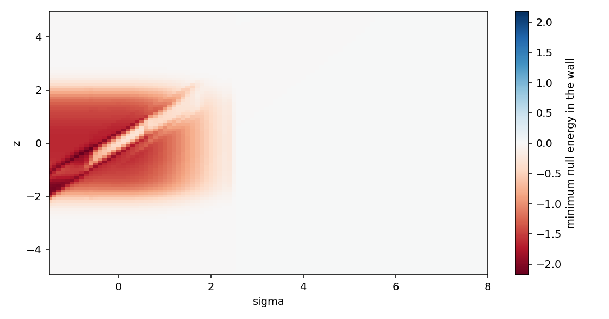
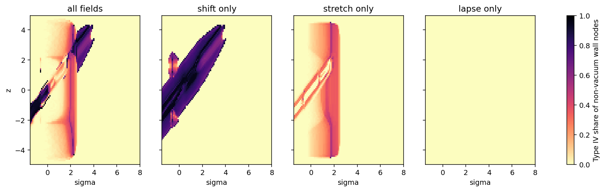

# Axial Track: the Service Track within One Space

Date: 2026-09-23. Decision context: termination option (4) of the
[constant-radius track](CONSTANT_RADIUS_TRACK.md), a track inside a single
asymptotically flat space, modelled exactly. Code:
`adm_harness/axial_track.py`, the generated kernel
`adm_harness/axial_einstein_generated.py` (from
`scripts/derive_axial_track_einstein.py`) and the independent check
`adm_harness/numerical_einstein.py`. Gate: `scripts/run_axial_track_gate.py`
with data in [data/axial_track_gate](data/axial_track_gate/). Boundary-layer
probes: `scripts/run_axial_wall_probes.py` with data in
[data/axial_wall_probes](data/axial_wall_probes/).

The service region is the cylinder around the packet's line of travel where
the service fields take their full values. The transverse boundary layer is
the surrounding shell where those fields return to flat space. Both terms
name regions of the geometry. The C1 source units that produce it are
separate, physically isolated assemblies coupled through fields. In code and
data, `core` refers to the service region and `wall` to the transverse
boundary layer.

## Result

The service track embeds exactly in one flat space. Inside the service
region, spacetime is the product of the service metric with a flat transverse
plane. The along-track null energies vanish identically there, the stress is
Type I, and both transverse pressures equal \(-K/8\pi\), where \(K\) is the
Gaussian curvature of the service metric. Beyond the transverse boundary
layer and beyond the service cutoff the metric is exactly Minkowski: the
largest stress component outside the layer is 0 at every sample. The end
transitions and their opening requirement are gone.

The transverse boundary layer matches the service fields to that exterior,
and with the transplanted beta075 service it fails the geometry-demand gate.
In the base design, 74,700 of the 374,187 non-vacuum boundary-layer points are
Type IV (20%). They occur at 2,844 of the 21,384 \((\sigma,z)\) samples,
including all 217 live packet samples. Halving the jet step gives 74,702, so
the layer is stable under refinement. Field attribution on the same data
gives no Type IV for the lapse alone, 120,363 points for the carry shift alone
and 53,576 for the stretch alone.

Three exact identities of the axial metric account for this outcome. First, a
shift with a transverse gradient carries a momentum flux linear in the shift,
while its null-energy sum is quadratic, so the flux dominates at every edge
of the shear layer. Second, a stretch that changes in time splits the two
radial null Hessians of the stretch, which leaves a band wherever their
static part changes sign. Third, a lapse carries no energy flux, so a
boundary layer with a static spatial metric and zero shift is Type I for any
lapse history.

The probes locate a boundary-layer structure that passes. The static stretch
transition comes first, the shift transition follows where the stretch has
returned to one, and a strong lapse gradient (\(\log\alpha\gtrsim4\))
envelops both. A stretch that decays inside this envelope leaves a band
narrowed by the large lapse: its width is \(1.3\times10^{-5}\) at a decay rate
of 0.3. The transplanted service meets neither condition. Its decompression
and packet radial windows vary the stretch in time, and its carry shift sits
partly at the support edges, where the service lapse is weak.

## Construction

The metric on \((\sigma,z,r,\phi)\) with \(\phi\) a Killing direction is

\[
ds^2=-\alpha^2d\sigma^2+A^2(dz+\beta\,d\sigma)^2+dr^2+C(r)^2d\phi^2 .
\]

In the service region \(r\le r_c\), the fields \(\alpha\),
\(A=\sqrt{\gamma_{\ell\ell}}\) and \(\beta\) are the C∞ service fields of the
constant-radius track, with the rail coordinate read as \(z\) and the same
service cutoff over \(4\le|z|\le5\). Across the transverse boundary layer
\(r_c\le r\le r_c+w\), the blend \(\chi(r)=1-S(u)\) takes the flattened
minimum-jerk step \(S\) of the constant-radius design rule, with join
fraction 0.1. Its argument is either linear, \(u=(r-r_c)/w\), or logarithmic,
\(u=\log(r/r_c)/\log(1+w/r_c)\). The blend applies to \(\log\alpha\),
\(\log A\) and \(\beta\). The transverse profile is flat, \(C=r\).
Alternatively it carries a string cushion, \(C''=-K_\Sigma\chi(r)C\), a
spherical cap across the service region joined to a cone outside.

| Design | Service-region radius | Layer width | Spacing | Transverse profile |
|---|---:|---:|---|---|
| base | 1.75 | 1 | linear | flat |
| layer 0.5, 2, 4 | 1.75 | 0.5, 2, 4 | linear | flat |
| layer 4 log, 16 log | 1.75 | 4, 16 | logarithmic | flat |
| region 1, region 3 | 1, 3 | 1 | linear | flat |
| string cushion | 1.75 | 1 | linear | \(K_\Sigma=1/1.75^2\) |

Each design runs on the current reset schedule. The base design also runs on
the trailing front at full and quarter rate and on the quarter-rate reset
after the live window, from the [reset comparison](RESET_SCHEDULE_OPTIONS.md).
The samples cover \(\sigma\in[-1.5,20]\) and \(|z|\le4.9\) at spacing 0.1.
Each sample evaluates the service region, 96 composite Gauss–Legendre radii
across the boundary layer, split at the flattened joins, and one exterior
radius.

## Einstein tensor and validation

A symbolic derivation gives the orthonormal Einstein tensor in the frame
\(n=(\partial_\sigma-\beta\partial_z)/\alpha\), \(e_z=\partial_z/A\),
\(e_r=\partial_r\), \(e_\phi=\partial_\phi/C\). Each component splits into a
product part, which sets every \(r\)-derivative of \(\alpha\), \(A\) and
\(\beta\) to zero, and a boundary-layer part, in which every term carries such
a derivative. The derivation verifies exactly that the product \((n,z)\)
block equals \((C''/C)\,\eta\), that the product \(rr\) and \(\phi\phi\)
components coincide, and that \(e_\phi\) is an eigenvector everywhere.

| Check | Result |
|---|---|
| Generated tensor against a brute-force four-dimensional finite-difference kernel, analytic fields at 8 boundary-layer points | largest relative difference \(2.2\times10^{-5}\) |
| Same comparison on the service metric, worst of three boundary-layer points | differences fall as the square of the brute-force step: \(6.7\times10^{-4}\), \(1.7\times10^{-4}\), \(4.1\times10^{-5}\) for steps 0.005, 0.0025, 0.00125 |
| Service-region transverse pressure against the spherical track's \(p_\Omega\) at six service points | largest absolute difference \(2.9\times10^{-4}\) |
| Flat fields | exact vacuum at all radii |
| Static string cushion | \(\rho=-p_z=K_\Sigma\chi/8\pi\) exactly; the deficit angle equals \(2\pi\int KC\,dr\) to \(10^{-9}\) |
| Null-energy minimizer (exact trust-region dual) | agrees with dense sampling of the null sphere |
| Hawking–Ellis classifier | recovers boosted Type I, Type IV, null dust and degenerate spectra |

The classifier takes the eigenvalues of the \((n,z,r)\) block of \(T^a{}_b\)
from the backward-stable QR algorithm, after normalizing by the largest
component. A complex pair above \(10^{-6}\) is Type IV. A real spectrum with a
timelike eigenvector is Type I, with margin the magnitude of that
eigenvector's Minkowski norm at unit Euclidean length. Nearly repeated
eigenvalues are resolved from eigenspace dimensions. Tensors whose largest
component is at or below \(10^{-8}\), the stencil noise level, are vacuum.

## Service region

The service region is an exact product, so its stress is
\(T=\mathrm{diag}(K_\Sigma,-K_\Sigma,-K,-K)/8\pi\). Its minimum null energy
is \(\min(0,(K_\Sigma-K)/8\pi)\). On the current schedule, the flat service
region reaches −0.283 at (1.6, 2.1). That is the transverse counterpart of the
spherical track's angular minimum −0.270; the difference is the missing
\(1/(8\pi R^2)\) cushion. The slow schedules raise the minimum to −0.065, and
the half- and quarter-rate columns of the reset comparison carry over
directly.

A string cushion with \(K_\Sigma=1/1.75^2\) restores the spherical cushion.
The cost is a deficit angle of 4.53 rad (72% of \(2\pi\)) and a line density
of 0.18 in geometric units. The cone also extends along the whole axis.
Because the worst points have \(K\gg K_\Sigma\), the minimum moves only from
−0.283 to −0.270.

## Boundary-layer census

The negative-null content is
\(\sum\Delta\sigma\,\Delta z\int2\pi C\max(-N_{min},0)\,dr\), where
\(N_{min}\) is the Eulerian-normalized minimum null energy. The static
columns refer to the stretched support at \((\sigma,z)=(-1.5,0)\).

| Case | Type IV / non-vacuum layer points | Samples with Type IV | Layer minimum null | Static layer minimum | Static radial ANEC | Layer content | Service-region content |
|---|---:|---:|---:|---:|---:|---:|---:|
| base | 74,700 / 374,187 | 2,844 | −2.18 | −1.64 | −0.308 | 128.7 | 4.23 |
| base, half jet step | 74,702 / 374,187 | 2,846 | −2.18 | −1.64 | −0.308 | 128.7 | 4.23 |
| layer 0.5 | 71,934 / 378,251 | 2,735 | −8.27 | −6.40 | −0.603 | 200.2 | 4.23 |
| layer 2 | 78,032 / 370,122 | 2,964 | −0.85 | −0.42 | −0.159 | 101.5 | 4.23 |
| layer 4 | 76,098 / 366,700 | 2,987 | −0.42 | −0.11 | −0.082 | 107.1 | 4.23 |
| layer 4 log | 71,734 / 364,412 | 2,936 | −0.40 | −0.24 | −0.073 | 97.6 | 4.23 |
| layer 16 log | 59,255 / 359,397 | 2,896 | −0.31 | −0.052 | −0.022 | 208.7 | 4.23 |
| region 1 | 74,948 / 374,181 | 2,881 | −2.20 | −1.68 | −0.315 | 89.0 | 1.38 |
| region 3 | 74,426 / 374,193 | 2,832 | −2.16 | −1.61 | −0.303 | 195.0 | 12.44 |
| string cushion | 67,578 / 1,914,977 | 2,596 | −2.14 | −1.58 | −0.299 | 90.8 | 3.30 |
| trailing front | 59,205 / 518,705 | 2,804 | −2.18 | −1.64 | −0.308 | 186.3 | 3.11 |
| trailing front, quarter rate | 94,510 / 1,271,418 | 7,849 | −2.18 | −1.64 | −0.308 | 395.8 | 1.19 |
| after live window, quarter rate | 88,908 / 1,320,203 | 7,871 | −2.18 | −1.64 | −0.308 | 441.8 | 1.30 |

Layer width redistributes the cost. It leaves the Type IV layer in place. The
static minimum falls roughly as \(1/w^2\), from −6.40 at width 0.5 to −0.052
at logarithmic width 16, and the static radial ANEC falls roughly as \(1/w\).
The integrated content stays near 100–200, because a stretch of
\(\log800=6.7\) relaxes across the transverse plane at a cost set by the
plane's logarithmic capacity. The static boundary layer violates the null
energy condition over 99.5% of its area.



Slower resets thin the band at each sample and hold the stretch longer, so
more samples carry it. The Type IV share of non-vacuum layer points falls from
20% to 7%, while the affected samples rise from 2,844 to 7,871.

## Why the boundary layer has Type IV



The attribution cases keep one field in the service region and set the
others flat. The shift-driven Type IV follows the carried packet to
\(\sigma\approx4\). The stretch-driven bands cover the whole support during
decompression and concentrate near \(\sigma\approx1.8\), where the
logarithmic decay rate of the stretch is largest. The lapse alone produces
348,450 Type I points and no Type IV. Three identities, each checked exactly
in `tests/test_axial_track.py`, give the mechanism.

**Shear identity.** In a boundary layer with \(\alpha=A=1\) and any
\(\beta(\sigma,z,r)\), the along-track null energies are

\[
8\pi\,T(n\pm e_z,\,n\pm e_z)=-\left(\beta_r^2\pm\Delta_\perp\beta\right),
\qquad \Delta_\perp\beta=\beta_{rr}+\beta_r/r .
\]

They take opposite signs wherever \(|\Delta_\perp\beta|>\beta_r^2\). The
Laplacian is linear in the shift and the gradient term quadratic, so the
condition holds wherever a shift begins to vary and across the whole layer
for a weak shift. A static shift window of amplitude 0.6 is Type IV at 6,933
of 7,942 layer radii. The spherical track carries its shift uniformly over
closed cross-sections and has no such layer.

**Hessian identity.** For \(z\)-independent fields with zero shift, the
axial metric is a doubly warped product over the \((\sigma,r)\) plane, and

\[
8\pi\,T(k_\pm,k_\pm)=-\frac{\nabla_{k_\pm}\nabla_{k_\pm}A}{A}-\frac{\nabla_{k_\pm}\nabla_{k_\pm}C}{C},
\qquad k_\pm=n\pm e_r ,
\]

where the second term equals \(\alpha_r/(r\alpha)\) for \(C=r\). This is the
axial counterpart of the areal-radius identity behind the constant-radius
track. In a static layer the two Hessians coincide. Time dependence splits
them by the mixed Hessian, which leaves a band where their static part
changes sign. Band widths from the exact probes grow linearly with the rate,
and translating the profile gives a band about 4.7 times narrower than
amplitude decay:

| Rate or speed | 0.01 | 0.05 | 0.3 | 1.0 |
|---|---:|---:|---:|---:|
| amplitude decay | \(1.3\times10^{-4}\) | \(6.7\times10^{-4}\) | \(4.0\times10^{-3}\) | \(1.3\times10^{-2}\) |
| translation | \(2.8\times10^{-5}\) | \(1.4\times10^{-4}\) | \(8.5\times10^{-4}\) | \(2.8\times10^{-3}\) |

**Flux identity.** With zero shift and \(z\)-independent fields,
\(8\pi T_{nr}=-\partial_r(A_\sigma/\alpha)/A\). More generally, the momentum
constraint makes the Eulerian energy flux vanish wherever the spatial metric
is static and the shift is zero, whatever the lapse does. A time-dependent
lapse layer is Type I at every probe radius.

## What a one-space boundary layer requires

The staged probes give the lapse, stretch and shift separate transition
layers. Each field has its own start radius and width, and the lapse envelope
spans 1.75–5.75.

| Staged boundary layer | Type IV / non-vacuum radii | Minimum null |
|---|---:|---:|
| shift and lapse co-located | 0 / 1,926 | −0.35 |
| shift inside the lapse envelope | 0 / 3,851 | −0.09 |
| the same with \(\beta_0=1.6\), moving | 0 / 3,851 | −0.09 |
| stretch co-located with the shift inside the envelope | 1 / 3,851 | −2.71 |
| shift transition before the stretch transition | 525 / 3,851 | −2.49 |
| stretch transition before the shift transition | 0 / 3,862 | −6.30 |
| the same with \(\beta_0=1.6\), moving | 0 / 3,862 | −6.30 |
| the same with the stretch decaying at rate 0.3 | 0 resolved; band \(1.3\times10^{-5}\) | −6.30 |
| stretch before shift, envelope \(\log\alpha=4\) | 0 / 3,862 | −2.55 |
| stretch before shift, envelope \(\log\alpha=2\) | 751 / 3,861 | −0.80 |

The shift's flux scales with the proper shear \(A\beta_r/\alpha\). The lapse
suppresses it wherever \(A/\alpha\ll1\), which requires the stretch to reach
one before the shift varies. In the service, \(\log\alpha\) and \(\log A\) are
nearly equal, so a stretch varying alongside the shift cancels the lapse
terms in \(\rho+p_z\). The one-space boundary layer therefore needs three
properties:

1. a spatial metric that is static wherever it varies with \(r\);
2. every transverse gradient of the shift inside a lapse envelope with
   \(\log\alpha\gtrsim4\), placed after the stretch transition;
3. all time dependence of the stretch confined to the \(r\)-independent
   service region.

Continuity joins the service-region stretch to the layer's static stretch, so
condition 3 holds only for a stretch that stays static. A one-space service
therefore keeps its stretch as a standing structure and runs its clocks, carry
and packet windows through the lapse and the shift. The locally deepest
staged layer reaches −6.30. Its widths and envelope strength set that level,
and they remain free.

## Comparison with the end transitions

| Measure | Two end transitions (spherical track) | Boundary layer, base | Boundary layer, logarithmic 16 |
|---|---:|---:|---:|
| minimum null energy, static | −0.058 | −1.64 | −0.052 |
| radial ANEC per unit energy | −0.042 per end | −0.308 | −0.022 |
| negative-null content per unit \(\sigma\), static | 3.8 | 48.2 | 45.0 |
| Hawking–Ellis type in service | Type I everywhere | Type IV at 20% of layer points | Type IV at 16% of layer points |

The end transitions are static and ultrastatic, so their cost stays fixed
through the service. The boundary layer surrounds the whole stretched support
and carries about 12 times the negative-null content, while its widest form
matches the end transitions pointwise and in ANEC.

## Decision

The accurate model settles the termination comparison for the current
service. The two-ended constant-radius track passes the gate, and its static
end transitions carry an opening requirement of −0.058 minimum null energy
and −0.042 radial ANEC per end. The axial track removes the ends. In
exchange its transverse boundary layer carries a refinement-stable Type IV
layer, set by the carry shift and the decompressing stretch, along with 12
times the static negative-null content. A passing one-space track requires a
service revision with a standing stretch, lapse envelopes around every shear
layer, and a reset that acts through the lapse and the shift.

## Reproduction

```bash
python toolkit/adm_harness_cli/scripts/derive_axial_track_einstein.py
OPENBLAS_NUM_THREADS=1 python toolkit/adm_harness_cli/scripts/run_axial_track_gate.py --workers 6
python toolkit/adm_harness_cli/scripts/run_axial_track_gate.py --figures-only
python toolkit/adm_harness_cli/scripts/run_axial_wall_probes.py
PYTHONPATH=toolkit/adm_harness_cli:toolkit/adm_harness_cli/scripts python -m pytest toolkit/adm_harness_cli/tests/test_axial_track.py
```

The derivation takes about 40 seconds. The gate takes about 12 minutes with
six workers, and its manifest records the case designs, the noise floor and
the software hashes. The probes take under a minute.
