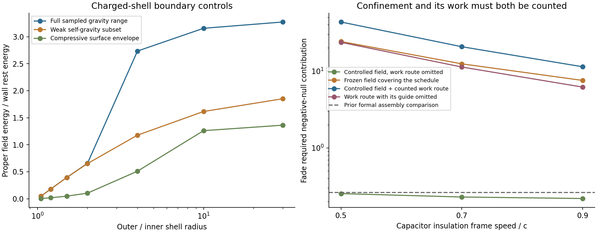

# Charged capacitor construction for the active rail support

This bounded investigation supplies no capacitor construction meeting the
retained assembly conditions. Charged-shell models admit equilibria and radial
stability, with economical boundaries requiring an unidentified relativistic
stress law. Magnetic insulation uses familiar electromagnetic physics, but
the scheduled radial compression creates a substantial additional work duty.
Counting its transport through the selected receiver route removes the
apparent source advantage. This is a construction barrier for the evaluated
arrangements; the active rail's geometry and separated component roles remain
the basis of the comparison.

The electrical store considered here is the remaining radial electric field
in the [finite work-interface assembly](FINITE_WORK_INTERFACE.md). It serves
the support actuator during the late interval x in [-2.1,-0.5], s in
[0,1.285], outside the protected moving packet. The standing substrate,
angular jacket, pressure medium, work delivery, and heat receiver retain
their distinct roles. Spherical electrovacuum examples below are boundary
analogues for a capacitor; the rail retains its prescribed active metric.

## Construction requirements

At full electrical recovery, the retained electric cells initially contain
71.33 material-frame energy units, with individual capacities summing to
80.59. Their net electrical work is +42.30 and their mechanical work is
-105.19 over this interval. At 90% recovery the corresponding values are
100.00, 111.85, +42.30, and -132.52. The negative mechanical term represents
field energy delivered through the changing cell geometry.

A candidate therefore supplies charge confinement, finite supporting
material, the aligned electric stress, reversible electrical coupling, and
the mechanical connection to the support system. Its complete tensor enters
the existing source comparison. Passive field-energy capacity alone covers
only part of this duty.

The previous additional co-moving mass comparison permits rest energy per
rated electric energy about 0.401 at full recovery or 0.324 at 90% recovery.
These figures preserve the earlier formal fade reference 0.262788. They are
selection comparisons for a specified tensor and material history. A wall
with pressure or tension requires its full tensor; shared structural material
requires a common load and energy balance. Consequently these mass ratios
provide context for the shell calculation, rather than a universal acceptance
threshold for every capacitor construction.

## Spherical charged boundaries

[Bičák and Gürlebeck](https://arxiv.org/abs/1008.1137) describe two oppositely
charged spherical shells with a flat center, an electric Reissner--Nordström
gap, and a neutral Schwarzschild exterior. Their junction formulation gives
each shell's surface energy and pressure. The later
[Ng, Choo, and Lim model](https://arxiv.org/abs/2302.03192) also supplies
explicit capacitor interfaces. These are gravitational matching models with
specified surface stresses; a finite material constitutive law is a further
input.

For f=1-2M/r+Q²/r², the static junction relations used here are

    sigma = (sqrt(f_inner)-sqrt(f_outer))/(4 pi r),
    p = (f_outer'/sqrt(f_outer)-f_inner'/sqrt(f_inner))/(16 pi)-sigma/2.

The calculation fixes inner radius a=1 and samples outer radii b/a of 1.05,
1.2, 1.5, 2, 4, 10, and 30. Positive shell rest masses parameterize the
ordinary outward-facing junction branch. The electric gap and neutral
exterior have positive metric factors throughout their respective domains.
The 22,104,621 deterministic samples cover charge 0.01--1.15 and logarithmic
and linear grids of the two shell inventories. This is a bounded numerical
envelope, with the full parameter grid recorded for reproduction.

Two restrictions are imposed on each surface: sigma >= |p| and existence of
a local sound slope eta=dp/dsigma in [0,1] giving positive radial potential
curvature. The potential follows the fixed-charge shell treatment of
[Eiroa and Simeone](https://arxiv.org/abs/1102.1683):

    V = (f_inner+f_outer)/2 - y²/4 - (f_inner-f_outer)²/(4 y²),
    y = 4 pi r sigma,     Rdot² + V = 0.

Surface conservation gives y'=-4 pi(sigma+2p) and
y''=8 pi(1+2 eta)(sigma+p)/r. Each shell's electrovacuum mass and charge
parameters are held fixed under its independent local radial perturbation.
The test checks V''>0 and allows each shell its own slope. A finite-thickness
material, angular perturbations, thermodynamics, and driven charging require
their own equations. The different charge/mass assumptions in
[Reyes, Chiapparini, and Perez Bergliaffa](https://doi.org/10.1140/epjc/s10052-022-10107-4)
are kept separate; their uncharged stability boundary provides an independent
analytical control for the implementation.

The electric proper energy is integrated as

    U_E = Q²/2 integral_a^b dr/(r² sqrt(f_gap)).

An adaptive integral resolves the narrow metric minimum of strongly
gravitating examples. A separate 1024-point Gaussian integral checks every
selected result, agreeing within 5.8e-13 relatively. The infinity-normalized
Killing energy is also recorded with the exterior matching clock factor.
Thus proper volume, material rest energy, and energy measured at infinity
remain distinguishable.

### Boundary cost and shape

| Outer/inner radius | Best sampled field/wall rest energy, DEC and radial slope | Weak-gravity subset | Compressive surface envelope |
| --- | ---: | ---: | ---: |
| 1.05 | 0.04791 | 0.04742 | 0.00436 |
| 1.2 | 0.17885 | 0.17736 | 0.01812 |
| 1.5 | 0.39347 | 0.39347 | 0.04777 |
| 2 | 0.65645 | 0.65123 | 0.10359 |
| 4 | 2.73450 | 1.17747 | 0.50995 |
| 10 | 3.15597 | 1.61531 | 1.26050 |
| 30 | 3.27238 | 1.85169 | 1.36202 |

The weak subset uses max(2M_gap/a,Q²/a²,2M_outer/b)<=0.01 as a
small-self-gravity comparison. The compressive envelope additionally uses
0<=p<=sigma/2 and 0<=eta<=1/2, motivated by a surface kinetic-pressure
range. It remains an envelope of allowed stresses and slopes, with a physical
surface gas and its normal confinement still to be constructed.

The small-self-gravity behavior has a direct explanation. The inner shell
carries tension Q²/(16 pi a³), while the outer shell carries compressive
pressure Q²/(16 pi b³), to leading order. Applying the componentwise energy
bound gives

    U_E/(M_inner+M_outer) <= 2(b-a)/(b+a).

Consequently closely spaced spherical shells have a substantial wall cost.
Widening the gap improves this ratio, approaching 2 in the weak-gravity
limit. The economical sampled inner shells have tension about 95--99% of
their surface rest-energy density, and their outer shells have pressure of
similar magnitude. The admitted sound slope establishes a radial response
at one equilibrium; it supplies no identified material with that stress law.

The large ratios in the unrestricted columns use strong self-gravity. The
selected b/a=30 example has minimum f_gap about 0.000442, inner p/sigma
about -0.997, and outer p/sigma about +0.997. Its field proper energy is
about 3.14, while its infinity-normalized field energy is about 0.527 and
its two shell rest energies sum to about 0.960. Its geometry and clock
variation are substantial parts of the construction. Such an object requires
a joint local geometry and material solution before it can be assigned a
role in the prepared rail.

There is also a tensor-shape restriction. The electric directions of a
complete small spherical cell average isotropically over that cell. The rail
uses a radially aligned Maxwell stress. Extracting only the favorable energy
ratio from a round cell would omit this difference and the wall stresses.
An elongated or open-load field cell needs its own boundary calculation.

These controls leave an integrated load-transmitting capacitor as the relevant
construction target. The spherical family has acceptable mathematical
equilibria, while the economical finite material and the required rail tensor
remain unprovided by those equilibria.

## Magnetic insulation coupled to the support history

[VanDevender and colleagues](https://doi.org/10.1103/PhysRevSTAB.18.030401)
and [Evstatiev and colleagues](https://arxiv.org/abs/2408.12053) provide
physical and computational starting points for magnetically insulated pulsed
power structures. Their electrode, current, and loss treatments motivate an
orthogonal-field charge-confinement control. They establish useful plasma
physics, while a rail capacitor still requires its own finite boundaries and
driven field solution.

For radial electric energy u_E and a transverse magnetic field, E dot B=0
and the minimum electric-field-free frame speed is v_i=E/B, with c=1.
Consequently u_B=u_E/v_i². Oppositely directed cells cancel their angular
Poynting flux in the coarse average. Equal transverse orientations have
material-frame magnetic tensor (rho,p_r,j,p_t)=(u_B,u_B,0,0). Its radial
boost is included explicitly in the ADM source comparison. This favorable
field control grants full useful volume; finite layers, current returns,
and confinement add their respective tensors.

Let ell=Gamma B_metric be the material radial length per coordinate label.
The transverse flux variable and energy per unit label are

    K = u_B (ell R)²,        U_B = K/ell.

Preserving K through the scheduled support contraction raises U_B. Conversely,
keeping u_B proportional to the required electric field requires changing K.
The exact endpoint identity separates the external field work from mechanical
compression:

    Delta U_B = average(1/ell) Delta K + average(K) Delta(1/ell).

The first control prescribes the minimum insulating field at every time.
The second prepares K(x)=max_t[u_E(ell R)²]/v_i² and then conserves it.
This second choice covers the whole history. Merely setting the initial field
to its initial insulation minimum leaves some later samples with only about
2.72% of the required magnetic energy.

At full electrical recovery, the 1024-cell results are:

| Insulation frame speed | Controlled field: initial added ADM energy | Controlled field: gross work export | Frozen field: initial added ADM energy | Frozen field: fade added ADM energy |
| --- | ---: | ---: | ---: | ---: |
| 0.9 | 88.70 | 229.41 | 113.87 | 2,203.86 |
| 0.7 | 146.62 | 379.24 | 188.24 | 3,643.12 |
| 0.5 | 287.38 | 743.30 | 368.95 | 7,140.51 |

The work columns sum local material-frame work over the patch; ADM columns
use the selected slices. The distinction matters on this varying metric.
At v_i=0.5, active control takes 69.49 units of additional field work in and
exports 743.30. The geometry contributes +422.25 mechanically. At 90%
electrical recovery, the corresponding export rises to 983.43 because that
operating choice retains more electric field. Full recovery is therefore the
more favorable capacitor setting for this construction.

Before counting the active field's power transport, full recovery at v_i=0.5
has sampled fade source requirement 0.25405. This is below the previous formal
reference 0.262788 and would look favorable from the instantaneous field
tensor alone. Its large additional work port is essential to that result.
For the frozen-flux alternative, the fade requirement rises to 24.23.

The existing pressure medium also provides a limited simple pressure-balancing
option. If that medium alone balances the local magnetic pressure, it requires
p>=u_B. With electric energy weighted by proper volume and proper duration,
the full-recovery v_i=0.9 control satisfies this inequality for about
1.17e-5 of the weighted exposure. This is a test of a simple local cell with
the pinned fluid pressure. Loads transmitted to the standing substrate or
angular jacket require those components' actual response and work equations.

### Joint work delivery is the decisive additional check

The continuation sends the combined electric and transverse-magnetic work
through the selected receiver-side route. It grants perfect local reuse of
opposing work flows, perfect conversion, ideal matched absorption, and zero
added heat-receiver tensor. Electric-to-guide sharing is increased to its
allowed maximum, preserving the original electric floor and rate allocation.
Thus the comparison gives the active capacitor considerable operating freedom.

The per-label field work P enters the same conservative wave transport as
P/[Gamma(1-direction*v_material)]. Incoming charging waves propagate toward
decreasing x; recovered work propagates toward the receiver. The paired
radial delivery guides are counted using their established 0.5 frame-speed
comparison, with a separate relaxed 0.9 comparison. Both require guide flux
well above the sharing cap 0.66843, so the saturated allocation is consistent.

| Capacitor insulation speed | Joint work input | Joint work export | Fade source requirement, delivery speed 0.5 | Fade requirement with delivery guide omitted |
| --- | ---: | ---: | ---: | ---: |
| 1, formal null-field limit | 24.10 | 150.26 | 8.640 | 4.699 |
| 0.9 | 27.87 | 193.54 | 11.365 | 6.182 |
| 0.7 | 41.36 | 342.84 | 20.732 | 11.279 |
| 0.5 | 75.04 | 706.55 | 43.501 | 23.666 |

The first row grants the limit u_B=u_E; a massive insulating plasma requires
magnetic dominance and a subluminal frame. The last column is an optimistic
tensor bound with the delivery guide removed and the retained electric share
accounted for. It locates a radial-null burden at the receiver-side edge
x approximately -0.50078. Radial guide fields have zero radial-null
contribution, so reducing their energy cannot remove that component. The
relaxed 0.9 delivery-speed comparison already reaches the same fade values.

For capacitor v_i=0.9, the full guide requires flux about 90.88, compared with
0.66966 in the preceding full-recovery interface. Its added startup ADM
energy is about 74,456 units. Relaxing the delivery comparison to 0.9 reduces
that startup figure to about 5,441, while retaining fade requirement 6.182.
These values are conditional assembly comparisons, with the omitted material,
loss, and finite-coupler costs still to be supplied.

The physical cause is specific. Radial electric energy decreases as the
support length contracts, delivering mechanical work. Transverse magnetic
energy with conserved flux increases under that same contraction. Active
control must remove both stored magnetic energy and compression work to keep
the insulating field small. The resulting return wave develops a substantial
stress at the receiver. This couples capacitor confinement to the existing
work and mechanical-response roles; assigning insulation to a magnetic field
does not by itself close their joint balance.

## Field strength and finite-gap material controls

The physical length scale L remains free. In the full-recovery electric
history, the peak field is approximately

    E_peak = (5.86e26 volt)/L.

Thus L about 4.43e8 m places the peak near the electron Schwinger field, and
L about 4.43e10 m places it near one percent of that field. These are scale
markers. A leakage calculation requires the actual field invariants, spatial
gap, and duration, as treated by
[Gelis and Tanji](https://arxiv.org/abs/1510.05451).

Shrinking a quasistatic unidirectional gap until its available electrostatic
work falls below a pair's rest energy is a separate way of removing that
static pair-production channel; the finite-potential threshold is discussed
by [Gies and Torgrimsson](https://arxiv.org/abs/1507.07802). For two independent
electron/positron charge layers, even the particle rest-energy accounting gives

    M_carriers c²/U_E = 4 m_e c²/(e V_gap).

Keeping e V_gap below 2 m_e c² therefore gives a ratio exceeding 2 before
support or confinement is added. The previous full-recovery added-mass
comparison instead requires a voltage at least about 5.10 MV for these ideal
layers, exceeding the approximately 1.022 MV quasistatic threshold. At 90%
recovery the comparison rises to 6.30 MV. Electron/proton layers require
roughly 4.68--5.79 GV for the same added-mass comparison.

This calculation applies to separately counted charged layers. Reusing
existing material requires its charge and force budget, while finite pulse
profiles and magnetic field invariants require their own discharge analysis.
Increasing L lowers the electric field without improving the dimensionless
material-energy ratio. Neither high permittivity nor a short gap alone
supplies the missing stress and work construction.

## Construction decision and evidence

The spherical-shell family remains a mathematical source of boundary
conditions. Its economical points require material properties that the cited
models leave unspecified, and a complete spherical cell changes the averaged
stress orientation. The passive magnetic-insulation control encounters a
compression-energy barrier. Active control transfers that barrier into a work
return whose source burden exceeds the retained assembly comparison even
under the generous joint test above.

Accordingly this round stops before another converter or storage component is
introduced. A further candidate needs a specified finite charge-bearing
boundary whose mechanical work is compatible with the existing pressure,
substrate, and jacket dynamics. Such a construction could use known physics;
the evaluated families provide no demonstrated instance satisfying this
rail's combined conditions. This result concerns the tested capacitor
arrangements and receiver route, rather than a general exclusion of
electromagnetic storage or of the active rail architecture.

The capacitor gap remains open. Even a successful capacitor would leave the
full physical converter, finite curved guide boundaries, thermal receiving
material, earlier arming, reset, and independent quantum source to be supplied
for the complete An--T--Le construction.

The shell evidence is in [data/charged_capacitor_shells](data/charged_capacitor_shells).
Its manifest records the producer, model, tests, grid, numerical envelopes,
and quadrature verification. Eight focused tests cover the junction mass
identity, static potential, independent finite-difference stability,
published uncharged stability boundary, proper energy quadrature, Maxwell
tensor boost, and transverse-field work identities. Narrative reporting is
maintained manually in this supporting document. The magnetic work and scale
controls are in [data/charged_capacitor_insulation](data/charged_capacitor_insulation),
and the optimistic coupled route is in
[data/charged_capacitor_work_delivery](data/charged_capacitor_work_delivery).
The focused suite passes 63 tests, including the eight new capacitor controls.
The final [audit](data/charged_capacitor_audit/verification.json) verifies 379
input/output hashes across inherited and new evidence. Joint-transport source
comparisons change by at most 0.432% between 512 and 1024 spatial cells and
0.00375% when the geometry interpolation is refined from two to four
subintervals per archived time interval. This time check concerns geometry
interpolation; the field-work schedule retains its original 257 intervals.
The largest conservative stream-balance residual is below 5.4e-14. The
guide-omitted fade maximum agrees exactly with the independent radial-null
expression. New evidence occupies approximately 25 MB, and independent cases
run with at most four workers.

The [composite capacitor and rail-connection continuation](COMPOSITE_CAPACITOR_AND_RAIL_CONNECTIONS.md)
separates charged tensile skins from directional and fluid backing, credits
the existing pressure, and counts partial unloading through the work route.
Its pressure-allocation bound locates the remaining construction duty in
the longitudinal backing, pressure link, and standing-support connection.
