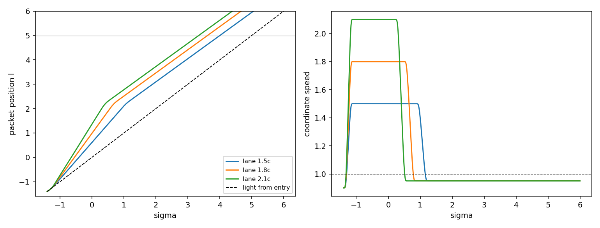

# Choreography Pass: Packet Path, Lane Speed and Arrival

Date: 2026-09-23. Context: the [one-space revision](ONE_SPACE_REVISION.md)
passes the geometry-demand gate. Its packet windows advance at unit speed,
while the shift carries the packet at \(U/B\). This pass puts the windows,
the carve and the carry speed on one prescribed packet path. Code:
`adm_harness/constant_radius_track.py` (`packet_path`, `packet_position`,
`packet_velocity`). Run: `scripts/run_choreography_pass.py`, with data in
[data/choreography_pass](data/choreography_pass/).

## Result

With the static support and a path-matched carry shift, the packet reaches
the far end of the track ahead of light through flat space. The one-space
gate passes with no residual bands.

- **Arrival.** On the 2.1c lane the packet reaches \(\ell=5\) at
  \(\sigma=3.34\). A light signal sent through flat space from the entry
  event arrives at \(\sigma=5.0\), so the packet leads by 1.66, an
  end-to-end speed of 1.35c. The 1.8c and 1.5c lanes lead by 1.38 and 1.00.
- **Packet safety.** Across the packet body during the live window, the
  worst normalized norm \(g(u,u)/\alpha^2\) is −0.95. While coasting at
  0.95c the packet sits at −0.0975, the flat-space value.
- **Gate.** On the static support every lane is Type I at all 2.37 million
  non-vacuum boundary-layer points. Refined, the 2.1c lane is Type I at all
  4.79 million. Root-finding at every flux-carrying null-sum crossing of the
  60 widest-estimate samples finds no Type IV band. The exterior is exactly
  vacuum.
- **Audits.** Radial escape is complete and entry reachability finds no hits.
  No trace enters a both-shrinking region, and dense bundles show no
  crossings. Probes that move with the packet stay timelike until they leave
  the track.

The path-matched shift carries the lane speed on the static support by
itself. With the carve restored on a held support, 25 of the 60 samples
carry bands up to \(3.2\times10^{-5}\) wide. This settles the
band-tolerance question from the one-space revision: the design uses the
static support, which is band-free.



The dashed line in the left panel is light through flat space from the entry
event.

## Path

The packet follows a prescribed worldline \(\ell_p(\sigma)\) whose
coordinate speed is

\[
v(\sigma)=v_{in}+(v_{lane}-v_{in})\,\psi\!\left(\frac{\sigma-a}{\tau_a}\right)
-(v_{lane}-v_{out})\,\psi\!\left(\frac{\sigma-d}{\tau_d}\right),
\]

with \(\psi\) the rail's smooth step. The position integrates this speed in
closed form. Every packet-centred structure is centred on \(\ell_p(\sigma)\):
the packet windows, the carve, the shell exclusion and the rematch. The
carry field is \(U=v\,B\) at the centre, so the packet's coordinate speed
equals the path speed. The packet lapse window takes the rematch schedule.

| Stage | Setting |
|---|---|
| entry | \((\sigma,\ell)=(-1.4,-1.4)\) at 0.9c |
| acceleration | to the lane speed over \(\Delta\sigma=0.3\), done by \(\ell\approx-1\) |
| lane | 1.5c, 1.8c or 2.1c through the support, \(|\ell|\le R_{th}=1.75\) |
| catch | deceleration to 0.95c over \(\Delta\sigma=0.4\), from \(\ell\approx1.8\)–1.9 to 2.4, across the support's edge taper; the catch windows span it |
| release | the live window closes as the packet passes \(\ell=2.6\) |
| coast | 0.95c through flat space to the track end at \(\ell=5\) |

The packet lapse window has log gain 3 over radius 0.875. Together with the
release at \(\ell=2.6\), it keeps the faster lanes within the lapse
envelope \(\alpha>2r|\beta_z|\) at every sample but one per lane
(see Gate).

## Search

A grid of 144 choreographies on the static support varies the lane speed
(1.2–2.1c), acceleration time (0.3, 0.6), deceleration time (0.4, 0.8),
coasting speed (0.8, 0.9, 0.95c) and catch exit (\(\ell=1.8, 2.1, 2.4\)).
Every candidate keeps the packet timelike through the live window (worst
−0.945) and while coasting. Of the 144, 131 arrive ahead of light. The 13
that trail are the 1.2c lanes coasting at 0.8c, together with the 1.5c lane
that combines slow ramps, a 0.8c coast and the earliest exit.

| Parameter | Values | Mean lead over light |
|---|---|---|
| lane speed | 1.2 / 1.5 / 1.8 / 2.1 | 0.05 / 0.55 / 0.89 / 1.13 |
| coasting speed | 0.8 / 0.9 / 0.95 | 0.32 / 0.74 / 0.92 |
| catch exit | 1.8 / 2.1 / 2.4 | 0.50 / 0.66 / 0.81 |
| acceleration time | 0.3 / 0.6 | 0.69 / 0.62 |
| deceleration time | 0.4 / 0.8 | 0.70 / 0.61 |

The lead is set by the lane speed through the support and the length of the
lane. A later catch lengthens the lane, and a faster coast loses less on the
flat-space leg. The chosen choreography takes the short ramps, the 0.95c
coast and the exit at 2.4 for each lane.

## Gate

| Case | Non-vacuum layer points | Type IV | Flux crossings resolved | Samples with bands (widest) |
|---|---:|---:|---:|---|
| 1.5c lane, static support | 2,372,611 | 0 | 17 | 0 of 60 |
| 1.8c lane, static support | 2,372,500 | 0 | 18 | 0 of 60 |
| 2.1c lane, static support | 2,372,353 | 0 | 18 | 0 of 60 |
| 2.1c lane, static support, refined | 4,791,336 | 0 | 18 | 0 of 60 |
| 2.1c lane, held support with carve | 2,372,748 | 0 | 246 | 25 of 60 (\(3.2\times10^{-5}\)) |

The samples cover \(\sigma\in[-1.5,10]\) and \(|z|\le4.9\) at spacing 0.1,
with the wide stack of the one-space revision at 12 nodes per panel (24
refined, with half the jet step). The held-carve bands lie at
\(\sigma=0.2\)–1.0 and \(z=1.8\)–2.6, where the carve crosses the support
edge with the packet.

In each static case the lapse envelope ratio exceeds one at a single sample
outside the live window, with ratios of 1.06–1.59. For the 1.5c and 1.8c
lanes it sits at the trailing support edge (\(z=-2.1\)), and for the 2.1c
lane just ahead of the packet (\(z=2.5\)). The classifier finds those
samples Type I at every node. The envelope is the sufficient estimate, and
the classifier decides.

## Service audits

The audit ledger carries the packet at its path speed at every packet point,
since the packet body moves rigidly along \(\ell_p(\sigma)\). The
construction field \(U/B\) equals the path speed at the centre and grows as
\(B(\ell_p)/B(\ell)\) toward the support edge. Its packet norm is recorded
beside the path norm.

| Audit | 2.1c lane | 1.8c lane |
|---|---:|---:|
| live packet points (spacelike) | 175 (0) | 196 (0) |
| maximum live packet norm, path speed / construction field | −30.2 / −30.0 | −34.6 / −34.4 |
| radial escape (escaped/expected, stalled) | 1430/1430, 0 | 1358/1358, 0 |
| entry reachability hits | 0 | 0 |
| centerline probes escaped (maximum norm) | 21/21 (−0.096) | 24/24 (−0.097) |
| probes in transit when the ledger window closes (minimum null speed) | 16 (0.54) | 18 (0.54) |
| traces entering both-shrinking | 0 | 0 |
| dense-bundle crossings (minimum width ratio) | 0 (0.156) | 0 (0.181) |

The centerline probes leave the track at 0.95c with norm −0.096. The probes
still in transit are minus-branch null rays seeded at \(\sigma=2.8\)–4.4.
They cross the standing support at a coordinate speed of at least 0.54 and
are still moving when the ledger's window closes at \(\sigma=15\).

Two audit settings follow from the path.

- Probes that integrate the construction field from off-centre seeds
  start faster than the packet (2.31 against 2.1 at 0.33 off centre). They
  leave it within \(\Delta\sigma=0.3\) and enter the region ahead, where
  \(U/B\) reaches 8.7 and the field is spacelike, up to +105. That region
  lies ahead of the packet body at every \(\sigma\).
- Radial null rays of one family obey the first-order equation
  \(d\ell/d\sigma=-\beta\pm\alpha/\sqrt{\gamma_{\ell\ell}}\), so distinct
  rays of one family stay ordered in the continuum. At the audit's default
  step, half the ledger's \(\sigma\) spacing, one bundle per lane through
  the packet lapse window recorded crossings (193 and 202 samples). At 0.1 of
  the spacing both lanes record none. On the 2.1c lane a step of 0.02 agrees,
  and the minimum width ratio settles near 0.155. The pass uses 0.1.

## Light through the standing boundary layer

The lapse sheath raises the lapse by \(e^{16}\) and the stretch by
\(e^{8}\), so light running along the track inside it covers \(z\) at
\(dz/d\sigma=\alpha/A\approx e^{8}\approx2981\) in exterior time. At
\(r\approx10.5\), where the stretch has fallen further toward one than the
lapse, the ratio reaches \(1.9\times10^{4}\). After the release the shift
vanishes and the standing configuration is static. Light then takes the
path of least optical length \(\int\sqrt{A^2dz^2+dr^2}/\alpha\), which a 48-direction
lattice shortest path at spacing 0.05 bounds from above.

| Signal from the entry event to \(\ell=5\) on the axis | Arrival \(\sigma\) | Lead over flat-space light |
|---|---:|---:|
| light through flat space | 5.00 | 0 |
| packet, 2.1c lane | 3.34 | 1.66 |
| light through the standing structure | 0.85 | 4.15 |

The light route runs out to \(r\approx10.5\), along the track and back. Its
transit time of 2.25 comes almost entirely from the radial crossing of the
service region and pre-sheath at the track end, where the service lapse is
one. At the entry, inside the support, the raised service lapse makes the
crossing nearly instant.

The packet worldline is timelike, so it arrives after this light, as every
causal worldline must. The rail is therefore a standing superluminal signal
channel along its whole sheathed length, independent of the packet. The
packet adds the transport of matter through the service region. The sheath's
lapse maximum is a Shapiro time advance, and its negative-null content pays
for it. The exterior time \(\sigma\) is a global time function, since
\(g^{\sigma\sigma}=-1/\alpha^2<0\) everywhere, so every causal curve on a
single rail advances in \(\sigma\). Two rails in relative motion can close
causal curves, as two Krasnikov tubes can.

## Costs

| Measure | One-space revision, static support | Choreography, 2.1c lane | Choreography, 1.5c lane |
|---|---:|---:|---:|
| boundary-layer minimum null energy | −2.65 | −2.65 | −2.65 |
| standing negative-null content per unit \(\sigma\) | 490 | 490 | 490 |
| service-region minimum null energy | −0.153 | −1.158 | −1.301 |

The boundary-layer costs belong to the standing support and the stack, and
the path leaves them unchanged. The service-region minimum moves to the
leading flank of the packet lapse window, 0.7–0.8 ahead of the packet
centre, as the packet leaves the support. There the window's lapse of
\(e^{3}\) moves through the unstretched region. It is largest on the
slowest lane (−1.30) and smallest on the fastest (−1.16), so the window's
depth and flank set it more than the lane speed does. The service region
stays Type I throughout.

## Open items

1. **Signal channel.** The standing sheath carries light along the track at
   up to \(1.9\times10^{4}\) in exterior time. The shear identity needs
   \(A/\alpha\ll1\) only where the shift varies, which is the carried stretch
   of the track. Beyond it the sheath can taper along \(z\), or turn
   conformal, to bound the channel's length and speed. The choice depends on
   whether the rail is meant to carry signals as well as packets.
2. **Service-region curvature at the lapse window.** The minimum of −1.16 to −1.30 sits
   on the leading flank of the packet lapse window. A shallower or longer
   window flank outside the support is the lever, subject to the lapse
   envelope.
3. **Technical disclosure.** The one-space geometry, the static support, the
   staged boundary layer and the path choreography are ready for the
   disclosure, together with the channel property.
4. **Sources.** The roles are the same as in the one-space revision: the
   service region's transverse pressure \(-K/8\pi\), the standing support
   and the boundary-layer stack.

## Reproduction

```bash
OPENBLAS_NUM_THREADS=1 python toolkit/adm_harness_cli/scripts/run_choreography_pass.py --workers 6
PYTHONPATH=toolkit/adm_harness_cli:toolkit/adm_harness_cli/scripts python -m pytest toolkit/adm_harness_cli/tests/test_constant_radius_track.py toolkit/adm_harness_cli/tests/test_axial_track.py
```

The run takes about 10 minutes with six workers: 0.7 for the search, 5.2
for the boundary layers, 0.9 for band resolution and 2.7 for the audits and
the light channel. `--skip-audits` evaluates the paths and boundary layers
only. The manifest records the lanes, timing, stack, envelope parameters,
bundle step, standing snapshot and software hashes.
