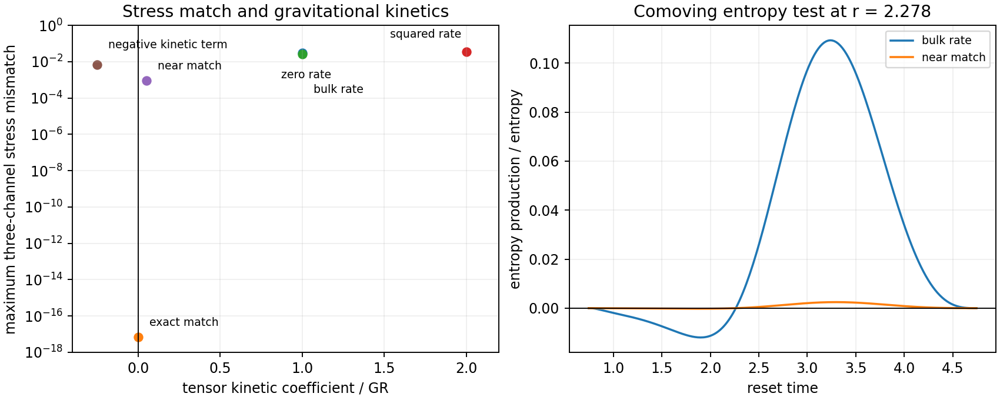

# Comer–Andersson Spherical Startup Attempt

Date: 8 September 2026.

The bounded quadratic specialization supplies the required early angular
response, with an exact rate-sector tensor fit at a degenerate gravitational
kinetic coefficient. All 72 registered evaluations fail the combined local
conditions. This identifies a concrete limitation of the chosen action and
prescribed paths; the general model-(iii) construction remains open.

The subsequent [two-current evolution round](COMER_TWO_CURRENT_EVOLUTION_ROUND.md)
evolves particles, entropy, and geometry together. It obtains a converging
local evolution with positive resistance entropy production and regular GR
kinetics, while its explicit signed-support law fails initial rail pressure
matching. The coupled calculation therefore separates the behavior of the
ordinary currents from the remaining support and junction requirements.

## Question and scope

The [bounded reset search](LE_RESET_INVERSE_SEARCH.md) found an angular
startup mismatch for source laws whose additional material stress starts too
late. This attempt examines the deformation-rate dependence in Comer,
Andersson, Celora, and Hawke's model (iii), then tests one explicit quadratic
choice of that dependence. The question is whether the new term supplies
the required angular stress with consistent density, radial pressure, entropy
behavior, and regular gravitational dynamics.

The retained initial data are the same matched-static controls, on the same
areal annulus. Particles start at rest in the areal frame; a pre-existing
thermal sector supplies a finite heat-current capacity. The direct and
waypoint mass/lapse paths remain prescribed in this attempt. The analysis
therefore tests an inverse constitutive specialization on those paths. An
initially moving medium, different mass/lapse evolution, and a fully specified
nonlinear two-current action define broader constructions.

## Paper reduction

The primary source is [Comer et al., arXiv:2606.17686v1](https://arxiv.org/html/2606.17686v1),
especially equations (35), (149)–(162), and (168)–(172). Model (iii) permits
the entropy three-form to depend on proper-time derivatives of material
metrics. Equation (150) then contains a derivative of the spatial tensor
\(D^{ab}_{6}\). This is the candidate source of an earlier angular response.

The paper's controlled simplification makes the additional choice
\(D^{ab}_{6}=\upsilon_6\widetilde D_4 h^{ab}\), with
\(\widetilde D_4=O(v_s^2)\), where \(v_s\) is entropy drift. The viscosity
terms are proportional to expansion and shear. The
[2024 companion paper](https://eprints.soton.ac.uk/495878/1/entropy-26-00621.pdf)
develops the constitutive metric dependence underlying these terms. The
positive entropy expression in the simplified limit pertains to those
additional choices. The quadratic functional below is a separate choice
within the general allowed dependence and carries its own entropy test.

Write
\[
ds^2=-N^2dt^2+L^2dr^2+R^2d\Omega^2,\qquad
H_r=N^{-1}\partial_t\log L,\quad
H_t=N^{-1}\partial_t\log R,\quad
\Theta=H_r+2H_t.
\]
The material rate tensor is \(B^i{}_j=\operatorname{diag}(H_r,H_t,H_t)\).
In the retained areal paths \(R=r\), so \(H_t=0\). If the first change
in \(\log f\), with \(f=L^{-2}\), is order \(u^n\), then
\(H_r=O(u^{n-1})\) and its proper-time derivative is \(O(u^{n-2})\).
The required current is
\(J=-\sqrt f H_r/(4\pi r)\).

With finite initial thermal density and bounded transport coefficients,
the heat drift is \(O(u^{n-1})\). Consequently the published simplified
closure has the following onset orders:

| Contribution | Direct path, \(n=3\) | Waypoint path, \(n=9\) |
|---|---:|---:|
| Required angular time-curvature stress | 1 | 7 |
| Ordinary bulk/shear viscous stress | 2 | 8 |
| Derivative of the simplified \(D_6\) | 3 | 15 |
| Diagonal correction from preloaded heat drift | 4 | 16 |

Thus preloading the thermal sector regularizes its heat capacity while the
published simplified deformation term still enters too late for these
static-start paths. Independent initial motion or a different internal
material evolution can alter these orders.

## Explicit quadratic functional

The single additional rate-sector choice is
\[
Q=\frac12\left[a\Theta^2+b B_{ab}B^{ab}\right],\qquad
S_Q=\int\sqrt{-g}\,Q\,d^4x,
\]
with constant coefficients \(a,b\). These invariants are built from the
material metric and its proper-time derivative, as permitted in the general
model. This specialization can be represented explicitly by a thermal
master energy \(\epsilon=C s^{1+w}\), \(w=1/3\), and a scaled entropy
three-form
\[
s_{ABC}=F\,\bar s_{ABC},\qquad
F=\left(1-\frac{Q}{\bar\epsilon}\right)^{1/(1+w)},\qquad
\bar\epsilon=C\bar s^{1+w}>Q.
\]
Here \(\bar s_{ABC}\) is a closed reference three-form. Substitution gives
\(-\epsilon=-\bar\epsilon+Q\). A particle rest-energy term may be included
in the master function. This establishes a specific functional dependence;
its entropy production and equations of motion remain physical conditions.

Varying the lapse and both spatial scale factors before imposing \(R=r\)
gives
\[
\rho_Q=Q,\qquad
p_{i,Q}=Q-\dot C_i-\Theta C_i,\qquad
C_i=a\Theta+b H_i,
\]
where the dot denotes particle proper time. The rate sector carries zero
radial current in this comoving reduction. An independent weak variation of
the action checks all three expressions, including a case where \(Q=0\)
on the areal trajectory while its angular variation is finite.

For \(H_t=0\), writing \(H=H_r\), the channels reduce to
\[
\rho_Q=\tfrac12(a+b)H^2,\qquad
p_{r,Q}=-(a+b)\dot H-\tfrac12(a+b)H^2,
\]
\[
p_{t,Q}=-a\dot H+\tfrac12(b-a)H^2.
\]
The instantaneous static tensor of the same metric differs from its full
Einstein tensor by a current and the angular time-curvature term
\[
P_{t,G}-P_{t,G}^{\mathrm{static}}=-\frac{\dot H+H^2}{8\pi}.
\]
Matching that angular term while retaining the prescribed density and radial
pressure therefore fixes
\[
a=\frac1{8\pi},\qquad b=-\frac1{8\pi}.
\]
Preloaded heat produces additional diagonal corrections at higher onset
order. They preserve this leading coefficient requirement under the stated
static-start assumptions. The numerical tensor fit records the required
current separately, so it supplies a rate-sector match rather than a completed
two-current source.

## Kinetic and entropy conditions

For material worldlines normal to the slices, the Einstein–Hilbert kinetic
density is \((B_{ab}B^{ab}-\Theta^2)/(16\pi)\). The fitted \(Q\) cancels
it. More specifically, the quadratic kinetic coefficient of a transverse,
traceless metric perturbation, divided by its GR value, is
\[
K_{\mathrm{TT}}=1+8\pi b.
\]
At the exact tensor match \(K_{\mathrm{TT}}=0\). Thus the apparently exact
stress correction sits at a degenerate gravitational principal part. The
acceptance condition requires a strictly positive tensor kinetic coefficient.
This diagnostic concerns the explicit constant-coefficient action; the
characteristics of the full general Comer–Andersson system remain a separate
problem.

The entropy test is also explicit. In the comoving limit,
\(\dot{\bar\epsilon}=-(1+w)\Theta\bar\epsilon\), and the closed reference
entropy current implies
\[
\frac{\Gamma_s}{s}=\frac{\dot F}{F}
=-\frac{\dot Q+(1+w)\Theta Q}{(1+w)(\bar\epsilon-Q)}.
\]
For the quadratic action, \(Q=(a+b)H^2/2\). When \(a+b>0\), increasing
the magnitude of the initial deformation rate gives negative entropy
production at order \(u^{2n-3}\). When \(a+b<0\), the corresponding
negative contribution occurs during the return to zero rate. Since \(F=1\)
at both rate-free endpoints, any nonconstant intermediate \(F\) returns
to its original value. Its comoving entropy derivative changes sign.
Ordinary finite-coefficient heat and viscous production scale one order
later at these endpoints. The exact match has \(Q=0\) on the areal path
and avoids this entropy variation, while retaining the kinetic degeneracy.

## Numerical contract

Four independent scenarios combine the direct and waypoint paths with
\((T,z)=(4,-0.65)\) and \((14.255,0.65)\). Each is evaluated at
129 × 65, 257 × 129, and 513 × 257 radial/time points. The controls, written
as \((8\pi a,8\pi b)\), are
\((0,0),(1,-1),(1,0),(0,1),(0.975,-0.95),(1,-1.25)\).
An independent linear least-squares fit uses the density, radial-pressure,
and angular channels simultaneously. Full four-dimensional curvature probes
compare the dynamic and matched-static tensors at three finite-difference
steps and retain their complete eigensystems.

The heat diagnostic retains the required current explicitly. For a thermal
fluid with \(p=w\rho\), energy \(E\) and current \(J\) in the particle
frame obey
\[
\frac{J}{E}=\frac{(1+w)v_s}{1+w v_s^2}.
\]
With \(w=1/3\) and \(|v_s|\leq0.1\), this requires
\(E\geq7.525|J|\). One positive diagnostic thermal normalization, fixed
across resolutions and controls, supplies that capacity and keeps every
entropy root real. Its initial Tolman profile and comoving adiabatic
continuation are recorded, together with the mass cost of adding that initial
profile to the frozen source. This prices the assumed preload; matching it
to the existing signed infrastructure remains part of a full construction.

The Cattaneo column records the required combination
\(\nabla_r T+T a_r=-(\tau\dot J+J)/\kappa\), using positive unit
\(\tau,\kappa\) in the reference units. It is an inverse transport demand.
The constituent force equations, a common evolving temperature, and the full
model-(iii) corrections to heat transport would be required for a survivor.

The run uses four workers with a 1,536 MiB address-space limit per worker,
a 600-second compute cap, and a 100 MB output cap. No additional source
layer, coefficient function, or matching surface is introduced after a failed
test of this specialization. Narrative findings are written manually.

## Measured tensor and entropy results

All twelve three-channel least-squares fits return
\((8\pi a,8\pi b)=(1,-1)\) to floating-point precision. Their largest
absolute stress residual is \(8.48\times10^{-15}\), their design matrices
have rank two, and their condition numbers range from 2.12 to 2.65. The
fitted tensor kinetic ratios lie between \(-6.67\times10^{-16}\) and
\(1.00\times10^{-15}\), consistent with the exact zero derived above.
Consequently each exact fit fails the regularity condition.

The finest direct-fast grid gives the following comparison. Stress entries
are maximum absolute mismatches across density, radial pressure, and angular
pressure in the harness's geometric units. The entropy column is the minimum
\(\Gamma_s/s\) of the explicitly defined comoving rate functional.

| Control | \((8\pi a,8\pi b)\) | Maximum stress mismatch | \(K_{\mathrm{TT}}\) | Minimum \(\Gamma_s/s\) |
|---|---|---:|---:|---:|
| Zero rate term | \((0,0)\) | \(3.0503\times10^{-2}\) | 1 | 0 |
| Exact tensor match | \((1,-1)\) | \(6.94\times10^{-18}\) | 0 | 0 |
| Positive bulk rate | \((1,0)\) | \(2.6894\times10^{-2}\) | 1 | \(-1.1965\times10^{-2}\) |
| Positive squared rate | \((0,1)\) | \(3.5976\times10^{-2}\) | 2 | \(-1.1965\times10^{-2}\) |
| Near match | \((0.975,-0.95)\) | \(8.9940\times10^{-4}\) | 0.05 | \(-2.3168\times10^{-4}\) |
| Negative tensor kinetic term | \((1,-1.25)\) | \(6.7236\times10^{-3}\) | \(-0.25\) | \(-2.4062\times10^{-2}\) |

The near match retains five percent of the GR tensor kinetic coefficient
while leaving a finite stress mismatch. Its comoving entropy derivative
also takes both signs. The zero-rate control retains regular GR tensor
kinetics and zero rate-sector entropy production while leaving the original
angular demand. Across all four scenarios and three resolutions, every
registered control fails at least one condition.

The onset samples extend to \(u=2^{-12}\). At that point the direct-fast
ratio \(P_{t,G}^{\mathrm{time}}/u\) is
\(1.07447\times10^{-5}\), and the waypoint-fast ratio
\(P_{t,G}^{\mathrm{time}}/u^7\) is \(6.94774\times10^{-2}\).
For the positive-bulk control the corresponding scaled entropy derivatives
\((\Gamma_s/s)/u^3\) and \((\Gamma_s/s)/u^{15}\) are
\(-2.18796\times10^{-13}\) and \(-2.18202\times10^{-8}\).
These samples retain the predicted leading powers and negative onset sign.
The entropy calculation concerns coincident particle and entropy currents;
the separate heat-current reconstruction supplies a kinematic capacity test.
A common evolving two-current state would require the constituent equations.



## Thermal mass accounting

The generous prescribed thermal profiles keep the reconstructed entropy
drift below 0.096 and the rest energy positive. Their initial mass prices are
large compared with the retained metric:

| Scenario | Added thermal mass on the annulus | Minimum \(f\) after adding it to the frozen initial source |
|---|---:|---:|
| Direct fast | \(6.158\times10^6\) | \(-1.971\times10^6\) |
| Direct slow | \(2.960\times10^6\) | \(-9.471\times10^5\) |
| Waypoints fast | \(6.451\times10^8\) | \(-2.064\times10^8\) |
| Waypoints slow | \(3.449\times10^7\) | \(-1.104\times10^7\) |

Thus simply adding these preloads violates the retained requirement
\(f>0\). The initial lapse varies by a factor of approximately 78, so the
chosen Tolman radiation profile, proportional to \(\alpha_i^{-4}\), has a
large density contrast. Supplying the required inner-region current at small
drift then puts substantial energy in the outer annulus. These values price
this particular thermal profile and drift bound. A different thermal state
or a redistribution within the existing signed source would have its own
mass and force accounting. The tensor-kinetic degeneracy follows from the
rate-action coefficients independently of this normalization.

## Independent curvature and artifact verification

The original 216 records contain 108 dynamic tensors and 108 matched-static
controls. The uniform time stencils resolve the direct paths accurately;
the sharp waypoint extrema require shorter time steps. A separate audit
re-evaluates the same 36 witnesses at
\(h_t=2\times10^{-4},5\times10^{-5},1.25\times10^{-5},3.125\times10^{-6}\),
holding the radial step at \(6.25\times10^{-4}\). This adds 288 records and
preserves the original run files byte for byte.

For the fast waypoint family, the largest dynamic-minus-static error falls
from 0.1944 to 0.04880, 0.01221, and 0.003053 across those steps. At the
smallest step, the largest error divided by the local dynamic correction is
\(1.62\times10^{-4}\); the slow waypoint maximum is
\(7.76\times10^{-5}\). This approximately first-order decrease is consistent
with centered second derivatives at knots of the retained cubic spline,
whose third derivative can jump. The comparison uses analytic derivatives
of that same interpolated metric. It certifies the curvature stencil at
each retained witness; the exact rate-action argument supplies the conclusion
across the prescribed paths.

For the direct families, \(h_t=5\times10^{-5}\) gives maximum absolute
errors below \(5.88\times10^{-8}\) and local relative errors below
\(8.35\times10^{-6}\). Smaller steps encounter floating-point cancellation
in the weaker curvature signals. The kinetic and tensor-fit conclusions
also follow from the symbolic variation and weak-action tests independently
of these finite differences.

All 504 retained eigensystems certify. Independent matrix multiplication
reproduces their eigen-equations with relative errors below
\(1.00\times10^{-16}\), and a fresh eigenvalue calculation reproduces all
154 raw complex-pair records. These comprise 66 original and 88 refined
dynamic probes. Every holding control is Type I. The exact angular
correction leaves the radial density-pressure-current discriminant
unchanged, so the existing Type IV witnesses persist on these prescribed
geometries.

The artifact audit also checks all four 131,841-point field files, their
heat moments, mass accounting, inverse Cattaneo drive, stored entropy fields,
and summary extrema. The largest replayed summary difference is
\(3.56\times10^{-15}\). The frozen source kernel and reference hashes agree
with the bounded reset search.

## Construction implication and stopping decision

The paper's general deformation-rate dependence admits the required early
angular response. In the explicit quadratic choice, the coefficients needed
to preserve the prescribed density and radial pressure force cancellation
of the gravitational tensor kinetic term. Nearby choices restore part of
that kinetic term while leaving stress discrepancies, and the specified
entropy functional has negative comoving production on portions of the
retained paths. The published small-drift specialization faces the earlier
onset-order obstruction under the same static-start assumptions.

This closes the bounded attempt for the constant-coefficient action on the
retained paths. A further construction would need independently evolving
material state and geometry, with its initial energy included in the mass
constraints and its entropy and force equations solved together. Changing
the geometry or initial material motion can change the coefficient argument.
The broader Comer–Andersson framework and the An–T–Le connection therefore
remain open, with a sharper requirement on any proposed source.

## Retained evidence and reproduction

The main run took 6.78 seconds with four workers; refinement and artifact
verification took another 3.77 seconds. The completed evidence occupies
65.24 MB before Git storage. The largest main-run worker resident peak was
248.6 MiB and the parent peak was 222.0 MiB. Summing four copies of that
worker peak and the parent peak gives a conservative process-peak total of
1.19 GiB; the individual peaks can occur at different times.

The full harness passed 299 tests, including independent weak variations of
the action, a four-dimensional analytic metric control, the trace-free
kinetic perturbation, entropy differentiation, and thermal moment recovery.
The additional audit executed successfully against the saved evidence. The
implementation is committed in `cc5e253`, and the curvature/artifact audit
in `0cc3f79`.

The [main manifest](data/comer_andersson_startup/manifest.json) records the
72 evaluations, 12 fits, source and software hashes, and resource limits.
The [artifact verification](data/comer_andersson_startup/artifact_verification.json)
records the independent replay and refined curvature errors. The complete
[fits](data/comer_andersson_startup/fits.csv),
[control summaries](data/comer_andersson_startup/summaries.csv),
[onset samples](data/comer_andersson_startup/onsets.csv), and
[thermal prices](data/comer_andersson_startup/thermal_scale_accounting.csv)
retain the numerical comparisons. Both curvature CSV files have companion
NPZ files containing projected and raw tensors, eigenvalues, eigenvectors,
and matching row indices. The four scenario field files retain metric,
rate, demanded-stress, current, thermal, and entropy arrays.

For a repeat, choose a new empty destination for the main run, then apply
the audit to that destination:

```bash
PYTHONPATH=toolkit/adm_harness_cli \
OPENBLAS_NUM_THREADS=1 OMP_NUM_THREADS=1 MKL_NUM_THREADS=1 \
MPLCONFIGDIR=/tmp/comer-startup-matplotlib \
python toolkit/adm_harness_cli/scripts/run_comer_andersson_startup.py \
  --workers 4 --output /tmp/comer-startup-repeat

PYTHONPATH=toolkit/adm_harness_cli \
OPENBLAS_NUM_THREADS=1 OMP_NUM_THREADS=1 MKL_NUM_THREADS=1 \
MPLCONFIGDIR=/tmp/comer-startup-matplotlib \
python toolkit/adm_harness_cli/scripts/run_comer_andersson_audit.py \
  --workers 4 --output /tmp/comer-startup-repeat
```
