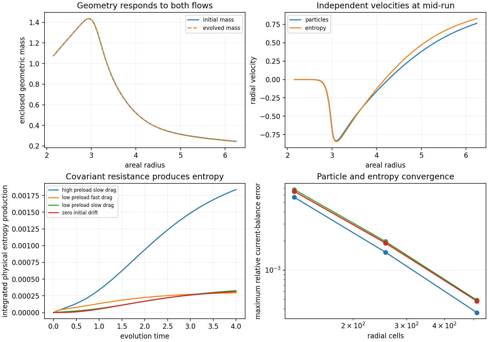
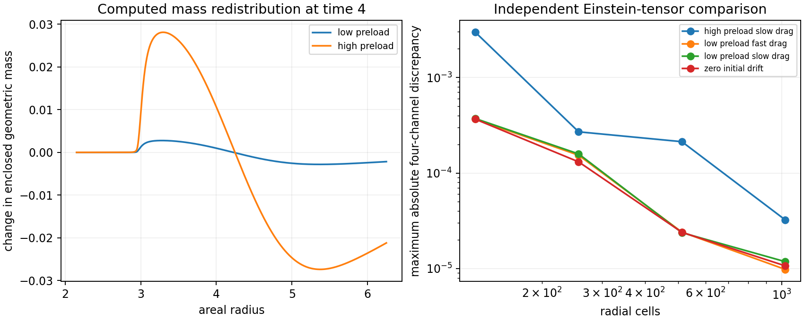

# Comer–Andersson Two-Current Evolution Round

Date: 8 September 2026.

The coupled currents complete the registered interval with positive rest
energies, nonnegative resistance entropy production, and an unchanged GR
tensor kinetic coefficient. Their independent Einstein-tensor discrepancies
decrease with refinement. All 36 finest curvature witnesses are Type I.
The explicit radial-tension support nevertheless fails the initial rail
junction: the reference requires negative radial enthalpy, while this
support contributes zero and the ordinary currents contribute positively.

The subsequent [vacuum-support selection rounds](VACUUM_SUPPORT_SELECTION_ROUNDS.md)
find complete algebraic initial-tensor fits with radial and angular vacuum
orientations. Their local elastic realization has negative radial kinetic
energy, leaving the physical supporting sector unresolved.

## Question and registered scope

The [quadratic startup attempt](COMER_ANDERSSON_SPHERICAL_STARTUP_ATTEMPT.md)
matched a prescribed angular demand at a degenerate gravitational kinetic
coefficient. This round instead evolves particle and entropy currents through
their own force equations and determines the mass and lapse from their
combined stress. The initial mass profile comes from the retained rail; the
subsequent geometry follows the sources.

The signed infrastructure requires its own constitutive prescription. The
explicit choice here is a separately conserved radial-tension source. It
preserves the reference initial energy after allocating a finite particle
and thermal preload, while changing the initial pressure. That pressure
change is assessed by an independent junction calculation. The evolution
measures whether the earlier kinetic and angular difficulty survives when
the two currents and geometry evolve together. Full rail acceptance also
requires the initial worldtubes and subsequent service conditions to match.

The primary source is [Comer, Andersson, Celora, and Hawke,
arXiv:2606.17686v1](https://arxiv.org/html/2606.17686v1), particularly
equations (78)–(101). These give separate particle and entropy force
equations, a common conserved stress, and an entropy-production condition on
the resistance. This round uses a barotropic specialization of those
two-current equations with an explicit nonlinear resistance law. The
additional deformation-rate terms of model (iii) are zero in this
specialization. The signed support remains an effective source with a
specified conservation law; its microscopic realization is a separate
constitutive question.

## Two currents and positive entropy production

The rest energies are
\[
\rho_n=n^{6/5},\qquad \rho_s=s^{4/3},\qquad
p_n=\rho_n/5,\qquad p_s=\rho_s/3.
\]
Each current has its own radial four-velocity. With zero entrainment, its
stress is the corresponding perfect-fluid stress. The master-function
coefficients still vary with the evolving state:
\(\mathcal B_n=(6/5)\rho_n/n^2\) and
\(\mathcal B_s=(4/3)\rho_s/s^2\). The scalar fluid pressures are
barotropic constitutive choices, with sound speeds \(\sqrt{1/5}\) and
\(\sqrt{1/3}\).

For particle and entropy four-velocities \(u_n,u_s\), define
\[
\gamma_{ns}=-u_n\cdot u_s,\qquad
R^a=\mathcal R\left(u_s^a-\gamma_{ns}u_n^a\right),\qquad
\mathcal R=\frac{h_nh_s}{(h_n+h_s)\tau_0},\quad h_x=\rho_x+p_x.
\]
The resistance coefficient responds to both evolving enthalpies. The
positive constant \(\tau_0\) sets its scale. The force equations are
\[
\nabla_bT_n^{ab}=R^a,\qquad \nabla_bT_s^{ab}=-R^a.
\]
Since \(u_n\cdot R=0\), the particle energy equation implies
\(\nabla_a(nu_n^a)=0\). The entropy equation gives
\[
T\Gamma_s=u_s\cdot R=\mathcal R(\gamma_{ns}^2-1)\geq0,
\qquad T=\frac43\rho_s^{1/4}.
\]
Thus both the total exchange and the physical entropy production are fixed
by the same force law. The resistance is algebraic in the local state, so
the two fluid characteristic cones retain the relativistic Euler speeds
\((v_x\pm c_x)/(1\pm v_xc_x)\). The source contains no metric-rate
quadratic term, and the GR tensor kinetic coefficient remains unchanged.
These statements concern the ordinary currents and gravitational kinetic
term; a microscopic support theory would carry further characteristic
conditions.

## Conserved support and initial data

The areal metric is
\[
ds^2=-\alpha^2dt^2+A^2dr^2+r^2d\Omega^2,\qquad
A=f^{-1/2},\qquad f=1-2m/r.
\]
Choose a signed support energy \(I(r)\), with source-frame channels
\[
E_I=I(r),\qquad P_{r,I}=-I(r),\qquad J_I=0,\qquad
P_{t,I}=-I(r)-\frac r2 I'(r).
\]
Direct covariant differentiation gives \(\nabla_aT_I^a{}_b=0\) for
arbitrary time-dependent positive \(\alpha,A\). The radial pressure and
angular stress are constitutive functions of the specified support profile.
Its zero radial enthalpy makes the energy equation independent of changing
radial volume.

The domain is \(r\in[2.15,6.25]\). Let \(m_i(r)\) be the retained
initial matched-static mass and \(E_i=m_i'/(4\pi r^2)\). Allocate
\[
E_{\mathrm{pre}}(r)=\frac{0.039783\,\eta}{r^2}
\left[\sin^4\!\left(\frac{\pi(r-2.15)}{4.10}\right)+10^{-8}\right],
\qquad I=E_i-E_{\mathrm{pre}}.
\]
The amplitude uses the existing radial-string energy scale. The small
positive floor defines the dilute boundary states. Half of the initial
source-frame preload energy is assigned to each ordinary fluid. Particle
velocity is \(v_n=v_0\sin^4[\pi(r-2.15)/4.10]\); the entropy velocity
is recovered from the opposite current \(J_s=-J_n\). The total initial
energy is exactly \(E_i\) and the total initial current is zero, so the
initial Hamiltonian and momentum data match \(m_i\).

The changed support pressure is an explicit part of this new initial state.
Its lapse is determined by the new radial pressure. The previous prescribed
mass path, static-start acceleration, and initial lapse profile are free to
change in this local evolution. Matching to the reference worldtubes remains
an independent condition.

## Coupled equations and numerical design

For each fluid, source-frame moments are
\[
E_x=(\rho_x+p_x)\gamma_x^2-p_x,\quad
J_x=(\rho_x+p_x)\gamma_x^2v_x,\quad
P_{r,x}=J_xv_x+p_x,\quad P_{t,x}=p_x.
\]
At every Runge–Kutta stage, the total energy and radial pressure determine
\[
m_r=4\pi r^2E,\qquad
\nu_r=\frac{m+4\pi r^3P_r}{r^2f},\qquad \nu=\log\alpha.
\]
The outer boundary fixes \(\alpha=1\). The momentum equation gives
\[
m_t=-4\pi r^2\alpha\sqrt f\,J,\qquad
k=\frac{A_t}{A}=-4\pi r\alpha A J.
\]
For force components \((Q_{E,x},Q_{J,x})\), the two Euler equations are
\[
\partial_tE_x=-\frac1{Ar^2}\partial_r(\alpha r^2J_x)
-\frac{\alpha_r}{A}J_x-k(E_x+P_{r,x})+\alpha Q_{E,x},
\]
\[
\partial_tJ_x=-\frac1{Ar^2}\partial_r(\alpha r^2P_{r,x})
-\frac{\alpha_r}{A}E_x+\frac{2\alpha P_{t,x}}{Ar}
-2kJ_x+\alpha Q_{J,x}.
\]
Their summed conservation equation and the radial constraints imply the
remaining Einstein equation for a regular continuum solution. Independent
four-dimensional curvature probes measure the angular equation numerically.

The finite-volume method reconstructs logarithmic rest energy and rapidity,
uses local relativistic characteristic speeds in a Rusanov flux, and advances
with two-stage strong-stability-preserving Runge–Kutta. The initial reference
mass is represented separately from the integrated fluid-energy perturbation.
This preserves its small positive inner \(f\) without subtracting large
quadrature approximations. The inner mass evolves with the boundary flux.
Both numerical boundaries admit outward escape from the domain and supply
zero inflow. Particle, entropy, and mass balances include the recorded
boundary fluxes; the entropy balance also includes \(\alpha A\Gamma_s\).

Four scenarios are fixed: \((\eta,\tau_0,v_0)=(0.01,2,0.04),
(0.01,0.25,0.04),(0.1,2,0.04),(0.01,2,0)\). Each runs to time 4
at 128, 256, and 512 cells, with 81 retained times. The run uses four
workers, a 600-second compute budget, a 1,536 MiB address-space limit per
worker, and an 80 MB evidence budget. A nonpositive polar metric or invalid
ordinary-fluid state stops that evolution. No further support profile,
matching layer, or fitted coefficient is added after the registered tests.

## Initial worldtube condition

The retained initial rail has \(h_i=E_i+P_{r,i}<0\) throughout the
annulus. The radial-tension support contributes zero to \(E+P_r\), while
both ordinary currents contribute positive radial enthalpy. At either
boundary, the prescribed initial velocities vanish, so
\[
P_{r,\mathrm{candidate}}-P_{r,i}
=\left[1+\tfrac12(1/5+1/3)\right]E_{\mathrm{pre}}-h_i>0.
\]
For the same initial mass and radius, the jump in the acceleration component
normal to the static worldtube, oriented toward increasing radius, is
\[
\Delta a_\perp=\frac{4\pi r}{\sqrt{f_i}}\Delta P_r.
\]
Thus this source choice fails the initial shell-free junction already at
zero preload. The quantity measures extrinsic geometry and survives a time
coordinate relabeling. The local evolution is retained to distinguish the
behavior of the coupled currents from this independent embedding failure.

## Coupled evolution result

All twelve registered evolutions reach time 4. The minimum polar metric
factor remains \(7.77698\times10^{-6}\), and all ordinary rest energies
remain positive. The two fluids develop distinct velocities even in the
zero-initial-drift control: their initial pressure profiles and equations of
state produce different accelerations. Their largest relative drift on the
512-cell histories is approximately 0.240. The calculation uses the full
nonlinear velocity relations and resistance law throughout.

The initial particle-plus-entropy energy is a reassignment of 0.0076864
geometric mass units in the low-preload cases and 0.076864 in the high-preload
case. The total initial mass change is zero by construction. This controls
the preload energy cost while exposing the independent pressure cost in the
junction test. The resistance coefficient varies with the subsequent local
densities; its time variation is retained in the field data.

At 512 cells, the final local results are:

| Scenario | Maximum enclosed-mass change | Integrated resistance entropy production | Particle balance error | Entropy balance error |
|---|---:|---:|---:|---:|
| Low preload, slow drag | 0.002821 | \(3.2722\times10^{-4}\) | \(4.6115\times10^{-4}\) | \(4.8912\times10^{-4}\) |
| Low preload, fast drag | 0.002835 | \(2.9511\times10^{-4}\) | \(4.6675\times10^{-4}\) | \(4.7989\times10^{-4}\) |
| High preload, slow drag | 0.028110 | \(1.8382\times10^{-3}\) | \(3.3567\times10^{-4}\) | \(3.6407\times10^{-4}\) |
| Zero initial drift | 0.002814 | \(3.1340\times10^{-4}\) | \(4.7859\times10^{-4}\) | \(4.7029\times10^{-4}\) |

Balance errors are normalized to the corresponding initial particle number
or entropy. They include boundary escape; the entropy balance also includes
the computed production. For the low-preload slow-drag case, the maximum
of those two errors falls from 0.006786 at 128 cells to 0.001973 at 256 and
0.000489 at 512. The other three scenarios show the same improving trend.
The computed mass response contains both inward accumulation and outward
escape, with a larger response for the larger preload. The geometry and
angular stress evolve together through the field equations.



## Curvature refinement and source classification

For the explicit source, the complete radial discriminant is positive
analytically. The signed support cancels from \(E+P_r\), giving
\[
h\pm2J=\sum_{x=n,s}(\rho_x+p_x)\gamma_x^2(1\pm v_x)^2>0,
\qquad \Delta=(h+2J)(h-2J)>0.
\]
Thus both a timelike flux frame and an independent numerical curvature
comparison are available. The original run retains 108 source witnesses and
324 four-dimensional curvature tensors. All source witnesses are Type I.
Some coarse curvature tensors are Type IV where the positive source margin
is small relative to the discretization error.

A targeted refinement re-evolves the same four scenarios at 1,024 cells
and 161 retained times. It reuses the 512-cell witness coordinates and
evaluates each at three further time and radial stencil sizes. This is a
resolution test of the same constitutive model. It adds 36 source tensors
and 108 curvature tensors while preserving every original run file.

At the finest steps, \(h_t=6.25\times10^{-4}\) and
\(h_r=\Delta r/16\), all 36 dynamic witnesses are Type I. The largest
absolute four-channel error is \(3.24\times10^{-5}\), in the high-preload
scenario. The largest error divided by the largest absolute source component
at that witness is \(5.23\times10^{-4}\), or 0.0523%. These are local
tensor comparisons on the evolved geometry, including its angular channel.

For example, the low-preload slow-drag current-peak witness at time 3 has
geometric discriminants approximately
\(-6.91\times10^{-9}\), \(-1.70\times10^{-9}\), and
\(-2.56\times10^{-10}\) at 128, 256, and 512 cells. The first three
witness radii track the slightly shifting current peak. At the fixed
512-cell radius \(r=3.01884765625\), the 1,024-cell evaluation gives
\(+2.10\times10^{-10}\). The source discriminant is approximately
\(3.4\times10^{-10}\). The negative coarse classifications therefore
shrink and change sign as the source/curvature discrepancy is resolved.

The 1,024-cell final particle and entropy balance errors are below
\(1.15\times10^{-4}\) in every scenario. The largest absolute outer-mass
balance error is \(3.66\times10^{-6}\), with errors below
\(4.89\times10^{-7}\) in the three low-preload cases. The analytical
entropy sign, numerical conservation convergence, and independent tensor
comparison establish a consistent local evolution over this interval.
They leave the initial and final rail matching conditions as additional
requirements.



## Initial junction result

The retained 2,049-point initial profile has radial enthalpy between
\(-2.22196\times10^{-2}\) and \(-1.33850\times10^{-6}\). Both boundaries
have a finite negative value. For the low-preload source, the initial
junction measurements are:

| Boundary | Reference \(E_i+P_{r,i}\) | Radial-pressure jump | Normal-acceleration jump |
|---|---:|---:|---:|
| Inner, \(r=2.15\) | \(-1.3441020\times10^{-6}\) | \(1.3441031\times10^{-6}\) | 0.01302193 |
| Outer, \(r=6.25\) | \(-1.6020796\times10^{-4}\) | \(1.6020796\times10^{-4}\) | 0.01310710 |

Initial mass and total-current jumps are zero. The pressure jumps remain
strictly positive as the preload tends to zero, since their lower bounds
are \(-h_i\). Changing the positive resistance coefficient or redistributing
ordinary particle and thermal energy leaves this sign requirement in place
for the chosen radial-tension support. Consequently all four scenarios
fail shell-free matching to the retained initial worldtubes.

The initial lapse change follows the changed stress balance. Its value
alone depends on clock coordinates; the reported normal-acceleration jump
is the geometric junction obstruction. A material surface stress, different
initial worldtubes, or a support law carrying negative radial enthalpy would
change the matching problem. This round adds none of those constructions.

## Implication and stopping decision

Allowing independently evolving currents and a responding geometry removes
the forced kinetic cancellation encountered by the earlier prescribed-path
quadratic fit. The positive resistance law also supplies a consistent
entropy-production channel. The numerical curvature discrepancies decrease
with resolution, including at the formerly negative-discriminant witnesses.
This supplies a working local two-current example within the stated
effective-support assumptions.

Embedding that example in the retained rail requires a different supporting
stress response. The rail's initial negative radial enthalpy must be carried
by a constitutively specified sector; positive ordinary heat and particles
plus radial tension cannot supply it. The relevant remaining question is
therefore how the Comer currents couple to that signed support, including
its angular response, energy exchanges, and characteristics. General
model-(iii) dependence may provide further possibilities, and its full
constitutive realization remains open.

The round stops at the measured initial junction failure. Its results
support continued consideration of the Comer framework while retaining the
distinction between local fluid dynamics and an admissible rail handoff.
The full An–T–Le construction and V=5 service conditions remain unresolved.

## Verification, resources, and reproduction

The full harness passed 305 tests. The six new tests cover exact fluid
moment recovery, covariant drag and entropy production, nonlinear homogeneous
relaxation, direct covariant conservation of the signed support, an exact
static Einstein control, and coupled current-balance convergence. The
implementation and registered contract are committed in `e656242`.

The independent audit, committed in `9a59e55`, verifies all twelve field
files, totaling 290,304 spacetime samples, including their moment equations,
component sums, analytic positive radial discriminants, particle and entropy
integrals, and shell mass accounting. All 576 retained eigensystems satisfy
their eigen-equations to relative error below \(1.38\times10^{-16}\).
Fresh eigenvalue calculations reproduce all 138 retained raw complex-pair
records, which occur at the coarser numerical settings. The finest 36
curvature witnesses have real spectra. Original outputs and the frozen
source and reference hashes are preserved.

The main run took 11.28 seconds with four workers. The targeted refinement
and artifact audit took 12.39 seconds. The completed evidence occupies
57.78 MB before Git storage. The largest main-run worker resident peak was
197.4 MiB; the largest refinement-worker peak was 216.1 MiB. The original
80 MB evidence allowance accommodates the full round.

The [main manifest](data/comer_two_current/manifest.json) and
[artifact verification](data/comer_two_current/artifact_verification.json)
record run counts, resource measurements, software and source hashes, and
the audit results. The [evolution summaries](data/comer_two_current/summaries.csv),
[balance histories](data/comer_two_current/history.csv),
[junction table](data/comer_two_current/junctions.csv), and
[refinement histories](data/comer_two_current/refinement_history.csv)
retain the scalar evidence. The NPZ files store the evolved metrics,
individual fluid moments, support source, and reference profiles. Both
curvature CSV files have companion NPZ files retaining projected and raw
tensors, spectra, eigenvectors, and matching row indices.

The main run requires an empty destination. The audit uses the resulting
directory and preserves the original evidence:

```bash
PYTHONPATH=toolkit/adm_harness_cli \
OPENBLAS_NUM_THREADS=1 OMP_NUM_THREADS=1 MKL_NUM_THREADS=1 \
MPLCONFIGDIR=/tmp/comer-two-current-matplotlib \
python toolkit/adm_harness_cli/scripts/run_comer_two_current.py \
  --workers 4 --output /tmp/comer-two-current-repeat

PYTHONPATH=toolkit/adm_harness_cli \
OPENBLAS_NUM_THREADS=1 OMP_NUM_THREADS=1 MKL_NUM_THREADS=1 \
MPLCONFIGDIR=/tmp/comer-two-current-matplotlib \
python toolkit/adm_harness_cli/scripts/audit_comer_two_current.py \
  --workers 4 --output /tmp/comer-two-current-repeat
```
