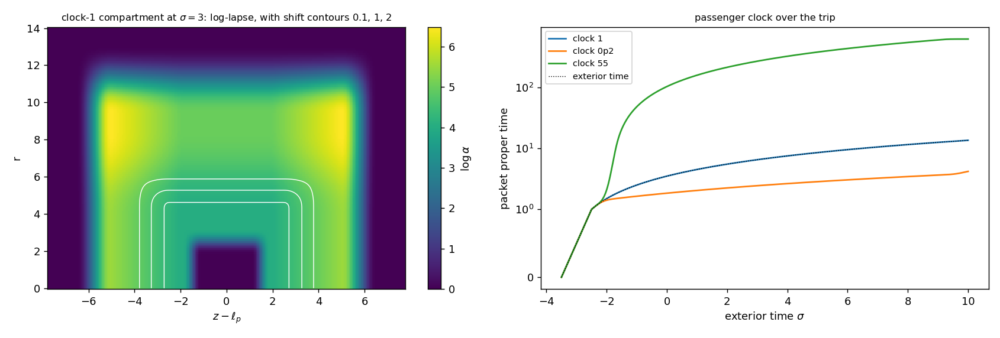

# Compartment Pass: A Flat Passenger Compartment with a Chosen Clock Rate

Date: 2026-09-25. Context: the [lapse and staging pass](LAPSE_AND_STAGING_PASS.md)
carries its packet on a lapse plateau of \(e^{4}\). There the packet's clock
runs 55 times faster than exterior clocks. Across the packet body the
curvature is \(0.31/L^2\), and the normal observers accelerate at up to
\(0.1\,c^2/L\). At a unit length of one metre these give tidal accelerations
of \(3\times10^{16}\) m/s² per metre of body length. This pass carries the
packet in a compartment that is exactly flat, with a clock rate chosen by
design. Code: `adm_harness/compartment_service.py`, with extra lapse terms in
`adm_harness/axial_track.py` (`radial_jets`, `tensor_from_fields`). Run:
`scripts/run_compartment_pass.py`, with data in
[data/compartment_pass](data/compartment_pass/).

## Result

- **A flat compartment.** Around the packet the lapse and the shift are
  uniform in space at every moment, so spacetime there is flat. The packet
  rests on the normal observers, which are free-falling there, from rest at
  departure to rest at arrival. Over the whole trip:
  - its speed relative to them is 0;
  - its acceleration is 0;
  - the largest orthonormal Riemann component in the compartment is
    \(4.4\times10^{-16}\).

  Passengers are weightless and feel no tides.
- **A chosen clock rate.** The packet's clock runs at the compartment lapse,
  a free design parameter. Rates of 0.05, 0.2, 1 and 55 times exterior time
  all pass the screen, and 0.2, 1 and 55 pass the full gate.
- **Gate.** For each full design, every evaluated point is Hawking–Ellis
  Type I: 2.4 million points, and 4.9 million refined. No flux-carrying
  crossing carries a band, and the exterior is exactly vacuum.
- **Arrival.** The packet leaves rest at \(z=0\) at \(\sigma=0\) and comes to
  rest at \(z=12.6\) at \(\sigma=7.5\). Light sent from the departure event
  arrives at \(\sigma=12.6\). The packet leads by 5.1, a mean speed of
  \(1.68c\).
- **Passenger time.** At clock rate 1 the passenger ages 7.5 over the trip,
  as exterior clocks do, which is 0.60 of light's crossing time. At 0.2 the
  passenger ages 1.5, or 0.12 of light's crossing time.
- **Demand.** The demand remains a tension without energy, local to the
  packet and present only during the trip:
  - peak stress is 2.9 at clock rate 1, the same as the lapse-staged rail;
  - per unit distance, the negative-null content is about 1.5 times the
    lapse-staged rail's;
  - static source units can sit wherever the null deficit lies.



The left panel maps the log-lapse around the packet at \(\sigma=3\), in the
middle of the lane. White contours mark the shift at 0.1, 1 and 2. The right
panel plots the packet's proper time against exterior time for the three
clock rates; the dotted line is exterior time.

## Why the compartment is flat

Where the lapse and the shift depend on \(\sigma\) alone, the metric
\(-\alpha(\sigma)^2d\sigma^2+(dz+\beta(\sigma)\,d\sigma)^2+dr^2+r^2d\phi^2\)
becomes Minkowski under \(t=\int\alpha\,d\sigma\),
\(x=z+\int\beta\,d\sigma\). The normal observers are then free-falling, with
acceleration \(D\log\alpha=0\). A packet carried at \(\beta=-v\) rests on them
and ages at the rate \(\alpha\). The coordinate speed changes from 0 to
\(2.1c\) and back, while the passenger stays weightless throughout.

The same change of coordinates fixes where the compartment's boundary can
go. Wherever the shift is uniform in space, it removes the shift and leaves a
pure lapse, and a pure lapse is Type I for any profile. The compartment is
therefore a low-lapse hole cut into a gate-passing lapse structure. Its
boundary lies entirely inside the region where the shift is still uniform.

## Layout

Offsets \(\zeta=z-\ell_p(\sigma)\) are measured from the packet, and every
profile moves with it.

| Element | Location | Setting |
|---|---|---|
| compartment | \(|\zeta|\le1\), \(r\le1.75\) | lapse set to the clock rate; shift \(-v(\sigma)\) |
| hole boundary | \(1\le|\zeta|\le2\), and \(1.75\le r\le3.25\) | log-lapse rises from the clock value to the plateau |
| plateau | across the shift's extent, radially to \(r=9.25\) | log-lapse 4 |
| convex rise | from \(|\zeta|=1.75\) outward | log-lapse slope builds to 0.5 across the shift's edges |
| shift edge | \(2.25\le|\zeta|\le4.25\) | shift falls from \(-v\) to 0 |
| shift transition | \(4.25\le r\le6.25\) | shift falls to 0 radially |
| lapse sheath | \(3.75\le r\le8.75\) rise, \(9.25\le r\le13.25\) fall | \(e^{1}\), across the shift transition |
| fall | \(4.75\le|\zeta|\le6.75\), and \(9.25\le r\le13.25\) | log-lapse returns to 0 |

The packet path runs at rest until \(\sigma=0\), accelerates to \(2.1c\) over
1.5, holds, and decelerates to rest over 1.5 from \(\sigma=6\). The lapse
structure switches on over \(-2.5\le\sigma\le-1.5\), before the carry, and off
over \(9\le\sigma\le10\), after it.

## What each element does

The screen classifies every node within 8.25 of the packet at
\(\sigma\)-spacing 0.25 and offset spacing 0.1. It then root-finds the
widest-estimate crossings of each design.

| Screened design | Type IV nodes | Resolved crossings (banded, widest) |
|---|---:|---|
| **clock rate 1, 0.2 or 55** | 0 | 0 |
| clock rate 0.05 | 0 | 0 |
| plateau \(e^{3}\) | 0 | 0 |
| plateau \(e^{2}\) | 22,348 | 0 |
| steeper shift edge (width 1) | 0 | 0 |
| sharper hole boundary (width 0.5) | 0 | 0 |
| no convex rise | 218 | 24 (24, \(2.0\times10^{-3}\)) |
| sheath \(e^{0.5}\) | 0 | 0 |
| no sheath | 101,638 | 0 |

Three elements carry the admissibility:
- **The sheath.** Across the shift's radial transition, the shift's flux is
  linear in the shift. The stress stays Type I only where the lapse is high
  and still rising radially, and the sheath supplies that rise.
- **The convex rise.** It holds the Gaussian curvature of the service metric
  negative where the shift varies along the track.
- **The plateau.** It keeps the lapse high where the shift varies; at
  \(e^{2}\) it falls below what the shift's edges need.

The hole's sharpness and the clock rate itself leave the gate unchanged,
since the hole lies where the shift is uniform.

## Gate

| Measure | Clock rate 1 | Clock rate 0.2 | Clock rate 55 |
|---|---:|---:|---:|
| samples (\(\sigma\in[-3.5,10]\), offsets \(|\zeta|\le8.25\)) | 22,576 | 22,576 | 22,576 |
| non-vacuum boundary-layer points, Type I (Type IV) | 2,457,368 (0) | 2,457,368 (0) | 2,421,656 (0) |
| refined: half jet step, 24 nodes per panel | 4,929,072 (0) | 4,929,072 (0) | 4,860,128 (0) |
| estimated band samples | 0 | 0 | 0 |
| lapse envelope violations (worst ratio) | 0 (0.076) | 0 (0.076) | 0 (0.076) |
| minimum null energy | −0.93 | −1.30 | −0.58 |
| exterior | exactly vacuum | exactly vacuum | exactly vacuum |

## Passenger

| Measure | Clock rate 1 | Clock rate 0.2 | Clock rate 55 |
|---|---:|---:|---:|
| trip | rest at \(z=0\) to rest at \(z=12.6\) | same | same |
| exterior time, departure to arrival | 7.5 | 7.5 | 7.5 |
| lead over light | 5.1 | 5.1 | 5.1 |
| passenger proper time | 7.5 | 1.5 | 409 |
| passenger time over light's crossing time | 0.60 | 0.12 | 32.5 |
| speed relative to the local free-fall frame | 0 | 0 | 0 |
| acceleration | 0 | 0 | 0 |
| largest compartment curvature component | \(4.4\times10^{-16}\) | \(4.4\times10^{-16}\) | \(4.4\times10^{-16}\) |

Along a long lane at \(2.1c\), a passenger ages \(\alpha/2.1\) of light's
crossing time per unit distance:
- 0.48 at clock rate 1, the rate of exterior clocks;
- 0.095 at clock rate 0.2;
- 26 at clock rate 55.

Per light-year of lane, those are about 5.7 months, 5 weeks and 26 years.

At a unit length of one metre, the compartment is 3.5 m across and 2 m long.

## Demand

| Measure | Lapse-staged rail | Clock rate 1 | Clock rate 0.2 | Clock rate 55 |
|---|---:|---:|---:|---:|
| trip distance | 6.4 | 12.6 | 12.6 | 12.6 |
| peak negative-null content, instantaneous | 141 | 198 | 199 | 186 |
| negative-null content integrated over \(\sigma\) | 799 | 2,286 | 2,303 | 2,155 |
| content per unit distance | 125 | 181 | 183 | 171 |
| peak negative energy, instantaneous | \(1.9\times10^{-4}\) | \(1.3\times10^{-3}\) | \(1.3\times10^{-3}\) | \(1.3\times10^{-3}\) |
| peak stress component | 2.9 | 2.9 | 5.4 | 1.75 |
| largest lapse | \(e^{5.5}\) | \(e^{6.5}\) | \(e^{6.5}\) | \(e^{6.5}\) |

Positive energy vanishes throughout, and no point satisfies the dominant
energy condition.

The content lies mainly in the structure the compartment is cut into. At
clock rate 1, the outer falls hold 1,334 of the 2,286 and the sheath rise
621. The hole boundary holds 157, the sheath plateau 81, the service region
63 and the inner band 30. The null condition fails along \(r\) on 41% of the
Type I volume, along \(z\) on 36% and along \(\phi\) on 18%.

A deeper hole raises the peak stress: 5.4 at clock rate 0.2, where the
log-lapse falls by 5.6 across the hole boundary. The plateau \(e^{3}\), which
also passes the screen, would lower the demand of the falls.

## Placement

Inside a low-lapse compartment carried at \(2.1c\), the shift exceeds the
local light speed, and observers at fixed \(z\) cannot exist there. At clock
rate 1 that region reaches \(r=2.2\) and \(|\zeta|=1.2\); at clock rate 0.2
it reaches \(r=2.4\) and \(|\zeta|=1.4\). It carries none of the null
deficit, so static source units can sit wherever the demand lies. Weighted
by the deficit, the source frame moves relative to static units at a median
of 0 and a 99th percentile of \(0.04c\). About a tenth of the deficit lies at
points with a repeated principal stress, where the source velocity is not
unique. The clock-55 design, whose static frame exists everywhere, has the
same share.

## Open items

1. **Service audits.** The escape, reachability and bundle audits run on a
   ledger along the axis built for the spherical track. They need a ledger
   for the compartment's path before they can apply here.
2. **Demand.** The plateau \(e^{3}\) and a shorter shift edge are the direct
   levers on the negative-null content.
3. **Co-moving light surfaces.** The walls still move faster than light in
   the exterior. The frequency shifts at their light surfaces, recorded in
   the [source scaling test](SOURCE_SCALING_TEST.md), remain a condition on
   quantum source sectors.

## Reproduction

```bash
OPENBLAS_NUM_THREADS=1 python toolkit/adm_harness_cli/scripts/run_compartment_pass.py --workers 4
PYTHONPATH=toolkit/adm_harness_cli:toolkit/adm_harness_cli/scripts python -m pytest toolkit/adm_harness_cli/tests/test_compartment_service.py toolkit/adm_harness_cli/tests/test_axial_track.py
```

The run takes about 12 minutes with four workers:
- the screen and its band resolution take 3 minutes;
- each clock rate's gate, refinement, census and passenger history take
  3 minutes.

The manifest records the designs, the screened variants, the zones, the
checks and the software hashes. The tests compare the compartment's tensor
with an independent finite-difference Einstein tensor, and they check the
compartment's flatness, the packet's rest on the normal observers, the clock
rate and the exterior vacuum.
