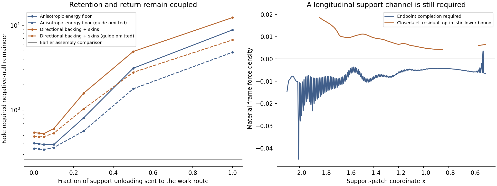

# Composite capacitor and rail connections

The capacitor candidate consists of charged tensile skins, a separate radial
backing, the existing pressure medium, and bidirectional electrical contacts.
Its mechanical connections determine whether electrode loads are balanced
inside each cell or transmitted to the standing rail support. This study
evaluates those alternatives on the scheduled active-rail patch, including
credit for the pressure medium already present.

The composite calculations put the immediate construction problem in the
joint backing, pressure link, and standing rail support. Internally balancing
the capacitor cancels the macroscopic electric stresses that participated in
the original pressure-link force balance. The counted material then requires
an additional longitudinal force channel. Even arbitrary resolved sharing
of the existing pressure leaves a fade pressure-drop deficit of about 0.03190:
the most favorable required drop is 0.03775, compared with 0.00586 available.

The energy calculations identify the associated tradeoff. A passive skin and
directional backing covering the electric tractions require about 171.53 units
of initial material energy and reach 1,864.41 at fade. Controlled unloading
reduces the inventory and increases the return-channel burden. Partial
unloading improves that comparison while leaving the mechanical completion
open. The bounded material-selection search therefore stops at the rail
connection, with an explicit force and work specification for the next joint
component calculation.

## Architecture and material basis

The controlling geometry is the prepared, scheduled carrying flow with its
protected packet, collars, and release interval. The capacitor occupies the
existing endpoint support patch, x in [-2.1,-0.5], over s in [0,1.285]. The
standing radial support, angular jacket, endpoint heat/current medium, delivery
guides, and thermal receiver retain distinct roles. The
[architecture scope review](ACTIVE_RAIL_ARCHITECTURE_SCOPE_REVIEW.md) and
[finite work interface](FINITE_WORK_INTERFACE.md) specify that decomposition.

The archived endpoint and pressure-fluid/field tensors have cancelling
divergences. The constructed delivery, receiver, and capacitor material replace
part of that endpoint realization. Their remaining required force is the
archived endpoint force minus the forces of the supplied components. The
original endpoint tensor is consequently a completion target, and its
unconstructed remainder receives its own source and mechanical requirements.

The charged-skin material basis is a phase boundary carrying trapped charged
fermions. Its leading surface thermodynamics are

    Sigma = tau + C n_s^(3/2),
    P = -tau + (C/2) n_s^(3/2).

Consequently a tension-dominated skin supplies P/Sigma near -1, while its
positive pressure approaches Sigma/2. The slope dP/dSigma at fixed tau is
1/2. Charge injection changes the carrier energy as well as the electric
field energy. For skin area A and carrier number N, the required additional
chemical port follows from U=tau A+C N^(3/2)/sqrt(A). This relation is
implemented and checked independently against area variation. The model's
trapping phase and couplings remain material hypotheses.
[Morris, *Charged Vacuum Bubble Stability*](https://arxiv.org/abs/hep-ph/9810420)
provides the charged-wall construction underlying this surface model.

A related constitutive lead is Peter's
[surface current-carrying domain wall](https://arxiv.org/abs/hep-ph/9503408).
It computes surface energy and tension from a scalar-wall/condensate model,
with a carrier localization threshold. That calculation treats the current
symmetry as global and omits long-range electromagnetic interactions. A rail
electrode would require the gauged finite-layer problem, its confinement
energy, and the electrical contacts. These models therefore identify
constitutive building blocks for the tensile skin; the separate backing
and rail connections carry the remaining construction duties.

For the backing, the numerical screen includes directional pressure, an
isotropic causal stiff-fluid limit, and a radiation-pressure fluid. The
tensile skins remain separate in each case. A general anisotropic material
saturating the dominant energy condition supplies an optimistic comparison.
Its energy inequality alone supplies no finite material realization.

## Existing pressure receives an explicit credit

Write u for electric energy density and p_* = min(p_fluid,u) for the existing
isotropic pressure allocated to the cell. New material must then supply

    delta p_r = u-p_*,       delta p_t = -u-p_*.

The pressure credit reduces the radial backing requirement and increases
the skins' tangential load. The following minimum added densities include
both effects:

| Added material family | Minimum added energy density |
| --- | ---: |
| General anisotropic DEC floor | u+p_* |
| Directional compression backing plus tensile skins | 2u |
| Isotropic stiff-fluid backing plus tensile skins | 3u-p_* |
| Radiation-fluid backing plus tensile skins | 5u-3p_* |

In the directional composite, the backing costs u-p_* and the skins cost
u+p_*. Thus reusing the existing pressure leaves the minimum added density
at 2u. For isotropic backing, the skins supply tension 2u, including the
backing's angular pressure. Existing fluid energy stays in the source ledger.
The remaining macroscopic pressure of electric field, allocated fluid, and
new support is the pressure of the unallocated fluid. All comparisons use
the complete boosted tensor.

At full recovery, the existing pressure supplies about 10.75% of the electric
load under an electric-energy/proper-duration weighting. This quantity is
a load-allocation diagnostic. A physical arrangement must implement the
subcell pressure distribution and its connections.

## Passive preparation and controlled unloading

Let ell=Gamma B, D=ell R^2, H_e=H-S, and U_E=H_e ell/R^2, per coordinate
material label and solid angle. The elementary electric cell has

    q=sqrt(2 H_e),       1/C=ell/R^2,
    Delta U_E = W_electrical + W_mechanical,E.

Endpoint product averages give an exact discrete work identity. Across the
full-recovery history, ell at fade is between 0.0380 and 0.3658 of its initial
value. R changes by about one percent. This deformation acts very differently
on a tensile skin and a compressed radial backing.

The least prepared passive coefficients covering the field tractions are

    U_skin = tau(x) R^2,       tau=max_s(U_E/R^2),
    U_back = K(x)/ell,         K=max_s(U_E ell).

These laws grant zero charge-carrier energy and a maximally stiff directional
backing. The skin stores little area work; the backing accumulates radial
compression work. Their 1024-cell total rises from 171.53 to 1,864.41. Their
fade required negative-null remainder is 6.27767. Traction coverage also
leaves excess pressure and tension, so this configuration is a material
capacity control with unresolved force balance.

The more favorable controls prescribe the balancing stresses exactly. Let
W_* = -average(p_*) Delta D denote the credited fluid's compression work.
The support's mechanical work is

    W_support = -W_mechanical,E - W_*.

Two inventories then bracket the required handling of that work. A retained
inventory has U_support=U_initial+prefix(W_support), with the smallest initial
value keeping it above the material energy floor throughout the interval.
A controlled inventory follows that floor and exchanges
Delta U_support-W_support through an additional work port. These histories
grant arbitrary constitutive adjustment consistent with the specified
stress and energy accounting.

At full recovery and 1024 cells:

| Family | Retained: initial material energy | Retained: fade material energy | Controlled: fade material energy | Controlled: joint work export |
| --- | ---: | ---: | ---: | ---: |
| General anisotropic floor | 96.57 | 194.98 | 8.88 | 151.45 |
| Directional backing and skins | 165.87 | 264.29 | 16.88 | 217.60 |
| Stiff-fluid backing and skins | 235.60 | 334.01 | 24.89 | 283.91 |
| Radiation-fluid backing and skins | 375.57 | 473.98 | 40.89 | 416.70 |

The retained fade source remainders are respectively 0.51732, 0.65312,
0.78931, and 1.06208. The controlled instantaneous values are 0.20377,
0.21633, 0.22889, and 0.25400 before transport of the added work. The preceding
zero-added-material interface gives 0.20375. The older 0.262788 formal-store
value is an assembly comparison, with no universal feasibility status.

## Mechanical connection accounting

For the electric cells, the signed deformation work is -105.18847, with
111.90093 delivered and 6.71246 absorbed across individual label intervals.
The existing fluid has 7.96944 of positive compression work and -1.12778
of expansion work. Granting instantaneous local reuse of opposite work leaves
103.99898 of electric/fluid mechanical export and 5.65217 of input across
the interval. This credit preserves the fluid's prescribed energy history;
it specifies the ideal coupling that would transfer the work.

The paired radial guide also changes energy under the prescribed deformation:
its constant G gives U_G=G ell/R^2 and Delta U_G=G Delta(ell/R^2).
For this history the signed change is -523.69715. This is a deformation term
on the time-dependent metric. A source-free radial guide can have zero local
four-divergence while its energy changes this way. Consequently the guide
figure is a geometry/support accounting diagnostic, and a physical port duty
requires the actual guide-end and support boundary conditions. Assigning
all of it to electrical return or receiver heat would add an unsupported
assumption.

The physical distinction is therefore between a closed cell, whose internal
backing takes the opposite field work, and an attached cell, whose residual
tractions enter the wider support equations. The second case requires the
standing support's reciprocal forces, work, and constitutive response.

## Partial unloading through the existing route

An unloading fraction lambda interpolates between retained and controlled
support energy:

    U_support(lambda) = (1-lambda) U_retained + lambda U_floor,
    W_joint = W_electrical + lambda W_support,port.

The two leading families use lambda=0, 0.025, 0.05, 0.1, 0.25, 0.5, and 1.
The two isotropic-fluid composites also receive retained/full-unloading
comparisons. Every case sends its complete joint work through the existing
receiver-side route. The screen grants perfect local reuse, perfect
conversion, ideal absorption, and omission of the heat-receiver tensor.
These concessions make the transport source comparisons optimistic. The
separate attachment audit below retains the actual preceding heat receiver.

At 1024 cells with four geometry subdivisions per original time interval:

| Family | Best sampled unloading fraction with the guide | Fade remainder with the guide | Best sampled remainder with the guide omitted | Full-unloading fade remainder with the guide |
| --- | ---: | ---: | ---: | ---: |
| General anisotropic floor | 0.10 | 0.39163 | 0.34248 | 8.81767 |
| Directional backing and skins | 0.05 | 0.52686 | 0.48043 | 12.33417 |
| Stiff-fluid backing and skins | 0 | 0.67979 | 0.62493 | 15.85141 |
| Radiation-fluid backing and skins | 0 | 0.95331 | 0.89845 | 22.88608 |

The guide uses the existing 0.5 field-frame-speed comparison. A relaxed 0.9
comparison reduces the general-floor best sampled value to 0.38837. The
guide-omitted best unloading fractions are 0.05 for the general floor and
0.025 for the directional composite. All these are sampled controls with
the specified time history, route, and material-energy assumptions.

The modest unloading fractions reduce retained material energy without
creating the large return stream of full unloading. Full unloading raises
the required guide flux from the preceding 0.66966 to about 70.57 for the
general floor and 98.67 for the directional composite. The separately
supported capacitor therefore exposes a storage-versus-return tradeoff;
changing its constituent material alone leaves that tradeoff in place.

In the right panel, the blue curve is the force still required to complete
the preceding endpoint realization. The orange curve is a lower bound on
the complete closed-cell assembly's force residual where its full local
fluid pressure has been assigned to the cell. The two curves describe those
distinct construction controls at the last interval midpoint.

## The material connection requires longitudinal stress

For a co-moving surface skin with zero radial pressure, its radial divergence
is F_skin=rho a-2 p_t k, where k is the material-frame derivative of ln R.
The charged Fermi skin spans -rho<=p_t<=rho/2. A wider control grants the
entire DEC interval -rho<=p_t<=rho and arbitrary positive density.

On the pinned 1024-cell allocation evaluated at 4096 positions, the Fermi
skin's force sign cannot supply 72.30% of the remaining force demand, weighted
by absolute force and proper spacetime volume. The wider DEC skin misses
71.15%. At s=1.28249, x=-2.00605, the required force is about -0.04496.
The wider skin has F_skin/rho between +0.55468 and +0.84140 there. Changing
the skin density or its allowed tangential stress preserves that sign
conflict. A longitudinal stress gradient provides an additional channel.

The complete internally balanced composite gives a second witness. Wherever
p_*=p, adding the electric field, allocated fluid, and balancing support
leaves zero averaged radial and tangential pressure. The DEC material floor
then gives total density at least n+4p+2u, before the receiver. Its rest-frame
force is bounded below by

    F_closed >= (n+4p+2u+rho_receiver) a + F_workwaves.

For the selected receiver-side work route F_workwaves is nonnegative.
The constant-flux radial guide has zero local divergence. Thus positive a
requires a separate opposing force. This witness applies to about 78.12% of
the force-weighted demand and reaches approximately 0.04525. It is independent
of the skin's microscopic charge-confinement mechanism. Extra retained
co-moving energy increases its holding-force requirement in this region.

### Allowing the existing pressure to be shared differently

The final control releases the maximum-pressure-credit choice. Let r=p-p_*
be the original fluid pressure left outside the internal cell balance. It
can take any value in

    max(p-u,0) <= r <= p.

The general DEC floor gives rho_total+pr_total >= n+4p+2u regardless of this
allocation. At fade, on a connected interval of positive acceleration,
force balance therefore requires

    r_x <= -Gamma B a (n+4p+2u) - Gamma B v r_t/N.

This grants omission of charge-carrier excess energy, the thermal receiver,
work-wave momentum, and retained support energy. Each adds positive force
on the chosen interval. Integrating from left to right gives a necessary
pressure budget: the required drop must fit between the largest allowed
left pressure and the smallest allowed right pressure.

The last-time material velocity is at most 1.4e-10. The calculation retains
the most favorable temporal term for any pressure allocation linear across
the final archived interval, using |r_t|<=max(p_previous,p_final)/Delta s.
Its integrated allowance is approximately 5.3e-18 on the selected interval.
Pressure variations within that interval would require a separately resolved
constitutive and propagation calculation.

| Pinned allocation / evaluation cells | Required pressure drop | Available pressure drop | Deficit |
| --- | ---: | ---: | ---: |
| 512 / 512 | 0.03786736 | 0.00597849 | 0.03188887 |
| 1024 / 1024 | 0.03780258 | 0.00590868 | 0.03189389 |
| 1024 / 4096 | 0.03775449 | 0.00585647 | 0.03189802 |

The dense witness spans x=-2.05020 to -0.84473 at s=1.285. The necessary
pressure drop is about 6.45 times the available drop. The deficit changes
by 0.013% between the 1024 and 4096 evaluations. This control allows the
pressure allocation to vary independently at every resolved location and
time before imposing a joint equation of state. The remaining mismatch is
therefore already a property of this closed-composite/pressure-link class.

## Construction consequence

The charged tensile skin remains a useful electrode candidate, and the
separate backing makes its load path explicit. The current family gives two
ways to close that path. Internal closure transfers the electric tractions
into material stress and removes their macroscopic radial contribution;
the fixed pressure link then lacks the pressure gradient required by its
counted energy. External attachments preserve a longitudinal stress path
through the rail, whose reciprocal force, deformation work, and source tensor
must be supplied by the standing components.

Consequently the next joint problem is the capacitor backing, pressure link,
and standing-support connection. Its unknowns include the longitudinal and
angular support stresses, their end tractions, and the split between retained
mechanical energy and returned electrical work. The capacitor supplies its
electrode tractions and constitutive energy/work relations as boundary data.
The heat/current medium, delivery route, and protected-packet constraints stay
in that joint ledger. This is the stopping condition for the present material
search: the broader mechanical completion now determines which capacitor
construction can be selected.

The bounds concern this prescribed history and these composite/connection
classes. They establish neither a general obstruction to capacitors nor an
impossibility result for the active rail. A completed charge-confining finite
layer, its stability, and physical contacts remain to be constructed after
the mechanical allocation is settled. The separate absolute quantum source
and the full An-T-Le construction also remain open.

## Evidence and verification

Material/work controls:
`toolkit/adm_harness_cli/adm_harness/composite_capacitor.py`.
The three numerical producers are `evaluate_composite_capacitor.py`,
`evaluate_composite_capacitor_transport.py`, and
`evaluate_composite_pressure_allocation.py` in
`toolkit/adm_harness_cli/scripts`. The independent audit is
`audit_composite_capacitor.py` in that directory.

Evidence directories:

- [`data/composite_capacitor`](data/composite_capacitor): four material/work
  cases, with 512/1024 cells and 90%/100% recovery.
- [`data/composite_capacitor_transport`](data/composite_capacitor_transport):
  18 unloading/material cases at each of three spatial/geometry resolutions.
- [`data/composite_capacitor_audit`](data/composite_capacitor_audit): force
  witnesses, resolution comparisons, and standalone PNG/PDF figures.
- [`data/composite_capacitor_pressure_allocation`](data/composite_capacitor_pressure_allocation):
  the resolved pressure-sharing bound at three evaluations.

Forty-six focused tests pass across the new composite controls and the
associated capacitor, pressure-link, and transport modules. The tests include
an independent normal-frame covariant-divergence comparison and a source-free
radial-field control, establishing the distinction between deformation work
and an actual material force. Analytical hydrostatic examples check the
pressure-drop witness and its treatment of disconnected acceleration domains.

The largest exact composite work residual is 2.56e-14; the largest transport
balance residual is 1.81e-14. Across all sampled source comparisons, spatial
refinement changes the result by at most 1.21%, while doubling the transport
geometry subdivisions changes it by at most 0.00428%. Those subdivisions
refine geometry interpolation; the material/field history retains its original
257 time intervals. The force-sign fractions are stable under denser spatial
evaluation; the pointwise force maxima vary more with spatial sampling, as
the separate tables record. All 140 input/output hash checks pass. New numerical
evidence occupies 5,471,189 bytes, approximately 5.5 MB.
