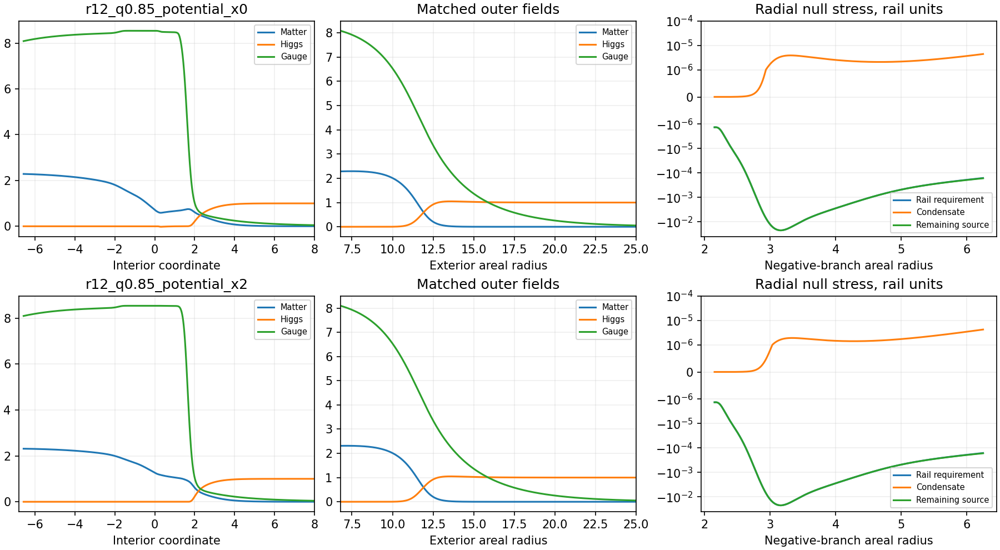

# Joint condensate continuation on the retained rail

Two joint scalar–Higgs–gauge solutions extend regularly through the retained asymmetric throat, match a self-gravitating exterior at areal radius 6.8, and approach vacuum at both distant ends. The branch with no resolved Higgs node is the preferred material candidate. It carries the required radial boundary load while adding at most 2.64% to the magnitude of the negative radial quantum enthalpy required over the original annulus. The full angular tensor, absolute quantum stress, and coupled perturbations remain requirements of the complete source.

## Registered construction

This bounded round uses the [joint-selection direction](CONDENSATE_JOINT_SELECTION_DIRECTION.md) to seek a regular stationary material profile through the retained throat. It keeps the Ishihara–Ogawa matter, Higgs, and gauge action with \(e=0.1\), \(\lambda=1\), and \(\mu=1.4\). The negative-side exterior obeys the classical Einstein–matter equations. The interior and positive-side tail retain the phase-0.745 geometry. A complete quantum source must subsequently account for the difference between that geometry's Einstein tensor and the material tensor.

Two domains share one boundary-value problem. The exterior runs outward from areal radius 6.8, and the interior runs from that same cut through the finite-radius throat to the positive-side far field. Interior integration uses proper radial distance. All three field values and normal derivatives match at the join. The retained mass and lapse gradient match there as well. The exterior clock approaches unity; one unknown clock normalization multiplies the retained interior lapse.

The exterior carries eight first-order variables: three fields and their derivatives, the mass, and the logarithmic lapse factor. The interior carries the six field variables. Two eigenparameters determine the positive gravitational conversion \(g=Gv^2\) and the interior clock normalization \(A_0\). Sixteen boundary conditions close these fourteen equations and two eigenparameters: exterior vacuum and clock conditions; the inner mass; six field continuity conditions; lapse and radial-load matching; and three asymptotic interior vacuum conditions. A prescribed frequency fraction \(q\) sets \(\omega=q\sqrt\mu A_0\), where \(0<q<1\). Thus matter can decay in the distant positive-side vacuum. The negative-side mass threshold \(\omega<\sqrt\mu\) is checked independently.

The old inner scalar amplitudes, their derivatives, and the zero inner electric derivative are free to adjust in this problem. The material's negative radial pressure remains constrained by the retained geometry, while its dimensionless magnitude follows from the solved gravitational conversion. Robin conditions at the positive far end use the vacuum matter, Higgs, and gauge decay rates. The asymptotic domain is extended during verification.

The initial branch search compares potential-dominated interior seeds with a hollow control. The primary frequency fractions are 0.70, 0.85, and 0.97. Material scales place the join at dimensionless radii 12 and 20. Potential-seed transitions near coordinate zero and coordinate two provide a bounded placement comparison. An auxiliary metric multiplies the retained log lapse and log radial scale by a continuation fraction from zero to one, preserving the areal-radius profile and the exact join data. Only fraction one represents the retained interior. Both auxiliary and direct full-metric attempts are numerical branch-location procedures.

The computation uses four workers, single-thread numerical libraries, a ten-minute search allowance, and a 20 MB retained-data allowance. Each branch-location relaxation has a mesh cap and a finite runtime limit. Failures to converge are recorded as numerical outcomes. A physical obstruction requires converged fields or an independent analytic condition. Acceptance requires resolved original-equation and boundary residuals, positive exterior metric factor, localized far fields, and finite interior fields. Following an accepted branch, the counted tensor and quantum remainder determine the next source test. Positive kinetic terms and static regularity leave the coupled angular perturbations and time-dependent service conditions as further requirements.

## Joint field equations and asymptotic clocks

For proper interior distance \(s\), measured in \(v^{-1}\), let \(R_s/R=\mathcal R\), \(A_s/A=\mathcal A\), and \(A=A_0A_{\rm rail}\). The interior equations are

\[
u_{ss}=-(2\mathcal R+\mathcal A)u_s+
\left[\mu h^2-\frac{(\omega-ea)^2}{A^2}\right]u,
\]
\[
h_{ss}=-(2\mathcal R+\mathcal A)h_s+
\left[\mu u^2+\frac\lambda2(h^2-1)-\frac{e^2a^2}{A^2}\right]h,
\]
\[
a_{ss}=-(2\mathcal R-\mathcal A)a_s+
2e^2a(u^2+h^2)-2e\omega u^2.
\]

The areal radius remains finite at the throat, so the equations continue across it without imposing a spherical origin. The retained lapse and radial scale differ on the two sides. Proper-distance interpolation preserves that asymmetry. The exterior equations and the full material stress follow [the condensate action and tensor derivation](SCREENED_SCALAR_CONDENSATE.md).

Vacuum localization requires \(\omega<\sqrt\mu\) at the normalized exterior end and \(\omega/A_0<\sqrt\mu\) at the retained positive end. The earlier exterior-only candidate had \(\omega/A_0\simeq1.28\), above \(\sqrt\mu=1.18322\). Its frequency therefore also failed this far-end localization condition. The joint parameter \(q\) selects the ratio below that threshold from the outset.

The normal derivatives at the internal cut satisfy \(\partial_s(u,h,a)=-\sqrt{N_R}\,\partial_r(u,h,a)\), where exterior \(r\) is the dimensionless areal radius and interior \(s\) increases toward the throat. The lapse condition is \(\sigma_R\sqrt{N_R}=A_0\). Mass continuity and

\[
m_R+4\pi g r_R^3p_{r,R}
=r_R^2N_R(\partial_r\log A)_{\rm rail}
\]

enforce the two independent extrinsic-curvature conditions. Consequently the joined static metric carries zero distributional surface stress at this cut.

## Converged branches

The fifteen numerical starting cases give three converged auxiliary solutions. Two continue to the full retained metric. The third reaches metric fraction 0.102024 before the registered step-size limit. Its failure is numerical branch continuation at fixed parameters. The retained search supplies two regular full-metric candidates and makes no exclusion claim for the other starting cases.

| Quantity | Branch with one Higgs node | Branch with no resolved Higgs node |
| --- | ---: | ---: |
| Material scale \(v\) | 1.76470588 | 1.76470588 |
| Frequency fraction \(q\) | 0.85 | 0.85 |
| Gravitational parameter \(g\) | \(7.52650190\times10^{-5}\) | \(7.51388030\times10^{-5}\) |
| Common conversion \(\eta=g/v^2\) | \(2.41684\times10^{-5}\) | \(2.41279045\times10^{-5}\) |
| Frequency \(\omega\) | 0.853805932 | 0.853998677 |
| Positive-end clock \(A_0\) | 0.848938490 | 0.849130136 |
| Exterior ADM mass, rail units | 1.77376992 | 1.77090962 |
| Minimum exterior \(N\) | 0.76318532 | 0.76347686 |
| Maximum scalar amplitude | 2.292791 | 2.313694 |
| Total material proper energy, geometric rail units | 2.699610 | 2.690407 |
| Total matter number | 49,012.7568 | 48,954.2828 |

The branch names refer to resolved sign changes in the real Higgs profile. The first has a minimum Higgs amplitude near −0.02222. The second retains positive Higgs amplitude, including an exponentially small value deep in the potential-dominated region. Its lower exterior mass and absence of a resolved Higgs node make it the preferred continuation candidate. These selection properties leave the full perturbation spectrum open.

For the preferred branch, the inner material values are approximately

\[
u_R=2.31192,\quad h_R=2.59\times10^{-9},\quad
a_R=8.09654,\quad u'_R=0.00538292,\quad a'_R=-0.112257.
\]

The pressure decomposition is

\[
V_R=0.25,\quad K_R+D_R=0.01460417,\quad E_R=0.00816000,
\qquad p_{r,R}=-0.24355583.
\]

Thus potential energy supplies most of the negative radial pressure, with small kinetic, gradient, and electric corrections. Its geometric pressure remains \(-5.6991156\times10^{-5}\), exactly the retained load. This realizes the pressure-to-potential direction identified in the preceding synthesis. The previous fixed value \(p_{r,R}=-0.125\) and the corresponding forced kinetic contribution have been replaced by a solved material normalization.

The material fields remain finite through the entire retained throat. The matter amplitude varies gradually across the potential-dominated interior. The Higgs field stays small there, then approaches its vacuum value on the positive side. The negative-side exterior has its own smooth transition to vacuum. The selected radius-6.8 cut lies inside this complete field profile; the actual optical transition follows the solved field masses and couplings.

## Screening and independent balances

The electric flux across the cut is finite. For the preferred branch, \(4\pi r_R^2a'_R/\sigma_R=-231.17053\) in the field normalization. The material on the two sides therefore has opposite net charge contributions. Their combined matter charge is approximately +4,895.42828 and their combined Higgs charge approaches its negative as the asymptotic cutoff increases. Global screening follows from the field equations while the cut permits the electric gradient needed by the regular interior.

Independent integration checks

\[
Q_\psi+Q_h+4\pi\left[\frac{r^2a'}\sigma\right]_{\rm exterior\ far}
+4\pi\left[\frac{R^2a_s}A\right]_{\rm positive\ far}=0,
\]

with both radii in Higgs-vacuum units. It also checks the exterior mass increment and interior stress conservation,

\[
p_{r,s}=-(\rho+p_r)\frac{A_s}{A}
+2\frac{R_s}{R}(p_t-p_r).
\]

Eight refinements cover both branches at tolerances \(10^{-5},10^{-6},10^{-8}\), with the positive far coordinate extended from 48 to 64 and the exterior dimensionless radius from 160 to 200. The finest original-equation errors are below \(1.9\times10^{-8}\), and boundary errors are below \(10^{-15}\). At tolerance \(10^{-8}\), the integrated Gauss-law errors are below \(8\times10^{-13}\). Exterior mass integrals agree to better than \(10^{-11}\), and independent fourth-order pressure derivatives give relative conservation errors below \(1.4\times10^{-7}\).

For the preferred branch, the residual charge fraction is \(1.15\times10^{-6}\) at the shorter domain and \(2.74\times10^{-8}\) at the longer domain. The retained finite electric flux accounts for these residuals. Frequencies and ADM masses remain consistent under both tolerance and domain refinement.



## Interior source requirement

The interior metric determines a complete static tensor independently of the condensate. In physical proper distance \(l\), its orthonormal components are

\[
8\pi\rho_{\rm req}=\frac{1-R_l^2-2RR_{ll}}{R^2},\qquad
8\pi p_{r,\rm req}=\frac{-1+R_l^2+2RR_lA_l/A}{R^2},
\]
\[
8\pi p_{t,\rm req}=\frac{A_{ll}}A+\frac{A_lR_l}{AR}+\frac{R_{ll}}R.
\]

Subtracting the material tensor gives the required additional source. This is an Einstein-tensor remainder, with its quantum expectation value still to be calculated. The scalar fields obey their material equations on the retained metric; the additional source must realize this remainder together with the model's quantum force and renormalized couplings.

At the matching cut, the required additional energy, radial pressure, and angular pressure are approximately \((-1.21\times10^{-4},0,+1.10\times10^{-4})\) in geometric rail units. The present exterior includes only the classical material. A complete semiclassical continuation therefore also has to determine the quantum stress and the metric through this transition. The matched extrinsic curvature establishes the classical absence of a surface sheet; the absolute quantum source has a further continuation requirement.

The original negative-side annulus has 2,049 retained witnesses, all requiring negative radial enthalpy, with 1,162 requiring negative angular enthalpy. For the preferred branch, the added positive radial material enthalpy is a median 0.0895% and a maximum 2.643% of the magnitude of the required negative radial value. This makes the interior potential-dominated state inexpensive in the radial null channel while preserving the explicit positive material energy in the full ledger.

The corresponding angular ratios are a median 7.782% and a maximum 27.684. The maximum occurs at the outer witness \(R=6.25\), where the required angular enthalpy is only \(-2.29797\times10^{-7}\), while the material adds \(+6.36171\times10^{-6}\). The required additional angular source there is consequently \(-6.59151\times10^{-6}\). The full angular profile remains an independent requirement even though the radial cost is small.

The regularity and static matching obstruction of the earlier exterior-first branch is resolved within this joint construction. The resulting material profile supplies a concrete background for its coupled fluctuations and quantum stress. The previous ideal-sheet response is a placement clue; the actual optical operator must follow these smooth fields. Their absolute curved quantum tensor, quantum backreaction, angular stability, and subsequent active-rail evolution retain their separate roles in a complete An–T–Le construction.

## Verification and retained evidence

The reproducible four-worker run takes 118.71 seconds and retains 12.48 MB. The recorded maximum worker resident memory is approximately 862 MiB. Twenty-three focused tests pass across the three condensate test modules. They include the exact potential state, coordinate and proper-distance field equations, an independent Ellis-tensor control, conserved charge including both asymptotic fluxes, mass integration, stress balance, and the normal-derivative and geometric join conditions.

The [manifest](data/condensate_joint/manifest.json) hashes the source code, retained geometry, and numerical artifacts. Individual outcomes are in the [branch-location table](data/condensate_joint/branch_location.csv), [continuation trace](data/condensate_joint/continuation_trace.csv), [refinements](data/condensate_joint/refinements.csv), and [primary summaries](data/condensate_joint/primary_summaries.csv). The solution archives preserve polynomial coefficients and eigenparameters; CSV profiles retain the material tensor and the required interior remainder. Reproduction from the repository root:

```bash
PYTHONPATH=toolkit/adm_harness_cli OPENBLAS_NUM_THREADS=1 OMP_NUM_THREADS=1 MPLCONFIGDIR=/tmp/rail-joint-mpl python toolkit/adm_harness_cli/scripts/run_condensate_joint.py --workers 4 --output /tmp/rail-joint-repeat
PYTHONPATH=toolkit/adm_harness_cli OPENBLAS_NUM_THREADS=1 OMP_NUM_THREADS=1 pytest -q toolkit/adm_harness_cli/tests/test_screened_condensate.py toolkit/adm_harness_cli/tests/test_condensate_rail.py toolkit/adm_harness_cli/tests/test_condensate_joint.py
```
