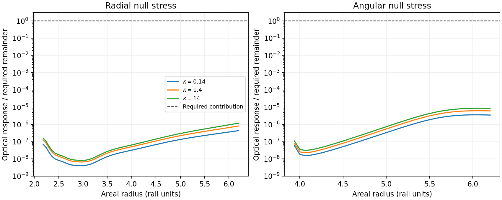

# Quantum stress of the joint condensate background

The resolved condensate preserves the enclosing boundary's useful vacuum-response signs. One real Higgs-portal scalar supplies negative radial optical enthalpy at all 65 principal observations and negative angular optical enthalpy at all 37 observations requiring it. At the solved material normalization, the central coupling supplies between \(6.63\times10^{-9}\) and \(8.11\times10^{-7}\) of the required radial magnitude. The smooth optical response therefore provides a small part of the measured source requirement.

The absolute quantum source encounters a separate, decisive condition at the geometric join. The matched classical background has a curvature step, and the scalar vacuum develops a positive \(d^{-2}\) energy term on its interior side. The required additional energy stays finite and negative there. Hence this exact joined background fails the regular semiclassical source equation. A complete condensate–quantum construction requires the metric transition, absolute vacuum stress, and material response to satisfy a common set of equations.

The [smooth joint investigation](SEMICLASSICAL_JOINT_INVESTIGATION.md) implements a common quantum stress and material force, then performs a fixed-charge material update and recalculates the absolute vacuum on that smooth seed. Its integrated negative radial stress remains roughly 186,000–204,000 times too small for the measured opening balance. This supplies a global solvability barrier for the bounded alternating geometry update beyond the original curvature-junction condition.

## Registered source and calculation

The starting material is the regular, nodeless branch in the [joint-continuation calculation](CONDENSATE_JOINT_CONTINUATION.md). The quantum probe is one real, minimally coupled neutral scalar in its static ground state, with positive Higgs coupling

\[
\mathcal L_\chi=-\tfrac12(\nabla\chi)^2-\tfrac12\kappa|\phi|^2\chi^2,
\qquad M_\chi^2(x)=\kappa v^2 h(x)^2.
\]

This is an explicit spectator-field extension of the material action. Quantizing the charged material itself requires its coupled scalar, gauge, and constraint operators. The registered central coupling is \(\kappa=1.4\); comparisons at 0.14 and 14 measure the response to a decade change in the exterior mass. The material, frequency, clock, and common gravitational conversion retain their solved values. In particular, a one-field stress in rail length units is multiplied by \(\eta=2.41279045\times10^{-5}\).

The first calculation measures the smooth optical contribution by subtracting the massless ground state on the same complete joined metric. A smooth transparent-plateau approximation sets the optical mass to zero where \(|h|\leq10^{-7}\) and restores exactly \(\kappa v^2h^2\) where \(|h|\geq2\times10^{-7}\). An infinitely differentiable transition joins the two. All observations lie in the common massless region. Varying that threshold independently checks the negligible Higgs-tail approximation. This subtraction yields a finite optical response at those observations; the absolute curved vacuum supplies another term in the source equation.

The field operator follows the Euclidean spherical Green-function construction of [Arrechea and collaborators](https://arxiv.org/html/2607.07583v1#S2). The radial finite-volume form includes the complete condensate-dependent mass and both asymptotic ends. Positive Schur-complement differences evaluate the finite Green-function change without subtracting nearly equal large coincident values. Frequency integration and the spherical harmonic sum retain the energy density, radial pressure, angular pressure, and both null contractions. Four workers perform independent angular sums. Spatial resolution, frequency quadrature, angular truncation, end distance, and the transparent plateau receive separate controls. The retained-data allowance is 20 MB.

The second calculation audits the quantum regularity of the internal geometric join. The previous matching enforces continuous induced metric and extrinsic curvature. Its interior Einstein tensor and exterior classical material tensor have different energy and angular-pressure limits. Thus second normal derivatives of the metric jump. The high-frequency response of a minimal scalar to this curvature step supplies a necessary regularity test for the absolute source, independently of the finite optical subtraction. A nonzero divergent one-sided bulk term is a stopping condition for promotion of this fixed background to a complete semiclassical construction.

Smooth material-dependent optical potentials and their joint renormalized force equation are developed by [Mazzitelli, Nery, and Satz](https://arxiv.org/abs/1110.3554) and [Franchino-Viñas, Mantiñan, and Mazzitelli](https://arxiv.org/abs/2110.14692). The optical calculation here holds the classical material profile fixed; its quantum force remains part of the coupled material equation.

## Stress supplied by the smooth optical profile

The positive Higgs coupling makes the scalar effectively massless in the potential-dominated interior and massive in the exterior vacuum regions. The field sees the complete smooth profile, including the positive side of the throat. Radius 6.8 remains an internal material cut; the optical reflection follows the actual Higgs transitions farther along the solved fields.

For each coupling, the radial sign agrees at 65 of 65 principal observations. The angular sign agrees at all 37 observations with negative required angular enthalpy. The ratios below use the geometric one-field optical response divided by the additional source required after counting the full classical material tensor:

| Higgs coupling \(\kappa\) | Median radial fraction | Largest radial fraction | Median angular fraction | Largest angular fraction |
| --- | ---: | ---: | ---: | ---: |
| 0.14 | \(4.67\times10^{-8}\) | \(4.37\times10^{-7}\) | \(4.36\times10^{-7}\) | \(3.60\times10^{-6}\) |
| 1.4 | \(8.18\times10^{-8}\) | \(8.11\times10^{-7}\) | \(7.13\times10^{-7}\) | \(6.21\times10^{-6}\) |
| 14 | \(1.03\times10^{-7}\) | \(1.19\times10^{-6}\) | \(9.65\times10^{-7}\) | \(8.66\times10^{-6}\) |

Angular ratios include the 37 observations with negative angular demand. Increasing the coupling by two decades produces a modest increase in the response. Its one-field radial magnitude remains roughly six to eight orders below the requirement. The common conversion \(\eta\) follows from the solved material and geometric matching, so the source equation fixes its value for this branch.

The component comparison also constrains the tensor shape. The additional source requires positive energy at 13 of the 65 observations, while the optical energy is negative at every observation. It requires negative radial pressure at all 65, while the optical radial pressure has that sign at 39. These differences establish that the finite optical term alone has neither the magnitude nor the complete tensor shape of the remainder. A hypothetical common field multiplicity would rescale every component together and retain these sign differences.

The complete quantum expectation also contains the boundary-free curved vacuum. Its finite bulk profile has yet to be computed. Thus the optical deficit measures a specific source component; the curvature-junction calculation below supplies the independent obstruction in the absolute source. Optical reflection and curved-vacuum polarization retain their separate terms in

\[
T_{\rm required}=T_{\rm material}
+\eta\big(\langle T\rangle_{\rm massless,\ curved}
+\Delta\langle T\rangle_{\rm Higgs\ profile}\big).
\]



## Curvature matching and the absolute quantum source

At the radius-6.8 join, the tensors on the two sides, in geometric rail units, are

| Component | Retained interior Einstein tensor / \(8\pi\) | Exterior classical material |
| --- | ---: | ---: |
| Energy density | \(-5.70215774\times10^{-5}\) | \(+6.38257998\times10^{-5}\) |
| Radial pressure | \(-5.69911561\times10^{-5}\) | \(-5.69911561\times10^{-5}\) |
| Angular pressure | \(+5.70063668\times10^{-5}\) | \(-5.31849988\times10^{-5}\) |

The continuity of radial pressure, mass, and lapse gradient establishes the earlier classical matching result. The energy and angular-pressure jumps determine a curvature discontinuity. In a common proper normal coordinate, define exterior-minus-interior jumps

\[
D_A=\Delta(A_{ll}/A),\qquad D_R=\Delta(R_{ll}/R).
\]

The Einstein equations give

\[
D_R=-4\pi\Delta\rho=-0.00151861292953,
\qquad D_A=8\pi\Delta p_t-D_R=-0.00125079814617.
\]

Consequently the Ricci scalar jumps by \(-2D_A-4D_R=0.00857604801045\). The original material field values and first normal derivatives remain continuous; the curvature jump comes from using the prescribed interior geometry alongside an exterior sourced solely by classical material.

The short-distance quantum consequence follows directly from the radial scattering equation. Use local proper distance \(z\), a normalized clock at the cut, and the reduced radial field \(\sqrt A R\chi\). Its Euclidean potential is

\[
U=\frac{\zeta^2}{A^2}+\frac{j(j+1)}{R^2}+M_\chi^2+
\frac{R_{ll}}R+\frac{A_{ll}}{2A}+
\frac{A_lR_l}{AR}-\frac{A_l^2}{4A^2}.
\]

For large local Euclidean momentum \(k\), write \(c=\zeta_{\rm local}/k\). Relative to a smooth continuation of the interior, the first discontinuous Taylor coefficients give the reflection amplitude

\[
\mathcal R(k,c)=-\frac{(1-c^2)D_A+(1+c^2)D_R}{8k^2}
+O(k^{-3}).
\]

The \(k\)-dependent part of \(U\) contributes at the same order as its curvature potential. Including both is essential to this coefficient. A smooth optical mass has equal one-sided values and leaves this leading curvature-step term unchanged. The reflected coincident Green function at interior proper distance \(d\) is \(\mathcal R e^{-2kd}/(2k)\). Its angular momentum integral yields

\[
\rho_Q^{\rm step}\sim-\frac{2D_A+3D_R}{480\pi^2d^2},\qquad
p_{r,Q}^{\rm step}=o(d^{-2}),\qquad
p_{t,Q}^{\rm step}\sim\frac{3D_A+7D_R}{960\pi^2d^2}.
\]

These are one-sided bulk terms. They compare two metrics with the same local interior coefficients at each observation, so their leading divergence survives local covariant renormalization. The trace independently agrees with the minimal-field identity: \(\langle\chi^2\rangle\sim-\Delta\mathcal R_{\rm scalar}\log d/(96\pi^2)\), giving \(T^a{}_a\sim-\Delta\mathcal R_{\rm scalar}/(192\pi^2d^2)\).

For the solved normalization, the geometric coefficients are

\[
\eta(\rho_Q,p_{r,Q},p_{t,Q})^{\rm step}
\sim \frac{1}{d^2}
(+3.59439263\times10^{-11},\ 0,\ -3.66259244\times10^{-11}),
\]

where the zero records the coefficient of \(d^{-2}\) only. The required quantum energy instead approaches the finite negative value \(-1.20847377\times10^{-4}\). Thus the static scalar vacuum on this exact joined background fails the regular source equation near the cut. The optical subtraction cancels this common geometric term and therefore cannot diagnose or repair it by itself.

This local result is checked against a full continuous radial equation on quadratic, joined metric profiles. The computed \(k^2\mathcal R\) approaches the analytic coefficient as \(k\) increases. A compact quadratic profile also admits a direct first-order scattering integral, providing a separate check of the frequency-dependent terms. The general sensitivity of quantum corrections to discontinuous source profiles is discussed by [Calmet and Sebastianutti](https://link.springer.com/article/10.1140/epjc/s10052-026-15691-3); the coefficients above are derived for the present scalar and measured rail junction.

The obstruction applies to the exact, piecewise classical background in the continuum semiclassical formulation. It supplies a regularity condition on a future coupled solution. A smooth metric transition would remove the imposed curvature step while introducing its own Einstein-source requirement. That transition, the renormalized absolute vacuum, and the material's quantum force must be determined together. The short-distance asymptote defines neither a physical minimum layer thickness nor a validated quantum-gravity scale.

## Numerical verification and evidence

Seven mode-sum runs vary the independent numerical choices. The finest calculation has 79,894 radial nodes, 49 spherical harmonics, and 144 logarithmic frequency nodes over \([10^{-9},128]\). Auxiliary endpoints are at coordinate distances 384. The table gives the largest change at an observation, normalized by its largest tensor or null-channel component:

| Comparison | Maximum fractional change |
| --- | ---: |
| Core resolution 256 to 512 | \(5.54\times10^{-6}\) |
| Core resolution 512 to 1,024 | \(1.40\times10^{-6}\) |
| Frequency nodes 80 to 144, with extended frequency limits | \(1.09\times10^{-6}\) |
| Highest harmonic 24 to 48 | \(3.00\times10^{-11}\) |
| End distance 96 to 384 | \(2.97\times10^{-3}\) |
| Transparent Higgs threshold \(10^{-7}\) to \(10^{-9}\) | \(8.77\times10^{-12}\) |

The end-distance comparison dominates the measured finite-domain sensitivity. Its approximately 0.30% change preserves every registered sign and the large magnitude deficit. The transparent-plateau comparison resolves the negligible Higgs-tail approximation independently.

A separate continuous solver evolves logarithmic normal fluxes and their portal-induced differences directly from the differential equation. Three frequency/harmonic pairs, four observations, and three spatial resolutions give 36 comparisons. Their maximum discrepancies decrease from \(1.14\times10^{-5}\) to \(2.84\times10^{-6}\) and \(7.12\times10^{-7}\), consistent with second-order spatial convergence. The finest finite response also satisfies the independent local pressure-conservation identity with a largest relative residual of \(2.07\times10^{-7}\).

Fifteen continuous local-scattering calculations check the curvature-step coefficient. At momentum 100, the largest relative difference from the analytic coefficient is \(1.61\times10^{-7}\). Direct scattering quadrature, the trace identity, a dense-matrix Green-function comparison, an exactly transparent control, and invariance under a global clock rescaling provide additional checks. All 39 focused tests across the condensate and curved-boundary modules pass.

The seven mode-sum calculations use 375.24 seconds with four workers; the independent continuous controls take approximately fourteen additional seconds. The largest recorded mode-worker resident memory is 259.1 MiB. Retained evidence, including the figure, occupies 1.91 MB. The [supply table](data/condensate_vacuum/supply_summary.csv), [selected observations](data/condensate_vacuum/selected_witnesses.csv), [refinements](data/condensate_vacuum/refinement_comparisons.csv), [continuous-mode checks](data/condensate_vacuum/continuous_mode_checks.csv), and [junction scattering checks](data/condensate_vacuum/junction_scattering_checks.csv) record the numerical results. The [final mode manifest](data/condensate_vacuum/plateau/manifest.json), [audit](data/condensate_vacuum/audit.json), and [summary manifest](data/condensate_vacuum/summary_manifest.json) retain source and artifact hashes.

Reproduction from the repository root:

```bash
PYTHONPATH=toolkit/adm_harness_cli OPENBLAS_NUM_THREADS=1 OMP_NUM_THREADS=1 python toolkit/adm_harness_cli/scripts/audit_condensate_vacuum.py --workers 4 --output /tmp/rail-condensate-vacuum-repeat
PYTHONPATH=toolkit/adm_harness_cli OPENBLAS_NUM_THREADS=1 OMP_NUM_THREADS=1 MPLCONFIGDIR=/tmp/rail-condensate-vacuum-mpl python toolkit/adm_harness_cli/scripts/summarize_condensate_vacuum.py --output /tmp/rail-condensate-vacuum-repeat
PYTHONPATH=toolkit/adm_harness_cli OPENBLAS_NUM_THREADS=1 OMP_NUM_THREADS=1 pytest -q toolkit/adm_harness_cli/tests/test_condensate_vacuum.py toolkit/adm_harness_cli/tests/test_curved_boundary.py toolkit/adm_harness_cli/tests/test_condensate_joint.py toolkit/adm_harness_cli/tests/test_condensate_rail.py toolkit/adm_harness_cli/tests/test_screened_condensate.py
```
