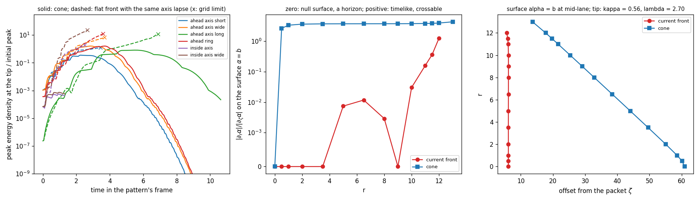

# Cone Tip Field Pass: Fields at the Conical Front

Date: 2026-09-25. Context: the [front light surface pass](FRONT_LIGHT_SURFACE_PASS.md)
took a slender conical front as the reference. The cone sheds sideways the
light and matter that the carry overtakes, and one question stayed open: how
quantum fields behave near its tip, where the exact axis stays on the light
surface. At the front of a superluminal warp drive, the renormalized stress of
a quantum field grows exponentially during the flight (Finazzi, Liberati and
Barceló 2009). Field modes pile up there on a white-hole horizon and blueshift
without limit. This pass asks whether the cone's tip carries that mechanism.
Code: `adm_harness/scalar_wave.py`. Run: `scripts/run_cone_tip_field_pass.py`,
with data in [data/cone_tip_field_pass](data/cone_tip_field_pass/).

## Result

- **The cone has no front horizon.** In the pattern's frame during the lane,
  the surface where the pattern's Killing vector turns null is a horizon only
  where its transverse lapse gradient vanishes.
  - The current front's surface is null across \(r\le3.5\) and at
    \(r\approx9\), and within 1.2% of null out to \(r=8\). It is a white-hole
    horizon disk with \(\kappa=9.1\)–9.7.
  - The cone's surface is timelike wherever \(r>0\). Its transverse lapse
    gradient exceeds the along-track gradient by 2.6 at \(r=0.5\) and by
    3.3–4.3 beyond, so light crosses it. Its null set shrinks to the axis.
- **The tip sheds field modes faster than it blueshifts them.** On the axis
  at the tip the along-track rate is \(\kappa=0.563\). The lapse's transverse
  curvature pushes modes off the axis at \(\lambda=2.70\), 4.8 times faster.
- **Field evolution confirms it.** A massless scalar field was evolved on the
  cone's stationary background around the tip.
  - Packets arriving from ahead raise the tip's energy density to at most 1.6
    times their initial peak, then leave along the flank. The tip density then
    falls at 1.6–4.0 per unit time, and the packets carry off 1.4–1.7 times
    their energy.
  - Field moving forward from inside the cone never reaches the tip. There
    its energy density stays below \(10^{-3}\) of its initial peak, and it
    leaves across the cone's surface.
  - On a flat front with the same lapse along the axis, the same packets
    gather on the surface. Their energy density there grows at 1.07–1.10 per
    unit time in the best-resolved runs, the horizon's \(2\kappa=1.13\), until
    the compressed packets reach the grid scale.
- **Quantum stress at the tip.** Every mode reaching the tip rises by a
  bounded factor and leaves, so the renormalized stress there stays at the
  size of local vacuum polarization: \(\hbar c/L^4\) times curvature terms of
  order one, about \(3\times10^{-26}\) J/m³ at \(L=1\) m. The classical demand
  is of order \(10^{44}\) J/m³ at that scale.
- **The rear.** Both fronts keep a black-hole-type horizon at the rear, a null
  disk with \(\kappa=9.1\). Its quantum stress stays finite, and it radiates
  forward into the pattern at the Hawking-like temperature \(\kappa/2\pi\),
  about 3 mK at \(L=1\) m.



The left panel follows the peak energy density at the tip, relative to each
packet's initial peak. Solid lines are the cone and dashed lines the flat
front, each drawn while its Killing energy holds to 1%. A cross marks where a
flat-front run reaches the grid scale. The middle panel gives the ratio of the
transverse to the along-track lapse gradient on the surface \(\alpha=b\): zero
marks a null surface, and positive values a timelike, crossable one. The right
panel draws the two surfaces at mid-lane.

## Horizons of the moving pattern

During the lane the metric in the pattern's frame,
\(-\alpha^2dt^2+(d\zeta+b\,dt)^2+dr^2+r^2d\phi^2\) with \(b=\beta+v\), is
stationary. Its Killing vector \(\partial_t\) has norm \(b^2-\alpha^2\) and turns
null on the surface \(S:\ \alpha^2=b^2\). The normal
\(n=\nabla(\alpha^2-b^2)\) has norm \((1-b^2/\alpha^2)\,n_\zeta^2+n_r^2\), which
on \(S\) reduces to \(n_r^2\). The surface is therefore null, and a Killing
horizon, exactly where its transverse gradient vanishes. Everywhere else it is
timelike: light crosses it in both directions, and it only bounds the region
the pattern outruns.

| \(r\) | Current front: \(\zeta\) of \(S\) | Current front: \(|\partial_r\alpha|/|\partial_\zeta\alpha|\) | Cone: \(\zeta\) of \(S\) | Cone: \(|\partial_r\alpha|/|\partial_\zeta\alpha|\) |
|---:|---:|---:|---:|---:|
| 0 | 6.16 | 0 | 60.89 | 0 |
| 0.5 | 6.16 | 0 | 60.12 | 2.64 |
| 1 | 6.16 | 0 | 58.59 | 3.34 |
| 3.5 | 6.16 | 0 | 49.57 | 3.69 |
| 6.5 | 6.18 | 0.012 | 38.43 | 3.72 |
| 9 | 6.19 | 0 | 29.11 | 3.74 |
| 11 | 6.10 | 0.16 | 21.60 | 3.80 |
| 12 | 5.64 | 1.24 | 17.75 | 3.92 |
| 13 | — | — | 13.66 | 4.31 |

On its null disk the current front has the surface gravity
\(\kappa=|\partial_\zeta\alpha|=9.1\)–9.7. Beyond \(r\approx11\) the disk bends
into a crossable surface, which is the radius out to which the
[front light surface pass](FRONT_LIGHT_SURFACE_PASS.md) found overtaken light
and matter trapped. The cone's surface runs as a straight flank from its base
near \(\zeta=14\) to the tip at \(\zeta=60.9\), at the cone's half-angle.

At the tip the along-track rate is \(\kappa=0.563\) and the transverse
curvature of the lapse is \(-\partial_r^2\alpha=4.20\). A paraxial ray there
leaves the axis at

\[
\lambda=\tfrac12\left(\sqrt{\kappa^2+4v\,(-\partial_r^2\alpha)}-\kappa\right)=2.70 .
\]

A mode at the tip gains energy per quantum at the rate \(\kappa\) and is
compressed along the track at \(\kappa\), while its cross-section grows at
\(2\lambda\). In this estimate its energy density there changes at
\(2(\kappa-\lambda)=-4.3\) per unit time. On a horizon the same mode grows at
\(2\kappa\).

## Field evolution

The run evolves a massless scalar field, axisymmetric, on the stationary
metric of the pattern's frame at mid-lane. It uses fourth-order differences
on a grid of step 0.03 around the tip, 26 along the track by 8 in radius, with
absorbing layers at the edges. The comparison background is a flat front. It
repeats the cone's lapse along the axis at every radius out to 6, so it shares
the tip's \(\kappa\) and has no transverse gradient. Gaussian packets move
forward relative to the normal observers. They arrive from ahead, as the
field that the pattern overtakes, or from inside the cone, as field moving
forward through the pattern. The Killing energy is conserved on a stationary
background, so each run is read while it holds to 1%. The packets from inside
run on half the grid step, because they blueshift as they cross the cone's
surface outward.

| Packet | Cone: tip peak / initial peak | Cone: tip rate after peak | Cone: energy carried off | Flat: tip density at the grid limit | Flat: growth over the last resolved unit | Flat: resolved until |
|---|---:|---:|---:|---:|---:|---:|
| from ahead, wavelength 1, width 0.5 | 0.35 | −3.0 | 1.72 | 1.23 | 0.40 | 3.4 |
| from ahead, wavelength 1, width 1.5 | 1.61 | −3.4 | 1.56 | 6.7 | 0.81 | 3.7 |
| from ahead, wavelength 3, width 1.5 | 0.82 | −1.6 | 1.41 | 11.6 | 1.10 | 6.9 |
| from ahead, ring at \(r=1.5\) | 1.61 | −4.0 | 1.54 | 12.0 | 1.43 | 3.6 |
| from inside, width 0.5, half step | \(5.5\times10^{-4}\) | — | — | 1.83 | 1.07 | 2.5 |
| from inside, width 1.5, half step | \(7.4\times10^{-4}\) | — | — | 22.1 | 1.33 | 2.7 |

On the cone, the Killing energy holds to \(6\times10^{-4}\) while the field
passes the tip. The packets from ahead reach the tip region, peak, and slide
off along the flank, outward and backward. Their energy leaves the domain
through its rear and outer layers, with the gains of 1.4–1.7 that the
[front light surface pass](FRONT_LIGHT_SURFACE_PASS.md) found for rays. The
field from inside meets the cone's layer before the tip and crosses the
surface outward. On leaving the raised lapse its energy grows five- to
eightfold, in line with the gains that rays from inside the cone keep.

On the flat front, every packet gathers on the surface near the axis. Its
energy density grows until the packet is compressed to a few grid cells, and
the Killing energy then departs from conservation. The best-resolved runs, the
long-wavelength packet from ahead and the narrow packet from inside on the
half step, grow at 1.10 and 1.07 per unit time, close to \(2\kappa=1.13\).
Shorter packets reach the grid scale sooner, which is why their growth over
the last resolved unit is lower. On the cone, the same packets never compress
that far: they leave the tip region first.

## What this means for quantum fields

The quantum stress in a state that is regular before the carry is built from
field modes like these. At a white-hole horizon every arriving mode is
compressed and blueshifted without limit. The stress there grows as
\(e^{2\kappa t}\) for as long as the carry lasts, which is 18 e-folds per unit
\(\sigma\) for the current front's \(\kappa=9.1\). At the cone's tip every
evolved mode rises by at most a factor of 1.6 and then leaves. Nothing
accumulates there, so the stress at the tip stays at the scale of local
vacuum polarization, set by the curvature of the tip region.

The evidence has a defined scope. The modes are axisymmetric, the sector that
reaches the axis; modes with angular momentum about the axis stay off it
behind their centrifugal barrier. They are classical modes, with the stress
inferred from their behavior. A renormalized stress computed directly in
3+1, by Hadamard subtraction on the evolved modes, remains to be done.

Two steady processes remain in both designs. The rear horizon is black-hole
type. In the 1+1 treatment its stress stays finite and it emits a Hawking-like
flux (Finazzi, Liberati and Barceló 2009). The flux runs forward into the
pattern at \(\kappa/2\pi=1.45\,\hbar c/(k_BL)\), about 3 mK at \(L=1\) m. The
pattern also outruns light in the exterior. In its frame the whole exterior
therefore has a spacelike Killing vector, and modes of both signs of Killing
energy meet there. Scattering off the pattern can mix them into a steady
emission of quanta, at a rate that remains to be computed.

## Open items

1. **Renormalized stress.** The stress at the tip and across the pattern in
   3+1, from the evolved modes by Hadamard subtraction.
2. **Steady emission.** The rear horizon's flux, and the mode mixing in the
   exterior, at their rates.
3. **Transitions.** The field through the acceleration and deceleration,
   while the cone extends and the surface forms and disappears.

## Reproduction

```bash
OPENBLAS_NUM_THREADS=1 python toolkit/adm_harness_cli/scripts/run_cone_tip_field_pass.py --workers 4
PYTHONPATH=toolkit/adm_harness_cli:toolkit/adm_harness_cli/scripts python -m pytest toolkit/adm_harness_cli/tests/test_scalar_wave.py
```

The run takes about 75 minutes with four workers. The surfaces and the tip
rates take a minute. Each main field run takes 10–18 minutes, and each run on
the half step about 26. `--refined-only` repeats the half-step runs and merges
them with the stored histories, and `--figure-only` redraws the figure. The
manifest records the grids, the packets, the cone, the tip rates, the run
times and the software hashes. The tests check that the solver moves packets
at the light speed with and without a shift, conserves the energy in flat
space and the Killing energy on a curved stationary background, keeps the
field regular on the axis, and absorbs in its edge layers.
