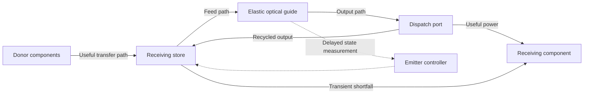
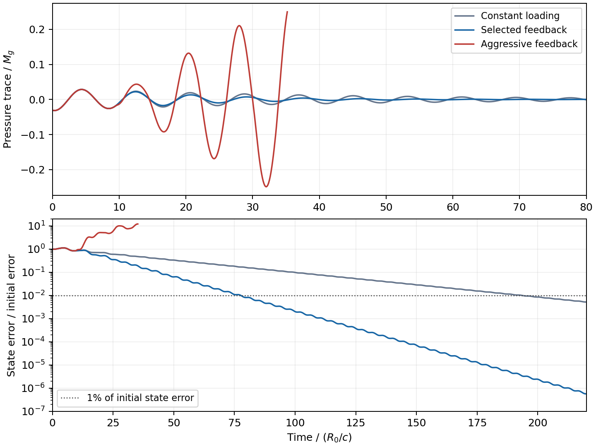

# Controlled optical transfer with finite flight delays

16 September 2026.

A steady optical guide, receiving store and downstream dispatch port can
supply the prescribed useful power while keeping the ring at a fixed
operating point. In the homogeneous ring model, this removes the demand
waveform from the radial equation of motion. Bounded feedback then handles
departures from that operating point. The selected controller includes
signal flight, power flight, sampled commands and a finite actuator response.

All four inherited material histories retain positive energy reserve after
counting the guide, useful transit, both internal optical paths and a
positive receiving-store margin. Eight finite perturbation cases complete
their requested transfers. An aggressive feedback control reaches the
tensile boundary after the flight delays are included, while the selected
gains shorten the reference recovery time from approximately 194 to 78
guide-time units. Physical stores, splitters, routing reactions and thermal
behavior remain assembly requirements. The follow-up
[store, splitter, routing and loss investigation](OPTICAL_STORE_SPLITTER_ROUTING_AND_LOSSES.md)
constructs a constitutive receiving-store model, static routing reactions
and hardware loss requirements for this arrangement.

## The receiving store separates useful demand from guide loading

The [preceding optical calculation](CONSTITUTIVE_JOINTS_AND_OPTICAL_REACTIONS.md)
changed the ring's input power with useful demand. Switching near its
radial period produced a peak integrated pressure trace about 11.6 times
the slow-step value. The present arrangement uses the existing receiving
store to supply a steady guide input and returns unused output to that
store. Useful power branches downstream of the guide's extraction ports.



Let \(A(t)\) be the requested receipt at one exchange node, with
\(0\le A\le P_*\), and let \(\delta\) bound its useful transfer
delay. The feed and outgoing paths each take \(\delta/2\). The store
emits power \(u(t)\); the guide receives \(u(t-\delta/2)\) and
emits \(Q(t)\). At the dispatch port, arriving guide output supplies
\(\min[A,Q(t-\delta/2)]\), its excess returns to the store, and the
store supplies any shortfall. Thus useful delivery equals \(A(t)\).

With guide energy \(H\) and store energy \(B\),

\[
\dot H=u(t-\delta/2)-Q(t),
\]
\[
\dot B=A(t-\delta)-A(t)+Q(t-\delta/2)-u(t).
\]

The energies in the useful, feed and outgoing paths are respectively

\[
O=\int_{t-\delta}^{t} A(s)\,ds,\quad
F=\int_{t-\delta/2}^{t}u(s)\,ds,\quad
G=\int_{t-\delta/2}^{t}Q(s)\,ds.
\]

Consequently \(B+H+O+F+G\) is constant. The preparation fills both
internal paths and establishes the guide's operating state before the
useful transfer begins. The store covers startup and returns useful
in-flight energy during final drainage.

At nominal operation \(u=Q=P_*\). The ring then remains at its fixed
equilibrium for every bounded demand waveform, including the resonant
switching sequence. Its integrated pressure trace remains zero because
photon pressure and elastic tension remain balanced. The light in the
external paths and the dispatch hardware retain their own momentum and
reaction requirements.

## A counted operating envelope

Use the preceding ring law, guide reference energy \(M_g\), and radius
\(R_0=\delta/(2\pi\times1.5)\), with \(c=1\). Dimensionless
radius, momentum, photon action and energy are \(x,y,z,h\). Escape
optical depth is one per circuit. Select the steady power fraction
\(s_0=0.4\), giving

\[
x_0=(1-s_0)^{-1/2}=1.290994\ldots,\qquad
z_0=\tfrac13,\qquad h_0=x_0.
\]

Let \(C=\delta P_*\). Fixed guide reference inventory is

\[
M_g=\frac{4\pi R_0P_*}{s_0}=\frac{10}{3}C.
\]

The transient envelope permits \(1\le x\le1.5\), \(h\le1.4\),
and emitted power \(u\le1.5P_*\). For a tensile ring, its material
energy is at least \(M_g\), so the Hamiltonian bound gives

\[
Q\le\frac{M_g(1.4-1)}{2\pi R_0}=2P_*.
\]

The feed and outgoing paths therefore contain at most \(0.75C\) and
\(C\). Allocating a receiving-store floor of \(0.25C\) gives

\[
E_{\rm prepared}=1.4M_g+C+0.75C+C+0.25C
                =\frac{23}{3}C.
\]

The terms count guide energy, useful transit, feed transit, outgoing
transit and stored margin. Every trajectory within the stated guide and
power envelope satisfies \(B\ge0.25C\). This is an exact conditional
storage bound. The guide dynamics and controller must establish the
envelope separately.

Nominal operation needs \(C+\delta P_*+h_0M_g\), approximately
\(6.3033C\), for the guide, paths and delay coverage. The larger
\(7.6667C\) preparation used throughout this audit retains the transient
allowances and positive store floor.

## Feedback with the signal and power flights included

Radiation-pressure feedback can stabilize mechanical optical systems, and
finite optical delay affects its damping and phase. These effects are
discussed in the [cavity optomechanics review](https://arxiv.org/abs/1303.0733)
and demonstrated in a movable-mirror setting by
[Cripe and colleagues](https://arxiv.org/abs/1710.04700).
The present controller uses the derived elastic-ring model and its own
delay calculation.

The state measurement takes \(\delta/2\) to reach the emitter
controller, and a changed emitted power takes another \(\delta/2\)
to reach the guide. In units \(R_0/c\), the total flight delay is
\(3\pi=9.42478\ldots\). Commands update every
\(T_s=3\pi/20\), and the emitter follows a first-order response with
time constant \(0.25\). Thus the two flights span twenty controller
updates. The numerical integration queries previously completed solution
segments for every delayed value.

The selected bounded command, evaluated from the delayed state, is

\[
q_{\rm cmd}=\operatorname{clip}\left[
q_0-0.02(z-z_0)+0.05y,\ 0,\ 1.5q_0\right],
\qquad q_0=\frac{0.4}{4\pi}.
\]

The gains account for the phase accumulated over the flight paths.
Forty-eight candidate gain pairs were evaluated with the exact linear
sampled map. The continuous ring and actuator equations are integrated
between samples with a matrix exponential; twenty delayed state records
supply the command history. The resulting recurrence has the form
\(\xi_{k+1}=A_d\xi_k+B_dK\xi_{k-20}\).

| Control law | Largest magnitude of sampled linear eigenvalues | Asymptotic exponent per \(R_0/c\) |
| --- | ---: | ---: |
| Constant loading | 0.98855 | −0.02443 |
| Selected delayed feedback | 0.96834 | −0.06826 |
| Aggressive delayed feedback | 1.07748 | +0.15835 |

The aggressive law attempts rapid photon-action regulation and velocity
damping using the delayed state. Its nonlinear trajectory reaches
\(x=1\) at approximately \(35.19305R_0/c\), while sufficient
receiving-store energy remains. This failure is a mechanical consequence
of the delayed controller's unstable response.

A forty-five-point linear sensitivity screen combines operating references
\(s_0=0.35,0.40,0.45\), flight delays of 16–24 sample intervals, and
actuator constants 0.125–0.5. The selected gains retain eigenvalue
magnitudes below one at every screened point; the largest is 0.99621.
These are discrete sensitivity checks. The nonlinear trials use the
nominal reference, geometry and flight times.

## Nonlinear demand and perturbation tests

The demand alternates between zero and \(P_*\) every
\(3.8238248R_0/c\), using eighty intervals followed by useful-path
drainage. This retains the earlier resonant switching timescale while
placing the switching at the delivery port. The equilibrium trial
delivers the complete sequence with zero guide motion and zero pressure
trace in the model.

Eight perturbed initial states combine all signs of a 2% radius error,
momentum \(y=\pm0.01\), and a 2% photon-action error. Their initial
guide energies are charged to the same prepared total by adjusting the
store's initial charge. Every selected-feedback case completes the useful
transfer sequence and final drainage.

| Quantity across the eight cases | Observed range or maximum |
| --- | ---: |
| Radius \(R/R_0\) | 1.25678–1.32661 |
| Largest radial speed | \(0.02443c\) |
| Largest \(|\Pi|/M_g\) | 0.03221 |
| Largest guide energy \(H/M_g\) | 1.29807 |
| Emitted power / useful peak | 0.94973–1.04943 |
| Smallest receiving-store energy / \(M_g\) | 0.52123 |
| Prepared receiving-store floor / \(M_g\) | 0.07500 |

For the reference disturbance, selected feedback reaches the 1% state-error
band at \(77.75R_0/c\); constant loading reaches it at
\(193.56R_0/c\). Settling here means the last observed entry into
the band during the full trial. The initial pressure peak is shared by
both cases because the feedback command has a finite round-trip delay.
The improvement is faster decay after that delay.



The stored-energy bound applies to any trajectory within its specified
envelope. The nonlinear perturbation results establish tested responses
within that envelope; a global controller domain and non-axisymmetric
guide modes remain separate dynamical requirements.

## Applying the construction to the required material exchanges

The eighteen inherited exchange nodes comprise six material cores, six
joint groups, four field and photon populations, the remaining inventory,
and the complementary rail port. Their positive receipts obey the
previously certified continuous power bounds \(P_{*,i}\).

At each time, define \(A_i=\max(P_i,0)\) and
\(D_i=\max(-P_i,0)\). Reciprocal total power permits the abstract
donor-to-receiver routing

\[
F_{di}=\frac{D_dA_i}{\sum_j A_j},
\]

with zero routing when all powers vanish. Its row and column sums supply
the donor and receiver powers. The same dispatch construction applies to
each receiving node, with fixed guide and path inventories prepared from
its individual peak. Zero-peak nodes require zero added optical inventory.
The spatial arrangement must realize the assumed local path lengths.

| History | Largest prepared optical/store energy per label | Minimum remaining energy reserve |
| --- | ---: | ---: |
| First, coarse | 0.00028743 | 0.00146784 |
| First, fine | 0.00029024 | 0.00134426 |
| Second, coarse | 0.00007724 | 0.00319491 |
| Second, fine | 0.00012769 | 0.00281769 |

All 246,816 states and their inherited continuous reserve bounds retain
positive remaining energy. The preparation consumes at most 17.65% of a
label's minimum constitutive reserve in the first fine history and 4.34%
in the second. These are energy reserves after the counted local guide,
store and path construction. Routing, splitter and store stresses still
require matching to the assembly's target tensor, including their macro
deformation work and additional operating exchanges.

Losses remain significant. Charging a constant retained-loss fraction
against the entire nominal guide throughput \(\sum_iP_{*,i}\) gives
sampled energy ceilings of approximately \(3.46\times10^{-7}\) and
\(9.25\times10^{-7}\) on the two fine histories. These are about
0.35 and 0.92 parts per million of total nominal guide throughput. This
energy-only screen counts accumulated heat; thermal pressure, heat export,
sensor energy and converter losses require physical models and budgets.

## Physical scope and reproducibility

The construction supplies an exact nominal guide trajectory for the
prescribed bounded receipts, a finite-delay store identity, counted optical
path energy, and a tested bounded controller for radial disturbances.
The receiving store remains a reversible energy reservoir in this model.
Its material law, dispatch-port bandwidth and momentum reactions, sensors,
modulator hardware, reflectors and spatial routing remain components of
the physical assembly. The existing ten first-fine-history rejections for
separately added current hosts, large core stretches and material
identification requirements also persist.

The [control and transfer module](../toolkit/adm_harness_cli/adm_harness/controlled_optical_transfer.py),
[four-worker audit](../toolkit/adm_harness_cli/scripts/audit_controlled_optical_transfer.py),
and [tests](../toolkit/adm_harness_cli/tests/test_controlled_optical_transfer.py)
accompany the [numerical summary](data/controlled_optical_transfer/summary.json)
and [hash manifest](data/controlled_optical_transfer/manifest.json).
Thirteen optical archives, four history archives, the response figure and
exact executed sources preserve the results. The focused suites pass
**64 tests**, including independent Jacobian checks, delayed-input
causality, bounded dispatch and conservation across all three flight paths.

Refined integrations agree within \(2.2\times10^{-11}\) at common
comparison times. The aggressive controller's boundary time agrees within
\(5.4\times10^{-11}R_0/c\). The largest guide energy-balance error
is below \(2.2\times10^{-13}M_g\), and the complete store/path ledger
error is below \(2.2\times10^{-11}M_g\). Thirty-six explicit routing
matrices verify the donor and receiver sums to within
\(1.2\times10^{-13}\) in the inherited power normalization.

Reproduction uses a fresh output directory:

```sh
env PYTHONPATH=toolkit/adm_harness_cli OPENBLAS_NUM_THREADS=1 OMP_NUM_THREADS=1 \
  MPLCONFIGDIR=/tmp/optical_control_matplotlib \
  python toolkit/adm_harness_cli/scripts/audit_controlled_optical_transfer.py \
  --workers 4 --output /tmp/controlled_optical_transfer_replay

env PYTHONPATH=toolkit/adm_harness_cli OPENBLAS_NUM_THREADS=1 OMP_NUM_THREADS=1 \
  python -m pytest -q toolkit/adm_harness_cli/tests/test_controlled_optical_transfer.py \
  toolkit/adm_harness_cli/tests/test_constitutive_joints_and_optics.py \
  toolkit/adm_harness_cli/tests/test_distributed_reconfiguration.py \
  toolkit/adm_harness_cli/tests/test_material_reconfiguration.py \
  toolkit/adm_harness_cli/tests/test_finite_containment.py \
  toolkit/adm_harness_cli/tests/test_containment_ensemble.py
```
