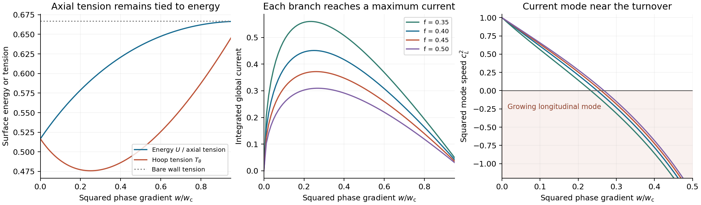

# Current-carrying scalar wall as a magnetic containment material

16 September 2026.

A canonical scalar wall can support a localized carrier condensate with
relativistic surface tension. Assigning that wall the remaining sleeve load,
alongside the existing magnetic and auxiliary support components, fails the
required stress allocation at both saved locations. This remains true after
releasing the complete previous carrier allowance and allowing freely
changing wall energy. A broader necessary inequality also excludes sleeve
assemblies composed of canonical scalar fields with nonnegative total
potential and nonnegative integrated normal pressure at the second location,
within the same allocation and support basis. The first location clears that
broader inequality; its material feasibility remains open.

The containment component is itself an assembly. Its plasma storage,
magnetic pressure, electrical current, hoop restraint, axial support, and
thermal interfaces can use different constituents. The calculation below
tests one assignment of the sleeve duties within that assembly. Composite
sleeves with complementary constitutive responses and explicitly modeled
load transfer remain a formulation target. The required energy and stress
budget applies to the complete assembly, including its interfaces.

The [constituent-resolved ensemble audit](CONTAINMENT_ENSEMBLE_ROLE_AUDIT.md)
supplies pointwise passing allocations using the existing ideal membrane,
string and Maxwell primitives, with their local stress directions retained.
It counts the original carriers in full. That assembly lies outside the
restricted wall classes tested here; its finite physical construction and
coupled evolution remain open.

These results hold the [common magnetic jacket](MAGNETIC_GEOMETRY_COMPARISON.md)
and registered heat histories fixed. The jacket retains internal magnetic
pressure \(0.1p\), annular pressure \(1.1p\), radius ratio 1.01, radial straight
legs, and bend-to-leg ratio 0.01. This is a microscopic-model test following
the [material survey](MAGNETIC_CONTAINMENT_MATERIAL_SEARCH.md).

The starting action is the wall and carrier model of
[Peter, *Surface Current-Carrying Domain Walls*](https://arxiv.org/abs/hep-ph/9503408),
equations (1)–(8). A real field separates two vacua; a complex field condenses
inside the wall. The published model uses a global carrier symmetry.
Its electrical realization requires gauging that symmetry. Here the action
is implemented directly, and the resulting stress identities are applied
to the saved containment ledger.

With metric signature \((-+++)\) and \(c=\hbar=1\), write

\[
\mathcal L=-\frac12(\partial\phi)^2-\frac12|\partial\Sigma|^2-V,
\qquad
V=\frac{\lambda_\phi}{8}(\phi^2-v^2)^2
 +f|\Sigma|^2(\phi^2-v^2)
 +\frac{m^2}{2}|\Sigma|^2+\frac{\lambda_\sigma}{4}|\Sigma|^4.
\]

The normal coordinate is \(n\), the tube axis is \(z\), and \(s\) is local
hoop distance. For
\(\Sigma=\sigma(n)e^{i(k_\theta s-\omega t)}\) and
\(w=k_\theta^2-\omega^2\), the profile equations are

\[
\phi''=\left[\frac{\lambda_\phi}{2}(\phi^2-v^2)+2f\sigma^2\right]\phi,
\qquad
\sigma''=[w+2f(\phi^2-v^2)+m^2+\lambda_\sigma\sigma^2]\sigma.
\]

Odd \(\phi\) and even \(\sigma\) give the half-domain conditions
\(\phi(0)=\sigma'(0)=0\), \(\phi(L)=v\), and \(\sigma(L)=0\).
The numerical benchmarks use \(v=\lambda_\phi=\lambda_\sigma=1\),
\(f=0.35,0.40,0.45,0.50\), and \(m^2=2f-0.6\).
These choices are dimensionless test parameters. Assigning an energy scale,
electric charge, wall thickness, and operating temperature remains a
separate physical specification.

Minimizing our potential over \(\sigma^2\) at fixed \(\phi^2\) gives the
sufficient and, for this positive-coupling family, exact condition

\[
\big[\max(2fv^2-m^2,0)\big]^2
 \leq \frac{\lambda_\phi\lambda_\sigma v^4}{2}
\]

for \(V\geq0\) relative to the chosen vacua. Every benchmark satisfies it.
Spatial gradients, carrier excitation, and potential energy all enter the
reported wall energy.

The profile calculation gives an explicit example of the object being
considered. At \(f=0.4,w=0\), the central condensate is 0.7071270 and the
surface energy is 0.5166533, compared with the bare-wall tension \(2/3\).
At \(w=0.0649985\), the integrated current is 0.4511286, surface energy is
0.5908755, and hoop tension is 0.4758611. Axial tension equals surface energy
throughout this spacelike branch.



The left panel uses the refined \(f=0.4\) calculation. The other panels
compare all four couplings. The right panel resolves the region around the
current maximum; negative squared mode speed gives an exponentially growing
long-wavelength current perturbation.

For each solved profile define
\(I(w)=\int_{-\infty}^{\infty}\sigma^2\,dn\) and
\(\mathcal C=\sqrt{|w|}\,I\). Direct differentiation of the stationary
profile functional gives \(dS/dw=I/2\). Thus for a spacelike current,

\[
U=S,\qquad T_\theta=S-wI,\qquad
c_L^2=-\frac{dT_\theta}{dU}=1+\frac{2wI'}{I}.
\]

For the timelike rest-frame branch,
\(U=S-wI\), both in-plane tensions equal \(S\), and
\(c_L^2=I/(I+2wI')\). These are current-mode diagnostics of the global
planar model. Coupled electromagnetic, bending, and finite-temperature
stability require their respective equations.

All four spacelike branches develop a negative \(c_L^2\) after their current
maximum. For \(f=0.4\), refinement brackets its zero between
\(w=0.0649985\) and 0.0665461. The sampled portion with
\(0\leq c_L^2\leq1\) and positive hoop tension reaches
\(T_\theta/U\simeq0.80535\). This large tension ratio coexists with the
axial-tension constraint that causes the containment failure below.

An independent analytic control follows from linearizing the carrier on the
bare kink, \(\phi=v\tanh(an)\), where
\(a=\sqrt{\lambda_\phi}v/2\). Its lowest carrier eigenvalue is

\[
\Lambda_0(w)=m^2+w-a^2\ell^2,\qquad
\ell=\frac{\sqrt{1+32f/\lambda_\phi}-1}{2}.
\]

Consequently \(w_c=a^2\ell^2-m^2=0.2606456\) for \(f=0.4\).
This is the bare-branch linear threshold. The populated numerical branch
is followed to \(0.95w_c\), where its condensate and current have decreased
substantially. Global uniqueness of nonlinear branches remains open.

The stress restriction can be derived without choosing a coupling. Allow
also an axial phase gradient and define nonnegative kinetic terms

\[
K_t=\omega^2\sigma^2/2,\quad K_z=k_z^2\sigma^2/2,\quad
K_\theta=k_\theta^2\sigma^2/2,\quad
K_n=(\phi'^2+\sigma'^2)/2.
\]

Varying the action with respect to the metric gives

\[
\begin{aligned}
\rho&=K_t+K_n+K_z+K_\theta+V,\\
p_z&=K_t-K_n+K_z-K_\theta-V,\\
p_\theta&=K_t-K_n-K_z+K_\theta-V,\\
p_n&=K_t+K_n-K_z-K_\theta-V.
\end{aligned}
\]

For a static hoop current, \(K_t=K_z=0\), hence \(p_z=-\rho\) pointwise.
This identity survives changing the normal profile, adding more such
canonical fields, and minimal gauging with a static axial magnetic field.
The latter also has axial pressure equal to minus its energy density.
Thus tuning the condensate changes its hoop response while leaving axial
tension tied to the total energy in this specialization.

More generally, the same calculation gives

\[
\rho-p_z+p_\theta-p_n=4K_\theta+2V\geq0.
\]

Upon integration and positive geometric weighting, let \(u\) be the wall
energy contribution, \(z\) its axial pressure, \(H=-p_\theta\) its summed
hoop tension, and \(N\) its normal pressure contribution. Then

\[
z+H\leq u-N.
\]

This inequality includes simultaneous temporal and axial carrier
excitations, with any mixed stresses requiring cancellation in the diagonal
ledger. It extends to sums of canonical scalar fields with nonnegative total
potential. The numerical rejection below uses \(N\geq0\), including the
membrane limit \(N=0\). Layers carrying net normal tension, other field
orientations, and noncanonical derivative interactions require their own
stress calculation.

The containment comparison explicitly credits native carriers. The old
particle-carrier tensor is released in full, including its bend allowance,
and the old particle centrifugal hoop load is removed. The new wall receives
only the magnetic interface load. Its energy may change independently at
each time and label, and extra bend, control, and thermal costs are set to
zero. The saved closed magnetic field energy, stored radiation, phase
sharing, and other rail obligations remain in the ledger. This generous
replacement tests a necessary condition before current capacity or cycle
evolution is imposed.

Let \((A,B,C)\) be the three residual-support facets after that replacement
and before installing the new wall. Cylindrical averaging gives the wall
tensor \((u,z,(N-H)/2)\). The support inequalities become

\[
\begin{aligned}
A+u-z+H-N&\leq0,\\
B+u-z+(N-H)/2&\leq0,\\
C+u+2z+(N-H)/2&\leq0.
\end{aligned}
\]

For the actual hoop-current specialization, \(z=-u\), and positive
canonical energy gives \(u\geq H\). With \(N=0\), define
\(G=\max(A+H,B-H/2)\). A pointwise wall exists within this relaxed stress
class only if

\[
\delta u=\max(H,C-H/2,0)+G/2\leq0.
\]

Allowing normal compression leaves the simpler necessary bound
\(B+3H/2\leq0\). Both locations violate it. Furthermore, using the general
canonical inequality \(u-z\geq H+N\) in the first two facets yields
\(A+2H\leq0\) and \(B+H/2\leq0\) whenever \(N\geq0\).
The corresponding combined gap is \(G+H\).

| Fine-history test | First location: maximum integrated gap; violating samples | Second location: maximum integrated gap; violating samples |
| --- | ---: | ---: |
| Hoop current, zero normal pressure: \(D\delta u\) | +0.00341224; 10 | +0.0508626; 966 |
| Hoop current, allowing normal compression: \(D(B+3H/2)\) | +0.00682447; 10 | +0.0108413; 36 |
| General canonical joint stress: \(D(G+H)\) | −0.0273501; 0 | +0.00942780; 18 |

Here \(D\) is the saved volume factor; gap values use the existing ledger's
normalized energy units. Each row is its own necessary inequality. The fine
histories contain 4,113 × 32 and 2,057 × 32 samples, respectively. The
normal-compression failures affect 10 and 11 labels. Their largest gaps
occur at \((t,x)=(0.5,-1.9998046875)\) and
\((1.27998046875,-1.9748359375)\). The broader second-location failure
affects 10 labels and peaks near
\((1.151982421875,-1.9748984375)\).

Both coarser histories reproduce the rejection. Their maximum
normal-compression gaps are 0.00670673 and 0.0103256; the broader
second-location gap is 0.00937936. Independent linear programs using the
five support-component tensors confirm infeasibility at every positive
worst-gap sample. Allowing freely adjustable axial wall stress restores
feasibility at all of those points. The earlier material survey's larger
joint-stress gaps included the separate particle-carrier allowance; the
values here apply the more favorable native-carrier replacement.

Numerical verification includes the analytic bare-kink profile and tension,
stress from independent spatial variations of energy, the normal-stress
first integral, the profile-action derivative, and direct support-component
linear programs. The four baseline families use 81 spacelike and 31 timelike
samples, with their common zero-current state shared. The \(f=0.4\)
refinement uses 161 and 61, a 50% longer domain, tighter BVP tolerance, and
twice the integration resolution. At shared points, surface energies change
by at most \(1.0\times10^{-10}\), currents by \(3.4\times10^{-10}\), and
finite-difference squared current-mode speeds by 0.00151. Maximum normal
pressure error decreases from \(5.3\times10^{-11}\) to
\(3.8\times10^{-13}\). The independent bare-kink eigenvalue errors decrease
by approximately four when the finite-difference spacing is halved.

Timelike continuation is restricted to a range where the stationary
functional \(V+w\sigma^2/2\) retains a nonnegative vacuum, with a 25% margin
from that boundary. An exploratory \(f=0.5,w=-0.108\) solve outside that
range exhausted the 30,000-node limit. It supplies a numerical failure,
with branch existence beyond the retained range unresolved. The saved
branches contain successful solves only. The new module and the two
magnetic comparison modules pass 34 tests in total.

The material formulation now has a sharper target: allocate current
conduction, hoop restraint, axial reaction, and stabilization among explicit
constituents of a composite sleeve. Their combined stresses, stored energy,
and interface reactions must fit the retained history. Under the tested
geometry and support assumptions, summing constituents that each satisfy
the excluded linear stress inequality preserves that inequality. A successful
assembly therefore needs a complementary constitutive response or a revised,
fully counted load path. The ensemble audit supplies a complementary response
using oriented Maxwell and membrane constituents already in the framework.
An additional candidate constituent is a non-Abelian wall with internal
orientational fields and a Skyrme derivative interaction. Nitta derives
an effective wall theory containing both quadratic and quartic derivative
terms, with potential terms controlling localized texture size.
[Nitta, 2013](https://arxiv.org/abs/1210.2233).
This gives a concrete action whose stress tensor differs from the canonical
scalar identity tested here.

For comparison, the surveyed rigid-membrane energy has the form
\(U=\tau+\alpha(n_z^2+n_\theta^2)+\beta n_z^2n_\theta^2\).
The quadratic and quartic terms suggest a connection to internal field
textures, but their coefficients, deformation range, and current coupling
must follow from a finite-width solution. The mathematical similarity alone
leaves those quantities undetermined. In particular, the wall profile must
remain localized at the large strains needed for axial compression, and
the coupled bending spectrum must remain stable.

Finite-width effective actions provide a route to computing the curvature
terms from an underlying scalar theory. Their controlled regime requires
wall thickness small compared with the curvature scale.
[Blanco-Pillado et al., *Effective Actions for Domain Wall Dynamics*, 2025](https://arxiv.org/abs/2411.13521).
Together, these sources offer possible constituent extensions. The present
construction target is the passing allocation in the ensemble audit.
A composite sleeve needs explicit current and load assignments,
coupled field and material profiles, and a total tensor that includes
interactions. The fixed-history ledger then screens the assembled response,
followed by stability for any surviving branch. A complete assembly meeting
the full containment cycle remains unidentified.

The implementation is
[current_carrying_wall.py](../toolkit/adm_harness_cli/adm_harness/current_carrying_wall.py),
with the [parallel runner](../toolkit/adm_harness_cli/scripts/evaluate_current_carrying_wall.py)
and [tests](../toolkit/adm_harness_cli/tests/test_current_carrying_wall.py).
The [numerical summary](data/current_carrying_wall/summary.json) and
[manifest](data/current_carrying_wall/manifest.json) record parameters,
input hashes, solver controls, LP witnesses, and source snapshots. The
standalone figure is available as [PDF](figures/current_carrying_wall.pdf).

From the repository root, a fresh evidence directory can be produced with:

```sh
env PYTHONPATH=toolkit/adm_harness_cli OPENBLAS_NUM_THREADS=1 OMP_NUM_THREADS=1 \
  python toolkit/adm_harness_cli/scripts/evaluate_current_carrying_wall.py \
  --workers 4 --output /tmp/current_carrying_wall_replay
```
