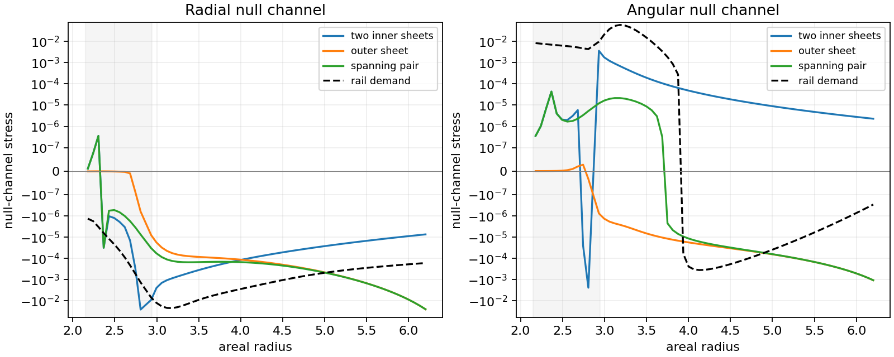

# Spherical Quantum Boundaries on the Frozen Rail

Date: 9 September 2026.

An enclosing spherical sheet at areal radius 6.8 supplies negative radial
vacuum response at all 64 retained bulk witnesses and negative angular
response at all 37 witnesses where the initial rail requires it. Couplings
1, 8, and 64 give the same placement selection. The two arrangements
confined to the inner positive-density region supply the angular sign at
zero of those 37 witnesses.

The [material-closure calculation](SPHERICAL_BOUNDARY_MATERIAL_CLOSURE.md)
finds ordinary surface stress requirements and a conditional causal fluid
response for the enclosing geometry. It also identifies the stopping
condition: the exact thin sheet produces singular stress in its nearby
bulk. A complete regular source requires the optical boundary to be
resolved as material with finite thickness.

## Registered construction and stopping conditions

The preceding [continuum boundary calculation](RENORMALIZED_BOUNDARY_SUPPORT_ROUNDS.md)
identifies two geometric requirements for an extended source: negative radial
enthalpy throughout the retained annulus and negative angular enthalpy over
part of it. This round calculates the actual change in the vacuum tensor
produced by concentric, semitransparent spherical boundaries on the initial
rail geometry. A radial mode equation retains every included spherical
harmonic and its angular stress.

The background is the complete, two-ended static metric obtained by freezing
the repaired source evaluator at phase 0.745 and setting the shift to zero.
This is the holding geometry used to construct the retained initial annulus.
The source parameters come from the coupled-reset manifest. Its lapse,
radial metric, and areal radius are preserved on both branches. The negative
branch contains the retained annulus. At large coordinate distance the
metric approaches the ultrastatic tail with areal radius
\(r=\sqrt{\ell^2+1.75^2}\).

The field is a real, massless, minimally coupled scalar in the static ground
state. A boundary at \(\ell_i\) has positive proper optical coupling
\(\lambda_i\). The difference between the ground-state tensors with and
without these boundaries, on the same geometry, is calculated away from
the sheets. Local bulk renormalization terms cancel in this difference.
The complete source would additionally contain the boundary-free curved
vacuum tensor, the matched material tensor, and the ordinary currents.
Thus the calculation measures a specified boundary response. The absolute
curved vacuum remains part of the subsequent source equation.

Write the static metric as
\[
ds^2=-\alpha^2dt^2+A^2d\ell^2+r^2d\Omega^2.
\]
For imaginary frequency \(\zeta\) and angular index \(j\), the radial
Green operator is
\[
L_{\zeta j}=-\partial_\ell\left(\frac{\alpha r^2}{A}
\partial_\ell\right)
+\alpha A\left[j(j+1)+\frac{\zeta^2r^2}{\alpha^2}\right].
\]
The boundary adds \(v_i\delta(\ell-\ell_i)\), where
\(v_i=\alpha_i r_i^2\lambda_i\). Its quadratic form is positive.
With \(C_i(\ell)=g_0(\ell,\ell_i)\) and
\(M_{ij}=\delta_{ij}/v_i+g_0(\ell_i,\ell_j)\), the exact resolvent
identity gives
\[
\Delta g(\ell,\ell')=-C(\ell)^T M^{-1}C(\ell').
\]
This formulation evaluates the finite difference directly, avoiding
subtraction of two large coincident Green functions.

The mode weight is \((2j+1)d\zeta/(4\pi^2)\). Define the integrated
derivative moments
\[
a=\int\!\sum_j w_j\frac{-\zeta^2}{\alpha^2}\Delta g,
\quad b=\int\!\sum_j w_j\frac{\partial_\ell\partial_{\ell'}
\Delta g}{A^2},
\quad c=\int\!\sum_j w_j\frac{j(j+1)}{2r^2}\Delta g.
\]
Then \(\Delta\rho=(a+b+2c)/2\),
\(\Delta p_r=(a+b-2c)/2\), and
\(\Delta p_t=(a-b)/2\). The two null channels are \(a+b\) and
\(a+c\). The minus sign in the time moment follows the continuation
back to Lorentzian time. The general spherical Green-function convention
agrees with equations (6)–(10) of
[Arrechea and collaborators](https://arxiv.org/html/2607.07583v1).

The registered placements use negative-branch areal radii 2.35, 2.85, and
6.8. The first two lie in the positive-density portion of the retained
annulus. Four arrangements are compared: an inner sheet at 2.85, two inner
sheets at 2.35 and 2.85, a spanning pair at 2.35 and 6.8, and the outer sheet
alone at 6.8. Each arrangement uses common coupling 1, 8, or 64. The outer
sheet is an explicit extension beyond the retained annulus and introduces
an additional material and junction requirement.

Bulk witnesses cover the retained annulus and remain at least 0.5 proper
length from every sheet. Spatial refinement, angular-mode refinement,
frequency quadrature, and the distance of the auxiliary end boundaries
are checked independently. Exact constant-coefficient Green functions and
the preceding planar continuum stress provide controls. A discrete
conservation residual provides a further check of the assembled tensor.

Four independent workers with single-thread numerical libraries perform
the mode computations. The registered allowance is 900 seconds per main
comparison, 1,536 MiB address space per worker, and 12 MB of saved evidence.
Only profiles, convergence evidence, and manifests are retained.

Continuation requires a converged improvement in the simultaneous radial
and angular requirements with a definite next source calculation. A
resolved sign obstruction or a structural obstruction in the absolute
source equation ends this search round. Parameter changes beyond the
registered placements require an identified physical reason.

## Curved vacuum response

The final profiles contain 64 principal witnesses over areal radii 2.18
through 6.2, plus 20 points used for conservation checks. The principal
witnesses remain at least 0.5 proper length from each of the three
registered sheet positions. For all three optical couplings, the sign
counts are:

| Arrangement | Negative radial response, out of 64 | Negative angular response where required, out of 37 | Both negative where required, out of 37 |
|---|---:|---:|---:|
| Inner sheet, radius 2.85 | 59 | 0 | 0 |
| Inner pair, radii 2.35 and 2.85 | 61 | 0 | 0 |
| Outer sheet, radius 6.8 | 64 | 37 | 37 |
| Spanning pair, radii 2.35 and 6.8 | 61 | 37 | 37 |

The enclosing sheet supplies angular structure that the earlier planar
model lacked. Its angular null channel is generally nonzero, as follows
from the spherical harmonics and their radial propagation on the rail.
The inner sheets' exterior response has positive angular enthalpy over
the region where negative angular enthalpy is required. Enclosing that
region reverses the useful angular sign.

For the outer sheet at coupling 8, selected final values are:

| Areal radius | Boundary-induced energy | Boundary-induced radial enthalpy | Boundary-induced angular enthalpy |
|---:|---:|---:|---:|
| 2.180000 | \(-4.88313\times10^{-10}\) | \(-9.76626\times10^{-10}\) | \(+3.25648\times10^{-10}\) |
| 2.933750 | \(-5.72708\times10^{-6}\) | \(-8.04064\times10^{-6}\) | \(-7.60474\times10^{-7}\) |
| 3.687500 | \(-8.55911\times10^{-5}\) | \(-9.37256\times10^{-5}\) | \(-1.04119\times10^{-5}\) |
| 4.190000 | \(-1.52919\times10^{-4}\) | \(-1.37095\times10^{-4}\) | \(-2.28164\times10^{-5}\) |
| 5.195000 | \(-8.13960\times10^{-4}\) | \(-6.88212\times10^{-4}\) | \(-8.64509\times10^{-5}\) |
| 6.200000 | \(-2.67794\times10^{-2}\) | \(-2.49925\times10^{-2}\) | \(-1.06920\times10^{-3}\) |

The response grows strongly toward the enclosing sheet. The initial rail's
largest radial demand occurs farther inward. The complete initial source
equation is
\[
T_{\rm required}=\langle T\rangle_{0,\rm curved}
+\Delta\langle T\rangle_{\rm boundary}
+T_{\rm material}+T_{\rm currents}.
\]
The calculation supplies its finite boundary term and a useful placement.
The boundary-free curved vacuum, the resolved material stress, and their
coupling to the evolving currents remain parts of the construction.

The field values use one real scalar with \(\hbar=c=1\) and the rail's
coordinate length unit. The demanded geometric tensor uses \(G=1\).
For a physical length scale \(L\) and \(N\) identical fields, the
relative quantum strength in the dimensionless Einstein equation is
\(N\ell_P^2/L^2\). The saved profiles retain the unscaled one-field
response; the sign comparison has no fitted strength parameter.

## Numerical validation

The positive finite-volume form resolves the core with spacings from
1/128 through 1/2048, with graded tails. The final profile uses 159,705
radial nodes, 129 angular harmonics, 192 logarithmic frequency nodes over
\([10^{-8},4096]\), and auxiliary Dirichlet endpoints at coordinate
distance 384 on each branch. End-distance controls extend through 1,536.

The following discrepancies compare accumulated tensors, normalized at
each witness by its largest tensor or null-channel component:

| Independent comparison | Largest fractional difference | Outer-sheet fractional difference |
|---|---:|---:|
| Core resolution 1,024 to 2,048 | 0.000912 | 0.00000420 |
| Frequency quadrature 144 to 192, with wider endpoints | 0.000000932 | 0.000000932 |
| Angular maximum 96 to 128 | 0.00000340 | 0.00000340 |
| End distance 384 to 1,536 | 0.000341 | 0.000341 |

The long-distance control matters for the very small inner response of the
outer sheet: the first endpoint comparison, 48 to 96, changes that response
by up to 1.84%. Extending the ends reduces this effect to the final value
in the table. All registered placement selections survive refinement.

An independent continuous ODE solver constructs ordered homogeneous modes
using logarithmic derivatives and their Wronskian. It compares nine
frequency/harmonic pairs at three additional spatial resolutions, giving
27,216 tensor comparisons. Maximum per-mode discrepancies decrease from
1.186% at core resolution 2,048 to 0.2953% at 4,096 and 0.07380% at 8,192.
The strongly attenuated modes expose the accumulated finite-difference
dispersion across the inner geometry; their discrepancies decrease
quadratically. The accumulated profile convergence is recorded separately
in the table above.

The independent stress-conservation identity is
\[
\partial_\ell p_r+(\partial_\ell\log\alpha)(\rho+p_r)
+2(\partial_\ell\log r)(p_r-p_t)=0.
\]
The initial five-point pressure derivative has a maximum relative residual
of 0.000142 at coordinate −1.5. Reducing its spacing from 0.016 to 0.008
and 0.004 reduces that residual to approximately 0.00000513 and
0.00000329. This local derivative check uses nine harmonics; the saved
full sum bounds its omitted harmonics below floating-point resolution at
the original stencil positions. The other conservation witnesses have
relative residuals below 0.00000272.

Exact constant-coefficient Green functions, a direct matrix inversion with
added material potentials, and the previous planar continuum stress check
the operator, delta-sheet normalization, and Lorentzian stress signs.
Against the retained rail profile, the reconstructed lapse agrees within
\(2.30\times10^{-8}\) fractionally and \(f\) within
\(2.18\times10^{-7}\). Off-grid metric interpolation differs from
the repaired source evaluator by at most \(4.46\times10^{-9}\).
The frozen source and reference hashes remain unchanged.

The eleven main comparisons use about 536 seconds in total with four
workers; the final main comparison takes 138 seconds. Peak recorded main
worker memory is approximately 361 MiB. The continuous-mode and derivative
audit takes another 68 seconds. The retained numerical evidence occupies
approximately 15 MB. Narrative findings are maintained manually in this
report and the linked material-closure report.

The complete harness test suite passes 343 tests in 28.32 seconds, with
four existing multiprocessing-fork deprecation warnings. Twelve added
tests cover the curved operator, finite optical response, stress
normalization, shell junction derivatives, momentum flux, and the local
thin-sheet limits.
