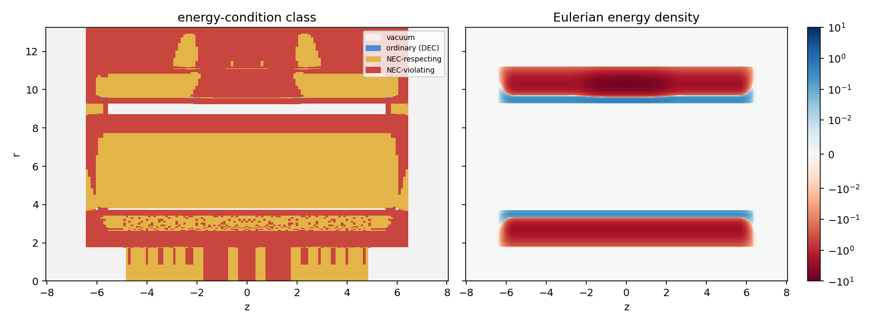

# Demand Census of the One-Space Rail

Date: 2026-09-23. Context: the [choreography pass](CHOREOGRAPHY_PASS.md)
fixes a gate-passing geometry that delivers the packet ahead of light. That
geometry is the 2.1c lane on the static support, inside the wide staged
boundary layer. This census records the stress-energy it demands, by role,
stress channel and location, as the input to source evaluation. Code:
`adm_harness/axial_track.py` (`radial_fields`, `principal_frame`). Run:
`scripts/run_demand_census.py`, with data in
[data/demand_census](data/demand_census/).

## Result

- **Ordinary matter covers almost none of the demand.** The dominant energy
  condition holds on 0.003% of the standing configuration's proper volume.
  Of the rest, 57% respects the null energy condition while violating the
  dominant one, 31% violates the null energy condition, and 12% is vacuum.
- **Energy comes in exactly balanced shells.** In the standing
  configuration the energy density follows the stretch alone, and every
  z-slice carries equal positive and negative energy. In rail units the
  energy of each sign is \(3.39\times10^{7}\). The lapse, including the
  whole lapse sheath, supplies stress without energy.
- **The conformal pre-sheath sets the scale.** It carries 99.98% of the
  standing energy: the same stack without it carries 6,230. Along the track
  it fixes a scale-free energy per unit length of
  \(G\mu/c^2\approx2.0\times10^{4}\) of each sign, which is 13 solar masses
  per metre at any size. A pre-sheath of \(e^{6}\) passes the node-level
  gate screen with 8 times less energy; resolved bands place the band-free
  threshold at \(e^{7}\) ([amplitude pass](AMPLITUDE_PASS.md)).
- **The demand sits at the support.** The support region \(|z|\le2.4\)
  holds 99.6% of the energy and 99.7% of the proper negative-null content.
- **Standing demand dominates.** One transit adds 0.13 σ of standing
  content in the coordinate measure and removes 0.02 σ in the proper
  measure. Its deepest points lie in the service region on the leading
  flank of the packet lapse window: −3.19 as the window switches on during
  the approach and −1.16 at the exit.
- **Static source units can sit anywhere.** Observers at fixed \((z,r)\)
  exist at every point and time, since the static frame moves at most at
  0.28 relative to the normal observers. During the carry the stress in the
  shift transition flows at up to 0.32c relative to them.
- **The approach and the sheath ends pass the gate.** The choreography pass
  sampled \(\sigma\ge-1.5\) and \(|z|\le4.9\). The transit begins at
  \(\sigma\approx-7\) as the packet approaches, and the sheath tapers out
  to \(|z|=6.5\). Over \(\sigma\in[-8,10]\) and \(|z|\le8\) every node is
  Type I. Root-finding at the approach's 29 flux-carrying crossings finds no
  band.



The left panel shows the energy-condition class and the right panel the
Eulerian energy density, both in the standing configuration after the
packet has passed.

## Method

At each node of each \((\sigma,z)\) sample, the census classifies the
orthonormal demanded tensor \(T_{ab}=G_{ab}/8\pi\). Type I points give the
rest-frame energy density \(\rho\) and the principal pressures. The
principal pressures are labelled by the axis, \(z\), \(r\) or \(\phi\),
that carries each eigenvector.

The classes are as follows:
- **ordinary:** \(\rho\ge|p_i|\), the dominant energy condition, as for
  familiar matter and classical fields;
- **NEC-respecting:** \(\rho+p_i\ge0\) with the dominant condition violated;
- **NEC-violating:** some \(\rho+p_i<0\).

The timelike eigenvector gives the source's velocity relative to the
normal observers and to observers at fixed \((z,r,\phi)\).

The census uses two measures:
- **Coordinate measure,** \(2\pi r\,dr\,dz\), the measure of the earlier
  reports.
- **Proper measure,** \(\sqrt\gamma=A\,r\), which includes the stretch.
  Sources must fill the proper volume, and near the support the stretch
  reaches \(1.9\times10^{6}\).

In the standing configuration, integrals over the whole slice are totals,
and the spacetime content measure is per unit \(\sigma\). Along
\(\sigma\), the transit excess is the integral of each quantity's
difference from the standing configuration.

The samples cover \(\sigma\in[-8,10]\) and \(z\in[-8,8]\) at spacing 0.1,
with 228 boundary-layer nodes plus the service region. The configuration at
\(\sigma=-8\) equals the standing configuration at \(\sigma=10\) exactly.

## Standing demand

| Zone | Radii | Proper volume | NEC-respecting | NEC-violating | Energy of each sign | Negative-null content, coordinate / proper |
|---|---|---:|---:|---:|---:|---:|
| service region | \(r\le1.75\) | \(1.4\times10^{4}\) | 32% | 67% | 0 | \(7\times10^{-5}\) / 0.01 |
| conformal rise | 1.75–3.75 | \(4.7\times10^{7}\) | 28% | 69% | \(7.3\times10^{6}\) | 57 / \(5.9\times10^{6}\) |
| lapse sheath rise | 3.75–8.75 | \(8.7\times10^{8}\) | 73% | 26% | 0 | 23 / \(8.1\times10^{6}\) |
| sheath plateau | 8.75–9.25 | \(1.3\times10^{8}\) | 0% | 0% | 0 | 0 / 0 |
| outer falls | 9.25–13.25 | \(1.0\times10^{8}\) | 5% | 94% | \(2.7\times10^{7}\) | 491 / \(3.1\times10^{7}\) |
| total | | \(1.15\times10^{9}\) | 57% | 31% | \(3.39\times10^{7}\) | 572 / \(4.47\times10^{7}\) |

Each zone has its own character.
- **Service region.** Its stress is a pure transverse pressure
  \(p_r=p_\phi=-K/8\pi\), with zero energy density and zero pressure along
  the track. In the standing configuration \(K\) is small everywhere (null
  minimum \(-1.7\times10^{-5}\)).
- **Conformal rise.** Here the lapse and stretch rise together. The zone
  holds a negative-energy shell with a thin positive rim at its outer edge.
- **Lapse sheath rise.** The lapse alone varies here, so the zone carries
  stress without energy. Its pressures are positive on the rise. The null
  condition fails on the shoulder of the lapse profile, where \(p_z\) and
  \(p_\phi\) turn negative.
- **Outer falls.** The stretch and lapse return to flat space here. The
  zone holds a thin positive rim followed by a negative-energy shell, and it
  carries most of the negative-null content.

Across the configuration, the null condition fails along \(z\) on 23% of
the proper volume, along \(\phi\) on 26%, and along \(r\) on 0.3%.

| Axial zone | Energy of each sign | Negative-null content, coordinate / proper |
|---|---:|---:|
| support, \(|z|\le2.4\) | \(3.38\times10^{7}\) | 414 / \(4.45\times10^{7}\) |
| track, \(2.4<|z|\le5.5\) | \(1.2\times10^{5}\) | 95 / \(1.3\times10^{5}\) |
| sheath ends, \(5.5<|z|\le6.5\) | \(7.1\times10^{3}\) | 63 / \(7.6\times10^{3}\) |

The coordinate content over the gate samples, \(|z|\le4.9\), is the 490 of
the earlier reports. The sheath ends and the track beyond \(|z|=4.9\) bring
it to 572.

## Why the energy balances

In the standing configuration the shift vanishes and the metric is static,
so the Hamiltonian constraint reads \(16\pi\rho=R^{(3)}\). The spatial
metric \(dr^2+r^2d\phi^2+A^2dz^2\) has
\(R^{(3)}=-2\Delta_\perp A/A\), with \(\Delta_\perp\) the flat Laplacian
of the transverse plane. Hence

\[
\rho\sqrt\gamma=-\frac{1}{8\pi}\,\partial_r\!\left(r\,\partial_rA\right),
\]

which integrates to zero across every z-slice. The energy density depends
on the stretch alone. The lapse enters the pressures through
\(4\pi\alpha(\rho+\textstyle\sum_ip_i)=D^2\alpha\), whose integral also
vanishes. The lapse maximum of the sheath therefore carries negative active
gravitational mass on its shoulders, balanced by positive active mass on
its flanks. The total mass of the standing configuration is zero, as the
exactly flat exterior requires. With zero mass, the positive mass theorem
requires negative energy density somewhere in any configuration that
departs from flat space. The census reproduces both balances to
\(2.6\times10^{-4}\) of their absolute scales with the 12-node radial
quadrature, and a dense radial rule on the slice \(z=5\) closes both to
\(10^{-16}\).

## Variants and the pre-sheath

| Boundary layer | Energy of each sign | \(G\mu/c^2\) along the track | Content, coordinate / proper | Transit Type IV nodes (screen) |
|---|---:|---:|---:|---:|
| single layer | 2,547 | 0.04 | 42 / \(1.9\times10^{3}\) | — |
| staged layers | 6,230 | 0.09 | 274 / \(7.7\times10^{3}\) | — |
| staged layers with lapse sheath | 6,230 | 0.09 | 386 / \(1.1\times10^{4}\) | 835 |
| with conformal pre-sheath \(e^{2}\) | \(6.1\times10^{4}\) | 25 | 364 / \(9.7\times10^{4}\) | 388 |
| with conformal pre-sheath \(e^{4}\) | \(5.2\times10^{5}\) | 262 | 427 / \(7.7\times10^{5}\) | 3 |
| with conformal pre-sheath \(e^{6}\) | \(4.2\times10^{6}\) | 2,334 | 499 / \(5.9\times10^{6}\) | 0 |
| with conformal pre-sheath \(e^{8}\) (wide stack) | \(3.39\times10^{7}\) | \(1.97\times10^{4}\) | 572 / \(4.47\times10^{7}\) | 0 |

All rows use the static support and the 2.1c lane. The screen classifies
every node of the sheathed variants over the transit,
\(\sigma\in[-8,3]\) and \(|z|\le8\).

The energy grows as \(e^{\varphi}\) with the pre-sheath's log scale
\(\varphi\), a factor of about 8 per step of 2. Without the pre-sheath the
along-track energy vanishes, apart from the support's tails. The lapse sheath
adds stress and no energy. In the coordinate measure the stacks differ by
factors of a few, and in the proper measure the pre-sheath dominates by
factors of thousands.

The pre-sheath remains necessary after the carve's removal. It carries the
flux-free rise that the moving shift needs: without it the transit leaves
835 Type IV nodes, and at \(e^{4}\) three remain. At \(e^{6}\) every node
is Type I. The [amplitude pass](AMPLITUDE_PASS.md) resolves bands there and
places the band-free threshold at \(e^{7}\).

## Transit

| Measure | One transit | In units of one σ of standing demand |
|---|---:|---:|
| coordinate content, net (added / removed) | +76 (+114 / −38) | +0.13 |
| proper content, net | \(-1.1\times10^{6}\) | −0.024 |
| negative energy, shift transition | −782 | — |

The transit runs from \(\sigma\approx-7\) to 4. As the packet approaches,
its lapse window raises the coordinate content. As the packet crosses the
support, the proper content falls, and the shift transition carries a small
negative energy while the shift is live.

The deepest transit points lie in the service region and the conformal
rise, on the leading flank of the packet lapse window.

| Point | \((\sigma,z)\) | Service region | Conformal rise |
|---|---|---:|---:|
| approach, window switching on | \((-5.8,-4.6)\), 0.76 ahead of the packet | −3.19 | −3.52 |
| exit | \((0.4,2.9)\) | −1.16 | −1.52 |

Two speeds bear on where sources can sit.
- **The static frame.** Observers at fixed \((z,r,\phi)\) move at most at
  0.28 relative to the normal observers, so static sources can exist
  everywhere throughout the transit.
- **The sources themselves.** Their rest frame moves at most at 0.076
  relative to the normal observers, and at most at 0.32 relative to the
  static frame. Both maxima occur in the shift transition during the carry.

## Physical scale

At the recorded normalization \(\eta=2.41\times10^{-5}\), one rail unit is
\(1/\sqrt\eta=204\) Planck lengths, or \(3.3\times10^{-33}\) m. Energies in
rail units are geometric lengths, and a mass follows as the energy times
\(c^2/G\) times the unit length.

| Measure | Wide stack (\(e^{8}\)) | Pre-sheath \(e^{6}\) |
|---|---:|---:|
| energy of each sign, recorded normalization | 150 kg | 19 kg |
| energy of each sign, one unit = 1 m | \(2.3\times10^{4}\,M_\odot\) | \(2.9\times10^{3}\,M_\odot\) |
| energy per unit length along the track, each sign, any scale | \(13\,M_\odot\) per metre | \(1.6\,M_\odot\) per metre |
| peak stress, recorded normalization | \(4.5\times10^{-4}\) Planck density | — |

With one unit set to one metre, the service region is 3.5 m across and the
transverse structure 26.5 m across. The energy scales linearly with size,
while the energy per unit length along the track depends only on shape. The
peak stress in Planck units scales as \((\ell_P/L)^2\), and a quantum
field's natural stress as \((\ell_P/L)^4\). Their ratio sets the next test.

## Inputs to source evaluation

Source evaluation starts from four roles, each with its own character:

1. **Energy shells.** Two pairs of exactly balanced shells, where the
   stretch rises and where it falls. Each pair has a negative-energy shell
   and a thin positive rim. Their size follows the stretch amplitude, which
   is the support stretch times the pre-sheath factor.
2. **Pure stress.** The lapse sheath demands stress with zero energy
   density: positive pressures on its rise, and negative \(p_z\) and
   \(p_\phi\) on its shoulder.
3. **Service-region pressure.** A transverse pressure \(-K/8\pi\) with zero
   energy density. It is near zero in the standing configuration and of
   order one during the transit.
4. **Moving stress.** During the carry, the shift transition's stress flows
   at up to 0.32c relative to static sources.

The pre-sheath scale is the controlling geometric lever on the energy of
roles 1 and 2. The next steps are the scaling test of candidate source
families against these roles, and the full gate for the \(e^{6}\) stack.

## Reproduction

```bash
OPENBLAS_NUM_THREADS=1 python toolkit/adm_harness_cli/scripts/run_demand_census.py --workers 6
PYTHONPATH=toolkit/adm_harness_cli:toolkit/adm_harness_cli/scripts python -m pytest toolkit/adm_harness_cli/tests/test_axial_track.py
```

The run takes about 8 minutes with six workers. It covers the census of the
wide stack and its variants, the pre-sheath screen and the approach gate.
The manifest records the checks, zones, variants, normalization and
software hashes.
