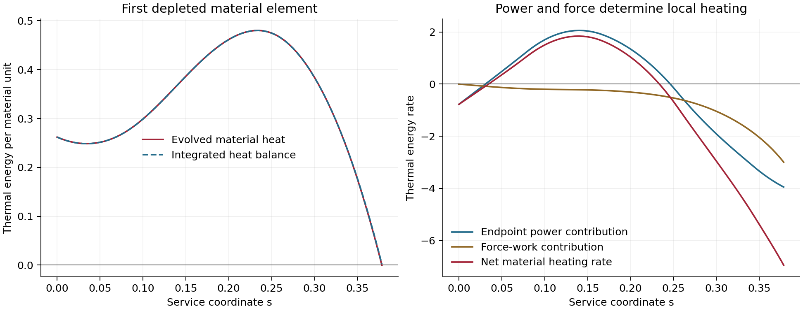

# Elastic storage coupled to the active endpoint medium

Date: 10 September 2026.

The finite endpoint body admits timelike, packet-excluding end worldtubes on
the active metric. The tested preparations nevertheless stop when a moving
material element exhausts its thermal store under the prescribed endpoint
exchange. A material heat-balance audit and refinement support this failure
mechanism. Substantial total energy remains in the body at that event.
The result constrains these preparations and this constitutive/exchange
specialization; complete elastic-reservoir viability remains open.

## Registered construction

This bounded calculation supplies a longitudinal thermoelastic reservoir
response to the existing endpoint heat/current tensor on the repaired active
beta075 V5 metric. The material has a conserved reference-length current,
evolving strain, velocity, and stored thermal energy. Its volume force and
power are the opposite of the pinned endpoint tensor's covariant divergence.
This defines a forced constitutive response with reciprocal exchange in the
tested volume. A microscopic contact law and endpoint feedback remain separate
requirements.

The first body occupies \(-2.1\leq\ell\leq-0.5\) during service
coordinate \(0\leq s\leq3\), covering late carry, release, and the first
reset. This interval admits a finite body separated from the live packet by
at least 0.15 coordinate units. Its fixed-coordinate end worldtubes receive a
timelike audit on the full scheduled metric. The end tractions and their ADM
energy flux are recorded as explicit ports to the support plant. Physical
anchors and preparation before this interval require additional construction.
The earlier radial-radiation witness occurs at \(s=-0.5525\), before this
material evolution starts. The two trials therefore have different preparation
and duty intervals. The present packet-exclusion result applies to this later
patch; a complete-cycle comparison still requires the earlier material history.

The baseline and dense endpoint inputs and active metric interpolants come
from the [radial transfer investigation](ACTIVE_ENDPOINT_TRANSFER_INVESTIGATION.md).
Their recorded interpolation and medium-window qualifications carry into this
calculation. The carrying shift and all scheduled metric derivatives remain
active. A spatially fixed computational interval leaves those temporal terms
in the material equations.

## Stored-energy law and tensor

Let \(n>0\) be inverse longitudinal stretch and \(q>0\) thermal energy
per material reference unit. The selected rest-frame line energy is

\[
\epsilon(n,q)=n(m+q)+\frac K2(n-1)^2,\qquad 0<K<m.
\]

Here \(q=c_V T\) represents a local thermal store with positive heat capacity
and zero thermal expansion in this first specialization. Its entropy per
reference unit can be written \(c_V\log(T/T_*)\). The elastic pressure is
generated by the same energy function:

\[
p=n\left(\frac{\partial\epsilon}{\partial n}\right)_q-\epsilon
=\frac K2(n^2-1),\qquad
c_L^2=\left(\frac{\partial p}{\partial\epsilon}\right)_q
=\frac{Kn}{m+q+K(n-1)}.
\]

This law gives tension below unit inverse stretch, compression above it, and
\(0<c_L^2<1\) throughout its positive-temperature domain. Its energy satisfies
\(\epsilon>|p|\). The pressure relation and longitudinal elastic variables
follow [Natário's relativistic rod formulation](https://arxiv.org/abs/1406.0634).
The additional rest-mass and thermal terms are the specialization tested here.
The general action-based setting for elastic matter on curved backgrounds is
reviewed by [Brown](https://arxiv.org/abs/2004.03641).

A radial bundle with density normalization \(A\) has four-dimensional tensor

\[
T_E^{ab}=\frac A{R^2}\left(\epsilon u^a u^b+p e^a e^b\right),
\qquad u^a=\Gamma(n_{\rm ADM}^a+v e_{\rm ADM}^a).
\]

Its transverse pressure is zero. This is a longitudinal reservoir model;
angular support and transverse stability retain their own component duties.
The factor \(R^{-2}\) converts line energy and force per solid angle to the
spherical volume tensor. It also makes the reference-length current
\(n u^a/R^2\) conserved when the material labels are conserved.

In terms of the line moments
\(E=(\epsilon+p)\Gamma^2-p\),
\(J=(\epsilon+p)\Gamma^2v\), and
\(S=p+vJ\), the evolved conservative variables are
\((Bn\Gamma,ABE,AB^2J)\). Their fluxes are

\[
\left(Bn\Gamma[-\beta+\alpha v/B],\;
A\alpha J-\beta ABE,\;
A\alpha B S-\beta AB^2J\right).
\]

The geometric sources use the full active lapse, shift, radial scale, and
extrinsic curvature. Endpoint projections
\(P=-n_b\nabla_aT_J^{ab}\), \(F=e_b\nabla_aT_J^{ab}\)
enter the reservoir energy and momentum equations as
\(-\alpha BR^2P\) and \(-\alpha B^2R^2F\). Thus strain work, heat storage,
and momentum change follow one supplied tensor and its balance equations.
The endpoint input alone leaves a passive-contact entropy-production test
underdetermined.

## Bounded comparison and gates

Four initial cases combine \(K=0.1,0.5\) with \(A=0.1,0.4\), using
\(m=1\), \(n=0.75\), and \(q=0.25\). The initial material is at rest
in the rail coordinate; its ADM velocity follows the actual shift. These
normalizations bracket the response of one constitutive family and provide
no optimized physical energy budget.

The finite-volume scheme uses reconstructed inverse stretch, rapidity, and
thermal energy, causal characteristic speeds, conservative numerical fluxes,
and two-stage time integration. Closed ends have zero material flux and
counted pressure traction. Primitive-domain failure or exhaustion of thermal
energy stops a case. Conservation ledgers distinguish geometric work,
endpoint exchange, and boundary ports.

The first run uses 128 cells and four workers. Subsequent runs refine the
same candidate and compare the dense endpoint fit or zero-exchange control
according to the observed mechanism. The registered calculation ends at a
stable constitutive barrier, or at a verified finite-interval response with
remaining preparation, anchor, contact-law, and Einstein-source obligations
recorded explicitly. The standing substrate, jacket, and live collars retain
their separate roles.

## Preparation and response results

The [worldtube audit](data/elastic_endpoint_reservoir/end_worldtube_audit.csv)
finds a minimum normalized end-timelike margin of 0.9591. The body stays
outside the live packet with the registered 0.15 minimum coordinate gap.
The [exchange scope audit](data/elastic_endpoint_reservoir/scope_manifest.json)
assigns 35.75% of the preceding full-interval exchange weight to this spacetime
patch. Thus this body tests one substantial part of the endpoint duty.
Packet exclusion follows the finite body and its end conditions over the
selected interval; its pre-entry preparation remains an additional requirement.

The uniform initial stretch leads to strong acceleration and compression.
Its 128-cell temperature stops occur at \(s=0.948\)–\(1.022\). The
zero-exchange controls also lose positive temperature, at \(s=0.925\) and
\(s=0.955\), despite the exact adiabatic law preserving each smooth material
element's thermal energy. Their temperature floor is therefore a numerical
limitation. Finer forced runs move the stops to \(s=1.141\) and
\(s=1.190\). These uniform-state stops supply no physical exclusion of the
elastic law.

The geometry explains why that initialization is demanding. At \(s=0\),
the patch's radial metric scale ranges approximately from 6 to 465, and its
proper length is about 352. Its late radial scale approaches one. A nearly
relaxed body at the beginning consequently undergoes a very large imposed
stroke. The next initialization defines its material reference from the
actual \(s=3\) geometry:

\[
n_0(\ell)=\frac{B_3\Gamma_3}{B_0\Gamma_0},\qquad
v_{\rm fixed}=\frac{B\beta}{\alpha}.
\]

Coordinate-fixed motion would then leave \(n=1\) at \(s=3\). The evolved
motion is still determined by the material equations. This reference changes
the initial conserved material amount as well as its strain; the two
preparations represent different material states. The initial inverse stretch
now spans approximately 0.00215 to 0.159.

With the original \(q_0=0.25\), these strain-matched cases instead exhaust
heat at \(s=0.163\)–\(0.266\). The low-amount cases reproduce those stops
under refinement: the soft case shifts from 0.17449 to 0.17351 and the stiff
case from 0.16333 to 0.16253. Their zero-exchange controls continue much
longer, to their separate numerical temperature limits beyond \(s=1.58\).

The final preparation therefore also estimates heat demand along the declared
coordinate-fixed reference paths. Material energy balance gives

\[
\left(\partial_s+v_c\partial_\ell\right)q
=-\frac{\alpha R^2}{An}(P-vF),\qquad
v_c=-\beta+\frac{\alpha v}{B}.
\]

Integrating the right-hand side on the reference paths gives a cumulative
heat change \(I_q\). The prepared state uses
\(q_0=0.25+\max(0,-\min_s I_q)\), evaluated over \(0\leq s\leq3\).
This supplies a finite, declared initial heat profile. Its adequacy for the
actual moving material is then tested by evolution.

| Prepared case | \(K\) | \(A\) | Initial ADM-slice energy | Heat-depletion stop, 128 cells |
| --- | ---: | ---: | ---: | ---: |
| Soft, lower amount | 0.1 | 0.1 | 28.0207 | 0.29634 |
| Stiff, lower amount | 0.5 | 0.1 | 115.7826 | 0.26611 |
| Soft, higher amount | 0.1 | 0.4 | 101.3931 | 0.37855 |
| Stiff, higher amount | 0.5 | 0.4 | 452.4407 | 0.35698 |

The energies include rest, strain, heat, and motion through
\(4\pi\int ABE\,d\ell\), in harness geometric units. They are slice
integrals rather than asymptotic gravitational masses. Every prepared case
reaches a local thermal boundary before completing the intended interval.
Further increases or reshaping of preload were left outside this bounded
comparison.

## Verified depletion mechanism

The soft, higher-amount baseline case receives the most detailed audit:

| Resolution / sampling | Heat-depletion stop |
| --- | ---: |
| 128 cells, original output cadence | 0.378546 |
| 256 cells, original output cadence | 0.378636 |
| 256 cells, 0.005 output cadence | 0.378630 |
| 512 cells, 0.005 output cadence | 0.378391 |

At 512 cells its first depleted element reaches \(\ell=-1.46406\).
Its conserved material label traces back to \(\ell=-1.33275\), with
initial heat \(q_0=0.26190\). The element initially warms to about 0.48,
then cools as its trajectory enters a different part of the endpoint exchange
and its force-work contribution becomes increasingly negative.



The [material heat audit](data/elastic_endpoint_reservoir/soft_high_baseline_n512_force1_prepared_reference_snap601_heat_audit.json)
integrates a net heat change of \(-0.25953\). The difference from the
evolved change is 0.00237, about 0.91% of that element's initial heat; at
256 cells the difference is 0.00339. This independent trajectory balance
identifies the imposed heat extraction as the leading cause of the stop.
The remaining numerical error limits precision in the exact depletion time.

Fresh metric evaluations at the same physical state give a final local heat
rate of \(-6.94655494\), compared with \(-6.94655568\) using the metric
interpolant. This checks the local forcing without replacing the evolved
trajectory by a fresh direct-metric integration.

The same prepared initial body with endpoint exchange switched off completes
\(s=0.5\), beyond the forced stop, with minimum heat 0.24966. This control
uses the same preparation profile, including its heat reserve. It separates
the early forced depletion from the late numerical temperature limitation
observed in the other zero-exchange runs.

At the baseline stop, the body still has an ADM-slice energy of 82.5441.
Its thermal inventory \(4\pi A\int Dq\,d\ell\) has increased from
5.5689 to 5.8746, where \(D=Bn\Gamma\). This inventory is a material
heat sum, distinct from the ADM energy integral. The state reaches the
thermal boundary locally while heat remains elsewhere. The largest sampled
material speed is 0.9342 and the largest longitudinal sound-speed squared is
0.1361; both retain causal margins through the recorded interval.

The dense endpoint fit also gives a local heat-depletion stop. Its prepared
soft, higher-amount case shifts from \(s=0.28125\) at 128 cells to
\(s=0.26446\) at 512 cells. The corresponding material heat-balance
discrepancy decreases from 0.16994 to 0.01618, the latter about 3.60% of the
depleted element's initial heat. This is a separate source/preparation
sensitivity check with weaker quantitative convergence than the baseline
witness. It supports the same mechanism while leaving its precise stop time
less well resolved.

## Source accounting and construction consequence

The supplied elastic tensor remains finite and in its positive-energy,
causal longitudinal domain up to the thermal stop. The particle, energy,
and covariant-momentum finite-volume ledgers close with their recorded
boundary and volume terms. For the finest baseline case the raw per-solid-angle
balance residuals are approximately \(2.2\times10^{-16}\),
\(6.7\times10^{-16}\), and \(4.5\times10^{-13}\), respectively.
These are discrete balance checks. They leave continuum errors to the
independent thermal audit and refinement comparisons.

The energy budget exposes the other components' obligations. Over that
recorded interval the per-solid-angle endpoint energy contribution is
\(+0.02379\), geometric work is \(-1.37874\), and the net end-port
contribution is \(-0.14473\). End support and the prescribed active geometry
therefore participate materially in the energy balance. Their physical
tensors and a smooth joint matching remain part of a complete construction.

This reservoir specialization contains local elastic and thermal stores, with
thermal expansion and internal heat conduction set to zero. Its elastic
energy and heat are distinct state contributions. The fixed endpoint
history can demand thermal extraction from a material element after that
element's available heat has been spent. A complete interaction law must
coordinate the heat/work split with the evolving material velocity,
temperature, strain, and endpoint response. Heat redistribution, conversion
between stored strain and heat through a specified constitutive mechanism,
and improved preparation remain possible modifications with their own
equations and energy accounting.

The present result establishes a finite, packet-excluding material response
over its evolved segment and a specific local thermal mismatch. It supplies
neither a general exclusion of elastic storage nor a proof that arbitrary
additional heat would fail. The bounded search ends here, with the need for
an actual state-dependent interaction established more precisely. Full-cycle
material preparation, anchor stresses, transverse stability, endpoint
feedback, and the complete active Einstein-source sum remain open. The
An–T–Le construction retains those requirements.

## Verification and reproduction

The focused suite passes 44 tests covering the elastic energy-pressure
identity, causal sound speeds, boosted primitive recovery, covariant source
balance, adiabatic expansion, end-port and prepared-heat accounting, and the existing transfer,
classifier, and metric-regularity checks. The source scripts write numerical
evidence only; this report is manually maintained. The main disclosure and
its PDF are unchanged.

With `PYTHONPATH=toolkit/adm_harness_cli` and one BLAS thread per worker, the
principal commands are:

```sh
python toolkit/adm_harness_cli/scripts/run_elastic_endpoint_reservoir.py --scope-only
python toolkit/adm_harness_cli/scripts/run_elastic_endpoint_reservoir.py --workers 4
python toolkit/adm_harness_cli/scripts/run_elastic_endpoint_reservoir.py --workers 4 --initialization relaxed_reference
python toolkit/adm_harness_cli/scripts/run_elastic_endpoint_reservoir.py --workers 4 --initialization prepared_reference
python toolkit/adm_harness_cli/scripts/run_elastic_endpoint_reservoir.py --workers 1 --cases soft_high --cells 512 --initialization prepared_reference --snapshots 601
python toolkit/adm_harness_cli/scripts/run_elastic_endpoint_reservoir.py --workers 1 --cases soft_high --forcing 0 --duration .5 --snapshots 101 --initialization prepared_reference
python toolkit/adm_harness_cli/scripts/audit_elastic_endpoint_reservoir.py soft_high_baseline_n512_force1_prepared_reference_snap601 --plot
```

The `--medium dense` option selects the independently fitted dense endpoint
history and its corresponding preparation. Run manifests record the exact
options and execution software hashes. The final implementation adds the
preparation modes and audit cadence while preserving the earlier default
equations and uniform-state initialization.
