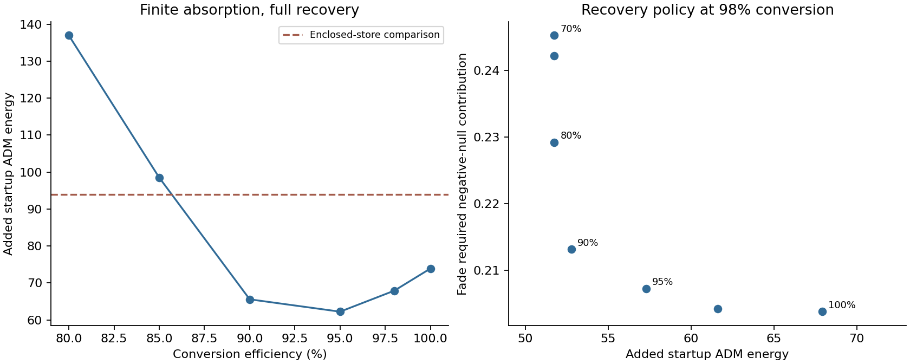

# Finite work interface for the prepared active rail support

The delivery route retains a useful efficiency range, and controlled recovery
reduces the required guide inventory. The remaining electric-storage material
now determines which operating point is preferable. The selected next search
is a charged-boundary field cell integrated with the rail's pressure and
support network. Its full material stress and mechanical work port are the
central construction requirements.

This investigation connects the selected electromagnetic delivery route to a
finite electrical work port. It retains the late non-live support interval,
connected pressure fluid, separate heat receiver, shared radial guide field,
and the archived charging schedule from the
[delivery study](POYNTING_WORK_DELIVERY.md). Its construction question is
whether a reversible work coupler can preserve the measured benefit while
providing finite matching, reaction, and storage duties.

## Registered calculations

The first calculation varies conversion efficiency on the existing finite
absorption solution with chi=100. Transport is linear in each prescribed
source: charging and its transparent carrier scale as 0.98/eta, while
electrical recovery scales as eta/0.98. The heat receiver is recomputed from
its proper-time energy balance for each efficiency. Guide allocation retains
the original electric floor, rate ceiling, and union of material and transport
sample positions. This produces a matched-load efficiency comparison on the
same material history.

An additional reflected-amplitude envelope measures the guide margin
required by a specified unwanted amplitude r. This envelope changes the
guide requirement by the factor

    k(r) = [(1+r)^2/v_d^2 - (1-r)^2]/2,

with v_d=0.5. It is a sensitivity of the guide allocation. Propagating a
reflected field requires its emission and boundary data; those data remain
separate from this envelope. The full matched-load tensors are compared only
at r=0. Break-even values refer to the previous formal enclosed-store
comparison and express selection margins.

The second calculation examines the electrical load itself. A small radial
capacitor cell of solid angle dOmega and coordinate length dx has

    Q_cell = sqrt(2 H_e) dOmega,
    C_cell = R^2 dOmega/(Gamma B dx),
    U_cell = H_e Gamma B dx dOmega/R^2,

where H_e=H-S is the retained electrical flux-energy. Along its material
worldline,

    dU_cell/dtau = V_cell dQ_cell/dtau - U_cell d(ln C_cell)/dtau.

The second term is the mechanical work of the changing cell geometry. It is
already part of the radial field's stress coupling to the rail. This identity
keeps electrical charging distinct from changes in field energy caused by
the scheduled geometry.

At a locally frozen capacitive port connected to a real line impedance Z,
incident and outgoing voltages obey a=(V+ZI)/2 and b=(V-ZI)/2. Therefore

    b/a = (1-Z I/V)/(1+Z I/V).

During charging, zero reflection requires Z=V/I. For fixed cell geometry,
this implies an exponentially increasing charge. The actual rail has a
changing capacitance and a prescribed charge history, so the inverse port
calculation measures the required impedance range and signed current. It
also measures the storage retained after guide sharing. A time-varying
matching network requires its own energy and force law.

## Literature basis

[Marini and colleagues](https://doi.org/10.1109/TAP.2022.3177571) demonstrate
temporary reactive-load matching with shaped excitation. The author's
[arXiv deposit](https://arxiv.org/abs/2502.03076) appeared in 2025; the paper
was published in 2022. Its transient storage and release provide a useful
capacitive-port control.

[Wenner and colleagues](https://doi.org/10.1103/PhysRevLett.112.210501)
demonstrate capture and release through an adjustable superconducting
resonator coupler. Their small-signal experiment establishes the physical
principle of reversible capture through controlled interference. The
required rail field strength, current, and supporting material remain
independent construction requirements.

[Mirmoosa and colleagues](https://arxiv.org/abs/1802.07719) derive matching
with time-varying reactances and explicitly identify energy exchange with the
modulation source. Consequently any rail adaptation includes the modulation
port alongside work input, electrical storage, and heat return.

## Evidence and decision

### Efficiency, finite bends, and the direct capacitive port

The 1024-cell efficiency comparison gives the following matched-load results.
Heat capacity is an integral of the individual receiving capacities. Startup
energy is the additional ADM slice energy, including the same formal heat
enclosure bound used in the preceding comparison.

| Conversion efficiency | Added startup energy | Heat capacity | Fade required negative-null contribution |
| --- | ---: | ---: | ---: |
| 100% | 73.91 | 43.14 | 0.1988 |
| 98% | 67.91 | 44.12 | 0.2038 |
| 95% | 62.23 | 45.67 | 0.2142 |
| 90% | 65.57 | 48.49 | 0.2384 |
| 85% | 98.49 | 51.65 | 0.2681 |
| Previous formal enclosed-store comparison | 93.94 | 44.12 | 0.2628 |

The startup crossing is approximately 85.6% efficiency at 1024 cells and
85.0% at 512 cells. In this registered family, the coupled heat and guide
costs have a broad useful efficiency interval. The nonmonotonic startup
result has a physical accounting explanation: reduced electrical recovery
lowers a return-wave peak that sets the prepared guide requirement, while
increasing receiving heat. This motivates a separate comparison that retains
98% conversion and controls the recovered fraction directly.

At the fixed drift comparison 0.5, reflected-amplitude guide envelopes of
0.01 and 0.02 raise nominal startup energy to 86.36 and 104.91. The crossing
is r=0.0141. This is a guide-margin requirement at the chosen drift value;
minimum plasma drift is itself a design tradeoff. The continuation therefore
also measures the reflection/drift relation with guide energy held fixed.

A finite magnetic turn admits a simple local Maxwell control. In cylindrical
bend coordinates, B_phi=k/r is divergence-free and curl-free within the
vacuum aperture. Matching its flux to a straight guide of half-width a
sets k/B_straight=2a/log[(b+a)/(b-a)], where b is the bend radius. For a/b=0.2,
the field's integrated energy is 0.9865 times the uniform-field estimate
u_straight A pi b, and its largest density is 1.5207 times the straight-leg
density. The material boundary carries finite magnetic tractions.

At b=0.01 model lengths, the two endpoint turns add approximately 0.0448
units of initial magnetic energy in this local control. Their aggregate
straight-cut magnetic reactions peak near 0.985 and 1.924 force units.
The receiver turn retains packet clearance about 0.14994. Radial metric
variation across the bend is about 1.1% at the left end and 0.043% at the
receiver. These quantities locate a finite-size field continuation with a
small magnetic inventory. A complete curved-background solution adds the
transition field, wave delay, material boundary tensor, and its reaction.
The calculation does not supply that supporting material.

The retained electric cells contain 71.33 units of initial material-frame
field energy and 8.44 at fade. Their individual maximum energies sum to
80.59 units. An exact discrete capacitor-work identity separates +42.30
units of net electrical charging from -105.19 units of mechanical work by
the changing capacitance; together they give the -62.89 field-energy change.
Thus electrical work remains necessary while the geometry releases field
energy mechanically. Both roles were already present in the radial Maxwell
stress calculation.

Allowing each charging cell its own best fixed real impedance gives 72.41%
reflected energy and incident energy 3.624 times useful charging work.
The calculation grants disconnection during idle and recovery and evaluates
only the charging samples. It therefore favors a simple direct connection.
The result selects controlled work coupling for this duty. A frozen passive
capacitive termination cannot supply the specified history efficiently.

The electric-cell material question is now quantitative. If additional
conserved capacitor material is proportional to each cell's maximum field
energy, the remaining nominal fade margin permits material rest energy about
0.401 times that rated energy. This corresponds to stored field energy per
material mass of 2.24e17 J/kg. The comparison uses the previous formal fade
value as a selection reference, with all remaining electric cells counted.
It supplies a conditional material budget rather than a physical universal
limit. This particular comparison treats the added material as co-moving
rest mass; a stressed charged boundary has additional pressure components.
Reusing already-counted pressure/support material requires an explicit
common stress and charge-confinement construction. A conventional added
capacitor bank remains far outside this budget.

The numerical stage is stored under data/finite_work_interface. Its nominal
98% case reproduces the previous finite-tap tensor exactly. Six independent
analytical tests verify the circuit work split, port power, magnetic-envelope
relation, and annular field quadrature. The second stage tests recovery
control and the drift tradeoff before selecting the next physical interface.

### Recovery control and the storage tradeoff

With conversion efficiency held at 98%, a reduced recovered fraction sends
the remaining discharge through the established thermal exchange. Charging
work, electric-field history, and fluid evolution remain fixed. Linearity
scales the electrical recovery wave by that fraction, and the corresponding
proper-time energy difference enters the receiving inventory explicitly.

| Recovered fraction | Added startup energy | Heat capacity | Fade required negative-null contribution |
| --- | ---: | ---: | ---: |
| 100% | 67.91 | 44.121 | 0.2038 |
| 95% | 57.31 | 44.245 | 0.2072 |
| 90% | 52.79 | 44.383 | 0.2131 |
| 80% | 51.75 | 44.664 | 0.2292 |
| 70% | 51.75 | 44.956 | 0.2453 |

The 90% case offers most of the startup reduction with a smaller fade penalty
than the minimum of startup energy alone. It adds 0.458 units of total
receiving heat, retains the electric rate ceiling of 1, and leaves a maximum
standing-support force-density remainder of 0.0439. This remains an exposed
mechanical duty. The 512-cell startup result is 52.67, compared with 52.79
at 1024 cells. The 70--80% cases add little further startup benefit while
increasing the fade source requirement appreciably.

Magnetic insulation also admits a continuous operating tradeoff. Holding
the guide fixed, its 3% energy margin gives the worst-phase minimum electric-
field-free frame speed

    v_d(r) = (1+r)/sqrt[(1-r)^2+3*1.03].

Thus unwanted amplitudes 0.05 and 0.1 correspond to frame speeds about 0.5255
and 0.5570. The stricter r=0.0141 comparison above holds drift at precisely
0.5. Neither value is an established maximum speed of all plasma particles.
A reflected-field construction also supplies its energy, transverse stresses,
current, and dissipation; the field envelope alone provides its guide target.

The recovery decision becomes more coupled once capacitor material is
included. At 90% recovery, initial retained electric energy rises to 100.00
material-frame units, and individual electric-cell capacities sum to 111.85.
The corresponding full-recovery values are 71.33 and 80.59. Less prepared
magnetic guide allows less of the original electric support to be shared.
Consequently the reduced startup cost of the interface is accompanied by
more electric storage requiring physical confinement. Its illustrative
co-moving added-mass budget is approximately 2.77e17 J/kg at the old fade
reference, compared with 2.24e17 J/kg under full recovery. The 90--100%
recovery family remains available while the charged material is selected.

### Why the capacitor's mechanical connection matters

A local small-cell equilibrium control makes the supporting stresses
explicit. For an aligned electric field with energy U, the integrated spatial
stresses are (-U,+U,+U). A closed, internally balanced cell requires opposite
wall stresses. The dominant energy condition then implies wall energy at
least U through each principal-stress inequality. This componentwise bound
is stronger than the U/3 trace bound for an isotropic enclosure. It follows
from the local equilibrium stress integral; its use here assumes cell size
and equilibration time small compared with the varying background scales.
The covariant stress-integral framework is described in Appendix A of
[Gralla and Jacobson](https://arxiv.org/abs/1503.03848).

In the instantaneous wall bound, field and wall stresses cancel internally,
and the combined small-cell tensor has material-frame energy at least 2U.
Applied to the 90% recovery case, this adds approximately 100.7 startup ADM
energy units. Its wall inventory subsequently declines with U; a mechanism
for that energy exchange is an additional requirement.

A second control retains that exchange in the wall. Let M(t) be the prefix
of the capacitor's mechanical work, positive into its field. An adiabatic
wall has U_wall(t)=U_wall(0)-M(t), and its smallest initial inventory obeying
the same stress bound is max_t[U(t)+M(t)]. The combined energy satisfies

    Delta(U+U_wall) = electrical work.

The 90% recovery construction releases 132.52 units mechanically as its
capacitance changes. Absorbing this work in internally balancing walls raises
their material-frame inventory from 120.53 to 253.05 units and the sampled
fade negative-null requirement to 0.5338. The independent discrete total-
energy residual is below 1.6e-14. These are optimistic stress/energy controls;
a causal wall equation of state has yet to be supplied.

This result distinguishes a packaged store from the intended actuator role.
The radial electric field participates in mechanical work on the support
system. A viable integrated capacitor therefore exposes that load and work
path to the connected pressure medium and standing plant. Closing those
stresses within an isolated capacitor transfers a substantial mechanical
energy duty into its enclosure. The appropriate material search includes
charged boundaries, pressure support, and electrical storage together.

### Literature starting point and construction decision

[Ng, Choo, and Lim (2023)](https://arxiv.org/abs/2302.03192) supply an
Einstein--Maxwell capacitor model with explicit charged-interface stresses.
Their spherical construction admits choices satisfying the weak energy
condition. Their planar example instead requires negative surface energy.
The spherical family therefore provides the more useful boundary-condition
analogue for the present search. Its horizon-free electric-field region and
matched charged surfaces offer a starting mathematical construction; finite
layer thickness, material constitutive laws, stability, and active charging
remain requirements for a rail adaptation. The rail's scheduled geometry,
protected packet, and distinct infrastructure roles remain the controlling
architecture.

The power-delivery calculations now provide enough information to resume
capacitor construction. They retain useful recovery and guide-drift choices,
finite absorption, and explicit electrical and mechanical duties. Choosing
among those settings depends on the source tensor of the charge-bearing and
load-bearing material. Further optimization of ideal converter settings has
limited selection value until that material is represented.

The completed audit checks 243 hashes across the earlier delivery evidence
and both new numerical stages. The combined focused suite passes 63 tests.
The audit independently verifies capacitor port-wave power and the adiabatic
closed-cell energy balance. Evidence occupies approximately 13 MB across
data/finite_work_interface, data/finite_work_interface_recovery, and
data/finite_work_interface_audit. The full curved guide, physical converter,
thermal receiving material, earlier preparation, reset, and quantum source
continue to require their respective constructions. The main disclosure
remains the established design document.

The subsequent [charged capacitor construction](CHARGED_CAPACITOR_CONSTRUCTION.md)
evaluates the boundary material and magnetic-insulation alternatives. Its
counted joint work return establishes a barrier for the tested magnetic
capacitor arrangement, while the economical spherical interfaces continue to
require an identified finite material law.
