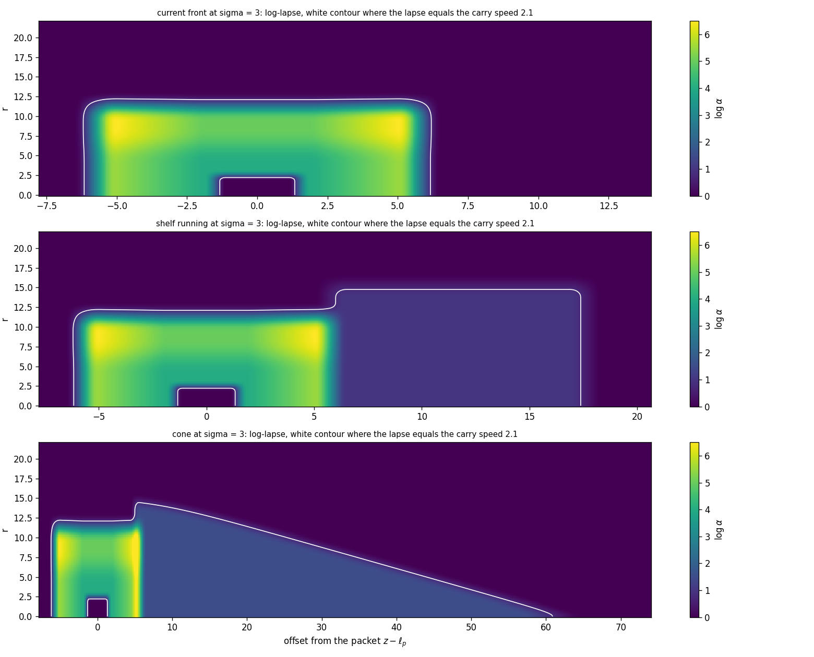
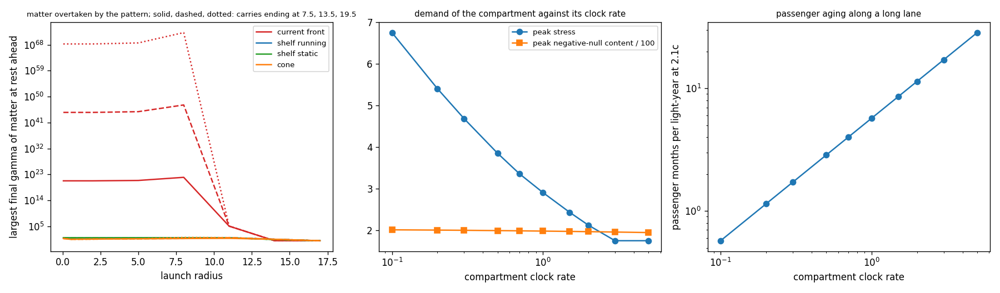

# Front Light Surface Pass: What the Carry Overtakes

Date: 2026-09-25. Context: the [compartment pass](COMPARTMENT_PASS.md) carries
passengers in a flat compartment at a chosen clock rate, inside a lapse
structure that moves at up to \(2.1c\) through the flat exterior. This pass
follows the light and matter that the structure overtakes. It finds that the
current front gathers them and releases them at arrival with unbounded
energy, and it compares two front elements that keep that energy bounded.
Code: `adm_harness/front_surface.py`, with the transverse terms evaluated at
every radius through `tensor_from_fields` in `adm_harness/axial_track.py`.
Run: `scripts/run_front_surface_pass.py`, with data in
[data/front_surface_pass](data/front_surface_pass/).

## Result

- **The current front gathers what it overtakes.** About 6.2 ahead of the
  packet, the log-lapse falls through the carry speed. Forward-moving light
  and matter at rest in the path collect on that surface out to
  \(r\approx11\) and gain energy at 9.6 e-folds per unit \(\sigma\) for as
  long as the lane lasts. The pattern releases them forward as it slows.
  Matter at rest just ahead leaves the 12.6 trip with \(\gamma=10^{22}\), a
  25.2 trip with \(10^{47}\) and a 37.8 trip with \(10^{72}\).
- **Forward shelf.** Route units hold the lapse at \(e^{1}=2.72\), above the
  carry speed, ahead of the pattern, and the front light surface disappears.
  Matter in the path is pushed ahead at \(\gamma=3.96\) and leaves through the
  terminal at 10.8. Light leaves at 2.72, or 8.7 when the shelf's leading edge
  runs ahead at \(3.5c\). These values are the same for all three trip
  lengths. The shelf costs 1.58 of negative-null content per unit length,
  \(2.1\times10^{27}\) kg per metre at any scale.
- **Conical front.** A slender cone of raised lapse, half-angle 15°, extends
  66 ahead of the packet with its lapse peaked on the axis. What it overtakes
  slides off sideways in bounded time. Matter overtaken during the carry
  leaves at \(\gamma\le5.8\) and light at most 5.5 times its energy, on
  every trip length. Matter already inside the cone at departure, a fixed
  amount, levels off at \(\gamma=14.9\) on long carries. The cone raises the
  peak content from 198 to 333, local to the packet.
- **Gate.** All four fronts are Hawking–Ellis Type I at every evaluated point:
  3.2–3.5 million points around the pattern and 0.14–0.23 million across the
  front elements, with the refinements likewise. Every flux-carrying
  crossing is band-free.
- **Choreography.** The route units follow schedules set before the carry.
  With the shelf, signals from the packet outrun the pattern inside the shelf.
  They reach route points ahead of it with a lead that grows by 0.109 per unit
  distance, so the pattern's duties stay open to change during the carry.
  With the cone, signals travel ahead inside the cone and stop at its surface.
- **Passengers.** The compartment is unchanged: flat, with weightless
  passengers at the chosen clock rate. A sweep over clock rates from 0.1 to 5 records its demand
  alongside the primary rate of 1.
- **Design fork.** The conical front becomes the reference front. The shelf
  remains recorded as the fork with a causal choreography and no front light
  surface, at a cost that grows with the route.



Each panel maps the log-lapse at \(\sigma=3\), mid-lane, against the offset
from the packet and the radius. The white contour marks where the lapse
equals the carry speed. For the current front it closes across the axis ahead
of the packet. The shelf moves it out to the shelf's radial boundary, and the
cone draws it into a slender point. The small contour around the packet marks
the compartment's low lapse, where the shift carries the packet.

## Why the front gathers what it overtakes

During the lane the pattern moves at a constant speed \(v\). In its frame
\(\zeta=z-v\sigma\) the metric
\(-\alpha^2d\sigma^2+(d\zeta+b\,d\sigma)^2+dr^2+r^2d\phi^2\), with
\(b=\beta+v\), is stationary, and every ray and particle keeps its Killing
energy \(E=\alpha\sqrt{m^2+|k|^2}-b\,k_z\). Where the shift vanishes, the
energy \(|k|\) that the normal observers measure changes as

\[
\frac{d\ln|k|}{d\sigma}=-\hat k\cdot\nabla\alpha ,
\]

so light gains energy at the rate at which the lapse falls along its
direction of travel. For light that starts and ends in the exterior, the kept
gain is \(\exp\big(v\int(-\partial_\zeta\ln\alpha)\,d\sigma\big)\) along its
path.

Ahead of the packet the current front's log-lapse falls from about 5.5 to
zero, and the along-track light speed passes the carry speed on the way.
Forward light ahead of that surface is slower than the pattern and gets
overtaken. Forward light behind it outruns the pattern, so both approach the
surface. Matter at rest ahead has \(E=m\), turns where
\(\sqrt{\alpha^2-v^2}=1\), and approaches the same surface from behind. There
the gain grows at the rate \(|\partial_\zeta\alpha|\) for as long as the lane
lasts. The run measures 9.6 e-folds per unit \(\sigma\), identical for light
and matter. Superluminal warp geometries share this front, both for quantum
fields (Finazzi, Liberati and Barceló 2009) and for swept matter
(McMonigal, Lewis and O'Byrne 2012).

The rear of the structure carries the matching surface with the opposite
orientation. Light near it separates, redshifted, and nothing gathers there.
The [source scaling test](SOURCE_SCALING_TEST.md) traced a ray on that rear
surface.

Two conditions remove the growth. Either the lapse ahead of the pattern
exceeds the carry speed everywhere the pattern's own lapse does, so the
surface disappears. Or the surface is tilted so steeply that what reaches it is
pushed off the pattern's path within a bounded time. The two front elements
take one route each.

## The two front elements

Both elements add a log-lapse term only where the shift vanishes, ahead of
the shift's front edge at \(\zeta=4.25\). There a pure lapse leaves a stress
with zero energy and zero flux, which is Type I for any profile. Around the
compartment and the shift, the fields are identical to the compartment
design's.

| Element | Setting |
|---|---|
| Forward shelf | log-lapse 1 (lapse 2.72) from the pattern's front fall forward, out to \(r=13.25\), falling to zero by \(r=17.25\) |
| shelf's leading edge | leaves the pattern's front at switch-on and runs at \(3.5c\), faster than light inside the shelf; comes to rest 2 beyond the pattern's front at arrival |
| static shelf | the same shelf switched on along the whole route together with the pattern |
| Conical front | log-lapse 1.5 (lapse 4.48) inside a cone of half-angle 15°, rising across a layer of width 3 inside its surface |
| cone's shape | base radius 16 at the pattern's front extent, tip 66.5 ahead of the packet, rounded over 0.5 on the axis |
| cone's timing | rises over 1.5 from the shift's front edge; extends while the carry speed rises from 0.6 to 1 and retracts as it falls back |

The shelf keeps the along-track light speed ahead of the pattern at 2.72
everywhere within the pattern's radius. The pattern then moves slower than
light in its surroundings, just as a traveler through a wormhole does. Matter
at rest in the shelf has \(E=\alpha_s\). It meets the pattern's rising lapse,
turns where \(\sqrt{\alpha^2-v^2}=\alpha_s\), and leaves ahead of the pattern
at

\[
\gamma'=\frac{\alpha_s^2+v^2}{\alpha_s^2-v^2}=3.96 .
\]

It leaves through the resting terminal at \(\alpha_s\gamma'=10.77\).

The cone's surface still moves faster than light, but along its flank the
transverse lapse gradient exceeds the along-track gradient by
\(\cot15°=3.7\). Near the tip the lapse is peaked on the axis, so objects
there move away from the axis faster than they gain energy. Elsewhere on the
flank, what reaches the surface slides outward along it and leaves the
pattern's path. For light overtaken during the steady lane, the conserved
\(E\) sets the kept energy by the exit angle \(\theta_f\), as
\((v-1)/(v\cos\theta_f-1)\). The 20 traced exits during the steady lane
follow it to \(3\times10^{-9}\). The half-angle decides the rest. A
stationary screen of the cone alone, in `scripts/run_cone_front_checks.py`,
shows wider cones holding what they overtake. With the tip rounded over
0.5, a 15° cone keeps gains of 1.0–4.9 at every launch radius from 0.05
outward. The largest gain, near the axis, reaches 10–20 at 22°, 500 to
\(10^{5}\) at 30° and \(10^{6}\) to \(10^{15}\) at 45°, for layers of 5 and 2. A
tip rounded over 2 flattens the lapse on the axis and raises the 15° gains
there to 10–42. The reference cone takes 15°, a rounding of 0.5 and
a layer of 3, between the screen's two layers.

## What each front keeps

The run launches forward light and matter at rest on eight radii from 0.05 to
17, spaced along the whole reach of each design, and traces them from
\(\sigma=-3\) until the structure has switched off. The same front is run on
carries whose lanes end at \(\sigma=6\), 12 and 18: trips of 12.6, 25.2 and
37.8. Weights follow the area of the launch disk.

| Front | Matter: largest final \(\gamma\) (12.6 / 25.2 / 37.8) | Matter: mean on 37.8 | Light: largest gain (12.6 / 25.2 / 37.8) | Light: mean on 37.8 |
|---|---:|---:|---:|---:|
| current front | \(1.0\times10^{22}\) / \(1.3\times10^{47}\) / \(1.7\times10^{72}\) | \(2.2\times10^{70}\) | \(9.9\times10^{4}\) / \(1.3\times10^{30}\) / \(1.7\times10^{55}\) | \(2.2\times10^{53}\) |
| running shelf | 10.8 / 10.8 / 10.8 | 3.4 | 8.7 / 8.7 / 8.7 | 5.0 |
| static shelf | 10.8 / 10.8 / 10.8 | 6.2 | 2.72 / 2.72 / 2.72 | 2.3 |
| cone | 6.7 / 12.2 / 14.2 | 1.9 | 11.6 / 11.6 / 11.6 | 2.1 |

With the current front, everything launched within \(r\approx11\) grows
together, and half the matter by area gains more than \(10^{3}\). The shelves
keep the same maximum at every radius. Their light gains are the terminal's
factor \(\alpha_s\) and, for the running shelf, the leading edge's
\((u-1)/(u-\alpha_s)=3.2\) as well.

The cone's objects fall into two populations. Those it overtakes during the
carry grow in number with the route. They leave at \(\gamma\le5.8\) for
matter and a gain of at most 5.5 for light, the same on every trip, with
area-weighted means of 1.2–1.7. The second population is a fixed quantity: the
matter already inside the cone's volume when it extends at departure. It
crosses the cone's interior and slides off its flank, which takes tens of
time units. Shorter carries release part of it early, which is why its
largest value rises from 6.7 to 14.2 over the three trips. On a carry twice
as long as the 37.8 trip, its values level off at 14.7–14.9
(`cone_inside_long_carry.csv`).

## Gate

| Measure | Current front | Running shelf | Static shelf | Cone |
|---|---:|---:|---:|---:|
| samples around the pattern (\(\sigma\in[-3.5,10]\), \(|\zeta|\le8.25\)) | 22,576 | 22,576 | 22,576 | 22,576 |
| Type I points there (Type IV) | 3,231,276 (0) | 3,483,277 (0) | 3,478,298 (0) | 3,315,848 (0) |
| refined: half jet step, double nodes, every other \(\sigma\) | 3,231,258 (0) | 3,480,673 (0) | 3,476,948 (0) | 3,315,829 (0) |
| samples across the front element | — | 3,520 | 3,520 | 15,785 |
| Type I points there (Type IV) | — | 142,503 (0) | 169,066 (0) | 229,150 (0) |
| refined | — | 139,131 (0) | 164,607 (0) | 219,996 (0) |
| estimated bands, resolved banded crossings | 0, 0 | 0, 0 | 0, 0 | 0, 0 |
| lapse envelope violations | 0 | 0 | 0 | 0 |
| minimum null energy: pattern, front element | −0.93, — | −0.93, −0.11 | −0.93, −0.11 | −0.93, −0.16 |

The radial nodes run from the axis outward, with the transverse terms at
every radius, because the cone's lapse varies with \(r\) inside the core
radius. The tests compare each front's tensor with an independent
finite-difference Einstein tensor at the cone's tip, flank and base and
across the shelf. They also confirm that each front leaves the fields
around the compartment and the shift unchanged.

## Demand

| Measure | Current front | Running shelf | Static shelf | Cone |
|---|---:|---:|---:|---:|
| peak negative-null content, instantaneous | 198 | 248 | 251 | 333 |
| content integrated over \(\sigma\), 12.6 trip | 2,295 | 2,747 | 2,783 | 3,114 |
| of which beyond \(\zeta=8.25\) | 0 | 383 | 419 | 518 |
| peak stress component | 2.91 | 2.91 | 2.91 | 2.91 |
| largest lapse | 649 | 652 | 652 | 1,694 |
| peak content as mass at one unit = 1 m | \(0.13M_\odot\) | \(0.17M_\odot\) | \(0.17M_\odot\) | \(0.22M_\odot\) |

The cone's demand is a fixed addition carried with the packet: 68% more peak
content on any route. Each unit length of shelf costs 1.58, a tension across
its radial boundary. That is
\(2.1\times10^{27}\) kg of null deficit per metre, independent of the unit
length, or \(1.0\times10^{13}M_\odot\) per light-year. A running shelf with
its edge at \(3.5c\) holds at most 0.4 of the route at once, and a static
shelf holds all of it. On the 12.6 trip the shelf adds about 50 to the peak.
On a route of one light-year it would hold about \(4\times10^{12}M_\odot\) at
once. The peak stress stays at the compartment's 2.91 for every front.

## Choreography

Every route unit follows a schedule set before the carry, and every front
runs on those schedules and local evolution alone. The run traces a forward
signal along the axis from the packet at departure and at mid-lane. It
compares the signal's arrival at route points with the arrival of the
pattern and of the front element.

| Front | Leading element | Signals from the packet |
|---|---|---|
| current front | the pattern's front fall, on planned timing | reach none of 19 route points before the pattern on the 37.8 trip |
| running shelf | the leading edge at \(3.5c\), on planned timing | reach 18 of 19 points before the pattern, with a lead growing 0.109 per unit distance (3.7 at \(z=44\)) |
| static shelf | the whole shelf, switched on before the carry | the same leads as the running shelf |
| cone | the cone's tip, 66 ahead, extending with the carry speed on planned timing | travel ahead inside the cone and reach points before the pattern's shift region with leads up to 9; they stop at the cone's surface |

Inside the shelf, a change of plan made at departure reaches every unit ahead
of the pattern in time to act on it. At one unit equal to one metre, the lead
after one light-year of route is about 40 days. Only the shelf's leading edge
runs ahead of every signal. A static shelf, switched on before the carry by
ordinary preparation, removes even that. With the cone and the current
front, units ahead of the cone take their duties from the schedule alone,
and the schedule runs to completion as planned. C1's adjustable overlap
between neighbouring units is the provision for a unit that fails. A pattern
that runs on without its packet keeps what it overtakes bounded with the cone
and unbounded with the current front.

## Passengers and clock rate

The front elements act only ahead of the shift, so the compartment is
exactly the compartment pass's. At the primary clock rate of 1 the passenger
is weightless, free of tides, and ages as exterior clocks do: 7.5 on the 12.6
trip and 0.48 years per light-year of lane. The sweep below applies the gate
and the census to the compartment at more clock rates. Its σ-spacing of 0.2
suits the demand, and the compartment pass holds the full gates at 0.2, 1
and 55.

| Clock rate | Type IV points | Peak stress | Peak negative-null content | Minimum null energy | Radius without static frames | Passenger time, 12.6 trip | Passenger time per light-year at \(2.1c\) |
|---:|---:|---:|---:|---:|---:|---:|---:|
| 0.1 | 0 | 6.75 | 201 | −1.45 | 2.45 | 0.75 | 17 days |
| 0.2 | 0 | 5.41 | 201 | −1.30 | 2.40 | 1.50 | 35 days |
| 0.3 | 0 | 4.69 | 200 | −1.20 | 2.35 | 2.25 | 52 days |
| 0.5 | 0 | 3.85 | 199 | −1.09 | 2.30 | 3.75 | 2.9 months |
| 0.7 | 0 | 3.36 | 199 | −1.01 | 2.25 | 5.25 | 4.0 months |
| **1** | **0** | **2.91** | **198** | **−0.93** | **2.20** | **7.50** | **5.7 months** |
| 1.5 | 0 | 2.44 | 198 | −0.83 | 2.10 | 11.25 | 8.6 months |
| 2 | 0 | 2.12 | 197 | −0.76 | 1.90 | 15.0 | 11.4 months |
| 3 | 0 | 1.75 | 196 | −0.67 | 0 | 22.5 | 1.43 years |
| 5 | 0 | 1.75 | 195 | −0.61 | 0 | 37.5 | 2.38 years |

Every rate passes, with 1,615,638 Type I points and none of Type IV. A lower
rate deepens the hole and raises the peak stress, from 2.91 at the primary
rate to 6.75 at 0.1. From rate 3 upward the peak settles at 1.75, the value
set by the lapse structure around the compartment. The negative-null content
stays between 195 and 201 across the whole range. Static frames exist
everywhere once the compartment lapse exceeds the carry speed, from rate 3
upward. The radius column gives the extent of the region without them at
mid-lane.



The left panel gives the largest final \(\gamma\) of matter at rest ahead
against its launch radius. Solid, dashed and dotted lines are the 12.6, 25.2
and 37.8 trips, whose lanes end at \(\sigma=7.5\), 13.5 and 19.5 with the
deceleration. The middle and right panels plot the sweep's peak stress, peak
content and passenger aging per light-year.

## The design fork

The two elements answer the same problem in opposite ways, and both pass the
gate. The shelf removes the front light surface altogether and makes the
carry causally open to change during the transit. Its passengers can signal
ahead, and its demand grows with the route at about \(10^{13}M_\odot\) per
light-year. The cone keeps a light surface, which sheds what it gathers, and
adds a fixed 68% to the peak demand carried with the packet. It leaves the
schedule ahead of the cone on planned timing, which the rail's choreography
already uses.

The design therefore takes the conical front as its reference front. The
shelf stays on record as the fork that trades route-scale demand for causal
control and a front free of light surfaces.

## Open items

1. **Service audits.** The escape, reachability and bundle audits, together
   with the swept-object audit of this pass, on a ledger for the compartment's
   path with the conical front.
2. **Demand.** The cone's length is its base radius over \(\tan15°\). A
   pattern whose lapse structure ends at a smaller radius shortens the cone,
   and the plateau \(e^{3}\) lowers the falls.
3. **Quantum fields at the cone.** The exact axis stays on the cone's light
   surface near its tip, and the regularity of quantum fields there remains
   open. The shelf removes that surface.
4. **Wider checks.** Rays with angular momentum about the axis, and the energy
   released into a realistic interstellar medium, weighted by density and
   composition.

## Reproduction

```bash
OPENBLAS_NUM_THREADS=1 python toolkit/adm_harness_cli/scripts/run_front_surface_pass.py --workers 4
OPENBLAS_NUM_THREADS=1 python toolkit/adm_harness_cli/scripts/run_cone_front_checks.py --workers 4
PYTHONPATH=toolkit/adm_harness_cli:toolkit/adm_harness_cli/scripts python -m pytest toolkit/adm_harness_cli/tests/test_front_surface.py
```

The run takes about 58 minutes with four workers. The swept objects
take 11 minutes, the signals 2, each front's gate, refinement and census 5
to 8, and the clock sweep 18. The manifest records the fronts, the
launch grid, the carries, the clock rates and the software hashes. The tests
compare the batch tracer with an adaptive integrator, including a trapped
trajectory, and check the helper functions against their scalar forms.
