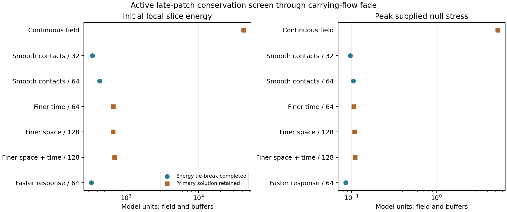
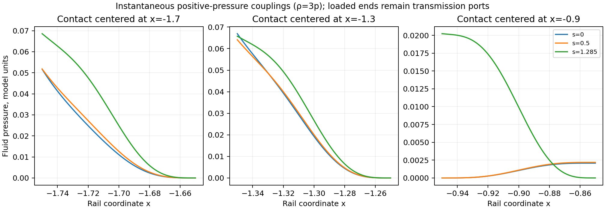

# Distributed electrothermal storage and pressure-bearing contacts

The evidence favors an adjusted assembly of separately graded radial
capacitors, local stores, confined-fluid pressure couplings, and the existing
endpoint heat/current and receiver/reset plant. Segmenting the field reduces
the required preload and source stress. The resulting mechanical contacts
require radial momentum transmission. A local isotropic-fluid calculation
supplies positive-pressure profiles for that role, including their added
energy, stress, loaded-end pressure, and thermal exchange.

For the late patch through carrying-flow fade, the refined field-and-buffer
history requires negative null stress of about 0.104 in the remaining source.
Including the instantaneous pressure couplings raises that requirement to
0.378, compared with 75.781 for the earlier prestressed reservoir at fade.
The comparison retains the same active geometry and fitted endpoint tensor.
The new histories prescribe motion below 0.203c and solve its conservation
requirements. Physical buffer response, confined contact dynamics, complete
pressure transmission, and the remaining negative-stress source constitute
the next construction gate.

## Construction and scope

This bounded study tests a radial electric force profile coupled to local
energy buffers on the repaired active rail. It follows the
[source selection](SOURCE_CONSTRUCTION_SELECTION.md) and the
[prestressed reservoir feasibility audit](RESERVOIR_FEASIBILITY_ENVELOPE.md).
The radial field supplies tension and local electrical conversion; the buffers
carry stored material energy and the endpoint exchange. A segmented variant
exposes finite mechanical contacts for transferring momentum to infrastructure.

The domain is the previous late reservoir patch, \(x\in[-2.1,-0.5]\), starting
at \(s=0\). The main comparison ends at carrying-flow fade, \(s=1.285\),
with one segmented extension to \(s=3\). The geometry retains its lapse,
shift, radial stroke, angular evolution, and protected moving packet.
The reconstructed endpoint tensor and its divergence are the earlier pinned
candidate. This patch carries 35.75% of the earlier full-interval exchange
weight; earlier preparation and the other rail duties retain their own scope.

The prescribed material worldlines have fixed coordinate position. This
inverse problem determines field and energy histories required to support
those worldlines. A physical realization additionally requires a responding
charged material, finite current inertia, confinement, and stable control.
The pressure-free buffer is an optimistic effective store. Its physical
equation of state and confinement remain part of source completion.

The charged multifluid framework supplies an appropriate subsequent dynamics
model: Andersson's [resistive relativistic charged fluids](https://arxiv.org/abs/1204.2695)
couple heat and charge transport, while
[Andersson, Dionysopoulou, Hawke, and Comer](https://arxiv.org/abs/1610.00449)
retain their inertia and their dependence on the equation of state.
The present conservation screen precedes that constitutive evolution.

## Conservation construction

Write \(v=B\beta/\alpha\), \(\Gamma=(1-v^2)^{-1/2}\), and
\(N=\alpha/\Gamma\), the proper-time rate on the chosen worldlines.
The rest energy of a local buffer is \(w\), and a radial electric field has
energy \(u_E\). Its orthonormal stress is
\((u_E,-u_E,0,u_E)\) in the order
\((\rho,p_r,j,p_\Omega)\). Thus it contributes zero radial null stress and
positive angular null stress. Both channels enter the optimization.

Define

\[
M=\Gamma BR^2w,\qquad H=R^4u_E=Q^2/2.
\]

The buffer's conserved rest-mass reference and initial heat profile are
inherited from the preceding thermal allocation control at the same spatial
resolution. Its energy floor is \(M\geq M_{\rm rest}\). Positive field flux
energy obeys \(H\geq10^{-8}\); a \(10^{-6}\) control tests this numerical
regularity floor. Physical size remains a free conversion parameter.

For endpoint divergence \((P,F)\), the sum of buffer and field obeys

\[
M_s+\frac{\Gamma B}{R^2}H_s
 =-\alpha\Gamma BR^2(P-vF),
\]

\[
H_x-\frac{vR^2}{N}M_s-R^2a_s M=BR^4F,
\]

where the acceleration of a fixed-coordinate worldline is

\[
a_s=\Gamma\left[\frac{\partial_s\operatorname{atanh}v}{\alpha}
+\frac{\alpha_x}{\alpha B}-vK_l\right].
\]

These equations retain the reciprocal endpoint power and momentum together.
Passive electrical conversion imposes \(H_s\leq0\), with
\(\sigma=-H_s/(2NH)\geq0\) in the reduced Ohmic description. The initial
field supplies that conversion energy. A finite charged-fluid construction
must also supply charge continuity, carrier inertia, relaxation, and its own
thermal and mechanical response.

The primary objective minimizes the largest supplied null projection over
all directions. A secondary objective minimizes the time integral of local
slice energy at the same peak. Exact maximization of the angular quadratic
checks the directional sampling and adds constraints as needed. The resulting
optima belong to the discretized inverse family.

## Contact variants and gates

The continuous variant enforces interior momentum balance across the body.
The segmented variant places three finite contact bands, centered at
\(-1.7,-1.3,-0.9\), each of coordinate width 0.1. Energy balance continues
through these bands. The remaining momentum divergence defines a mechanical
force port; the infrastructure supplying that force needs the opposite
divergence in its own tensor. Fixed coordinate contacts have zero canonical
mechanical work and can have nonzero normal-frame power. Their force and
material stress remain physical loads.

Both variants retain terminal electrode tractions as external construction
requirements. The segmented contact bands are a proposed addition to the
station plant, with their proper widths measured in the active metric.

A necessary local test examines a co-moving contact supported solely by
positive rest energy and angular stress, with \(w_c\geq|p_{\Omega c}|\) and
zero radial pressure. Its possible radial divergence per unit density lies in

\[
a_s-2|s^\mu\nabla_\mu\log R|
\ \leq\ F_c/w_c\ \leq\
a_s+2|s^\mu\nabla_\mu\log R|.
\]

An opposite-sign force requirement outside this cone excludes that local
contact model even with unrestricted positive density. Radial transmission,
moving supports, and separately routed momentum have different tensors and
remain separate constructions.

## Registered numerical checks

The suite compares 32, 64, and 128 spatial cells, independent time refinement,
the electric-flux floor, and the segmented reset extension. Four workers run
independent cases with one BLAS thread each. Numeric artifacts stay separate
from this manually maintained report.

Seven focused tests check the covariant reduction against independent tensor
divergence, worldline acceleration against its metric definition, exact oblique
null maximization, an analytic forced flat capacitor, and contact-force signs.
Production checks retain sparse optimization residuals and dual gaps, evaluate
the interpolated tensor divergence between grid nodes, and compare geometric
source tensors with two curvature steps and the actual metric interpolation.

The complete remaining source is evaluated as
\(G[g]/(8\pi)-T_{\rm endpoint}-T_{\rm buffer+field}\).
Required negative contributions in its energy and null projections are
reported alongside the added contact requirements. The fixed-background study
assigns no independent quantum capacity ceiling.

## Initial comparison and regularity gate

The initial suite completed five schedules. Two cases encountered a numerical
failure in secondary energy minimization, and the 128-cell optimization
reached its registered time limit. Their status files retain these outcomes.
The successful 64-cell segmented case has initial local slice energy 234.05,
maximum supplied null stress 0.08519, and a fade-time required negative null
contribution 0.07917. The prescribed velocity reaches 0.20214. Its initial
field energy is 199.66, and the remaining buffer energy is 34.39.

The continuous 32-cell case requires initial slice energy 41,391 and supplied
null stress 5.262. The force placement changes the source burden substantially
within this inverse family. The terminal electrodes and the segmented support
tensors remain additional requirements in both comparisons.

Spatial refinement from 32 to 64 cells changes the segmented initial energy
from 249.55 to 234.05 and its largest integrated collar force from 3.476 to
3.346. However, peak collar force density increases from 0.10891 to 0.21843.
The optimizer concentrates the force inside the allowed band. Its effective
discharge conductivity similarly increases from 174.6 to 342.1 under the
combined refinement. These histories provide a relaxed bound; a finite
physical interface and conversion law require a regularity constraint.

The local angular-support test also produces a sign obstruction. At fade in
the 64-cell case, a contact near \(x=-1.7375\) requires support divergence
\(-0.21843\), while every positive-energy angular-only support at the same
motion has positive radial divergence between \(0.31022w_c\) and
\(0.43121w_c\). Its momentum must reach another stress channel or location.

The segmented reset extension requires initial energy 2,303.9 and peak
supplied null stress 1.743. Its fade-time initial-state requirements differ
from those optimized only through fade. The printed spline-curvature
difference at exactly \(s=3\) crosses the metric table's temporal boundary;
that entry requires a smooth boundary extension before use as a curvature
error estimate. The direct repaired-geometry demand uses its full stencil.

A bounded follow-up imposes a smooth fixed contact profile and a finite
proper discharge rate. Within each band, the coordinate profile is
proportional to \((1-z^2)^3\), \(z=2(x-x_c)/0.1\), and vanishes outside.
Its integral is one. A single signed amplitude at each time specifies the
band's integrated force, with normal force density
\(A(s)\psi(x)/(4\pi BR^2)\). The amplitude joins the simultaneous energy
and momentum solve. This resolves the spatial concentration freedom.

The rate control requires
\(H_{i+1}\geq H_i\exp[-2\sigma_{\max}\Delta\tau_i]\), using the
trapezoidal proper-time interval. The main comparison uses
\(\sigma_{\max}=1\), with a value of 10 as a response sensitivity. These
are specified model response rates for comparing source costs, with physical
time conversion \(L/c\); a material conductivity and current-relaxation law
remain to be supplied. They carry no general buildability threshold.

The follow-up retains the independent divergence checks and uses a quadratic
extension of the metric's temporal jets for curvature stencils crossing the
table boundary. Nine focused tests now include the finite contact profile,
its opposite momentum balance, the rate bound, and temporal jet continuity.
The secondary optimization uses an interior-point solve and a numerical
peak allowance of \(10^{-6}\max(1,z_*)\). Its failure preserves the checked
primary optimum and records the missing energy tie-break explicitly.

The remaining contact material and full source completion determine the
stopping gate after this finite-response comparison.

The first finite-profile suite completed the 32- and 64-cell cases, the faster
response control, and the continuous-field recheck. Three larger linear
programs reached their time limits. At 64 cells the smooth-contact case has
initial energy 431.30 and supplied null peak 0.10513, with maximum effective
conductivity 1. Its contact force density is 0.12098. The local angular-only
support obstruction persists. Increasing the permitted conductivity to 10
reduces the initial energy to 332.49 and supplied null peak to 0.08563.

The final numerical refinement uses the HiGHS interior-point method for the
primary optimization. An independent trial completed the formerly timed-out
64-cell time refinement in 22 seconds. Both solver methods pass the analytic
capacitor and smooth-contact tests; the focused and existing tensor checks
total 19 passing cases. A joint spatial and temporal refinement joins the
separate refinements to assess the remaining discretization sensitivity.
Each primary solve retains the 180-second bound and each energy tie-break
the 90-second bound. This final solver comparison retains the same physical
equations, finite contact profile, and response-rate constraints.

## Completed finite-response comparison

The interior-point suite completed all eight primary optimizations, including
separate spatial and temporal refinements, their joint refinement, and the
reset extension. The smooth-contact family retains positive heat and its
specified finite discharge rate. Its maximum prescribed normal-frame speed
is 0.202140c, and the late-patch packet clearance is at least 0.15 in the rail
coordinate. These are inverse histories with counted mechanical ports;
stability and motion under a complete material/controller law require their
own evolution.

| Modeled pieces through fade | Initial local slice energy | Required negative null stress at fade |
| --- | ---: | ---: |
| Earlier freely evolved prestressed reservoir, 128 cells | 989.09 | 75.7805 |
| Continuous graded field and buffers, 64 cells | 41,617.88 | 5.2778 |
| Smooth segmented field and buffers, joint 128-cell refinement | 689.99 | 0.1040 |
| Same segmented history plus instantaneous fluid pressure couplings | 848.33 | 0.3779 |

The last row adds the modeled fluid stress inside the three contact bands.
Its loaded-end transmission paths, confining walls, and thermal-transfer
partners remain additional tensors. All quantities are in the earlier model
units. The energy is the normal-frame slice integral, with the same physical
scale conversion as the preceding feasibility report.

The primary peak objective completes in every final case. The secondary
energy tie-break completes for the 32-cell, 64-cell, and faster-response
segmented cases. Other cases retain the verified primary solution. Their
listed energies describe those retained histories, while their minimum
possible energy at the same peak remains undetermined.

| Smooth-contact comparison, conductivity ceiling 1 | Peak supplied null stress | Peak contact force density | Interior energy check | Interior force check |
| --- | ---: | ---: | ---: | ---: |
| 32 cells, 65 time intervals | 0.096495 | 0.063980 | 2.596% | 0.794% |
| 64 cells, 129 time intervals | 0.105127 | 0.120979 | 1.176% | 0.295% |
| 64 cells, 257 time intervals | 0.106363 | 0.121917 | 0.770% | 0.293% |
| 128 cells, 129 time intervals | 0.108961 | 0.142687 | 0.796% | 0.086% |
| 128 cells, 257 time intervals | 0.110152 | 0.143791 | 0.445% | 0.085% |

The independent checks evaluate the bilinearly reconstructed tensor between
grid points, differentiate its moments, and compare its covariant divergence
with the endpoint exchange. The percentages are sums of absolute residuals
divided by sums of the corresponding equation-term magnitudes at the sampled
interior points. The joint-refinement maximum absolute rest-frame residuals
are 0.000524 in energy and 0.0000987 in force. They resolve the broad source
comparison while leaving finite discretization error. Spatial refinement has
the larger remaining effect on the peak; the refinement from 64 to 128 cells
at 257 time intervals changes it by about 3.6%.

The finite contact profile removes the earlier doubling of force density
with spatial resolution. A conductivity ceiling of 10 yields supplied null
peak 0.085634 and initial energy 332.49 at 64 cells. This is a response-cost
sensitivity; an identified physical conductivity and relaxation law must be
matched to the chosen physical scale.

## Local pressure-coupling construction

The strongest fade-time angular-support witness in the joint refinement
requires support rest-frame divergence \(-0.143791\) at
\(x=-1.70625\). Direct derivatives of the repaired geometry put the
angular-only support cone between \(0.275553w_c\) and \(0.397825w_c\).
The two derivative steps, \(10^{-4}\) and \(5\times10^{-5}\), agree on
that sign separation. Increasing positive density preserves the mismatch.

A radial pressure gradient supplies the missing signed force. Consider a
local isotropic fluid with \(\rho_c=\kappa p_c\), \(\kappa=3\), and
the same coordinate-fixed target motion. This explicit ultrarelativistic
fluid model has \(dp_c/d\rho_c=1/3\). Its radial force projection is

\[
F_c=(\kappa+1)p_c a_s+
\frac{\partial_xp_c}{\Gamma B}
+\frac{v}{N}\partial_s p_c.
\]

On each inspected slice, set \(\partial_s p_c=0\), specify zero pressure
at the unloaded end, and integrate

\[
\partial_xp_c+(\kappa+1)\Gamma B a_s p_c
=\Gamma B F_c.
\]

The resulting pressure stays nonnegative. Its nonzero loaded-end value is
an explicit pressure-transmission requirement for the station structure.
The opposite force signs use opposite loaded ends. Its required rest-frame
thermal exchange on the inspected slice is

\[
P_c=(\kappa+1)p_c\Theta,\qquad
\Theta=\frac{\partial_s\log(\Gamma BR^2)}{N}.
\]

This exchange is predominantly cooling during the examined compression.
Its reciprocal transfer belongs in the heat/current medium. Time-dependent
pressure evolution replaces the imposed zero pressure derivative with the
fluid's energy equation and changes that transfer accordingly.

| Contact center | Loaded pressure at startup | Loaded pressure at fade | Fluid slice energy at fade |
| --- | ---: | ---: | ---: |
| -1.7 | 0.05169 | 0.06859 | 4.8488 |
| -1.3 | 0.06692 | 0.06573 | 8.5773 |
| -0.9 | 0.00208 | 0.02023 | 3.2602 |

The third contact changes force direction between startup and fade. Opposed
pressure chambers provide a concrete arrangement to investigate for that
bidirectional duty. The fluid's assigned role is local momentum transfer;
the electromagnetic stores and endpoint medium retain their energy and
current responsibilities.

These three fluid pieces add slice energies 158.34 at startup, 85.49 at
\(s=0.5\), and 16.69 at fade. Their full energy, radial, current, and angular
moments enter the source comparison. The corresponding remaining negative
null requirements are 0.35092, 0.34071, and 0.37794. The loaded-end pressure
changes by less than \(10^{-7}\) under the local integration refinement
across all 21 inspected contact slices, including the reset control.

## Reset, source completion, and stopping point

Extending the same passive storage family to \(s=3\) requires a larger
prepared field. The retained 64-cell reset history has initial slice energy
7,603.05 and peak supplied null stress 2.07572. Its remaining negative null
requirement at \(s=3\) is 2.04560, or 2.21992 with the local fluid pieces.
The reset extension has one resolved-grid control, with an independent force
check of 1.07%; a continuum reset certificate remains open.

This extension retains the prescribed endpoint exchange and mechanical
contacts throughout. The existing receiver/reset plant's independently
controlled energy export has yet to be coupled into this reservoir model.
The result therefore measures the cost of this passive retention history.
Full-architecture reset requires explicit current and energy transfer to
that already identified plant, including its receiving stress and capacity.

Physical assembly selection consequently remains open. The next
concrete construction is a distributed capacitor and local-store assembly
with opposed pressure couplings, a complete non-live pressure-transmission
path, and reciprocal cooling/reset ports to the existing endpoint medium.
Its component duties are distinct and its remaining loads are quantified.
Its field, buffer, and fluid stresses obey the null energy condition; the
remaining negative contribution requires an independently supplied sector.

The present investigation stops at the complete load-path and constitutive
gate. Confined-wall stress, charge-current inertia and relaxation, the
physical buffer equation of state, coupled pressure/heat evolution, and
earlier packet-safe preparation remain necessary parts of that construction.
The local angular-only contact model has a force-sign obstruction. The
pressure-gradient calculation gives a finite alternative local stress
channel, with explicit interfaces for the remaining infrastructure work.
The results retain the selection preference for specified fields and
materials and establish no exception favoring ideal string matter.

The focused tests and existing tensor tests total **26 passing cases**.
The final production suite completes **eight primary optimizations** using
four workers. **136 manifest hash comparisons** verify the three stages
against their recorded outputs and source revisions. The repaired-geometry
curvature-step differences through fade remain at most \(1.05\times10^{-5}\),
and the spline comparison remains at most \(6.43\times10^{-5}\). At
\(s=3\), the smooth temporal extension reduces the earlier boundary-stencil
artifact to a spline difference of \(2.05\times10^{-6}\).

Numeric comparisons, source projections, local pressure requirements, exact
geometry witnesses, and integrity results are in
[`data/graded_electrothermal/derived`](data/graded_electrothermal/derived/).
The production histories and their bounded solver failures remain in the
parent stage directories. Narrative findings are maintained in this report.
