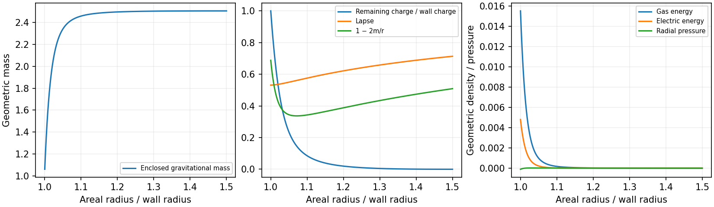

# Gravitating Screening Atmosphere

Date: 9 September 2026.

A cold charged atmosphere with its own gravitational field admits a static
match to the retained rail tail and a positive-energy Fermi wall. Two of
the sixteen registered material matches place the wall under tension.
The atmosphere therefore changes the equilibrium pressure sign that
forced local compression in the enclosing vacuum and thin-cloud models.
The result is an exterior fluid-and-junction equilibrium. A subsequent
local response calculation finds that relaxation of the screening cloud
can still outweigh the wall's tension. The selected equilibrium therefore
reaches a renewed shape-response barrier in this approximation. Its full
curved perturbations, finite-width particle boundary, and absolute curved
quantum stress remain parts of the complete material construction.

## Matter, geometry, and boundary data

The starting equations are the Einstein--Maxwell--Thomas--Fermi system and
the electrochemical first integral developed by
[Rueda, Ruffini and Xue](https://arxiv.org/abs/1104.4062), particularly
equations (59), (66), and (73)--(83). The present specialization has one
negatively charged, massive Dirac screening species at zero temperature.
Its wall carries positively charged fermions in the surface branches of
the [scalar Fermi-wall model](SMOOTH_QUANTUM_MATERIAL_ATTEMPT.md).
The charge benchmark is \(e^2/(4\pi)=1/137\). The particle masses and field
multiplicity are model parameters; identification with electrons or a
laboratory material requires an additional physical-scale match.

Use \(\hbar=c=1\), Heaviside--Lorentz electric units, and
\(\eta=G\hbar/L^2\) to convert microscopic stress to geometric stress.
For areal radius \(r\),
\[
ds^2=-\alpha(r)^2dt^2+\frac{dr^2}{f(r)}+r^2d\Omega^2,
\qquad f=1-\frac{2m(r)}r,\qquad E=\frac{Q}{4\pi r^2}.
\]
The mass function includes the electric energy. With screening charge
\(-e\), the local chemical potential obeys
\(\alpha\mu-eA_t=\mu_\infty\). The spin-two gas has
\[
p_F=\sqrt{\max(\mu^2-m_s^2,0)},\quad n=\frac{p_F^3}{3\pi^2},\quad
\rho_g=\frac1{\pi^2}\int_0^{p_F}p^2\sqrt{p^2+m_s^2}\,dp,
\quad p_g=\frac1{3\pi^2}\int_0^{p_F}\frac{p^4\,dp}{\sqrt{p^2+m_s^2}}.
\]
Consequently,
\[
m'=4\pi\eta r^2\rho_g+\frac{\eta Q^2}{8\pi r^2},\qquad
\frac{\alpha'}\alpha=
\frac{m+4\pi\eta r^3p_g-\eta Q^2/(8\pi r)}{r^2 f},
\]
\[
Q'=-\frac{4\pi e r^2 n}{\sqrt f},\qquad
\mu'=-\frac{\alpha'}\alpha\mu-\frac{eQ}{4\pi r^2\sqrt f}.
\]
The gas contributes positive isotropic pressure. The electric field adds
positive energy, radial tension, and positive tangential pressure.

At the outer edge \(r_e\), the gas reaches \(\mu=m_s\) and \(Q=0\).
The exterior is Schwarzschild, with
\(\alpha_e=\sqrt{1-2M_\infty/r_e}\) and gauge \(A_t(r_e)=0\).
Thus \(\mu_\infty=m_s\alpha_e<m_s\): gravity binds a compact cold gas
with a finite edge and zero total charge. These boundary values determine
an inward integration to the wall at \(R=6.8\).

Just inside the wall, the retained analytic rail tail has
\(f_-=1-b^2/R^2\), \(b=1.75\), and constant lapse equal to
\(\alpha(R)\). The interior carries zero electric flux. Screening
particles occupy the exterior side only, so all charge \(Q(R)\) belongs
to the positive wall particles. This is an explicit particle-exclusion
boundary condition. A mass contrast across the material can provide a
candidate mechanism; its finite-width stress and spectrum require a
material calculation. A gas transparent to the wall would also populate
the rail interior and change these boundary data.

## Surface matching

The integration variables are
\[
c_e=\frac{\sqrt6\pi}{e},\quad x=\frac rR,\quad t=\log x,\quad
U=\frac{r\mu}{c_e},\quad Z=\frac{eQ}{4\pi c_e},\quad
\mathcal M=\frac mR,\quad g=\frac{12\pi^3\eta}{e^4R^2},\quad
\mu_0=\frac{m_sR}{c_e}.
\]
The implementation uses a small-momentum series at the gas edge to
preserve the pressure's accuracy and integrates the electric potential
independently to check the Klein constant.

Let \(A=\sqrt{f_-}\), \(s=\sqrt{f_+(R)}\),
\(H_R=R\alpha'(R)/\alpha(R)\), and
\(S=4\pi R\Sigma\), \(\bar P=4\pi RP\). The Israel junction gives
\[
S=A-s,\qquad \bar P=\frac{s(1+H_R)-A}{2}.
\]
Only the material sheet enters \(\Sigma,P\); the extended atmosphere's
stress already enters the exterior Einstein equations. The scalar wall
and occupied surface branches obey
\[
\Sigma=\tau+\epsilon_f,\qquad P=-\tau+\frac{\epsilon_f}{2},\qquad
4\pi R\epsilon_f=\frac{2(S+\bar P)}3,\quad
4\pi R\tau=\frac{S-2\bar P}3.
\]
Charge fixes the wall number per area,
\(n_w=c_eZ_R/(e^2R^2)\). For \(F\) positive surface branches,
\[
\epsilon_f=\eta\frac{4\sqrt\pi}{3\sqrt F}n_w^{3/2},\qquad
4\pi R\epsilon_f=g\frac{4\,6^{3/4}}{9\sqrt{eF}}Z_R^{3/2}.
\]
Matching this value to the junction's required gas energy determines
\(M_\infty/R\). The cloud and wall therefore share one counted particle
number and one gravitational conversion factor.

## Registered equilibria

The [retained calculation](data/gravitating_atmosphere/manifest.json)
fixes \(r_e/R=1.5\), \(\mu_0=3\), and scans
\(g=10^{-4},3\times10^{-4},10^{-3},3\times10^{-3}\), each with
\(F=1,4,16,64\). The ADM mass search covers
\(0.12\le M_\infty/R\le0.40\) in 57 initial samples, followed by
bracketed root refinement. Each of the sixteen searches yields one
positive-component match in this interval. The two tensile matches have
\(F=64\), at the two smaller loadings. Inadmissible negative core masses
break a search bracket and are counted separately from integration errors.

The selected tensile equilibrium has \(g=10^{-4}\), \(F=64\):

| Quantity | Value in rail units |
|---|---:|
| Wall radius / outer edge radius | 6.8 / 10.2 |
| Total ADM mass | 2.504951398 |
| Mass function just outside wall | 1.061571003 |
| Atmosphere contribution to ADM mass | 1.443380395 |
| Minimum \(1-2m/r\) | 0.3369625 |
| Lapse at wall | 0.5314321 |
| Wall energy \(\Sigma\) | 0.0016032114 |
| Wall pressure \(P\) | −0.0001356302 |
| Scalar tension \(\tau\) | 0.0006248239 |
| Occupied wall energy \(\epsilon_f\) | 0.0009783875 |
| Wall-only transverse coefficient \(-P/\Sigma\) | 0.0845991 |
| Common conversion \(\eta\) | \(1.045600\times10^{-7}\) |
| Proper atmosphere width | 5.2724474 |
| Proper distance containing 90% of its ADM mass increment | 0.5714263 |
| Proper distance containing 90% of its screening particles | 1.0022236 |

The cloud extends over half the wall radius in areal coordinates, while
most of its gravitational mass lies close to the wall. Its mass increment
is substantial: treating this atmosphere as an external force would miss
more than half the total ADM mass. The wall's positive transverse
coefficient removes its own leading compression term; the relaxed cloud
and gravitational perturbations enter the combined deformation energy.



The same solution gives screening rest mass 11.20968, local screening
chemical potential 49.88379 at the wall, and screening Klein energy
7.99615. The wall Fermi momentum is 14.02024. Redshift and electric
potential give the wall particles a leading Fermi energy of 25.96450 at
infinity. These values specify the energetic thresholds for charged
confinement.

## Exterior-only cloud response

The exterior particle boundary changes the response from the earlier
symmetric [thin screening cloud](SCREENED_CHARGED_WALL_RESPONSE.md).
A local planar comparison can preserve the actual wall charge, particle
number, and \(\eta\), while taking the leading massless screening gas.
Let \(z\) be proper distance outward from the wall. Its profile is
\[
u_0(z)=\frac{c_e}{z+a},\quad z>0,\qquad
u_0(z)=\frac{c_e}{a},\quad z<0,\qquad
a^2=\frac{c_e}{e^2 n_w}.
\]
The exterior contains the gas and the interior supports an electric
perturbation. The counted cloud energy and pressure are
\[
\epsilon_c=\eta\frac{4\pi^2}{e^4a^3},\qquad P_c=\frac{\epsilon_c}{2}.
\]
These are comparison quantities for the local response. The atmosphere's
mass remains the bulk integral in the preceding curved equilibrium.

For a ripple \(h=\mathcal A\cos(kx)\), write the first-order potential
as \(h\,w_\pm(z)\). Fixed charge per material patch, continuity of the
potential, and Gauss's law give
\[
w_+(0)-w_-(0)=\frac{c_e}{a^2},\qquad
w_+'(0)-w_-'(0)=-\frac{2c_e}{a^3}.
\]
Set \(q=ka\), \(s=z/a\), and
\[
W_q(s)=e^{-qs}\frac{q^2+3q/(1+s)+3/(1+s)^2}{q^2+3q+3},\qquad
d_q=q+\frac{3(q+2)}{q^2+3q+3}.
\]
Then \(w_+=(c_e/a^2)B W_q\),
\(w_-=(c_e/a^2)C e^{kz}\), with
\[
B=\frac{q+2}{q+d_q},\qquad C=B-1.
\]
The sum of electric force and screening-gas pressure at the moving
boundary yields
\[
\boxed{\frac{K_c}{P_c k^2}
=-\frac{3(q+2)(q+1)}{2q^3+6q^2+9q+6}}.
\]
The cloud's relaxed contribution is negative at every positive wave
number. Its ratio tends to \(-1\) at long wavelength and to
\(-3/(2q)\) at short wavelength. The latter includes the electric field
created on the initially empty side of the wall.

An independent energy calculation uses coordinates following the wall.
With \(V=B W_q-(1+s)^{-2}\), it gives
\[
\frac{K_c}{P_c k^2}=-\frac3{q^2}\left[
qC^2+\int_0^\infty\left(V'^2+q^2B^2W_q^2+
\frac{6V^2}{(1+s)^2}\right)ds\right].
\]
The first term is the interior field energy contribution to the stationary
functional's second variation. Numerical quadrature and a separate
Poisson boundary-value solution reproduce the force result.

Adding the material's fixed-particle-number area response gives
\[
\Delta E=\frac{\mathcal A^2}{4}K_{\rm local},\qquad
K_{\rm local}=k^2\left[-P+P_c\frac{K_c}{P_c k^2}\right].
\]
For the selected curved equilibrium, the local comparison has
\(a=0.526024\), \(P_c=0.001685392\), while the positive wall tension
coefficient is \(-P=0.000135630\). Its planar screening chemical potential
at the wall is 48.3032, compared with the actual curved value 49.8838.
The local model matches the electric energy at the wall exactly and
underestimates the gas energy there by about 7.2 percent.

The [response audit](data/gravitating_atmosphere_audit/audit.json) records
widths \(d=0.025,0.05,0.1\) and angular labels \(10\le\ell\le80\),
with \(k=\sqrt{\ell(\ell+1)}/R\). Its comparison window uses
\[
kd\le0.2,\quad kR\ge10,\quad k/p_{F,\mathrm{screen}}\le0.2,\quad
8\pi\rho_{\rm wall}^{\rm bulk}/k^2\le0.05,
\]
\[
d/a\le0.2,\quad a/R\le0.1,\quad m_s/\mu(R)\le0.25.
\]
Here \(\rho_{\rm wall}^{\rm bulk}\) is the gas-plus-electric geometric
energy density on the exterior side. Thirty-seven width/mode pairs meet
these scale screens: 32 at width 0.025 and five at width 0.05. Every one
has negative local deformation stiffness. The destabilizing cloud term
exceeds the wall's tensile term by factors of at least 4.086. Over the
sampled response distance \(0\le z\le\min(a,1/k)\), the comparison
chemical profile differs from the actual atmosphere by at most 5.04 percent.

For example, \(\ell=26\), \(d=0.025\) gives \(k=3.89637\),
\(ka=2.04958\), \(kd=0.09741\), and
\(K_{\rm local}=-0.012117\). The cloud term is 6.885 times the available
wall tension. The formal planar crossing occurs only at \(k=35.2008\),
where \(k/p_{F,\mathrm{screen}}=0.7242\) and \(kd\le0.2\) would require
\(d\le0.005682\).

These scale ratios and profile comparisons assess the local model's
relevance. A bound on corrections from the full coupled Einstein,
electromagnetic, fluid, and material perturbations remains to be derived.
Consequently, the result establishes a negative direction in the stated
local response model and supplies a substantial adverse indicator for
the selected curved equilibrium. The complete curved stability question
remains open. The bounded investigation stops at this renewed shape
problem; the tensile static junction alone supplies insufficient evidence
to promote the construction.

## Finite-width particle thresholds

The one-sided atmosphere also requires a material barrier to screening
particles. A possible mass law across \(\chi=v\tanh(z/d)\) is
\[
m_s(\chi)=m_{\rm out}
+\frac{m_{\rm in}-m_{\rm out}}2\left(1-\frac\chi v\right).
\]
The empty interior requires \(m_{\rm in}>49.8838\) in the leading static
model. This mass law is a candidate microscopic extension, with its own
backreaction and vacuum dressing.

For charged wall particles, the leading surface dispersion used in the
equilibrium gives Fermi energy
\(E_F^\infty=\alpha_R k_F+eA_t(R)=25.9645\). A common bulk mass
\(m_h=yv\) must exceed this exterior continuum threshold and the interior
condition \(m_h>k_F\). The atmosphere adds a stronger restriction: it
can bind heavy particles away from the wall. In the local-density
description, keeping those bulk states empty requires
\[
m_h>\max_{r\ge R}\frac{E_F^\infty-eA_t(r)}{\alpha(r)}
=41.33882.
\]
The maximum occurs at \(r=7.80529\), inside the atmosphere. A sampled
profile and independent continuous optimization agree on this threshold.

Using \(v^2=3\tau d/(4\eta)\), the corresponding lower estimates of
the collective Yukawa loop measure \(Fy^2/(16\pi^2)\) are 6.181, 3.091,
and 1.545 at widths 0.025, 0.05, and 0.1. The formal short-wavelength
crossing width raises this estimate above 27.2. These values put a
weak-coupling treatment of the registered microscopic wall outside a
small-correction regime. Actual charged bound levels, finite-size shifts
of the bulk threshold, occupation of excited transverse branches, and
renormalized material stress require the finite-width Dirac and scalar
solution. Both the renewed shape response and the confinement scale
therefore limit the present classical surface realization.

## Verification and reproduction

Independent momentum integrals check the gas equation of state through
its nonrelativistic transition. Numerical volume integrals recover the
screening charge and atmosphere mass. Across all sixteen matches, their
maximum relative discrepancies are \(2.8\times10^{-11}\) and
\(1.2\times10^{-10}\). The independently integrated Klein constant varies
by at most \(7.8\times10^{-11}\). A finite-difference check of anisotropic
stress conservation on 4,001 profile points gives a maximum normalized
residual \(2.7\times10^{-5}\).

Two different integrators, DOP853 and Radau, replay the selected ADM mass
at three tolerances. At the tightest tolerance their scaled surface
matching residuals differ by less than \(8\times10^{-13}\). Seventeen
focused tests pass. The four-worker run takes 26.85 seconds; its largest
reported worker memory is about 144 MiB. The retained evidence occupies
418,534 bytes.

The separate audit passes all 33 checks, including direct momentum-space
normalization and the normal Israel force balance against both bulk radial
stresses. Ten wave numbers have independent force, energy, and Poisson
response checks, with maximum absolute discrepancies
\(2.3\times10^{-16}\) and \(6.4\times10^{-11}\). The audit takes
2.50 seconds with four workers. The two retained evidence directories
total 480,734 bytes. All 67 tests covering the atmosphere, local response,
and the earlier screening/material/junction/quantum harnesses pass.
An external single-worker replay reproduces every numerical equilibrium,
refinement, and profile entry exactly; its separate audit also passes.

```bash
export OPENBLAS_NUM_THREADS=1 OMP_NUM_THREADS=1 MKL_NUM_THREADS=1
export PYTHONPATH=toolkit/adm_harness_cli
export MPLCONFIGDIR=/tmp/active-rail-mpl-cache
python toolkit/adm_harness_cli/scripts/run_gravitating_atmosphere.py --workers 4 --output /tmp/rail-atmosphere-replay
python toolkit/adm_harness_cli/scripts/audit_gravitating_atmosphere.py --workers 4 --input /tmp/rail-atmosphere-replay --output /tmp/rail-atmosphere-audit-replay
python -m pytest -q toolkit/adm_harness_cli/tests/test_gravitating_atmosphere.py toolkit/adm_harness_cli/tests/test_one_sided_screening.py
```
