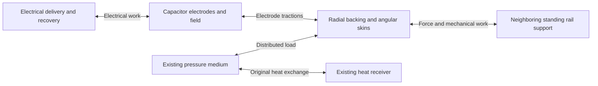
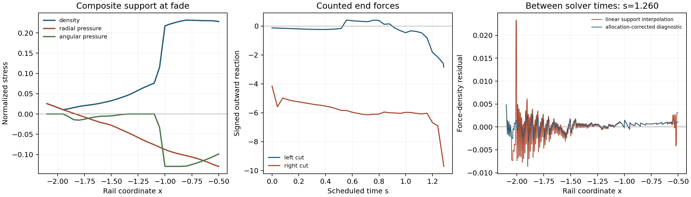

# Joint support stress schedule and counted rail connections

The [continuum audit correction](JOINT_SUPPORT_CONTINUUM_CORRECTION.md)
supersedes the force residual figures below by retaining temporal electric
momentum in the moving material frame. The solved schedules and end-work
results retain their values.

The joint investigation identifies a regulated composite support as a useful
construction target. Separate radial members and angular skins can satisfy
the resolved force and energy equations while retaining the original pressure
fluid, electrical delivery, and heat-receiver histories. Their sampled fade
negative-null remainder is 0.33291. The prepared elastic frame examined in
the preceding screen has a much larger burden and fails its passive heat
contact check.

This result supplies a stress schedule and an attachment specification. A
physical constitutive law, stable evolution between the sampled states, and
matching to neighboring standing support remain open. The independent
continuum audit also finds a force residual between solver points. Thus the
calculation gives a direction for the coupled construction, with the
capacitor's mechanical completion still outstanding.

## The joint problem retains the active architecture

The prescribed geometry is the scheduled patch x in [-2.1,-0.5], s in
[0,1.285], including its shift, carrying-flow evolution, and release. The
protected packet remains outside the patch. The material congruence is the
preceding coordinate-fixed one, whose speed stays about 0.20c in the sampled
history. The physical length scale remains free.

The [architecture review](ACTIVE_RAIL_ARCHITECTURE_SCOPE_REVIEW.md) assigns
distinct responsibilities to the radial backbone, angular jacket, support
actuators, endpoint medium, and receiver. Their roles organize this calculation:

The capacitor has field stress (u_E,-u_E,0,+u_E), charge
q=sqrt(2H_e), and inverse capacitance ell/R^2. Here ell=Gamma B,
D=ell R^2, H_e=H-S, and u_E=H_e/R^4. The normal electric traction is
therefore explicit. Its allocation between local backing and the wider rail
enters the joint momentum equation. The constant-flux guide and routed work
waves retain their separate tensors and exchanges.

The archived endpoint tensor supplies the exchange target. The new support
replaces the remaining endpoint realization after the work waves, receiver,
and additional radial guide have been counted. The original endpoint tensor
is consequently absent from the constructed source sum. The force target and
energy convention are given in the
[joint elastic screen](JOINT_ELASTIC_BACKING_PRESSURE_SCREEN.md).

## Scheduled support with its own energy

The support variables are its energy M per material label and stress-volumes
P=D p_r and Q=D p_t. The pressure fluid has thermal energy U=3Dp and conserved
number per label N_m. The general material comparison imposes

    M >= 0,       |P| <= f M,       |Q| <= f M,

where f is a declared stress-to-energy comparison, with 0<f<=1. This supplies
an energy-condition envelope. Causality and stability additionally require a
constitutive law and its evolution equations.

The support and change in pressure fluid obey one energy equation:

    partial_s(U-U_0+M) + (U-U_0) partial_s(ln D)/3
       + P partial_s(ln ell) + 2Q partial_s(ln R) = 0.

The matching radial equation is

    delta F_fluid + (M+P)a/D
       + d_r(P/D) + 2(P-Q)k/D = F_*,
    d_r = (v/N) partial_s + (1/ell) partial_x,
    N = alpha/Gamma,       k = d_r(ln R).

Thus changing the support stress changes both the force and strain work. The
receiver already supplies the original pressure-fluid heat exchange and
converter losses. The fixed-fluid controls set U=U_0 everywhere and give

    partial_s M = -P partial_s(ln ell) - 2Q partial_s(ln R).

They require zero additional heat exchange with the pressure medium. Internal
actuator work, constituent exchange, and the response of a real support remain
to be supplied within this total energy law.

## Component separation changes the material target

The broad energy-condition envelope grants one material simultaneous radial
and angular stresses. For the identified composite, radial members cost at
least |P|, tensile angular skins cost -Q, and compressed circumferential rods
cost 2Q. Adding their independently counted energies gives

    M >= |P| + max(-Q,2Q).

This constraint admits arbitrary scheduled preparation coefficients while
retaining the component energy costs. Charge-carrier excess energy, finite
contacts, and a physical control mechanism would add their own requirements.

The low-cost general stress trajectories violate this separate-member energy
condition over roughly 90–99% of their support-energy-weighted grid nodes.
They therefore describe a more capable shared material response. They cannot
be assigned directly to the earlier radial-member/angular-skin stack.

The separately counted composite still has a resolved joint solution. At
32 spatial cells and 35 time nodes, with the original fluid retained:

| Quantity | Scheduled separate-member composite |
| --- | ---: |
| Initial support rest energy | 1,271.66 |
| Fade support rest energy | 164.72 |
| Peak material null projection over the sampled history | 0.1339383 |
| Initial required negative-null remainder | 0.15931 |
| Mid-phase required negative-null remainder | 0.14571 |
| Fade required negative-null remainder | 0.33291 |
| Added heat exchange with the pressure fluid | 0 |

The preceding interface with zero added backing has a fade remainder of
0.203752. The new composite value is about 1.63 times that reference. This is
an assembly comparison at the retained geometry and route. The source
remainder still requires a physical realization, including the separate
absolute quantum stress construction.

The optimization minimizes the maximum material null projection, followed
by evaluation against the geometry at the three archived source phases.
It supplies neither a minimum initial inventory nor a global minimum of the
quantum-source remainder. The figures above describe the returned trajectory.

## The required response differs from a passive axial spring

For an uncoupled axial member with fixed internal state and positive
incremental stiffness, axial force decreases as length increases. The
corresponding comparison imposes

    Delta(P/ell) Delta ell <= 0.

Combining this condition with separate radial/angular member costs, the
original fluid, and the retained work route makes the discrete joint problem
infeasible. The freely scheduled composite has about 73.6% of its absolute
axial-force changes in the opposite sense. This fraction measures the returned
trajectory; the constrained solve tests whether another trajectory in that
registered class can satisfy the same requirements.

The load path therefore calls for a coupled internal-state response, cell
switching, or regulated attachments. Those freedoms already belong to the
standing-support/actuator role. They require an explicit energy relation,
finite signal and work transfer, and a stability calculation. A one-dimensional
passive rod law supplies a narrower response family than a coupled solid.
[Natário's relativistic elasticity analysis](https://arxiv.org/abs/1912.08221)
provides the longitudinal/transverse distinction, while
[Brown's hyperelastic formulation](https://arxiv.org/abs/2004.03641) gives the
stress and energy equations from a common action.

The additional general-material/monotonic-response control remains numerically
unresolved. Its first solver result failed the original-matrix inequality
check; the independent solver retry returned a numerical failure. It supplies
no material verdict.

## End forces and mechanical work

The combined nonwave traction at a material cut is

    tau = (U/3+P)/D - (H+G-S)/R^4.

The neighboring rail receives the opposite reaction. For the outward sign
epsilon=-1 at the left cut and +1 at the right cut, the ADM energy flux through
the coordinate-fixed material cut is

    F_out = epsilon 4 pi R^2 tau,
    Power_out = epsilon 4 pi alpha R^2 v tau.

This expression follows directly from the normal-frame energy flux
B R^2(alpha j/B-beta rho). The propagating work waves have their separate
transport ledger. The following mechanical quantities refer to the full
nonwave cut, including the electric and guide tractions:

| Cut | Signed outward force range | Net ADM work outward over the patch | Peak absolute ADM power |
| --- | ---: | ---: | ---: |
| Left | -2.840 to +0.414 | Approximately zero | Approximately zero |
| Right | -9.712 to -4.153 | 37.409 | 238.005 |

The left cut has negligible material velocity relative to the normal frame
while carrying a finite reaction. The right attachment carries both force
and mechanical energy. Its 37.409 is an ADM boundary-work quantity; the support
inventory table uses integrated local rest energy. Metric deformation also
contributes to the change in the volume energy.

The standing substrate has an assigned support role, but its material tensor
and finite attachment are still construction targets. These forces therefore
specify the required neighboring connection. Treating both nonwave end
tractions as zero is a separate control: the general material envelope with
adjustable fluid reaches a fade remainder of 8.7455, while the prepared
elastic cases are infeasible. Distributed continuation into the standing rail
is the more useful attachment target for this comparison.

## Resolution, conservation audit, and reconstruction limits

The selected separate-member solution has a maximum original-matrix force/
energy equality residual of 3.24e-12 and inequality violation of 2.80e-12.
Every null direction is checked analytically. Those small numbers concern
the declared finite-volume and time-quadrature equations.

An independent audit evaluates the continuous, piecewise interpolated tensor
between solver times, using four quadrature points inside every original
field-allocation panel. It preserves the full original pressure-fluid history
in the fixed-fluid cases. Its material-frame power and force formulas pass
an independent normal-frame covariant-divergence test on a metric with
nonzero shift and time-dependent lapse, radial scale, and angular radius.

| Interpolated candidate | Force residual / sum of force-term magnitudes | Power residual / sum of power-term magnitudes | Cell-equation residual sum ratio |
| --- | ---: | ---: | ---: |
| General material, 32 cells / stride 8 | 11.96% | 1.82% | 1.10% |
| General material, 64 cells / stride 4 | 9.75% | 0.52% | 0.87% |
| Separate-member composite, 32 cells / stride 8 | 8.24% | 1.85% | 0.98% |

The first two columns integrate absolute residuals and absolute term
magnitudes with proper material spacetime weight. The last column sums the
absolute cell-averaged ell F residuals and term magnitudes. For the selected
composite, the maximum pointwise force residual is 0.02419. The raw
interpolated construction therefore lacks a converged continuum force balance.

Part of the mismatch follows the known field-allocation variation inside
the support cells. A time-independent reconstruction using
Delta S=S-S_linear changes the target support tensor by
(Delta S/R^4,-Delta S/R^4,0,Delta S/R^4). It has zero local material-frame
power and vanishes at the support nodes. For the composite it reduces the
weighted force residual to 4.60%, but creates a local DEC violation of
3.75e-4. This correction is a diagnostic of the required subcell stress;
it fails the admissibility gate as a completed repair.

The general f=0.9 material retains its energy condition under this particular
reconstruction, with a force residual of 8.60%. However, its separate-member
energy deficit persists. A physical continuation must resolve spatial stress,
constituent costs, and constitutive evolution together.

General-envelope controls with the fixed fluid give sampled fade remainders
of 0.20381 at f=1, 0.22382 at f=0.9, and 0.25783 at f=0.75 on the coarse grid.
The 64-cell/stride-4 f=1 result is 0.23356. Multiple trajectories share the
material objective, and these source remainders remain resolution dependent.
The additional 64-cell/stride-2 run exhausted its angular cutting-plane limit;
it supplies no accepted refined trajectory.

The final panel displays the time with the largest mean absolute raw force
residual. The allocation-corrected curve is the diagnostic whose admissibility
failure is quantified above.

## Construction direction and evidence

The next physical target is the regulated radial/angle support connection,
including its internal state and finite end matching. The electrode skin,
pressure medium, work route, and receiver already provide explicit inputs to
that problem. The supplied stress schedule gives a concrete loading history
for selecting a coupled constitutive law and checking whether its controls
can be powered and stabilized. Increasing capacitor capacity alone leaves
this support-response requirement in place.

Evidence directories:

- [`joint_support_envelope`](data/joint_support_envelope): general stress and
  end-balance controls.
- [`joint_support_envelope_refinement`](data/joint_support_envelope_refinement):
  finite stress margins and numerical refinement.
- [`joint_component_cone`](data/joint_component_cone): separately counted
  members and the passive axial-response comparison.
- [`joint_support_audit`](data/joint_support_audit): continuum residuals,
  admissibility of the subcell diagnostic, and force/work histories at the ends.
- [`joint_support_figures`](data/joint_support_figures): standalone PNG/PDF figure.

The audit verifies 264 input/output hashes across the five joint calculation
stages. Producers and tests are under `toolkit/adm_harness_cli`; the new module
is `adm_harness/joint_support_envelope.py`, and the scripts begin with
`run_joint_support`, `refine_joint_support`, `run_joint_component`,
`audit_joint_support`, and `plot_joint_support`. The technical disclosure
retains its recognized design content; these construction results reside in
the supporting research record.

Final verification passes 45 focused tests and 390 input/output hash checks
including the audit and figure artifacts. The complete new joint evidence
occupies 3,872,745 bytes, approximately 3.9 MB.
