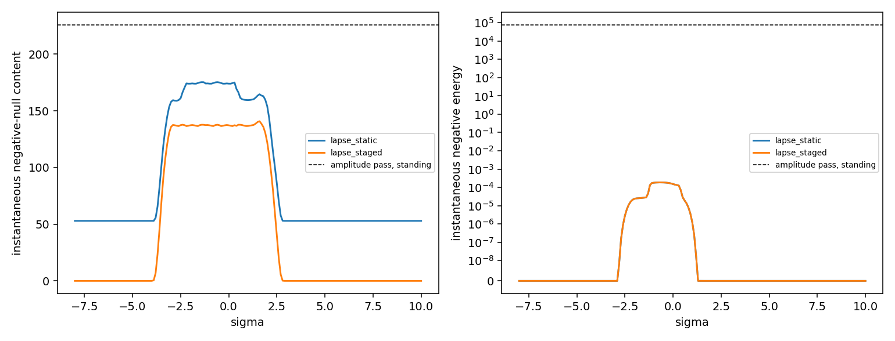

# Lapse and Staging Pass: A Rail Without Standing Mass

Date: 2026-09-24. Context: the [demand census](DEMAND_CENSUS.md) found that
the standing energy follows the stretch alone. The
[amplitude pass](AMPLITUDE_PASS.md) then left a conformal pre-sheath of
\(e^{7}\) as the remaining cost. This pass removes the stretch everywhere
and gives its job to the lapse, which carries no energy. It then stages the
lapse sheath in time around the packet. Code: `adm_harness/axial_track.py`
(`sheath_jets`) and `adm_harness/constant_radius_track.py` (live-window
timing and lapse shaping). Run: `scripts/run_lapse_staging_pass.py`, with
data in [data/lapse_staging_pass](data/lapse_staging_pass/).

## Result

- **Energy.** With the stretch equal to one everywhere, the energy density
  is exactly \(\rho=-(A\beta_r/\alpha)^2/32\pi\). The standing energy is
  zero, and during a transit the negative energy peaks at
  \(1.9\times10^{-4}\). The census design carried \(3.39\times10^{7}\) of
  each sign, standing.
- **Design.** Five elements replace the pre-sheath:
  - a flat support;
  - a convex packet lapse plateau of \(e^{4}\) around the packet;
  - live windows that open inside the service domain, with the lapse
    leading and lagging the shift;
  - a lapse sheath of only \(e^{1}\);
  - optionally, a sheath that rides with the packet.
- **Gate.** Over \(\sigma\in[-8,10]\) and \(|z|\le10\), every non-vacuum
  boundary-layer point is Type I for both designs:
  - static sheath: 3.94 million points, and 7.89 million refined;
  - staged sheath: 0.91 million points, and 1.82 million refined.

  Root-finding at every flux-carrying crossing among the widest-estimate
  samples finds no band. The exterior is exactly vacuum.
- **Staging.** With the sheath riding along with the packet, the standing
  geometry is flat space. Every demand exists only during a transit, local
  to the packet.
- **Demand.** The demand is now stress. The instantaneous negative-null
  content peaks at 141 during a transit, against \(4.47\times10^{7}\)
  standing in the census design and \(8.3\times10^{4}\) standing after the
  amplitude pass. The peak stress is 2.9.
- **Service.** The 2.1c lane still reaches \(\ell=5\) 1.66 ahead of light
  with the packet timelike. The packet's clock runs at most \(e^{4}=55\)
  times exterior time, below both earlier designs.
- **Audits and light.** The audits across the approach, carry, release and
  coast find no trapping, no reachability hits and no crossings. Light
  through the standing geometry arrives with light through flat space.



Both panels show sums over the rail at each \(\sigma\), with the static and
staged sheaths compared. The dashed lines mark the amplitude pass's
standing values, in the coordinate measure on the left. Its proper content,
\(8.3\times10^{4}\), lies off the scale. The lapse designs have a stretch
of one, so their coordinate and proper measures coincide.

## Why the energy vanishes

With \(A=1\) everywhere the spatial metric
\(dr^2+r^2d\phi^2+dz^2\) is flat, so the Hamiltonian constraint reads
\(16\pi\rho=K^2-K_{ij}K^{ij}\). Only the shift bends the slices:
\(K_{\hat z\hat z}=\beta_z/\alpha\) and
\(K_{\hat z\hat r}=\beta_r/2\alpha\). Hence

\[
\rho=-\frac{1}{32\pi}\left(\frac{A\beta_r}{\alpha}\right)^2 .
\]

The shift's radial transition is the only source of energy. It is negative
and suppressed by the square of the lapse, which reaches \(e^{4}\) and more
across it. Once the shift is zero, \(K_{ij}=0\): the stress reduces to
that of the lapse, with no flux, and every point is Type I. The same fact
makes staging safe. Wherever the shift vanishes, a lapse that moves or
switches in time stays Type I and carries no energy.

## What the lapse has to do

A lapse-only boundary layer fails where the lapse starts to rise radially
while the shift still varies along the track. There the radial flux is
about \(\beta_za_r/8\pi\alpha\). The radial pressure starts from the core's
\(-K/8\pi\), which takes both signs during a carry. It therefore crosses
zero where flux is present. The conformal pre-sheath avoided this because a
conformal rise carries no flux. The lapse design removes the crossing with
four elements.

1. **A convex packet lapse.** A convexity of 0.3 in the log-lapse along the
   track keeps the core's curvature \(K\) negative where the shift varies.
   The radial pressure then stays positive from the core outward. Near the
   packet the convexity changes the lapse by less than 2%.
2. **A packet lapse of \(e^{4}\).** The flux at the sheath's foot falls
   as \(1/\alpha\). At the leading edge of the packet bump \(|\beta_z|\)
   reaches 8.4, where the shift meets the rising lapse at
   \(r\approx4.4\)–4.9. There the lapse envelope \(\alpha>2r|\beta_z|\)
   calls for about 74. The convexity's positive pressure covers the
   difference at \(e^{4}\), and \(e^{3}\) leaves 232 Type IV nodes.
3. **Gated windows.** The windows open inside the service domain, with the
   rematch shift rising around \(\sigma=-2.4\). The lapse leads the shift
   by 1 and lags its release by 1.5. The lapse's own structure along the
   track therefore meets the shift only on the plateau.
4. **A lapse sheath of \(e^{1}\).** It gives a positive radial slope across
   the shift transition, which keeps the stress in the \((n,z)\) block
   sign-definite.

| Screened design (near the packet) | Type IV nodes | Resolved crossings (banded) |
|---|---:|---|
| **selected: convexity 0.3, packet lapse \(e^{4}\), sheath \(e^{1}\), gated** | 0 | 0 |
| **the same, sheath staged with the packet** | 0 | 0 |
| windows open from the start | 26,895 | 39 (20, \(\ge2\times10^{-3}\)) |
| flat plateau, no convexity | 7,495 | 24 (24, \(\ge2\times10^{-3}\)) |
| convexity 0.05 | 412 | 0 |
| packet lapse \(e^{3}\) | 232 | 0 |
| sheath \(e^{4}\) | 0 | 0 |
| sheath \(e^{0.5}\) | 0 | 0 |
| no sheath | 92,247 | 0 |
| flat plateau at \(e^{10}\), sheath \(e^{8}\) | 0 | 17 (11, \(1.5\times10^{-5}\)) |

The screen covers \(\sigma\in[-8,3]\) at spacing 0.2. It samples offsets
from the packet at 0.02 within one unit, which resolves the packet bump's
edges, and at 0.1 out to four units. Bands are root-found at each design's
24 widest-estimate samples. A flat plateau needs \(e^{10}\) at the packet
to suppress the core's curvature, and even then it leaves bands. The
convexity reaches a clean result at \(e^{4}\).

## Plateau shape and stress

The plateau covers the shift, which reaches about \(\pm1.5\) around the
packet. Its flat top runs to \(|z-\ell_p|\approx1.6\), and a gentle edge
reaches zero at 3.5. The service domain extends to \(|z|=7.5\), cut off by
8.5, so the plateau falls away before the cutoff.

| Plateau and service domain | Peak stress | Median of per-σ peaks |
|---|---:|---:|
| flat top 3.2, edge 0.6, cutoff at \(|z|=4\)–5 | 37.8 | 17.9 |
| flat top 1.6, edge 1.9, cutoff at \(|z|=4\)–5 | 16.6 | 2.9 |
| **flat top 1.6, edge 1.9, cutoff at \(|z|=7.5\)–8.5 (selected)** | 2.6 | 1.5 |

A wide plateau raises the edge's log-lapse to about 5.8 through the
convexity. A sharp edge then drops it quickly, and the service cutoff's
step compresses whatever reaches it. The selected shape keeps the edge
gentle and clear of the cutoff.

## Gate

| Measure | Static sheath | Staged sheath |
|---|---:|---:|
| samples (\(\sigma\in[-8,10]\), \(|z|\le10\)) | 36,381 | 36,381 |
| non-vacuum boundary-layer points, Type I (Type IV) | 3,936,637 (0) | 906,108 (0) |
| refined, half jet step and 24 nodes per panel | 7,891,975 (0) | 1,815,247 (0) |
| resolved flux-carrying crossings (banded) | 4 (0) | 4 (0) |
| lapse envelope violations | 0 | 0 |
| minimum null energy, service region / boundary layer | −0.26 / −0.48 | −0.26 / −0.47 |
| exterior | exactly vacuum | exactly vacuum |

The configuration at \(\sigma=-8\) equals the standing configuration at
\(\sigma=10\) exactly. The staged design has fewer non-vacuum points
because its sheath exists only around the packet.

## Demand

| Measure | Census design | Amplitude pass | Lapse, static sheath | Lapse, staged sheath |
|---|---:|---:|---:|---:|
| standing energy of each sign | \(3.39\times10^{7}\) | \(7.5\times10^{4}\) | 0 | 0 |
| standing negative-null content, proper | \(4.47\times10^{7}\) | \(8.3\times10^{4}\) | 53 | 0 |
| transit: peak negative energy, instantaneous | — | — | \(1.9\times10^{-4}\) | \(1.9\times10^{-4}\) |
| transit: peak negative-null content, instantaneous | — | — | 175 | 141 |
| transit: negative-null content over \(\sigma\) | — | — | 1,616 | 799 |
| peak stress | 19.9 | 9.0 | 2.5 | 2.9 |
| source speed relative to static observers, maximum | 0.32 | 0.11 | 0.23 | 0.23 |

In the static design the transit rises on a standing floor of 53, the
stress of the \(e^{1}\) sheath. In the staged design demand exists only for
\(\sigma\in[-3.9,2.8]\). Positive energy vanishes throughout both designs.
The negative-null content of the transit lies in the outer falls (456 of
799, staged) and the sheath rise (255). The rest lies in the band
\(r=1.75\)–3.75, the sheath plateau and the service region. The null condition fails along
\(r\) on 5.2% of the transit's proper volume, along \(z\) on 4.7% and along
\(\phi\) on 2.2%. No point satisfies the dominant energy condition.

## Packet clock

Trading stretch for lapse speeds the packet's clock. The table compares
the packet's proper time from \(\sigma=-8\) to its arrival at \(\ell=5\),
an exterior interval of 11.34.

| Design | Packet proper time | Peak clock rate |
|---|---:|---:|
| census design | 11,927 | 9,069 |
| amplitude pass | 351 | 140 |
| lapse designs | 294 | 55 |

The earlier designs combined a support lapse hill with the packet window.
The lapse designs carry the packet at \(e^{4}\) alone. The approach and
coast at 0.9c and 0.95c run at their flat-space rates.

## Service audits

The audits run on a ledger along the axis over \(\sigma\in[-8,15]\) and
\(|\ell|\le10\) (52,863 points). The sheath lies off the axis, so one
ledger serves both designs.

| Audit | Lapse designs |
|---|---:|
| live packet points (spacelike), maximum norm | 707 (0), −0.19 |
| radial escape (escaped/expected, stalled) | 1754/1754, 0 |
| entry reachability hits | 0 |
| centerline probes escaped (maximum norm) | 24/24 (−0.0975) |
| probes in transit when the ledger window closes (minimum null speed) | 65 (1.0) |
| traces entering both-shrinking | 0 |
| dense-bundle crossings | 0 |
| bundles below the 0.1 width criterion (minimum ratio) | 5 (0.090) |

Five minus-going bundles fall below the width criterion. They start at
\(\sigma\approx-4\) and \(\ell\approx-3.0\) to \(-3.4\), where light moves
at coordinate speed one. They then cross the trailing edge of the packet
plateau while its lapse switches on, and leave at \(\ell\approx-6.4\), again
at speed one. Rays that stay longer in the rising high-lapse region gain on
those ahead of them, so the bundle's coordinate width shrinks to 9–10%. The
rays keep their order, and the areal radius along them is constant.

## Light through the standing geometry

The static sheath's lapse of \(e^{1}\) gives an along-track light speed of
2.7 in exterior time. Reaching it costs a radial crossing of the service
region at light speed one, so the fastest route from the entry to
\(\ell=5\) arrives with light through flat space, at \(\sigma=5.0\). The
staged design's standing geometry is flat space.

## Physical scale

| Measure | Lapse, staged sheath |
|---|---:|
| peak negative energy, recorded normalization (1 unit = 204 \(\ell_P\)) | \(8\times10^{-10}\) kg |
| peak negative energy, one unit = 1 m | \(2.5\times10^{23}\) kg, 3.4 lunar masses |
| peak negative-null content, one unit = 1 m, as mass | \(1.9\times10^{29}\) kg, \(0.095\,M_\odot\) |
| peak stress, one unit = 1 m | \(3.5\times10^{44}\) Pa |
| peak stress, one unit = 1 km | \(3.5\times10^{38}\) Pa |

The negative-null content measures the NEC deficit integrated over volume,
in energy units. At one unit equal to one metre it compares with
\(3\times10^{4}\,M_\odot\) for the census design and \(56\,M_\odot\) for the
amplitude pass, both standing. The stress scales as \(1/L^2\) with the
rail's size, and the instantaneous content as \(L\). Both are set by the
packet's neighbourhood alone, so they are independent of the route's
length.

## What changes for sources

The source problem changes character. The demand is a tension without
energy on the shoulders of the lapse profile. It sits at the sheath and the
plateau's edges, with a small lapse-suppressed negative energy in the shift
transition. It exists only around the packet during a transit, and its
rest frame moves at most 0.23c relative to static observers.

This fits C1's scheduled duties. Units placed along the lane switch on as
the packet approaches and off after it passes, so each supplies a local,
timed stress. The pattern moves at up to 2.1c while each unit stays in
place. A tension with zero energy density can in principle combine a
negative-energy, negative-pressure sector (Casimir-type) with ordinary
positive mass.

## Open items

1. **Scaling test.** Evaluate the candidate source families against this
   demand: tension without energy, peak 2.9, local to the packet and per
   transit.
2. **Packet clock.** The packet ages up to 55 times exterior time during
   the carry. The envelope sets this through the shift's sharpest
   along-track gradient at the packet bump's edge. A smoother packet bump
   would lower it.
3. **Technical disclosure.** It follows the source evaluation, as agreed.

## Reproduction

```bash
OPENBLAS_NUM_THREADS=1 python toolkit/adm_harness_cli/scripts/run_lapse_staging_pass.py --workers 4
PYTHONPATH=toolkit/adm_harness_cli:toolkit/adm_harness_cli/scripts python -m pytest toolkit/adm_harness_cli/tests/test_axial_track.py toolkit/adm_harness_cli/tests/test_constant_radius_track.py
```

The run takes about 29 minutes with four workers. The screen, packet
clock and stress scan take 10 minutes, and each design's gate, refinement
and census take 6–9 more. The audits and light channel follow.
`--screen-only` stops after the screen. The manifest records the design,
the screened variants, the plateau shapes, the checks and the software
hashes.
