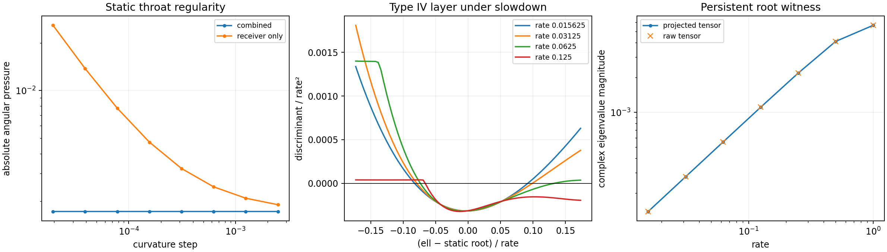

# Bounded Metric Repair and Uniform-Rate Diagnostic

Date: 8 September 2026.

**The combined candidate repairs the identified metric joins. Its demanded
tensor retains Type IV stress, and uniform slowing leaves a shrinking Type IV
layer.** These results establish a stopping point for local repair attempts.
Further source closure requires a design change that couples current to the
diagonal stresses throughout the evolution.

The candidate combines the [receiver repair](LE_RECEIVER_C2_REPAIR_ATTEMPT.md)
with a smooth origin profile and a smooth cap on the support-shell time window.
The frozen geometry and ledgers remain the reference. Implementation and tests
were committed as `bba91f2`; `322f51f` completes the diagnostic summary fields.
The candidate enters the full curvature evaluator through an explicit metric
provider, so every retained stress tensor is recomputed as \(G_{\hat a\hat b}/8\pi\).

## Combined regularity repair

Two active radial factors use \(|\ell|\) at the origin: the lapse shoulder and
the support-shell radial window. Both now use the same even polynomial inside
\(a=0.1\):

\[
r_a(\ell)=a\left(\frac{15}{8}t^2-\frac54t^4+\frac38t^6\right),
\qquad t=|\ell|/a.
\]

For \(|\ell|\geq a\), \(r_a=|\ell|\). The polynomial is smooth at zero and
matches value, slope, and curvature at both ends of the patch. The receiver
already vanishes in a neighborhood of the origin and retains its previous
C2 power-law repair.

The support-shell temporal factor has a Gaussian centered at \(s=-1.55\),
width \(0.3\), normalized at the nearest catch point \(s=-0.64\), then capped
at one. The original cap begins at a nonzero Gaussian slope. The candidate
preserves the normalized Gaussian below 0.75 and joins it to the constant cap
with a quintic matching value and two derivatives. The right-hand repair band
is approximately \(s\in[-0.64,-0.611979]\); the reflected band is centered about
\(-1.55\). The shell contribution to lapse, shift, and both spatial metric
channels is reconstructed together, including the downstream shift rematch.

At \((s,\ell)=(-0.64,-1.8)\), the original one-sided shift derivative jump is
approximately \(-4.70514\). The candidate's one-sided fits approach a common
derivative. Full-tensor angular pressure at that join converges toward
approximately 0.002869. The original kink appears in the metric derivatives;
its Einstein-tensor samples at the exact join stay finite. Consequently the
cap audit supplies a metric regularity result, with its curvature behavior
recorded separately.

At the static reset throat, \((s,\ell)=(1.878989361702128,0)\), the previous
candidate's angular pressure grows from 0.001905 at step 0.0025 to 0.025804 at
step 0.00001953125. The combined candidate stays near 0.0017263 across the same
eight levels. This removes the previously identified throat surface-pressure
singularity.

## Audit of active joins

The audit follows the primitives that enter the four metric fields for the
frozen parameter set. Numerical probes cover their joins, including the
moving compact-profile edges, in addition to the repaired locations.

| Primitive or operation | Regularity assessment |
|---|---|
| Receiver clipped square root | Four C2 Hermite joins, inherited from the receiver candidate |
| Lapse shoulder and support-shell radius at the origin | Common even polynomial with C2 joins at \(\ell=\pm0.1\) |
| Normalized shell Gaussian cap | C2 upper cap, with both time bands included in the audit |
| Catch, release, receiver memory/fade, and minimum-jerk packet schedules | Constant continuations match the first two derivatives |
| Compact smoothstep7 packet profiles | C3 matching at the compact-support boundaries |
| Tanh windows and functions of squared radius | Smooth analytic profiles |
| Annular differences | Frozen radii and widths keep the outer profile above the inner profile; compact saturation retains its matching derivatives |
| Additive carve cap | A radial envelope and derivative bound keep the sum below 0.903 |
| Shift rematch | The active trailing-edge profile and blend floor are smooth |
| Receiver side and live-packet masks | Receiver support is zero where the active negative-side metric could meet these switches |

For the additive carve check, replacing each temporal schedule by one gives
an upper envelope \(F(d)\), where \(d=|\ell-s|\). The retained grid uses
\(d\in[0,2]\) with spacing 0.001 and has maximum 0.8944265732. The tanh bump
satisfies \(|B'(d)|\leq d/(2rw)\), and the compact smoothstep7 bump satisfies
\(|B'(d)|\leq(140/64)d/(2rw)\) inside its support. Summing the weighted bounds
for the two shoulder profiles, entry, catch, and two edge profiles gives
\(|F'|\leq16.184872\). Hence the gap between grid nodes contributes at most
0.008092436, placing the continuous envelope below 0.90252 on this interval.
Beyond \(d=2\), the compact profiles vanish and the remaining shoulder term
is bounded by 0.18. Thus the cap at one stays inactive for all phases.

The one-sided metric jets and full curvature samples are retained separately.
Their finite-difference residuals resolve the repaired joins and expose the
original throat and Gaussian-cap jumps. The audit applies to the frozen active
configuration; enabling other profile modes introduces additional joins to
assess.

## Uniform-rate family and the remaining obstruction

Let \(\sigma=\kappa t\). The slowdown family uses

\[
\alpha_\kappa(t,\ell)=\alpha(\sigma,\ell),\qquad
\gamma_{ij,\kappa}(t,\ell)=\gamma_{ij}(\sigma,\ell),\qquad
\beta_\kappa(t,\ell)=\kappa\beta(\sigma,\ell).
\]

The lapse stays fixed at each matched phase, while evolution and shift slow
together. This changes the physical protocol speed and its service timing.
The static control freezes each phase and sets the shift to zero.

At a matched phase, extrinsic curvature scales as \(K_{ij,\kappa}=\kappa K_{ij,1}\).
The momentum constraint therefore gives \(j_\kappa=\kappa j_1\), while the
diagonal source channels obey

\[
X_\kappa=X_0+\kappa^2(X_1-X_0),\qquad
X\in\{\rho,p_\ell,p_\Omega\}.
\]

This relation provides a direct mechanism test. Define the static radial
enthalpy \(h_0=\rho_0+p_{\ell,0}\) and its dynamic coefficient
\(h_2=\rho_1+p_{\ell,1}-h_0\). At a spatial zero of \(h_0\),

\[
\Delta_\kappa
=(\rho_\kappa+p_{\ell,\kappa})^2-4j_\kappa^2
=\kappa^2\left(\kappa^2h_2^2-4j_1^2\right).
\]

For a nonzero current at this zero, sufficiently slow positive rates have a
negative discriminant. The threshold is \(\kappa_c=2|j_1|/|h_2|\). Thus the
static limit can be Type I while every nearby evolving member still contains
Type IV stress. Root-targeted sampling resolves this behavior as the layer
contracts below a coarse grid's spacing.

## Measured outcome

The combined candidate retains 1,365 active Type IV samples in the 4,504-point
set of phase profiles. All eight sampled phases contribute Type IV points.
All 4,504 matched static samples are Type I. The 104 previously retained
witnesses have exactly identical raw four-dimensional tensors; their CSV
channel comparison differs by at most \(9.99\times10^{-17}\) through decimal
serialization. The principal smooth witness at
\((1.878989361702128,-1.8)\) retains
\(\Delta\simeq-0.002064509\) at curvature step 0.0003125.

The static profiles bracket 28 enthalpy zeros across the eight phases. Each
bracket is solved again at three curvature resolutions, then evaluated with
the full time-dependent metric at rates
\(1,1/2,1/4,1/8,1/16,1/32,1/64\), plus its static control. At rates from
1/4 through 1/64, all 28 root locations have Type IV demand at every resolution.

One reset-phase root supplies a particularly clear obstruction:

| Curvature step | Static root \(\ell_*\) | Threshold \(\kappa_c\) |
|---:|---:|---:|
| 0.000625 | −0.981264 | 1.294626 |
| 0.0003125 | −0.981275 | 1.294764 |
| 0.00015625 | −0.981278 | 1.294799 |

At the finest root,
\[
j_1\simeq-0.0088900252,\qquad
h_2\simeq0.0137319023,\qquad
|h_0|\simeq1.23\times10^{-11}.
\]
The converged coefficients place \(\kappa_c\) comfortably above one. Applying
the continuum scaling law therefore predicts a Type IV point throughout
\(0<\kappa\leq1\) in this family. The directly computed tensors give:

| Rate | Radial discriminant at the root | Imaginary eigenvalue magnitude |
|---:|---:|---:|
| 1 | −1.275651 × 10⁻⁴ | 0.005647 |
| 1/4 | −1.902155 × 10⁻⁵ | 0.002181 |
| 1/16 | −1.232006 × 10⁻⁶ | 0.000555 |
| 1/64 | −7.716898 × 10⁻⁸ | 0.000139 |

Both the raw tensor and its symmetric spherical projection have the complex
pair. At this witness the numerical rate-scaling relation agrees to rounding
precision. Across all roots, its maximum absolute channel error decreases
from \(6.25\times10^{-7}\) to \(1.56\times10^{-7}\) to
\(3.91\times10^{-8}\) under successive step halvings, consistent with the
curvature method's second-order truncation error.

The ordinary reset profiles have spacing 0.025. At rates 1/32 and 1/64,
all 321 sampled points on each such profile are Type I. The targeted profiles
instead resolve 41 Type IV points out of 81 at both rates, with the same
counts at both curvature resolutions. Interpolated layer widths are
approximately 0.00556 and 0.00272 respectively. The decreasing width explains
the apparent disappearance on the ordinary grid.



## Validation and retained evidence

The harness passes **280 tests**, with four existing multiprocessing
deprecation warnings. The new tests cover the origin and cap primitives,
one-sided metric derivatives, complete shell-channel reconstruction and its
downstream rematch, smooth-witness preservation, throat curvature convergence,
and uniform-rate tensor scaling. A separate three-point smoke calculation
checks the shared profile-summary interface.

The completed diagnostic retains **13,891 full curvature evaluations**, plus
the intermediate evaluations used by the bracketed root solver:

- 104 reference witnesses.
- 1,212 join evaluations, including previous-candidate controls.
- 9,008 active and static phase-profile evaluations.
- 672 root/rate evaluations at three resolutions.
- 648 targeted layer evaluations.
- 2,247 ordinary rate-profile evaluations.

Every retained eigensystem passes certification, and every Type IV result is
supported by a complex pair in the raw tensor. The completed run took about
88 seconds with four workers and single-threaded BLAS. Data and the figure
occupy approximately **5.2 MB**.

The [manifest](data/le_metric_c2_repair/manifest.json) records parameters,
repair widths, rates, source and software hashes, runtime, and comparison
errors. The source-kernel hash remains
`c222300ddcbca1c6a2e8f938028485c08a56dff66f1f88c2cec006dd2b600fff`.
CSV row order matches the `row_index` array in the associated eigensystem NPZ.
The root summary is
[static_enthalpy_roots.csv](data/le_metric_c2_repair/static_enthalpy_roots.csv);
the metric audit is
[metric_join_jets.csv.gz](data/le_metric_c2_repair/metric_join_jets.csv.gz).
The runner also uses SciPy's bracketed root solver; this run used SciPy 1.16.2
and NumPy 2.3.3.

```bash
OPENBLAS_NUM_THREADS=1 OMP_NUM_THREADS=1 MKL_NUM_THREADS=1 \
MPLCONFIGDIR=/tmp/active-rail-le-matplotlib PYTHONDONTWRITEBYTECODE=1 \
python toolkit/adm_harness_cli/scripts/run_le_metric_repair.py --workers 4
```

## Scope and stopping decision

The regularity repair is useful: it supplies a candidate whose identified
joins have finite, convergent demanded stress. The root/current mismatch
survives that repair. A successful further design would have to control the
current at static enthalpy zeros, change the sign structure of that enthalpy,
or alter the coupled evolution in another structural way. Uniform slowing and
additional local smoothing leave this requirement in place.

The present work therefore stops further parameter patching. The frozen
service configuration remains a failed demanded-tensor gate case. Physical
component assembly, source realization, exterior vacuum matching, and service
validation remain separate requirements for any new design. These findings
constrain the tested geometry and slowdown family; the broader AN–T–LE
connection retains its status as an unestablished physical mechanism for this
project.
