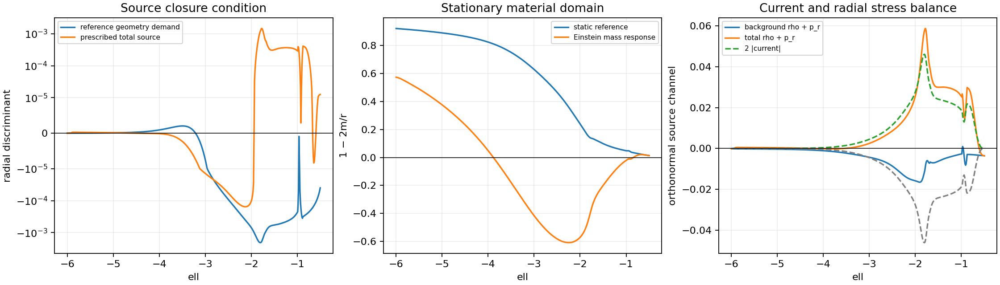

# Coupled Reset Source Attempt

Date: 8 September 2026.

**The registered source prescription fails both the complete-source Type IV
condition and the radial metric condition.** Tangential material and explicit
transfer energy remove the complex eigenvalue pair at the previous principal
witness. A Type IV layer persists farther outward, while the integrated source
energy exceeds the mass allowed by the chosen stationary material geometry
during reset. The attempt stops at these necessary conditions.

## Registered candidate and stopping sequence

This attempt tests one explicit source prescription inspired by Le's separation
of supporting matter and momentum transfer. It replaces part of the standing
radial string support with a tangential material body and two directed null
streams. The source enters radial Einstein constraints, allowing the mass,
radial metric, and lapse to respond. The inner mass is inherited from the rail;
the outer mass is free to change.

The local domain is the negative-side endpoint annulus
\(\ell\in[-6,-0.5]\). Its inner boundary excludes the areal-radius minimum,
where a single polar-areal chart would fail. The reference reset begins at the
release onset \(s=0.745\), passes through release, receiver fade, and geometry
decompression, and approaches its retained static endpoint at \(s=15\).
Matching a surviving new source to that endpoint is a subsequent condition;
the prescribed string reassignment changes even the late static source.

Three necessary conditions precede spacetime evolution:

1. The complete prescribed source must be free of Type IV stress throughout
   the handoff. Regular null transfer sectors are assessed by their explicit
   null structure; their individual Type II character is permitted.
2. The radial Einstein equations must admit a positive-lapse metric with
   timelike stationary material observers throughout the annulus.
3. On any surviving time-dependent family, the momentum and angular Einstein
   equations, source exchanges, and matching to the retained rail must agree.

A refinement-stable failure of either of the first two conditions stops this
candidate before constructing an inconsistent time evolution. The attempt has
one material-density ratio, one tangential-pressure ratio, and one handoff
profile. These are specified below and receive no outcome-driven tuning.

## Source prescription

At each phase the combined C2 rail candidate supplies a matched static control
\(T_b=(E_b,P_b,0,P_{tb})\) and the active demanded current. The former is an
explicit effective background prescription for this trial; a microscopic
realization of its signed stresses remains an independent project requirement.
The latter calibrates the requested transfer waveform in the new source's
orthonormal frame. Agreement with the new geometric demand is a subsequent
equation, rather than an assumed frame identity.

Write \(r=\sqrt{\gamma_\Omega}\). A C2 window \(W\) is one across the central
annulus and reaches zero through the first and last 3% of its areal extent.
The released radial string density is
\[
B=\frac{0.039783\,W}{r^2},
\]
using the existing body-only constant-flux fit. Removing its radial pair
changes the retained infrastructure to
\((E_b-B,P_b+B,0,P_{tb})\). This grants the candidate an explicit energy
reassignment from radial support.

For the outward current command \(J=-Wj_{\ell,\mathrm{reference}}\), define
\[
F=\sqrt{J^2+\epsilon^2W^2},\qquad
\epsilon=0.01\max_\ell|j_{\ell,\mathrm{reference}}|,
\qquad \mu_\pm=\tfrac12(F\pm J).
\]
The two nonnegative null streams carry
\((E,P_r,J,P_t)=(F,F,J,0)\) in total. The small counterstream reserve makes
the signed-current handoff smooth within each phase.

The tangential material body has density \(F\), radial pressure zero, and
\(P_t=F/4\). Its state is partitioned between endpoint and outer reservoir by
one fixed C2 weight. This partition adds no tensor and double-counts no stored
energy. The complete prescribed source is
\[
\boxed{(E,P_r,J,P_t)
=(E_b-B+2F,\;P_b+B+F,\;J,\;P_{tb}+F/4).}
\]
The ordinary material and both transfer streams individually satisfy their
algebraic dominant-energy bounds. The signed infrastructure background makes
classification of the complete sum essential.

## Radial Einstein response

The local material body is stationary in the areal frame,
\[
ds^2=-\alpha^2dt^2+\frac{dr^2}{f}+r^2d\Omega^2,
\qquad f=1-2m/r.
\]
For the matched static background,
\(m_b=\tfrac r2[1-(\partial_\ell r)^2/\gamma_{\ell\ell}]\).
The Hamiltonian equation fixes the changed mass directly:
\[
m=m_b+4\pi\int_{r_{\rm in}}^r(2F-B)\,\bar r^2\,d\bar r.
\]
Thus the radial metric responds to both released string energy and the full
energy cost of the material/transfer pair. A surviving radial domain then
determines its lapse from
\[
\partial_r\log\alpha
=\frac{m+4\pi r^3P_r}{r(r-2m)},
\]
with the outer reference lapse as its clock anchor. The momentum equation
requires
\(\partial_t m=-4\pi r^2\alpha\sqrt f\,J\).
It supplies a compatibility condition for a time history; the radial solves
alone provide no time-evolution certificate.

The criterion \(f>0\) is required by the stationary material frame of this
candidate. A violation excludes this ansatz and its matching prescription;
more general moving-matter geometries remain a different construction.

## Numerical design

The nine sampled phases cover release onset and completion, the reference
worst-DEC phase, receiver fade onset and completion, reset decompression,
completion of the geometry command, and late controls at \(s=5,15\).
Each phase uses 129, 257, and 513 uniformly spaced annular points, augmented
by six fixed locations from the preceding boundary diagnostics. The geometric
derivative steps are \(h_s=h_\ell=0.00125,0.000625,0.0003125\), respectively.
Each location receives fresh active and matched-static Einstein tensors.

The complete prescribed source receives a full mixed-tensor eigensystem
certificate at every sample. Component matrices are retained separately, and
the radial mass integral is evaluated on each refinement grid. A matched-static
lapse reconstruction supplies a quadrature control. The calculation uses four
independent worker processes with one BLAS thread per worker.

The implementation passes the 285-test harness suite, with four existing
multiprocessing deprecation warnings. Its five new tests cover component
accounting, the source enthalpy obstruction, Schwarzschild lapse convergence,
the integrated mass response, and static-background input validation. An
integration smoke run exercises reference extraction, component assembly,
radial constraints, eigensystem storage, and the diagnostic figure. Commit
`af814cd` records the implementation and registered design before the full run.

## Complete-source result

The run contains 8,253 prescribed-source samples and 16,506 freshly computed
reference Einstein tensors. The prescribed total has 2,030 Type IV samples
and 6,223 Type I samples across the three resolutions. Every matched-static
reference sample is Type I. At the finest resolution the phase results are:

| Phase \(s\) | Reference active Type IV / 519 | Prescribed total Type IV / 519 | Minimum required \(f\) |
|---:|---:|---:|---:|
| 0.745000 | 113 | 56 | 0.000005 |
| 1.285000 | 134 | 88 | 0.000229 |
| 1.571809 | 189 | 162 | 0.001893 |
| 1.645000 | 226 | 182 | −0.085547 |
| 1.878989 | 259 | 238 | −0.608659 |
| 2.005000 | 260 | 245 | −0.741494 |
| 2.600000 | 0 | 183 | 0.076420 |
| 5.000000 | 0 | 0 | 0.075472 |
| 15.000000 | 0 | 0 | 0.075472 |

At reset, the former principal witness \(\ell=-1.8\) changes from reference
demand \(\Delta\simeq-0.00206451\) to prescribed-source
\(\Delta\simeq+0.00122729\). The former static-enthalpy-root witness near
\(\ell=-0.981278\) also becomes Type I in the prescribed source. Thus the
explicit material and transfer channels supply enough radial enthalpy to
remove those local complex pairs.

The reset source instead has a converged Type IV witness farther outward at
\(\ell=-2.1328125\), where the handoff window is on its central plateau:

| Curvature step | Source radial discriminant | Imaginary eigenvalue magnitude | Required \(f\) at this point |
|---:|---:|---:|---:|
| 0.0012500 | −0.000155194259 | 0.00622884939 | −0.602547 |
| 0.0006250 | −0.000155193848 | 0.00622884115 | −0.601543 |
| 0.0003125 | −0.000155193805 | 0.00622884029 | −0.601313 |

Its finest source channels are
\[
(E,P_r,J,P_t)\simeq
(0.0104192151,\;0.0075692225,\;0.0109404947,\;0.0258825066).
\]
The full mixed tensor has the complex pair at each resolution. Moreover, the
prescription introduces a Type IV interval at \(s=2.6\), when all sampled
active reference tensors in this annulus are Type I. The local improvement at
the old witnesses therefore falls short of source closure across the reset.

## Radial metric result

At reset the minimum formal Hamiltonian response is
\(f=-0.609791,-0.608845,-0.608659\) on the three grids. At the finest minimum,
\(\ell=-2.250977\) and \(r\simeq2.957822\), the matched static source has
\(f_b\simeq0.360538\). Its available mass increment before \(f=0\) is
\[
\frac r2-m_b\simeq0.533204,
\]
whereas the prescribed source requires
\(\delta m\simeq1.433357\), including the energy released from radial
support. These values use the reference geometry's units. Hence the failure
has a substantial margin relative to numerical refinement.

The radial mass integral crosses \(f=0\) in the receiver-fade onset, reset,
and receiver-fade completion profiles at every resolution. The integral can
be recorded algebraically beyond that crossing; the chosen stationary
material metric ends there. Consequently these profiles carry no constructed
lapse or mass time derivative. This calculation establishes an obstruction
to this ansatz with its inherited inner mass. Formation of a dynamical horizon
would require a different spacetime calculation.

The matched-static lapse reconstruction at reset has maximum absolute error
\(1.8421\times10^{-4},4.6029\times10^{-5},1.1502\times10^{-5}\), showing
second-order quadrature convergence. The release-onset control, whose inner
\(f_b\) is approximately \(5\times10^{-6}\), remains harder to integrate:
its finest lapse error is 0.00543. The stopping evidence above uses the well
resolved reset profile and the mass equation, which is independent of lapse
quadrature.



## Mechanism and stopping decision

The registered source gives an especially direct expression for the remaining
radial obstruction:
\[
h_{\rm total}=E+P_r=h_b+3F,
\qquad
\Delta=(h_b+3F)^2-4J^2.
\]
Removing a radial string pair changes energy and radial pressure by opposite
amounts, so its contribution \(B\) cancels from \(h_{\rm total}\). The
material and null streams increase enthalpy, yet the signed static background
still drives the sum into \(|h_{\rm total}|<2|J|\) elsewhere. At the outward
reset witness, \(h_b\simeq-0.01484\), the total enthalpy is approximately
0.0179884, and \(2|J|\simeq0.0218810\).

At the same time, the energy change \(2F-B\) enters the Hamiltonian equation
and consumes more radial mass allowance than this geometry provides. Changing
the tangential-pressure ratio alone leaves both failing expressions unchanged.
Increasing material density would alter the enthalpy balance and add further
mass. These two requirements therefore need a common source and geometry
construction.

This is the registered stopping point for the single candidate. No additional
support layer or fitted correction is introduced. The observed improvement
followed by an outward residual fits the qualitative Le-inspired concern;
the residual sits inside the trial's source plateau, and the retained rail has
a signed exterior background. The calculation therefore establishes failure
of this explicit construction, with a broader redesign remaining open.

The completed work consists of a prescribed complete-source classification
and its necessary radial Einstein response. A full time-dependent reset,
angular Einstein matching, conserved endpoint/reservoir exchange, and retained
rail service validation remain unperformed because the candidate fails before
those stages. The endpoint and reservoir columns record their explicit
instantaneous energy partition; a conserved transfer history would require
the surviving spacetime and its exchange equations.

## Retained evidence and reproduction

The full run took 76.6 seconds with four workers. Data, numerical verification,
and the figure occupy approximately 8.8 MB. The
[manifest](data/le_coupled_reset_source/manifest.json) records the fixed source
parameters, phases, software and reference hashes, runtime, and rejection
before evolution. The frozen source kernel remains
`c222300ddcbca1c6a2e8f938028485c08a56dff66f1f88c2cec006dd2b600fff`.

All 24,759 retained reference and source eigensystems pass certification. An
independent eigenvalue calculation reproduces all 2,030 source complex pairs.
The five stored component matrices sum exactly to the stored total matrices;
the CSV enthalpy identity differs by at most \(4.02\times10^{-16}\) through
serialization. Material and null-stream densities are nonnegative. The
[artifact verification](data/le_coupled_reset_source/artifact_verification.json)
also records row alignment and eigen-equation residuals.

The principal files are
[constraint_summary.csv](data/le_coupled_reset_source/constraint_summary.csv),
[prescribed_source.csv.gz](data/le_coupled_reset_source/prescribed_source.csv.gz),
and [reference_tensors.csv.gz](data/le_coupled_reset_source/reference_tensors.csv.gz).
Each source and reference ledger has a corresponding eigensystem NPZ with
matching `row_index`. The separate
[component matrices](data/le_coupled_reset_source/component_tensors.npz)
retain infrastructure, endpoint, reservoir, outgoing stream, and incoming
stream in that order. Stored coordinate energies use \(\int4\pi r^2 E\,dr\),
the mass-equation measure; proper-volume energy has a different measure.

```bash
PYTHONPATH=toolkit/adm_harness_cli \
OPENBLAS_NUM_THREADS=1 OMP_NUM_THREADS=1 MKL_NUM_THREADS=1 \
MPLCONFIGDIR=/tmp/le-reset-matplotlib \
python toolkit/adm_harness_cli/scripts/run_le_coupled_reset_attempt.py --workers 4
```

## Source references

- [Stage 2 radial string crosswalk](STAGE2_RADIAL_STRING_CLOUD_ENDPOINT_CROSSWALK.md)
  supplies the body-only string flux used in the energy reassignment.
- [Bounded metric repair](LE_BOUNDED_METRIC_REPAIR.md) supplies the combined
  C2 background and the fixed radial witness locations.
- Le, [On the boundary cost of source-consistent warp shells](https://arxiv.org/html/2605.25417v2),
  motivates checking the complete source alongside its geometric realization.
- Le, [Steering a warp drive without exotic matter](https://arxiv.org/html/2606.22531),
  supplies the constructive separation into tangential support and explicit
  transfer channels. The annular source prescription above is specific to this
  rail trial.
