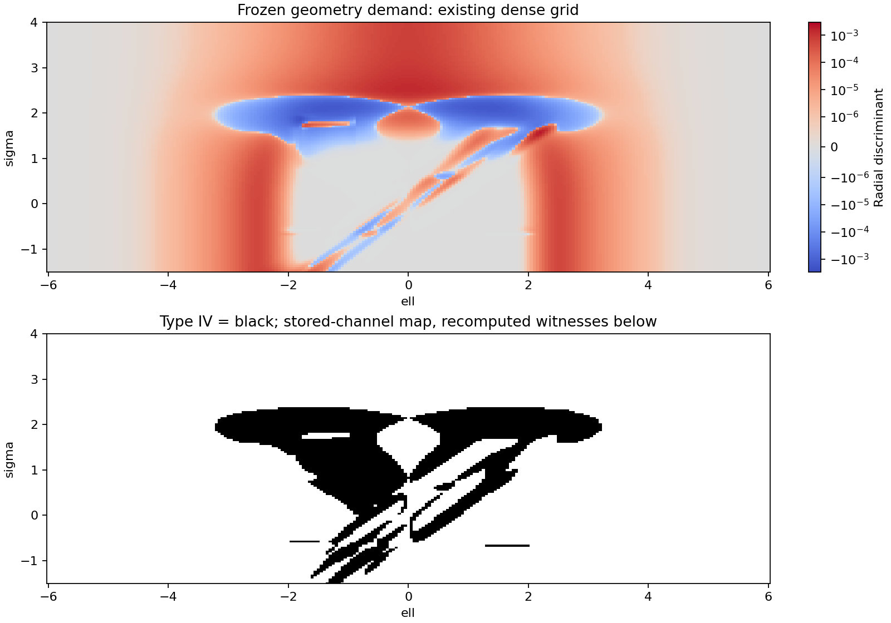
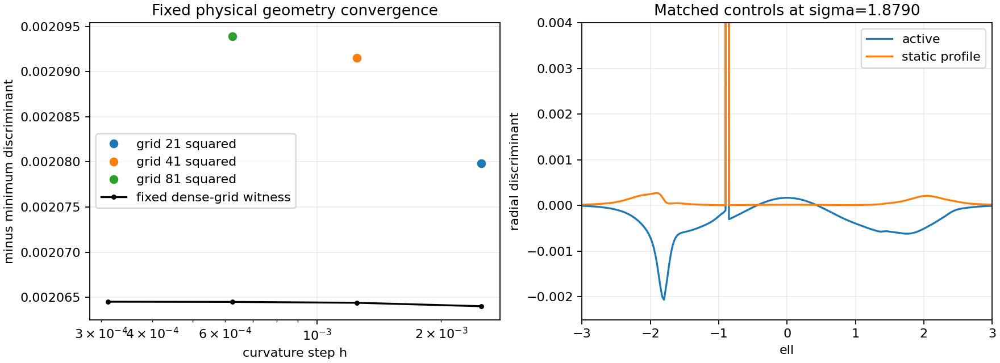
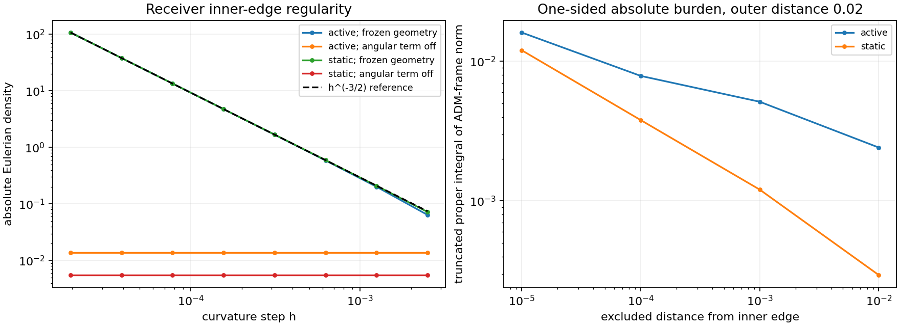
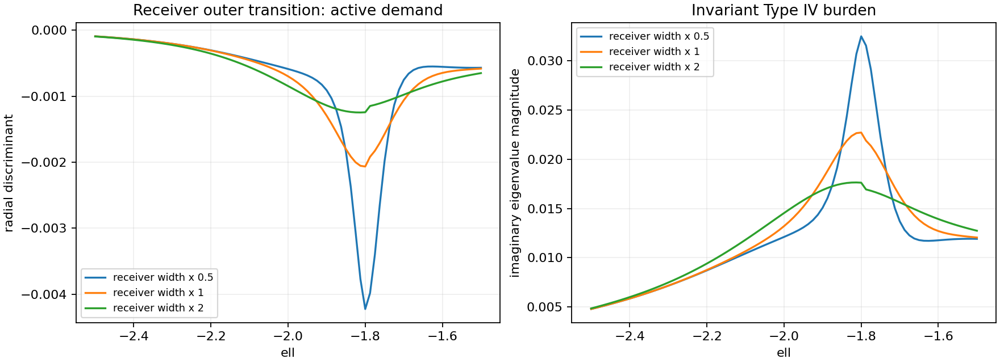

# LE Boundary Diagnostic of the Frozen Geometry Demand

Date: 8 September 2026.

**Verdict: INTERNAL CLOSURE FAILURE for the geometry-demand gate.** The frozen
beta075 geometry demands a refinement-stable Type IV layer around the receiver's
outer transition. Its receiver angular profile also produces singular curvature
at the inner edge. These are separate findings: the Type IV witness converges at
a smooth point, while the inner-edge stress grows with the power predicted by
the metric's square-root cusp. Both require attention before the proposed
ordinary material rest-frame constitutive reconstruction.

The evaluated tensor is the geometry's demand, \(T_{\mu\nu}=G_{\mu\nu}/8\pi\),
in the source kernel's geometric units. The physical-sector assembly and
layer-by-layer migration question remain open under the
[pre-flight findings](LE_BOUNDARY_GATE_PREFLIGHT.md). In particular, an independent
support stress tensor is still required for that separate construction.

## Frozen inputs and numerical method

The nominal case is `V5_smooth_split_horizon_escape_beta075_p003_mid_rematch_w6_t1p5`.
The baseline and dense manifests specify identical geometry parameters,
including `w_th=0.569`, receiver angular gain `0.03`, negative-side receiver
placement, and receiver outer-power exponent `0.5`. The existing source kernel
retains SHA-256
`c222300ddcbca1c6a2e8f938028485c08a56dff66f1f88c2cec006dd2b600fff`.
Both ledger hashes were verified before evaluation. The
[run manifest](data/le_geometry_boundary/manifest.json) retains the complete
parameters, source manifests, software hashes, and sample definitions.

The pre-flight was committed as `8f13bfe`; the classifier repair was committed
as `118c064` before this diagnostic ran. The
[repair report](LE_CLASSIFIER_REPAIR.md) describes the corrected negative-enthalpy
rest-frame assignment and causal eigensystem checks.

The diagnostic certifies the complete four-dimensional mixed tensor in the
orthonormal ADM frame. Stored maps reconstruct its spherical block from the
ledger's four stress channels. Fresh evaluations retain the raw curvature
tensor, its raw mixed spectrum, the symmetric spherical projection, and the
projection residual. This distinguishes source-discretization error from
algebraic classification error. The exact spherical Einstein tensor supplies
the symmetry being imposed. At the decisive witness, the raw spectrum and the
projected spectrum independently contain the same complex pair.

The new evaluator caches repeated metric stencil evaluations while preserving
the established curvature equations. Ten checks on the frozen candidate,
including both exact receiver edges, agree with the established kernel to a
maximum channel difference of `1.74e-18`. The comparison uses the original
one-sided current projection; the fresh classification uses the symmetric
current and records their difference.

The run comprises 113,726 stored grid points and 22,069 fresh diagnostic
evaluations, plus ten kernel cross-checks. Fresh work includes eight phase
profiles, matched static controls, a local two-dimensional refinement patch,
two physical-width families, receiver regularity checks, and extended exterior
samples. Four worker processes execute independent samples with BLAS threads
limited to one. The two diagnostic commands took approximately 186 seconds
combined and retained approximately 28 MB of data and figures.

## Type IV layer and interfaces

| Stored surface | Grid | Type I points | Type IV points | Other/unresolved | Uncertified eigensystems |
|---|---:|---:|---:|---:|---:|
| Baseline | 189 × 121 | 21,920 | 949 | 0 | 0 |
| Dense | 377 × 241 | 87,014 | 3,843 | 0 | 0 |

These are sample counts. The dense grid has Type IV points in every operating
phase and in each interior region label. Its `far_exterior` points are Type I.
The maps cover \(\sigma\in[-1.5,15]\), \(\ell\in[-6,6]\); their shared
curvature step is `0.0025`. Fresh differentiation refinement supplies the
separate convergence evidence below.



Interface masks use the actual standing-support, shell, receiver, and beta-rematch
windows. Each time slice is normalized to its own peak. A mask includes the
0.1%–99.9% transition or a radial gradient exceeding 5% of that slice's maximum.
Slices with negligible window amplitude are excluded. The retained
[landmarks](data/le_geometry_boundary/geometry_interface_landmarks.csv.gz)
give all resolved 90%, 50%, and 10% crossings, including rising and falling
branches. These are overlapping geometry-window masks; physical component
boundaries require the separate sector assembly.

| Geometry-window transition | Dense Type IV points | Minimum radial discriminant |
|---|---:|---:|
| Standing support, `W_raw` | 3,764 | −0.00206366 |
| Support shell | 60 | −0.000000259148 |
| Receiver radial cap | 907 | −0.00206366 |
| Receiver angular flange | 572 | −0.00206366 |
| Packet beta rematch | 1,862 | −0.00153806 |

The [interface table](data/le_geometry_boundary/geometry_interface_summary.csv)
also records positions, Type-I NEC/WEC/DEC minima, peak angular pressure,
current, and sampled window gradients. The exact receiver-edge study below
establishes the additional regularity limitation on finite-grid gradient maxima.

At the fixed dense-grid witness \((\sigma,\ell)=(1.878989361702128,-1.8)\),
halving both temporal and radial curvature steps gives:

| Curvature step | Radial discriminant | Imaginary eigenvalue magnitude | Relative spherical-projection residual |
|---:|---:|---:|---:|
| 0.0025 | −0.002064008826 | 0.02271568195 | 2.44 × 10⁻⁵ |
| 0.00125 | −0.002064389909 | 0.02271777888 | 6.10 × 10⁻⁶ |
| 0.000625 | −0.002064485201 | 0.02271830320 | 1.52 × 10⁻⁶ |
| 0.0003125 | −0.002064509029 | 0.02271843430 | 3.81 × 10⁻⁷ |

The finest mixed spectrum is approximately
\[
-0.008964364\pm0.022718434\,i,\qquad
-0.077719556,\quad -0.077719556.
\]
Its real eigenvectors are the two spacelike angular directions. The source
therefore has Type IV and lacks a timelike material rest eigenvector. The
discriminant changes by about 0.00115% between the two finest steps, while
the projection residual decreases by a factor of four per step halving.

The local patch spans ±0.2 around the witness in both coordinates. With
21², 41², and 81² samples and successively halved differentiation steps, its
minimum discriminant is −0.002079864, −0.002091511, and −0.002093920. The finest
sampled minimum is at \((1.86398936,-1.805)\). Its last change is about 0.115%,
and 5,823 of the 6,561 finest patch points are Type IV. This establishes an
extended layer as well as a converged fixed-point failure.



## Matched static controls

For each requested time slice, the control freezes the lapse and spatial metric
throughout the curvature stencil and sets the shift to zero. It is a family of
static spatial-profile controls with zero temporal metric derivatives. Merely
setting the reported current to zero would yield a different calculation.

All 4,504 static phase-profile samples are Type I. Fresh active witnesses from
all seven operating phases retain Type IV at the finest witness step:

| Phase | Witness (σ, ℓ) | Active minimum-witness discriminant | Static type at the same point |
|---|---|---:|---|
| Pre-entry | (−1.500000, −1.30) | −1.58468 × 10⁻⁵ | I |
| Entry/pre-catch | (−0.666223, −0.85) | −1.14700 × 10⁻⁵ | I |
| Catch/rematch | (−0.578457, −0.75) | −3.63625 × 10⁻⁵ | I |
| Held carry | (0.650266, 0.65) | −1.64125 × 10⁻⁵ | I |
| Release shift fade | (1.264628, 1.65) | −3.83798 × 10⁻⁵ | I |
| Post-release | (1.615691, −2.05) | −1.81641 × 10⁻⁴ | I |
| Reset/decompression | (1.878989, −1.80) | −2.06451 × 10⁻³ | I |

At the reset witness, the static NEC and DEC margins are both approximately
−0.0112003. Thus the current-dependent Type IV layer sits alongside a separate
static energy-condition deficit. Rest-frame EC columns are unavailable for
Type IV; the data represent them with NaN.

## Receiver regularity and absolute burden

The actual receiver radial shape contains
\[
u(\ell)=\operatorname{clip}\!\left(
\frac{|\ell|-0.875}{0.91875},0,1\right),\qquad u^{1/2}.
\]
It multiplies a smooth box whose value is nonzero at both clipping points.
The negative-side angular metric contains the exponential of `0.03` times this
receiver window. Consequently, at the negative inner edge, with
\(d=|\ell|-0.875\downarrow0^+\), the receiver contribution obeys
\[
\delta\gamma_\Omega\sim 0.016741\sqrt d
\quad\text{at}\quad \sigma=1.878989361702128.
\]
The measured coefficient remains stable down to `d=1e-8`. The metric is
continuous with a square-root cusp there. Its second radial derivative grows
as \(d^{-3/2}\), which explains the curvature scaling independently of the
classifier.

| Step at ℓ = −0.875 | Active Eulerian density | Static Eulerian density |
|---:|---:|---:|
| 0.0025 | −0.063980 | −0.072115 |
| 0.000625 | −0.587327 | −0.595464 |
| 0.00015625 | −4.753817 | −4.761954 |
| 0.0000390625 | −38.045007 | −38.053143 |
| 0.00001953125 | −107.594096 | −107.602233 |

At the finest steps, a halving multiplies the dominant stress by approximately
\(2^{3/2}\). Angular pressure grows alongside it. A diagnostic control setting
only the receiver angular gain to zero produces stable finite values at both
negative receiver edges; the positive-side checks are also stable. The
nominal geometry and frozen source artifacts retain their original parameters.

The negative outer clipping point, \(\ell=-1.79375\), has a first-derivative
jump. Its sampled density grows approximately as `h^-1`, identifying a surface
contribution that requires explicit matching treatment. The Type IV witness
at −1.8 lies outside that exact clipping point and remains stable under
refinement.

For the inner edge, the one-sided absolute burden was integrated over
\(d\in[\varepsilon,0.02]\), using
\(\|T_{\hat a\hat b}\|_F\sqrt{\gamma_{\ell\ell}}\,dd\).
This norm is defined in the ADM frame. At radial step `d/32`, the static
integral grows from 0.001205 to 0.003796 to 0.012015 as the excluded distance
decreases from `1e-3` to `1e-4` to `1e-5`. Halving the radial differentiation
step from `d/16` changes the final integral by about 0.36%. The observed growth
and the metric's analytic cusp establish an unbounded ordinary absolute
stress integral toward this edge. Finite-grid whole-profile norms therefore
provide sampled burdens, with their values depending on edge resolution.



## Physical-width sensitivity

Width changes were evaluated after the smooth Type IV witness passed its
fixed-geometry convergence check. They are separate diagnostic geometries.
The cusp persists in the nominal profile and prevents assigning a converged
whole-profile absolute stress budget.

At the reset slice, standing-taper widths `w_th × {0.5, 1, 2}` give finest
sampled minimum discriminants of −0.001403, −0.002064, and −0.002272. All three
retain Type IV. Their proper integrals of the imaginary eigenvalue magnitude
over `ell ∈ [-4,4]` are approximately 0.06619, 0.07617, and 0.09026.

The receiver's own default edge width is `0.11484375`. A separate sweep changes
that parameter while retaining `w_th` and the remaining nominal parameters:

| Receiver width multiplier | Finest minimum discriminant | Proper integral of imaginary eigenvalue magnitude, ℓ ∈ [−2.5, −1.5] |
|---:|---:|---:|
| 0.5 | −0.00422398 | 0.0181950 |
| 1 | −0.00206449 | 0.0182338 |
| 2 | −0.00124545 | 0.0179151 |

Each receiver variant was sampled at three spatial/differentiation resolutions
with active and static controls. Narrowing this width raises the Type IV peak;
the integrated imaginary-eigenvalue burden changes much less. These finite
widths establish sensitivity and persistence. A zero-width limit would require
its own analysis.



## Outermost source and exterior

At late time the geometry approaches the ultrastatic throat with areal-radius
squared \(\ell^2+a^2\), where \(a=1.75\). Its demanded stress is
\[
\rho=p_\ell=-\frac{a^2}{8\pi(\ell^2+a^2)^2},\qquad
p_\Omega=+\frac{a^2}{8\pi(\ell^2+a^2)^2},\qquad j_\ell=0.
\]
Fresh samples at `sigma=15`, on both ends at `|ell|=6,12,24,48,96`, confirm
this Type-I, negative-energy tail. The maximum channel error relative to the
analytic amplitude is about `1e-6` at 6 and 0.32% at 96 across all tested
steps; the latter reflects cancellation/roundoff sensitivity in the very small
far-tail curvature. Both angular steps `1e-4` and `5e-5` were checked.

At `|ell|=6`, the density is approximately `−7.98575e-5`. The source decays as
`|ell|^-4` through an infinite tail, so the ledger's exterior label corresponds
to a sourced asymptotic throat. Its two-ended volume integral of the ADM-frame
tensor norm beyond \(L\) is
\[
2a\arctan(a/L)\sim 2a^2/L.
\]
The tail has a finite integrated burden and remains energy-condition violating.
A finite source-to-vacuum termination is a separate exterior-matching design
requirement. This run establishes internal failure before such a matching test
could deliver an overall pass.

## Retained evidence and reproduction

All tables, compressed maps, eigensystems, raw fresh tensors, and figures are in
[data/le_geometry_boundary](data/le_geometry_boundary). Each eigensystem NPZ
uses `row_index` to identify its corresponding CSV row. Complex eigenvector
causal norms and unavailable rest-frame quantities use NaN. The
[receiver manifest](data/le_geometry_boundary/receiver_manifest.json) identifies
the supplemental regularity/width work and its software provenance.

```bash
OPENBLAS_NUM_THREADS=1 OMP_NUM_THREADS=1 MKL_NUM_THREADS=1 \
MPLCONFIGDIR=/tmp/active-rail-le-matplotlib PYTHONDONTWRITEBYTECODE=1 \
python toolkit/adm_harness_cli/scripts/run_le_geometry_boundary.py --workers 4

OPENBLAS_NUM_THREADS=1 OMP_NUM_THREADS=1 MKL_NUM_THREADS=1 \
MPLCONFIGDIR=/tmp/active-rail-le-matplotlib PYTHONDONTWRITEBYTECODE=1 \
python toolkit/adm_harness_cli/scripts/run_le_receiver_edge_diagnostic.py --workers 4
```

The full harness suite passes **226 tests**, with four existing multiprocessing
deprecation warnings. The failure reported here belongs to the frozen
geometry's demanded source. The classifier and curvature-reproduction checks
pass. The next geometry work is receiver regularization together with a
mechanism addressing the stable Type IV demand, followed by a rerun of this
gate and completion of the independent physical-source assembly.
