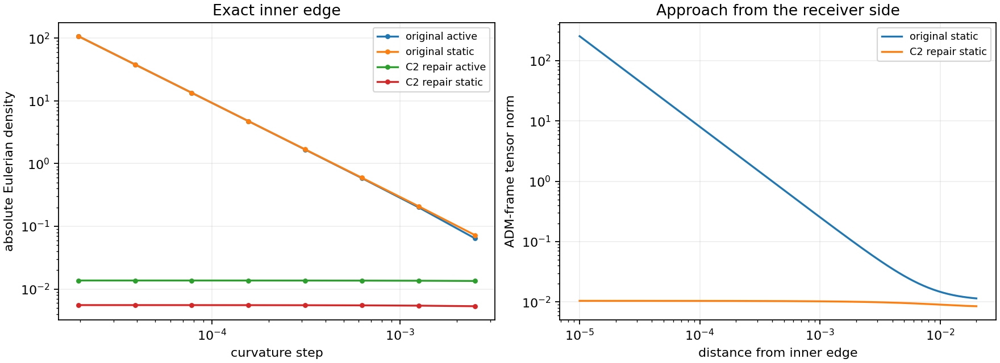
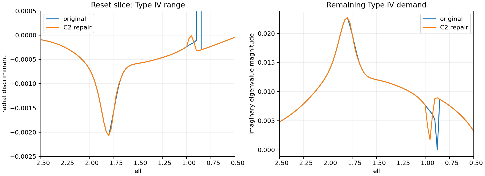

# Local C2 Receiver Repair Attempt

Date: 8 September 2026.

The [combined metric repair and uniform-rate diagnostic](LE_BOUNDED_METRIC_REPAIR.md)
extends this candidate with the throat and shell-window repairs and records
the stopping assessment for further local tuning.

**The receiver regularity repair succeeds locally. The geometry-demand gate
continues to fail through persistent Type IV stress.** The repaired candidate
has finite curvature at both former receiver clipping points and a finite
one-sided absolute stress integral at the inner edge. The established Type IV
witnesses remain exactly the same. A separate lapse kink at the throat also
requires regularization or an explicit surface-stress model.

This is a tested candidate geometry for comparison with the
[frozen boundary diagnostic](LE_GEOMETRY_BOUNDARY_DIAGNOSTIC.md). The frozen
`source_ledger.py`, its parameters, and the original ledgers retain their
provenance. The candidate is supplied explicitly to the curvature evaluator;
the existing source path remains the reference. Implementation and tests were
committed as `a6c96dc` before the comparison run.

## Repair definition

The frozen receiver contains a clipped power \(z^{1/2}\), where
\[
z=\frac{|\ell|-0.875}{0.91875}.
\]
The inner clipping point has a square-root cusp, while the outer clipping point
has a slope jump. The candidate replaces each end with a quintic Hermite
polynomial matching value, first derivative, and second derivative. The
remaining power-law segment and the constant exterior segments retain their
original values.

The nominal blending fraction is `b=0.125`, corresponding to a physical
coordinate width of `0.11484375` at each end. The modified negative-side
angular-metric bands are:

- Inner join: `ell ∈ [-0.98984375, -0.875]`.
- Outer join: `ell ∈ [-1.79375, -1.67890625]`.

The square-root law is retained between the joins. Its shell window, memory
schedule, angular gain, and packet exclusion are retained. The candidate
reconstructs the receiver angular metric factor from a reference evaluation
with that angular factor removed, then supplies the new metric throughout the
curvature stencil. Thus the Einstein tensor is recomputed from the candidate
geometry.

The implementation in
[receiver_regularity.py](../toolkit/adm_harness_cli/adm_harness/receiver_regularity.py)
supports the frozen angular-only receiver. Additional receiver lapse, radial,
or shift gains require a separate reconstruction and receive an explicit
error from this candidate evaluator. Its returned fields are limited to the
metric and selected windows used in the diagnostic. Service and physical-source
products require their own reevaluation before adopting the candidate.

Across the phase-profile samples, lapse, shift, and radial metric are unchanged.
The largest sampled relative angular-metric change is approximately 0.263%.

## Receiver-edge convergence

At the reset slice, `sigma=1.878989361702128`, the repaired active source gives:

| Edge | Curvature step | Eulerian density | Angular pressure |
|---|---:|---:|---:|
| Inner, −0.875 | 0.0025 | 0.0134573 | −0.0690378 |
| Inner, −0.875 | 0.000625 | 0.0136282 | −0.0691184 |
| Inner, −0.875 | 0.00015625 | 0.0136714 | −0.0691397 |
| Inner, −0.875 | 0.00001953125 | 0.0136841 | −0.0691459 |
| Outer, −1.79375 | 0.0025 | 0.00611490 | −0.0788626 |
| Outer, −1.79375 | 0.000625 | 0.00606431 | −0.0788381 |
| Outer, −1.79375 | 0.00015625 | 0.00605131 | −0.0788316 |
| Outer, −1.79375 | 0.00001953125 | 0.00604749 | −0.0788296 |

The corresponding original inner-edge density reached `−107.594` at the
finest step. The repaired density approaches approximately `+0.0136859`,
the receiver-free limit at that point. The static control also converges,
approaching approximately `+0.00555` at the inner edge. All four polynomial
joins were checked at two time slices with eight differentiation levels in
both active and static cases. C2 matching permits first-order curvature
convergence at the exact joins, where third derivatives can jump.



The absolute stress burden uses the same ADM-frame Frobenius norm and proper
radial measure as the original diagnostic. Over the receiver-side interval
`distance ∈ [epsilon, 0.02]`, with radial differentiation step `distance/32`:

| Excluded distance epsilon | Original static integral | Repaired static integral | Repaired active integral |
|---:|---:|---:|---:|
| 0.001 | 0.001205 | 0.000408 | 0.004392 |
| 0.0001 | 0.003796 | 0.000430 | 0.004604 |
| 0.00001 | 0.012015 | 0.000432 | 0.004625 |

The repaired integral approaches a finite limit as the excluded interval closes.
The independent `distance/16` calculations agree to the displayed precision.

## Remaining Type IV demand

All 104 retained witness evaluations have exactly identical raw four-dimensional
tensors in the original and repaired candidates. The reference recalculation
matches the previously saved stress channels to `9.99e-17` absolute error.
These witnesses lie outside the repair bands, including their curvature
stencils, so this equality is a direct locality check.

At `(sigma,ell)=(1.878989361702128,-1.8)`, the finest retained witness still has
\[
\Delta_{\rm rad}\simeq-0.002064509,
\qquad |\operatorname{Im}\lambda|\simeq0.022718434.
\]
The refined local patch retains the same sampled minimum, approximately
`−0.002093920` at `(1.86398936,-1.805)`. Its finest grid contains 5,799 Type IV
points out of 6,561; the original contained 5,823. Thus the local shape of the
layer changes slightly while its established peak persists.

The phase profiles contain 1,365 active Type IV samples, compared with 1,361
originally. All 4,504 static profile samples are Type I. At the repaired inner
edge the active tensor is now finite and Type IV; the original singular term
had dominated its classification. Finite stress alone therefore supplies a
regularity improvement while leaving the material rest-frame obstruction.



Blending fractions `0.0625`, `0.125`, and `0.25` were compared at three
resolutions. All retain the reset-profile minimum discriminant near
`−0.002064485` at the finest profile step. The corresponding proper integrals
of imaginary eigenvalue magnitude over `ell ∈ [-4,4]` are approximately
0.076391, 0.076433, and 0.076576. The active source-frame norm integrals are
approximately 0.854474, 0.854177, and 0.853865. These are sampled whole-profile
burdens; the separate throat contribution below requires its own treatment.

Exterior samples reproduce the original decaying throat tail, with a maximum
channel difference of `8.48e-22`. The local receiver repair leaves that exterior
architecture in place.

## Separate throat regularity check

The lapse contains a shoulder
\[
\exp\!\left[-\left(\frac{|\ell|-1.05}{0.35}\right)^2\right],
\]
which enters the lapse cushion through `eta_N`. Its first radial derivative
jumps at `ell=0`. The receiver repair has zero angular contribution in a
neighborhood of this location and leaves the lapse unchanged.

At the reset slice, static angular pressure at `ell=0` grows from 0.001905 at
step `0.0025` to 0.025804 at step `0.00001953125`. Its growing contribution
scales approximately as `h^-1`. Setting only `eta_N=0` in a diagnostic control
gives stable angular pressure near 0.001709. A held-carry slice supplies an
independent check of the same effect.

This identifies an additional lapse-junction issue in the original geometry.
A first-derivative jump requires explicit surface-stress treatment or smoothing
for a classical thick-source description. The receiver repair addresses its
own two joins; overall geometric regularity remains a separate requirement.

## Validation and retained work

The full harness suite passes **259 tests**, with four existing multiprocessing
deprecation warnings. New tests cover bounded monotone weights, preservation
of the intermediate profile, value/slope/curvature matching at every join,
invalid parameters, metric locality, exact witness preservation, convergence
to the receiver-free inner-edge curvature, and explicit rejection of unsupported
receiver channels.

The main comparison contains **21,443 fresh evaluations** and took approximately
169 seconds with four workers. The throat control adds 64 evaluations. Saved
data and figures occupy approximately **8.6 MB**. Every classified sample passes
its full eigensystem check, and every fresh Type IV classification is supported
by a complex pair in the raw tensor spectrum.

The [candidate manifest](data/le_receiver_c2_repair/manifest.json) records the
unchanged source parameters, explicit repair widths, software hashes, original
manifest hash, and comparison errors. The
[throat manifest](data/le_receiver_c2_repair/throat_manifest.json) records the
separate lapse-control check. CSV rows correspond to the `row_index` arrays in
their associated eigensystem NPZ files.

```bash
OPENBLAS_NUM_THREADS=1 OMP_NUM_THREADS=1 MKL_NUM_THREADS=1 \
MPLCONFIGDIR=/tmp/active-rail-le-matplotlib PYTHONDONTWRITEBYTECODE=1 \
python toolkit/adm_harness_cli/scripts/run_le_receiver_repair.py --workers 4

OPENBLAS_NUM_THREADS=1 OMP_NUM_THREADS=1 MKL_NUM_THREADS=1 \
PYTHONDONTWRITEBYTECODE=1 \
python toolkit/adm_harness_cli/scripts/run_le_throat_regularity_check.py
```

The attempt establishes a useful local repair and isolates a persistent
physical demand. A clean global smoothness comparison next requires treatment
of the throat lapse kink. Addressing Type IV then requires a change that reaches
the current/enthalpy balance in the affected region, together with renewed
geometry, service, and source checks. The present candidate remains a failed
overall boundary-gate case.
