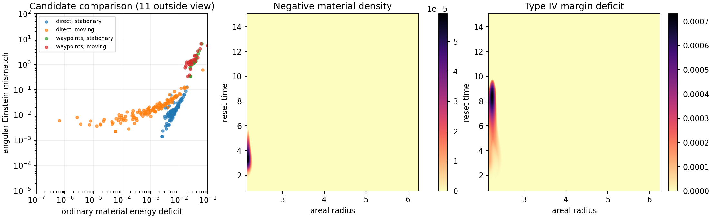

# Bounded Reset Construction Search

Date: 8 September 2026.

## Result

The bounded search found no locally admissible reset. A direct path between
the static endpoint geometries performed substantially better than the path
through intermediate rest waypoints. Allowing bounded infrastructure motion
also reduced the ordinary material energy deficit. All three finalists retain
negative ordinary density, Type IV stress, and a finite angular Einstein
mismatch on refinement. Their areal metrics remain positive.

An initial boundary expansion identifies a further obstruction to exact
closure throughout the registered source families. The prescribed geometry
demands an angular stress correction at an earlier order in time than the
initially empty material and transfer sectors can supply. This result concerns
the chosen static startup, outer boundary contract, and source laws. The
active rail's time-dependent worldtubes and a responsive material sector with
energy already present at startup define a broader construction problem.

## Registered question and acceptance conditions

This search seeks a local spherical reset whose mass history, transfer current,
material stresses, and Einstein tensor agree. The preceding
[single source trial](LE_COUPLED_RESET_SOURCE_ATTEMPT.md) fixed the ordinary
material density equal to transfer density. Its source retained Type IV stress
and required more mass than its stationary geometry allowed. Here, a changing
reservoir state determines a mass redistribution; the field equations then
determine the current and the material energy remaining after transfer costs.

The construction is a restricted local model informed by the beta075 V=5
reset. It chooses initial and final profiles from matched-static controls
of the repaired geometry. Each candidate retains its selected reference
path's inner and outer mass histories and the resulting net mass transfer.
Static endpoint data are an additional modeling choice: the original rail
is active at the initial reference phase. Full matching to its time-dependent
worldtubes and the V=5 service checks are subsequent acceptance conditions.
Consequently failure of this family excludes that specific local construction.
Its microscopic signed-source realization remains the existing constitutive
question. The frozen rail metric and source kernel supply the reference.

Acceptance requires nonnegative ordinary material and null-stream densities,
an admissible complete stress tensor, a positive stationary areal metric,
agreement with all four independent Einstein channels, conserved total
exchange, and the stated endpoint and matching conditions. Regular null
transfer is permitted. Negative ordinary density, a stable Type IV witness,
or a finite angular Einstein mismatch rejects a candidate. Numerical lapse
range exhaustion and optimizer termination are recorded separately from a
physical incompatibility.

## Mass history and source equations

The common domain is \(r\in[2.15,6.25]\), contained in all nine retained
negative-side static annuli. The input comprises the finest static controls
from the preceding trial. Each radial profile is interpolated in \(\log f_b\)
and \(\log\alpha_b\) onto 1,025 fixed radii. Cubic radial splines and bounded
C2 quintic blends between adjacent static phases define the reference family.
Each static shape is a rest waypoint. The interpolation stays between adjacent
log-metric values, preserving the nearly settled late controls. Its radial and
phase derivatives are evaluated analytically. Every numerical refinement
samples this same interpolant.

Let \(u\in[0,1]\), \(q=10u^3-15u^4+6u^5\), and
\[
\sigma(u)=0.745+14.255\frac{e^{4q}-1}{e^4-1},
\qquad t(u)=0.745+T[u+z u(1-u)].
\]
The exponential phase map assigns additional clock time to the active part
of the reference reset. The static endpoint at phase 15 is retained, and
phase derivatives through second order vanish at both ends. The duration
and skew vary within the bounds below. The candidate continues statically
after its endpoint through \(t=15\).

A second geometric path blends directly between the initial and final static
shapes with weight \(q(u)\), omitting the intermediate rest waypoints. It
uses the same clock law, storage controls, source laws, and endpoint mass
contract. This comparison tests whether the intermediate reference geometry
itself supplies an avoidable obstruction. Both paths are fixed before the
exploration batch.

Two compact nonnegative radial distributions identify donor and reservoir.
Their cumulative distributions \(C_d,C_R\) each range from zero to one on
the annulus. A C3 polynomial provides each compact cumulative profile. With
\(K(u)=\sin^4(\pi u)\), the mass history is
\[
m(t,r)=m_b(\sigma(t),r)+A K(u)[C_R(r)-C_d(r)].
\]
Thus \(AK\) is the temporarily redistributed coordinate mass: its donor
and reservoir contributions integrate to \(-AK\) and \(+AK\). It changes
the geometry and the current. Both endpoint profiles and both boundary mass
histories remain fixed. Truncation of a donor profile at the inner domain is
normalized explicitly; derivative matching is part of the subsequent full
rail matching condition.

The areal metric is
\(ds^2=-\alpha^2dt^2+dr^2/f+r^2d\Omega^2\), with \(f=1-2m/r\).
The energy and current equations give
\[
E=\frac{m_r}{4\pi r^2},\qquad
J=-\frac{m_t}{4\pi r^2\alpha\sqrt f}.
\]
In particular, the luminosity \(4\pi r^2\alpha\sqrt f J=-m_t\)
has a fixed integrated transfer. Changing the clock distribution preserves
the endpoint mass difference.

The static reference stress supplies an effective infrastructure path
\((E_b,P_b,0,P_{tb})\). A bounded release of the fitted string component is
\(B=0.039783\,b K W(r)/r^2\), where the C2 window reaches its plateau
through the first and last 3% of the annulus. The rest-frame infrastructure
then has channels \((E_b-B,P_b+B,0,P_{tb})\).

Two source families are registered. The first keeps this infrastructure at
rest in the areal frame. The second permits a bounded radial response of the
same rest-frame stress. Writing \(h_b=E_b+P_b\),
\[
j_b=J\frac{c^2h_b^2}{J^2+c^2h_b^2},\qquad
c=\frac{2v_{\max}}{1-v_{\max}^2},\qquad v_{\max}=0.5,
\]
and \(\psi=\tfrac12\operatorname{asinh}(2j_b/h_b)\).
The continuous tensor limit at \(h_b=0\) has zero infrastructure current
and boost contribution. The added diagonal term is
\(D=h_b\sinh^2\psi\). This is a Lorentz transformation of the prescribed
signed source, with \(|v|\leq0.5\); it preserves the infrastructure's
radial discriminant. The stationary family has \(D=j_b=0\).

The two null streams carry net current \(J-j_b\) and energy
\[
F=\sqrt{(J-j_b)^2+(0.01B)^2},\qquad
\mu_\pm=\tfrac12[F\pm(J-j_b)].
\]
Their energy cost leaves ordinary material density
\[
M=E-E_b+B-D-F.
\]
The material law is \(P_r=wM,\ P_t=\eta M\), with \(0\leq w,\eta\leq1\).
Consequently the prescribed total radial and angular pressures are
\[
P=P_b+B+D+wM+F,\qquad P_t=P_{tb}+\eta M.
\]
The lapse solves
\[
\partial_r\log\alpha=\frac{m+4\pi r^3P}{r^2 f},
\]
with the outer reference lapse as clock anchor. This is nonlinear because the
required current and source allocation depend on \(\alpha\). The implementation
solves for \(\alpha/\alpha_b\), using exact reference cancellation. At
\(w=1\), the pressure simplifies to \(P_b+2B+(E-E_b)\), giving a direct
integral control.

The energy, current, and radial pressure equations therefore enter the
construction itself. The independent angular equation is evaluated as
\[
8\pi P_{t,G}=f(\nu_{rr}+\nu_r^2+\nu_r/r)
+\tfrac12 f_r(\nu_r+1/r)
+\frac{f_{tt}-f_t\nu_t-3f_t^2/(2f)}{2\alpha^2f},
\qquad \nu=\log\alpha.
\]
The outer optimization drives the angular mismatch and source violations.
Every detailed candidate also retains the covariant energy and radial-force
exchange for infrastructure, material, and both streams. The null exchanges
have the corresponding null four-force direction. Total radial exchange and
angular Einstein closure are related by the Bianchi identity and are assessed
as complementary consistency measurements.

## Search bounds and numerical budget

| Control | Registered interval |
|---|---:|
| Reset duration \(T\) | 4 to 14.255 |
| Clock skew \(z\) | −0.65 to 0.65 |
| Temporarily redistributed mass \(A\) | 0 to 0.25 |
| Donor center | 2.35 to 2.9 |
| Donor half-width | 0.16 to 0.42 |
| Reservoir center | 3.4 to 5.55 |
| Reservoir half-width | 0.25 to 0.65 |
| Released string fraction \(b\) | 0 to 1 |
| Material radial pressure ratio \(w\) | 0 to 1 |
| Material tangential pressure ratio \(\eta\) | 0 to 1 |

The exploration evaluates 256 scrambled Sobol controls for each combination
of geometric path and source family, using seed 8172026, for 1,024 candidates.
Sixteen additional boundary controls supply analytic seeds. Up to two distinct
candidates per combination receive
bounded Powell refinement, with at most 240 evaluations per local solve.
The implementation also evaluates each initial seed once outside Powell's
evaluation allowance; the recorded total is therefore at most 241 per solve.
Mass and string-release amplitudes use the search coordinate
\(x=10^{-5}\operatorname{expm1}[z\log(1+x_{\max}/10^{-5})]\), with
\(z\in[0,1]\). This includes zero and resolves small amplitudes near the
compact inner geometry. The remaining controls use linear search coordinates.
The objective is the largest of negative material density, negative radial
stress margin, and angular equation residual, plus one tenth of their sum,
using a fixed source scale of 0.01. Acceptance uses each physical condition
separately.

Exploration uses 129 radii and 65 time parameters. The best three distinct
candidates are recomputed at 257 by 129 and 513 by 257 points, in addition to
their coarse grids. The static reference jets are preserved exactly while
derivatives of the changed lapse are refined. Independent four-dimensional
curvature probes evaluate the interpolated candidate metric at each
refinement, including witnesses for material density, radial stress, angular
closure, and the relaxed energy bound. A surviving construction also requires
targeted interface and enthalpy-root searches and the full rail/service checks.

The first numerical batch has a 7,200-second compute cap, four worker processes,
and a 500 MB output cap. Each worker has a 1,536 MiB address-space ceiling;
single-threaded BLAS avoids nested worker multiplication. Numerical summaries
are retained for exploration and local solves, with field and exchange arrays
retained only for finalists. Reports are written manually.

## Independent energy bounds

For a specified retained background, the ordinary carrier relaxation imposes
\(E_c\geq|j_c|\) and \(-E_c\leq P_c\leq E_c\). On the positive total
enthalpy branch, it gives
\[
E_{c,\min}=\max\{|j_c|,\ |J|-h_b/2\}.
\]
The negative branch requires \(h_b\leq-2|J|\); its optimistic energy bound
is \(|j_c|\). Here \(J\) is the total current and \(j_c\) is the current
remaining for ordinary carriers after any infrastructure motion. The bound
allows more freedom than the registered source law, so a deficit is a
necessary-condition failure. A feasible bound remains subject to stress type,
constitutive, conservation, and geometric checks.

The implementation checks these formulas against an independent sparse
[HiGHS linear program](https://docs.scipy.org/doc/scipy-1.16.2/reference/optimize.linprog-highs.html).
For the previous fixed-current trial, the positive-branch minimum energy is
integrated through the Hamiltonian equation at all three resolutions. These
bounds apply to that reference current and branch. They supply a diagnostic
control for the construction search, whose current changes with geometry.

## Validation and decision record

Eight dedicated tests pass before the search. They compare the exact reduced
Einstein formulas with independent four-dimensional curvature, reproduce
Schwarzschild and de Sitter stresses, verify Lorentz invariants and the speed
bound, compare analytic energy bounds with linear programming, verify stored
mass and net transfer, preserve a vacuum coupled-solver control, verify
the null exchange direction, and preserve the settled interpolation tail.
The complete harness passes 293 tests, with four existing multiprocessing
deprecation warnings. A four-worker integration pilot exercises exploration,
local optimization, all three field resolutions, component exchanges,
independent four-dimensional curvature, output limits, and the diagnostic
figure. The full batch uses the implementation and registered design committed
as `9387443`. The later onset audit, committed as `812cfee`, adds optional nonuniform time sampling;
its replay of the selected coarse candidate reproduces the stored mass,
lapse, source, and reduced Einstein tensor exactly. The eight dedicated
tests also pass after this extension.

A failed finite search is reported with its best remaining violations and
numerical convergence. Verified energy bounds can exclude their specified
fixed constructions. Optimizer nonconvergence alone supplies no general
infeasibility result.

## Measured search outcome

The batch completed 1,024 Sobol candidates, 16 boundary controls, and eight
local solves. Each local solve reached its 240-evaluation Powell allowance;
including the separate initial evaluations, the total was 1,928. All three
finalists completed all three field resolutions and 135 independent curvature
probes. The compute and output caps were both retained.

| Geometry path | Infrastructure | Evaluated exploration controls | Lapse range exhausted | Best local objective |
|---|---|---:|---:|---:|
| Direct | Stationary | 83 | 177 | 0.301526 |
| Direct | Moving | 132 | 128 | 0.252332 |
| Rest waypoints | Stationary | 18 | 242 | 38.527338 |
| Rest waypoints | Moving | 27 | 233 | 37.616367 |

Each row includes 256 Sobol points and four additional controls. Lapse range
exhaustion denotes termination of the numerical radial solve; those 780
exploration controls remain physically undecided. The eight local solves
also terminated at their evaluation allowance. The ranking describes the
retained sample and refinements, with global optimality remaining open.

The finest fields give the following remaining violations. The radial margin
is \(|E+P|-2|J|\); its negative values identify Type IV stress. All stress
values use the reference geometry's units.

| Candidate | Infrastructure | Minimum material density | Minimum radial margin | Maximum angular mismatch | Minimum \(f\) |
|---|---|---:|---:|---:|---:|
| 1043 | Moving | −5.91945 × 10⁻⁵ | −7.30133 × 10⁻⁴ | 2.86201 × 10⁻³ | 7.77698 × 10⁻⁶ |
| 1042 | Moving | −5.89661 × 10⁻⁵ | −7.16755 × 10⁻⁴ | 2.89750 × 10⁻³ | 7.77698 × 10⁻⁶ |
| 1040 | Stationary | −2.55655 × 10⁻³ | −6.60394 × 10⁻⁴ | 1.48805 × 10⁻³ | 7.77698 × 10⁻⁶ |

All three use the direct geometry path. Candidate 1043 ranks first on the
coarse search objective; candidate 1040 has a smaller angular residual and
a much larger material energy deficit. Candidate 1043 has duration 14.244402,
clock skew −0.648617, redistributed mass 0.001803212, and string-release
fraction 0.005524036. Its donor center and half-width are 2.762275 and
0.419692; its reservoir values are 5.548844 and 0.250250. The material ratios
are \(w=0.934296\) and \(\eta=0.001186\). Full precision controls reside
in [local_solves.csv](data/le_reset_inverse_search/local_solves.csv).

The moving infrastructure substantially lowers the material deficit, while
the angular residual remains. For candidate 1043 its maximum is 0.002223,
0.002310, and 0.002862 across the three grids. Refinement resolves a stronger
inner-edge residual; these maxima provide rejection evidence and still have
remaining discretization dependence. Independent four-dimensional curvature
agrees with the finest reduced geometric tensor to within 6.43 × 10⁻⁶ over
its probes and reproduces the approximately 0.002862 source disagreement.

At \((t,r)=(3.253648,2.166016)\), the finest independent curvature probe
has radial discriminant −1.51860 × 10⁻⁸ and material density approximately
−5.9 × 10⁻⁵. Type IV also occurs where ordinary density is positive:
at \((8.415262,2.230078)\), the independent discriminant is
−3.87237 × 10⁻⁶ and material density is approximately 2.47 × 10⁻⁴.
Thus the total stress obstruction extends beyond the negative-density points.

The same candidate changes the inner lapse by as much as 93.48% relative to
the selected static reference. The outer clock is fixed by construction;
the inner clock would require a substantial full matching calculation even
if the local source conditions closed. Its infrastructure speed reaches the
registered bound of 0.5. These features identify further constraints on any
continuation toward retained V=5 service.



The figure shows exploration controls and the eight retained local outcomes.
Eleven evaluated points fall outside the displayed comparison range; the
complete table retains them. The two spatial panels show candidate 1043's
finest fields.

## Energy and exchange controls

The independent LP reproduces the analytic carrier bound with maximum
objective difference 3.11 × 10⁻¹⁵. Applied to the previous fixed current
and positive total-enthalpy branch, even this relaxed minimum energy yields
\(\min f=-0.198989,-0.198459,-0.198413\) at reset phase 1.878989.
At receiver-fade completion, phase 2.005, the corresponding values are
−0.239701, −0.239831, and −0.239888. These fixed-current constructions exceed
their radial mass allowance even when ordinary radial pressure is optimized
within the stated relaxation. The present search changes the current through
the geometry and lapse equations, so it requires a separate energy test.

For the finest candidate 1043, allowing either feasible total-enthalpy branch
and arbitrary ordinary radial pressure within the relaxation still leaves a
maximum energy deficit of 0.00119015. This bound retains that candidate's
geometry, infrastructure motion, and current. It excludes redistributing
ordinary radial pressure as a complete repair of that fixed candidate.

The component sources sum to the stored total within 3.47 × 10⁻¹⁸. The
constructed energy, radial pressure, and current agree with their reduced
Einstein channels within 6.94 × 10⁻¹⁸. Those three equations enter the solve;
the finite angular residual remains the independent field-equation failure.
Endpoint and boundary mass errors are zero to stored precision. Candidate
1043's net-transfer quadrature errors decrease from 1.67125 × 10⁻⁷ through
1.04828 × 10⁻⁸ to 6.55777 × 10⁻¹⁰.

Its covariant total energy-exchange residual decreases from 5.52 × 10⁻⁷
to 1.00 × 10⁻⁷ and 2.23 × 10⁻⁸. The radial-force residual remains near
0.0011, consistently with the failed angular equation and the Bianchi
identity. The individual component exchanges and both null-force directions
are retained. Constitutive exchange laws and a closed full material evolution
remain subsequent requirements for a surviving construction.

## Initial boundary obstruction for the registered families

The outer boundary \(r_o=6.25\) gives a direct local obstruction independent
of the ten optimization controls. Both compact mass distributions end at or
inside 6.20. Therefore their added mass and radial derivatives vanish near this
boundary. The release window also satisfies \(B=B_r=0\) at \(r_o\).
Consequently \(E=E_b\), \(m=m_b\), and \(\alpha=\alpha_b\) there.

Write the initial outer log-metric expansion as
\[
\log f_b(u,r_o)=\log f_i+a u^n+O(u^{n+1}),
\qquad \tau_0=T(1+z)>0.
\]
The direct path has \(n=3\) and
\(a=10[\log f_{15}(r_o)-\log f_{0.745}(r_o)]\).
The waypoint path first advances its phase at order \(u^3\), then uses a
quintic rest-to-rest blend whose first change is cubic in that phase advance.
It therefore has \(n=9\). With
\[
a_\sigma=\frac{40(15-0.745)}{e^4-1},\qquad
a=10[\log f_{1.285}(r_o)-\log f_{0.745}(r_o)]
\left(\frac{a_\sigma}{1.285-0.745}\right)^3,
\]
the retained boundary data give

| Path | \(n\) | \(a\) | Initial \(h_i=E_i+P_i\) |
|---|---:|---:|---:|
| Direct | 3 | 0.000176958544 | −0.000160207957 |
| Rest waypoints | 9 | 0.095382729981 | −0.000160207957 |

Thus the current starts as
\[
J=j_*u^{n-1}+O(u^n),\qquad
j_*=\frac{n\sqrt{f_i}\,a}{8\pi r_o\alpha_i\tau_0}.
\]
In the stationary family, \(M=-|J|\) at this boundary. The newly supplied
ordinary material is negative as soon as the current starts. In the moving
family, the prescribed response gives
\(j_b=J+O(J^3)\), \(D=J^2/h_b+O(J^4)\), and \(F=O(|J|^3)\).
Hence
\[
M=-\frac{j_*^2}{h_i}u^{2n-2}+o(u^{2n-2}).
\]
This leading material density is positive because \(h_i<0\), explaining
the improvement from infrastructure motion. Its tangential pressure still
starts at order \(u^{2n-2}\).

At the boundary the radial source correction is
\(P-P_b=(1-w)(D+F)\). Its contribution to the lapse's radial derivatives
starts at order \(u^{n-1}\) in the stationary family and \(u^{2n-2}\)
in the moving family. The radial derivatives of the mass redistribution and
release supply zero lower-order boundary terms. Meanwhile the time-curvature
term in the angular Einstein equation gives
\[
P_{t,G}-P_{t,\mathrm{source}}
=\frac{n(n-1)a}{16\pi\alpha_i^2\tau_0^2}\,u^{n-2}
+O(u^{n-1}).
\]
Its coefficient is positive for both registered paths and every allowed
finite clock choice. The prescribed material angular stress appears at a
higher order, so the leading term remains. This establishes failure of exact
angular closure for these source families and boundary conditions, including
parameter choices beyond the finite sample. The expansion concerns the
outer boundary's startup; the larger measured inner-region residuals and
Type IV witnesses supply separate finite-tolerance rejection evidence for
the sampled candidates.

The [onset audit](data/le_reset_inverse_search/onset_boundary_audit.csv)
checks both paths and infrastructure choices at the two extreme initial clock
rates, using \(A=B=0,w=1,\eta=1/4\) so the lapse has the exact control
\(\alpha=\alpha_b\). Eighty samples retain the angular, current, and
material asymptotics. At the smallest time values above the stated roundoff
floor, angular coefficient ratios are 0.9970–1.0000 for the direct path and
0.9004–0.9430 for the ninth-order waypoint path. The latter approaches the
static subtraction floor before higher-order corrections become negligible.
The analytic expansion supplies the general argument; these numerical
controls check its sign, scale, and onset behavior. The small boundary
coefficient alone supplies no uniform lower bound at the search's finite
numerical acceptance tolerance.

## Construction implication and stopping decision

The search identifies a concrete requirement for a revised source law:
angular stress must be available when the geometry first accelerates. One
candidate direction is a pre-existing material sector with an independently
specified strain or stress response. Its initial positive energy must fit the
same mass accounting, and its exchanges must satisfy conservation. Changing
the exterior matching and associated energy supply defines another possible
boundary contract. Either direction changes the physical construction at
the point exposed by the onset calculation.

The bounded search stops with the four registered families. Continuing to
adjust their ten controls leaves the exact onset obstruction in place. Full
matching to the actual active initial worldtube could alter that premise;
the current static-start model supplies no general exclusion of the rail or
the broader An–T–Le connection. The useful result is a source-and-boundary
condition that a subsequent construction can confront before a larger run.

## Retained evidence and reproduction

The full search took 44.24 seconds with four worker processes. Its output
occupied 171.02 MB before the manifest; the completed audit and figure bring
the retained evidence to approximately 171.2 MB. The largest worker resident
peak was 194.1 MiB, and the parent peak was 311.5 MiB. Summing four copies of
the largest worker peak and the parent peak gives a conservative process-peak
total of 1.06 GiB, comfortably inside the 8 GiB working budget. Process peaks
can occur at different times.

The [run manifest](data/le_reset_inverse_search/manifest.json) records the
registered controls, actual counts, runtime, resource measurements, source
hashes, and absence of a surviving construction. The
[artifact verification](data/le_reset_inverse_search/artifact_verification.json)
independently checks all nine field files, summary extrema, component sums,
mass transfer, and the 135 stored eigensystems. All eigensystems certify;
independent eigenvalues reproduce the 69 raw complex pairs. The full
four-dimensional probe tensors, their unprojected tensors, and eigenvectors
are retained with matching row indices. The frozen source kernel hash is
`c222300ddcbca1c6a2e8f938028485c08a56dff66f1f88c2cec006dd2b600fff`.

The nine candidate NPZ files contain the metric, analytic mass derivatives,
source and reduced Einstein channels, reservoir history, four component
sources, and their exchanges. The component axis is infrastructure, material,
outgoing stream, incoming stream; channel order is \(E,P_r,J,P_t\).
Exchange channel order is energy and radial force. The full scalar ledgers
are [exploration.csv](data/le_reset_inverse_search/exploration.csv),
[refinement_summary.csv](data/le_reset_inverse_search/refinement_summary.csv),
and [independent_curvature_probes.csv.gz](data/le_reset_inverse_search/independent_curvature_probes.csv.gz).
The [onset manifest](data/le_reset_inverse_search/onset_audit_manifest.json)
records the audit software hashes and exact default-construction replay.

For a repeat, choose a new output directory. The search protects existing
evidence by requiring an empty destination. CSV control replay uses pandas
`float_precision='round_trip'` to preserve the stored binary control values.

```bash
PYTHONPATH=toolkit/adm_harness_cli \
OPENBLAS_NUM_THREADS=1 OMP_NUM_THREADS=1 MKL_NUM_THREADS=1 \
MPLCONFIGDIR=/tmp/le-inverse-matplotlib \
python toolkit/adm_harness_cli/scripts/run_le_reset_inverse_search.py \
  --workers 4 --sobol-power 8 --local-evaluations 240 \
  --budget-seconds 7200 --worker-memory-mib 1536 --output-cap-mb 500 \
  --output /tmp/le-reset-inverse-repeat

PYTHONPATH=toolkit/adm_harness_cli \
OPENBLAS_NUM_THREADS=1 OMP_NUM_THREADS=1 MKL_NUM_THREADS=1 \
MPLCONFIGDIR=/tmp/le-inverse-matplotlib \
python toolkit/adm_harness_cli/scripts/run_le_reset_onset_audit.py \
  --output /tmp/le-reset-inverse-repeat
```
