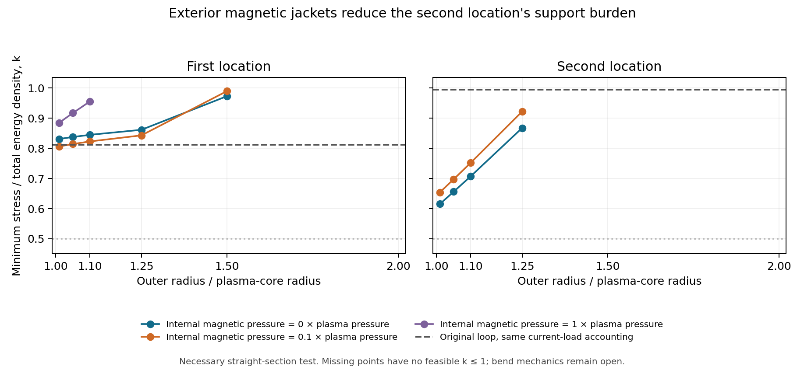

# Exterior magnetic jackets and material-strength requirements

Test date: 16 September 2026.

Moving most of the reservoir's magnetic field into an exterior annulus lowers
the second location's required material strength substantially. With the same
current and support accounting for both designs, the original loop requires
stress-to-energy fractions of 0.8115 and 0.9952. A common sampled jacket
geometry reduces these to 0.8065 and 0.6542. The first location becomes the
limiting case.

These are necessary straight-section material comparisons on the accepted
histories. Both current surfaces, the outer mechanical reaction, and the
circulating carriers' straight-section hoop load are counted. The full return
and bend fields and currents are also counted. Mechanical equilibrium of the
bends, a material response law, and a spatial realization of phase-field
sharing remain open.

An additional energy-only bound requires a stress fraction of at least 0.03227
and 0.13320 within this closed-jacket family, even with zero carrier cost and
freely evolving sleeve energy. Thus the geometry reduces a severe requirement
while retaining a material-strength scale far above the examples reviewed.



The curves show the sampled straight-section strength thresholds, including
carrier hoop reactions. The dashed lines use the same accounting for the
original loop. Missing markers indicate failure even at unit stress fraction.
The [PDF figure](figures/magnetic_geometry_comparison.pdf) is available for export.

## The two-boundary construction

The [original magnetic-loop test](MAGNETIC_LOAD_BALANCING_TEST.md) placed the
plasma and magnetic field inside a capsule-shaped tube. Its straight sleeve
bears the sum of plasma and magnetic pressure. This comparison surrounds
the plasma core, of radius \(r\), with a magnetic annulus extending to
\(\eta r\). The magnetic field outside the outer sleeve is zero.

The same closed capsule has radial straight legs of length \(L\), bends of
radius \(a=0.01L\), and an inner tube radius \(0.1a\). The plasma occupies
10% of the label volume. The outer assembly occupies \(0.1\eta^2\), and
the leg length adjusts slightly so its outer radial span remains half the
registered cell width. Both fields follow the original solenoidal affine
construction through the registered compression.

Let the inner and annular magnetic pressures on a straight leg be \(bp\)
and \(ep\), where \(p\) is the plasma pressure. The two interface loads are

\[
\Delta p_i=p(1+b-e),\qquad \Delta p_o=ep.
\]

For the straight core volume \(V_s\), the required integrated hoop tensions
are

\[
H_i=2pV_s(1+b-e),\qquad H_o=2pV_s\eta^2e.
\]

Consequently,

\[
H_i+H_o=2pV_s\,[1+b+e(\eta^2-1)].
\]

The magnetic energy of the complete loop is multiplied by
\(g=b+e(\eta^2-1)\), relative to the reference loop. The relation between
field energy and total hoop load retains the reaction at the outer boundary.
At fixed internal field, adding a finite external annulus increases that
total magnetic contribution.

The pressure-balanced choice \(e=1+b\) unloads the straight inner interface
of its plasma-plus-field pressure. Its outer hoop requirement is then
\(2pV_s\eta^2(1+b)\). Reducing the internal field lowers that requirement.
The \(b=0\) case represents an ideal field-excluding plasma core; finite
\(b\) permits a weaker internal field. The current sheets, finite field
penetration, opacity, and thermal exchange require a specified plasma and
conductor response.

Published work supplies relevant mechanisms and accounting precedents.
Romero and collaborators describe external magnets, opposing plasma
currents, and vessel currents in their field-reversed-configuration study.
Hilal, Arici, and Cuban optimize magnetic storage geometry while retaining
its required structural support. Their devices and plasma states differ from
the capsule modeled here; the present quantitative results come from the
rail replay calculation.
[Romero et al., 2018](https://www.nature.com/articles/s41467-018-03110-5),
[Hilal et al., 1985](https://digitalcommons.mtu.edu/michigantech-p/11060/).

## Current carriers and the revised baseline

The earlier comparison included current-carrier rest energy, kinetic energy,
and averaged kinetic stresses. This follow-up additionally assigns the
mechanical tension needed to turn those carriers around the straight tube's
circumference. For a carrier family with energy density \(\epsilon\) and
drift \(v\), its integrated transverse kinetic stress contributes
\(\int\epsilon v^2\,dV\) to the hoop requirement of the corresponding
straight-section host.

Both geometries use this additional mechanical term. It raises the original
loop thresholds from 0.7767 and 0.9746 to 0.8115 and 0.9952. This is a more
complete host requirement within the existing necessary comparison.

The field jump at the inner surface requires a sheet current proportional to
\(|\sqrt e-\sqrt b|\). The outer current scales as \(\eta\sqrt e\).
The core and annular bend currents scale as \(\sqrt b\) and
\((\eta^2-1)\sqrt e\). All four families retain their own particle rest
inventory, with the previous drift bound \(v\leq1/\sqrt2\). The normalized
carrier coefficients are held at the previous fine-history values,
\(2.54415\times10^{-8}\) and \(1.20001\times10^{-8}\), throughout each
location's geometry and resolution comparisons. They remain parameters
without an assigned particle species or SI conversion.

Each boundary also keeps a separate, fixed sleeve-energy inventory. If their
hoop-load peaks occur at different times, the minimum total inventory includes
both peaks. The code optimizes the summed axial stress subject to each
boundary's strength allowance and supplies an explicit split of that stress
between the two inventories. Holding their energies fixed requires the
recorded mechanical transfers.

## Geometry sweep and measured changes

The sweep contains 53 geometries per history: the original loop, a zero-field
wall control, three partially supported external-field controls, and 48
pressure-balanced jackets. The jackets combine eight internal-pressure ratios
from zero to one with outer-to-inner radius ratios of 1.01, 1.05, 1.1, 1.25,
1.5, and 2. Four parallel jobs cover both locations at two resolutions.

The table uses the fine histories and includes the carrier hoop term. Here
\(k\) is allowable stress divided by total proper energy density, including
rest-mass energy.

| Geometry | First location | Second location |
| --- | ---: | ---: |
| Original internal-field loop | 0.81147 | 0.99520 |
| Retain original internal field, add balanced exterior field; \(\eta=1.1\) | 0.95588 | Fails at \(k=1\) |
| Field-excluding core, \(\eta=1.1\) | 0.84502 | 0.70754 |
| Field-excluding core, \(\eta=1.01\) | 0.83119 | 0.61545 |
| Common jacket: \(b=0.1,e=1.1,\eta=1.01\) | **0.80655** | **0.65421** |
| Zero-field wall control, zero current cost | 0.59383 | 0.52680 |

The common jacket minimizes the worse of the two fine-history thresholds
among the sampled jackets. The nearby \(b=0.25\) jacket has a nearly equal
worst-location score of 0.80662. These samples identify a useful range of
reduced internal fields. Every tested geometry fails the whole-history
comparison at \(k=0.5\).

For the common jacket, complete-loop magnetic energy falls to 12.211% of the
original value. The magnetic part of the straight hoop load falls to 56.1055%.
The sheet-current requirement increases by a factor of about 1.792, while
bend current decreases to about 0.337 of the original. This tradeoff explains
why the first location gains little after the carriers and their mechanical
loads are counted.

Concrete tensor allocations are retained for both locations with a common
sleeve strength \(k=0.85\). Their minimum remaining density margins are
\(5.16\times10^{-5}\) and \(2.18\times10^{-4}\). Both boundary inventories
and their individual hoop capacities pass at every retained sample.

| Common-jacket quantity, per material label | First location | Second location |
| --- | ---: | ---: |
| Current-carrier rest inventory | 0.02603–0.02770 | 0.01064–0.01198 |
| Total fixed sleeve energy at \(k=0.85\) | 0.13260–0.15905 | 0.11109–0.14076 |
| Complete-loop electrical input | 0.00969–0.01060 | 0.00877–0.01172 |
| Carrier energy-control input | 0.01037–0.01108 | 0.00439–0.00484 |

The field, carrier, and sleeve transfers are recorded individually. They use
the unchanged absorbed-heat history and its previously computed compression
work. Integration with the original electrical and mechanical ports remains
a separate source-ledger requirement. The 1% radial gap also requires finite
conductor thickness and field penetration to be checked against the chosen
material and physical scale.

## A bound that survives changes to the sleeve energy law

The two-boundary force balance gives
\(H_i+H_o\geq2pV_s\) throughout this family. With
\(V_s/V_{\mathrm{core}}=1/(1+\pi a/L)\) and plasma energy \(E\), any such
sleeve therefore requires

\[
E_{\mathrm{sleeve}}\geq
\frac{2E}{3k(1+\pi a/L)}.
\]

At each sample, that energy must fit within the density remaining after the
fixed phase, fluid, photons, hot receiver, and interface obligations. Granting
the sleeve all of that remaining energy, with zero added field or carrier
cost, yields

\[
k\geq\max_{t,x}
\frac{2E}{3D(1+\pi a/L)\,\rho_{\mathrm{available}}}.
\]

The resulting lower bounds are 0.03227 and 0.13320. They permit independently
adjustable sleeve energy at every sample and omit the remaining auxiliary
support costs. Thus changing the fixed-inventory law alone leaves a
percent-level requirement within this family.

For scale, reported carbon plate nanolattices reach specific strength of
approximately 3.75 MJ/kg, corresponding to stress divided by rest-energy
density of about \(4.2\times10^{-11}\). Comparing that example with the
bound above leaves roughly nine orders of magnitude.
[Crook et al., 2020](https://www.nature.com/articles/s41467-020-15434-2).
The bound assumes that the jacket closes its transverse reactions through
the counted sleeves. A construction that transfers them through additional
rail connections requires the corresponding connection stress and energy
to be supplied explicitly.

## Bend loads and verification

Pressure balance on a radial straight leg leaves a significant load at a
transversely directed bend. For the balanced jackets, the inner-interface
pressure there is

\[
\frac{\Delta p_{i,\mathrm{bend}}}{p}
=1-\frac{\lambda_t^2}{\lambda_r^2}.
\]

The most compressed fine samples reach ratios of about \(-11.77\) and
\(-13.76\). The exterior field therefore pushes inward strongly on those
parts of the prescribed plasma boundary. Retaining the affine loop shape
requires additional bend support or a different field and shape evolution.
The retained straight-section allocations leave that mechanical problem
open, alongside bend-current host forces, induction fields, material
stability, and the microscopic phase-field overlap. The straight-section
energy bound already establishes the material scale of the closed-jacket
family under the prescribed loads.

The common jacket's coarse-to-fine thresholds change from 0.80552 to 0.80655
and from 0.64273 to 0.65421. The second location retains a 0.01148 resolution
sensitivity in \(k\); a continuous-time certificate remains open. The
energy-only bound changes by less than \(1.6\times10^{-5}\). Current
quadrature orders 32 and 64 agree within \(1.37\times10^{-7}\) relative
to the maximum current-tensor magnitude. The parent current histories
reconstruct exactly, and retained tensor allocations reconstruct within
\(2.78\times10^{-17}\).

All 56 focused tests pass. The additional checks cover direct two-cylinder
force balance, thin-gap limits, the four current families, circulating-carrier
hoop stress, separate inventory peaks, and agreement with independent
joint-time linear programs.

The [summary](data/magnetic_geometry/summary.json) records every geometry
and the common-geometry ranking. Four state archives retain three finite-gap
allocations per history. The [manifest](data/magnetic_geometry/manifest.json)
authenticates the parent archive and records 129 input/runtime hashes,
12 output hashes, and execution source snapshots. The implementation is in
[magnetic_geometry.py](../toolkit/adm_harness_cli/adm_harness/magnetic_geometry.py),
with its [runner](../toolkit/adm_harness_cli/scripts/evaluate_magnetic_geometry.py)
and [tests](../toolkit/adm_harness_cli/tests/test_magnetic_geometry.py).

Reproduction from the repository root uses a fresh output directory:

```bash
PYTHONPATH=toolkit/adm_harness_cli OPENBLAS_NUM_THREADS=1 OMP_NUM_THREADS=1 \
  python toolkit/adm_harness_cli/scripts/evaluate_magnetic_geometry.py \
  --output-name magnetic_geometry_reproduction --workers 4 --current-order 32

PYTHONPATH=toolkit/adm_harness_cli OPENBLAS_NUM_THREADS=1 OMP_NUM_THREADS=1 \
  pytest -q toolkit/adm_harness_cli/tests/test_magnetic_geometry.py \
  toolkit/adm_harness_cli/tests/test_magnetic_load_balance.py \
  toolkit/adm_harness_cli/tests/test_field_membrane_support.py \
  toolkit/adm_harness_cli/tests/test_virtual_cell_material_bank.py \
  toolkit/adm_harness_cli/tests/test_virtual_cell_thermal_replay.py

MPLCONFIGDIR=/tmp/rail_magnetic_geometry_mpl \
  python toolkit/adm_harness_cli/scripts/plot_magnetic_geometry.py \
  supporting_reports/data/magnetic_geometry/summary.json \
  supporting_reports/figures/magnetic_geometry_comparison
```
