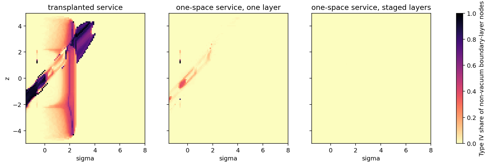

# One-Space Rail: Service Revision and Transverse Boundary Layer

Date: 2026-09-23. Context: the rail runs in one flat space, and the
[axial track](AXIAL_TRACK.md) showed that the transplanted service leaves a
Type IV layer in the transverse boundary layer. Code:
`adm_harness/axial_track.py` (staged layers, lapse and conformal sheaths) and
`adm_harness/constant_radius_track.py` (held and standing supports). Run:
`scripts/run_one_space_revision.py` with data in
[data/one_space_revision](data/one_space_revision/).

## Result

The one-space rail passes the geometry-demand gate at every evaluated point
after three changes.

1. The support holds its compressed state, with no decompression. The packet
   carve and windows keep their schedules.
2. The packet lapse window runs on the live schedule with log gain 2 and
   radius 0.875, so it covers the whole carried shift.
3. The transverse boundary layer is staged. Moving outward, a conformal
   pre-sheath raises lapse and stretch together by \(e^{8}\). A lapse sheath
   then rises by a further \(e^{8}\) across the layer where the shift returns
   to zero. Beyond it, the stretch returns to one and then the lapse.

The wide stack is Type I at all 4.4 million non-vacuum boundary-layer points.
The narrow stack, refined to half the jet step and twice the radial nodes, is
Type I at all 8.9 million. The exterior is exactly vacuum.

Root-finding goes beyond the node grid. At every flux-carrying null-sum
crossing of the 60 samples with the largest estimated band widths, it
resolves residual Type IV bands on the packet path. The widest band is
\(8\times10^{-6}\) in the wide stack, at 3 of 60 samples, and
\(2.2\times10^{-5}\) in the narrow stack. The moving carve is their source:
with the carve removed, the same stack shows no band at any resolved
crossing. The width falls exponentially with the sheath lapse, so the stack
can place it below any chosen scale. At the recorded normalization, where
one unit is \(1/\sqrt\eta\approx204\) Planck lengths, \(8\times10^{-6}\) units is about
0.0016 Planck lengths.

The service keeps its safety and its advantage:

- all 238 live packet points are timelike, with maximum norm −194;
- radial escape is complete, and reachability hits, trapped surfaces and
  bundle crossings are all zero;
- the schedule-factor advantage is 2.569 and the packet-coordinate advantage
  1.195.

Holding the support lengthens velocity-read delivery to \(\sigma=23.4\), from
10.1. After the live window the packet travels at \(U/B\) through a support
that stays compressed.

The boundary layer is a permanent structure. The wide stack reaches −2.65
minimum null energy and carries 490 units of negative-null content per unit
\(\sigma\). The two end transitions of the two-ended track together carry
3.8. The service region's own transverse deficit shrinks to a minimum of
−0.153, from −0.283, with integral 0.092, down from 4.23.



## Revision path

| Service and boundary layer | Type IV / non-vacuum layer points | Samples with Type IV | Live samples with Type IV | Resolved bands (widest) | Packet-coordinate advantage |
|---|---:|---:|---:|---|---:|
| current service, single layer | 74,700 / 374,187 | 2,844 | 217 | — | 1.233 |
| held support, single layer | 18,931 / 1,890,207 | 586 | 215 | — | 1.195 |
| held support and lapse envelope, single layer | 2,972 / 1,890,208 | 522 | 209 | — | 1.195 |
| the same, first-draft stack | 0 / 4,884,931 | 0 | 0 | 60 of 60 (\(2.0\times10^{-4}\)) | 1.195 |
| the same, final stack | 1 / 4,450,004 | 1 | 1 | 22 of 60 (\(2.2\times10^{-5}\)) | 1.195 |
| the same, final stack refined | 0 / 8,918,361 | 0 | 0 | 21 of 60 (\(2.1\times10^{-5}\)) | 1.195 |
| the same, wide final stack | 0 / 4,415,341 | 0 | 0 | 3 of 60 (\(8\times10^{-6}\)) | 1.195 |
| static support and lapse envelope, final stack | 0 / 4,449,618 | 0 | 0 | 0 of 60 | 0.352 |

The samples cover \(\sigma\in[-1.5,20]\) and \(|z|\le4.9\) at spacing 0.1.
The single layer takes 96 radii, and the stacks take 228–240 radii at 12
Gauss–Legendre nodes per panel, split at every join. The resolved bands lie
at \((\sigma,z)\approx(\pm0.6,\pm0.6)\) and \((1.5,1.8)\), inside the moving
carve around the packet.

## Why each change is needed

**Held support.** A stretch that changes in time splits the two radial null
Hessians of the stretch and leaves a band wherever their static part changes
sign. The decompression was the largest such change. Holding the support
lowers the layer's Type IV points from 74,700 to 18,931, and the slow-reset
comparison shows the same packet-coordinate advantage, 1.195.

**Lapse envelope.** A lapse gradient under a shift that varies along the
track carries a radial energy flux
\(8\pi T_{nr}\approx-a'\beta_z/\alpha\), against the null-energy term
\(8\pi(\rho+p_r)\approx a'/r\). Both scale with \(a'=\partial_r\log\alpha\),
so Type I requires \(\alpha>2r|\beta_z|\) wherever the lapse varies. In the
beta075 service, 10 of 1,445 shift-carrying samples violate it, with ratios
up to 4.1. All lie at the packet entry, where the trailing rematch shift
reaches the support edge before the packet lapse window switches on. The
live-scheduled envelope removes every violation (largest ratio 0.94).

**Staged layer.** Three facts set the stack.

- The shift's flux scales with the proper shear \(A\beta_r/\alpha\), and a
  lapse slope suppresses it wherever \(A/\alpha\ll1\) (shear identity). The
  shift transition therefore sits on a rising lapse, after the lapse has
  climbed well above the stretch.
- Wherever lapse and stretch rise together, as in the conformal pre-sheath,
  the flux vanishes exactly, even under a moving shift that varies along the
  track. There \(A_\sigma/\alpha\) stays independent of \(r\), and the
  lapse and stretch gradients cancel in \(\beta_z(b_r-a_r)\). The pre-sheath
  also scales the service curvature by \(e^{-2\varphi}\).
- The stretch returns to one outside the shift transition. There the shift
  is zero and the static stretch carries no flux.

The first-draft stack (conformal \(e^{4}\), with the lapse sheath finishing
its rise at the shift layer's edge) left bands up to \(2\times10^{-4}\) wide.
They sat at the handover between the two sheaths and at the shift layer's
outer edge. The final stack (conformal \(e^{8}\), with the lapse rising across
the whole shift layer) narrows them to the carve's residue.

| Wide final stack | Radii | Change |
|---|---|---|
| service region | \(r\le1.75\) | service fields, exact product with the transverse plane |
| conformal pre-sheath rise | 1.75–3.75 | lapse and stretch \(\times e^{8}\) |
| lapse sheath rise | 3.75–8.75 | lapse \(\times e^{8}\) |
| shift transition | 4.25–6.25 | \(\beta\to0\) |
| stretch and conformal fall | 9.25–11.25 | \(A\to1\) |
| lapse fall | 9.25–13.25 | \(\alpha\to1\) |
| exterior | \(r\ge13.25\) | Minkowski |

The sheath is a lapse maximum. Clocks inside it advance up to \(e^{16}\),
about \(9\times10^{6}\) times faster than exterior clocks, on top of the
service lapse. Free particles fall away from a lapse maximum on both flanks.
The sheath therefore holds the packet inside the service region and deflects
exterior matter.

## Service audits

| Audit | current service | held support and lapse envelope | static support and lapse envelope |
|---|---:|---:|---:|
| live packet points (spacelike) | 238 (0) | 238 (0) | 238 (0) |
| maximum live packet norm | −9.94 | −194 | −1716 |
| radial escape (escaped/expected, stalled) | 1696/1696, 0 | 1644/1644, 0 | 1630/1630, 0 |
| entry reachability hits | 0 | 0 | 0 |
| scheduled probes escaped | 224/235 | 189/235 | 189/235 |
| centerline probes at the ledger time limit | 0 of 24 | 22 of 24 | 22 of 24 |
| traces entering both-shrinking | 0 | 0 | 0 |
| dense-bundle crossings | 0 | 0 | 0 |
| schedule-factor advantage | 2.569 | 2.569 | 2.569 |
| packet-coordinate advantage | 1.233 | 1.195 | 0.352 |
| velocity-read arrival at \(\ell=5\) | 10.1 | 23.4 | 39.8 |

The centerline and packet-edge probes stay at norm −0.75. Three minus-branch
null probes cross points where the packet velocity field is spacelike, and
there the field reaches +1620. The two caustic-like bundle flags come from the
one-ulp areal-radius width recorded in the
[reset comparison](RESET_SCHEDULE_OPTIONS.md); the flagged bundles keep width
ratios of 0.32–0.35. Removing the carve drops the packet-coordinate advantage
to 0.352, which identifies the carve as the carrier of the speed advantage.

## Costs

| Measure | Two end transitions (two-ended track) | Wide final stack | Narrow final stack |
|---|---:|---:|---:|
| minimum null energy, standing | −0.058 | −2.65 | −10.62 |
| negative-null content per unit \(\sigma\), standing | 3.8 | 490 | 592 |
| outer radius of the transverse structure | — | 13.25 | 7.5 |
| service-region minimum null energy | −0.270 (angular) | −0.153 | −0.153 |

The content uses the measure of the axial report,
\(\sum\Delta\sigma\,\Delta z\int2\pi r\max(-N_{min},0)\,dr\), evaluated at
\(\sigma=10\), after the packet has passed. Widening the stack lowers the
pointwise minimum fourfold at a similar content.

## Open items

1. **Choreography.** A held support needs the packet to leave the stretched
   support before its live windows close. Velocity-read delivery (23.4) and
   the window-versus-velocity mismatch both point to one revision: tie the
   windows and the carve to the packet path, and extend them to the support
   exit.
2. **Band tolerance.** The residual bands come from the moving carve and
   narrow exponentially with the sheath lapse. One option accepts them below
   a stated physical scale. The other carries the speed advantage through a
   lapse-and-shift mechanism instead of the carve.
3. **Sources.** The source roles change with the geometry. The service region
   needs a small transverse pressure \(-K/8\pi\), and the boundary-layer stack
   needs a permanent, largely NEC-violating tensor over its area. C1 modules
   would supply these two roles in place of the string cloud and the end
   transitions.

The [choreography pass](CHOREOGRAPHY_PASS.md) takes up items 1 and 2.

## Reproduction

```bash
OPENBLAS_NUM_THREADS=1 python toolkit/adm_harness_cli/scripts/run_one_space_revision.py --workers 6
python toolkit/adm_harness_cli/scripts/run_one_space_revision.py --figures-only
PYTHONPATH=toolkit/adm_harness_cli:toolkit/adm_harness_cli/scripts python -m pytest toolkit/adm_harness_cli/tests/test_axial_track.py toolkit/adm_harness_cli/tests/test_constant_radius_track.py
```

The run takes about 26 minutes with six workers: 3 for the service jets, 16
for the boundary layers, 2 for band resolution and 4 for the audits. Its manifest records the layer
designs, the envelope parameters, the noise floor and the software hashes.
