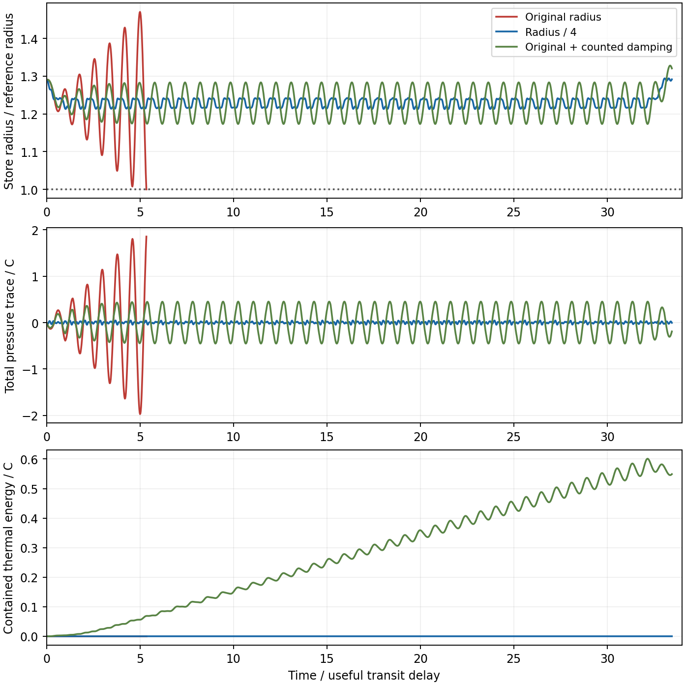

# Optical stores, splitters, routing reactions and losses

16 September 2026.

The receiving store now has a fixed material inventory, an elastic energy
law, optical charge, radial dynamics and a thermal specialization. A
two-output electro-optic interferometer supplies a concrete splitter
mechanism. Closed optical polygons provide an explicit calculation of turn
forces and their supporting tension. Together these constructions retain
positive energy headroom in all four inherited histories at the level of
an inventory screen.

Their operating requirements distinguish the remaining problems. The
original photon store reaches its tensile boundary under the earlier
switching sequence. A smaller store completes that sequence, while a
nearby frequency excites its own resonance. Counted damping stabilizes the
tested smaller store and accumulates thermal radiation. Optical losses
then impose a much tighter requirement than the static inventory budget.
The assembly still needs a material implementation, variable-load routing
evolution, finite-bandwidth exchange matching and a heat/replacement-power
system consistent with the target tensor.

## Receiving-store inventory and dynamics

The [controlled-transfer construction](CONTROLLED_OPTICAL_TRANSFER.md)
uses a steady guide, delayed useful receipts and downstream recycling.
Let the useful peak be \(P_*\), useful flight time be \(\delta\),
and capacity unit be \(C=P_*\delta\). Time below is measured in
\(\delta\), energy in \(C\), and \(c=1\). At nominal guide loading,
the store receives \(A(t-1)+1-A(t)\) and emits unit power. Therefore

\[
\dot H_s=A(t-1)-A(t),\qquad
O(t)=\int_{t-1}^{t} A(s)\,ds,\qquad H_s+O=H_s(0).
\]

The candidate store uses the existing relativistic elastic ring law with
fixed reference energy \(M_s=8C\). Define
\(x=R/R_{s0}\), \(p=p_R/M_s\), and coherent photon action
\(z=K/(M_sR_{s0})\). Its material energy, integrated tension, rest
energy and total energy per reference energy are

\[
e=\tfrac12(x+x^{-1}),\quad \theta=\tfrac12(x-x^{-1}),\quad
V=e+z/x,\quad h=\sqrt{p^2+V^2},\quad H_s=M_sh.
\]

The initial equilibrium is \(x_0=1/\sqrt{0.6}\), \(p_0=0\),
\(z_0=1/3\). Thus \(H_s(0)=10.32796C\), including the wall's
reference inventory and elastic energy. The nominal useful transit can
remove at most \(C\), leaving a quasistatic energy floor of
\(9.32796C\). This floor exceeds the wall reference energy; radial
motion nevertheless requires an independent calculation.

With \(v=p/h\), \(\gamma=h/V\), and net store power \(q\),

\[
\dot x=\frac{v}{R_{s0}},\quad
\dot p=\frac{z/x-\theta}{\gamma xR_{s0}}+\frac{vq}{M_s},\quad
\dot z=\frac{xq}{\gamma M_s}.
\]

These equations give \(M_s\dot h=q\). They use the earlier model's
matched, distributed comoving ports. Constant emission requires an
adjustable coupling with

\[
\eta_s(t)=\frac{2\pi R_{s0}x^2}{M_sz}.
\]

The trials enforce the chosen optical-depth ceiling \(\eta_s\le1\),
tensile radius \(x\ge1\), and radius ceiling \(x\le1.5\).
The coupling's response time, drive energy and physical interaction with
the wall accompany its amplitude requirement.

The earlier switching half-period is \(0.4057204\delta\). Eighty
alternating intervals are followed by one useful-flight time of drainage.
Eighty and four hundred intervals represent forty and two hundred full
on/off cycles. Reported trajectory extrema are sampled numerical maxima.

| Store preparation | Observed result |
| --- | --- |
| \(R_{s0}=\delta/(3\pi)\), elastic | Tensile boundary at \(5.341313\delta\) |
| \(R_{s0}=\delta/(12\pi)\), elastic, same demand | Completes at \(33.457633\delta\); peak \(|\Pi|=0.04725C\) |
| Smaller elastic store, half-period \(0.1025\delta\) | Tensile boundary at \(7.969646\delta\) |
| Original radius, damping coefficient 0.2, eighty intervals | Completes with approximately \(0.5490C\) of contained thermal energy |
| Same damped preparation, extended demand | Reaches the extraction ceiling at \(37.509643\delta\) |
| Smaller radius, damping 0.2, nearby frequency, four hundred intervals | Completes at \(42\delta\), with approximately \(0.06264C\) of contained thermal energy |

Reducing radius at fixed \(M_s\) increases the reference energy per
circumference fourfold. The smaller geometry therefore also specifies a
different wall section or material density. Its narrow resonance persists
in the nearby-frequency screen.

For a completed elastic trial, constant post-trial charge gives an exact
retention check. The future turning radii are

\[
x_\pm=h\pm\sqrt{h^2-1-2z}.
\]

After the smaller store's original eighty-interval trial, these radii are
approximately 1.287732–1.294257, and the maximum future extraction depth
is 0.10470. The store remains slightly oscillatory within its allowed
envelope. This exact continuation applies to ideal, undamped retention.

## Damping with contained heat and its pressure

A thermal specialization adds equilibrated one-dimensional radiation with
action \(b\). Then \(V=e+(z+b)/x\). Both radiation populations
contribute to pressure, while the controlled useful port extracts the
coherent population. The thermal bath assumes a continuum of populated
modes; its entropy is proportional to \(\sqrt b\).

For viscous mode coefficient \(k\), the additional terms are

\[
\dot p_{\rm visc}=-kp/R_{s0},\qquad
\dot b_{\rm visc}=\gamma xkpv/R_{s0}\ge0.
\]

The force work becomes internal heat exactly, so \(M_s\dot h=q\)
continues to hold. The complete integrated pressure trace includes the
viscous stress:

\[
\frac{\Pi}{M_s}=hv^2+
\frac{(z+b)/x-\theta}{\gamma}-kxp.
\]

The audit checks the comoving hoop-stress magnitude against rest energy,
along with the energy identity and increasing entropy. These mode-level
checks leave the local material's viscosity, relaxation time and causal
constitutive completion as physical requirements.

Thermal energy can undergo reversible expansion work while its entropy
increases. In the original-radius damped trial, repeated switching converts
enough useful charge to heat that the requested emission eventually
requires \(\eta_s>1\). The wall remains tensile and total store energy
remains positive at this event. The failure concerns the permitted useful
output rate.



Coherent absorption can also be counted internally. For optical depth
\(a\) per comoving circuit,

\[
\dot z_{\rm abs}=-\frac{az}{2\pi\gamma R_{s0}x},\qquad
\dot b_{\rm abs}=-\dot z_{\rm abs}.
\]

This process preserves total energy while consuming useful charge. An
idle equilibrium store therefore has
\(\eta_s(t)=\eta_s(0)\exp[at/(2\pi R_{s0}x_0)]\).
For the smaller store, \(\eta_s(0)=0.104167\), giving an extraction
limit after \(0.486654\delta/a\). At 0.62 ppm absorption per effective
circuit, that interval is approximately \(7.85\times10^5\delta\).
This idealized calculation isolates useful-charge degradation and counts
the absorbed energy and its pressure inside the store.

## Splitter mechanism, timing and electrical work

A balanced Mach–Zehnder interferometer provides complementary useful and
recycle outputs. Up to a fixed phase convention,

\[
U(\phi)=
\begin{pmatrix}
\cos(\phi/2)&i\sin(\phi/2)\\
i\sin(\phi/2)&\cos(\phi/2)
\end{pmatrix},\qquad U^\dagger U=I.
\]

Both output powers belong to the ledger. The ideal transfer matrix
describes optical redistribution; the phase actuator supplies electrical
work and has a finite response.

[Assumpcao et al.](https://www.nature.com/articles/s41467-024-54541-2)
demonstrate a thin-film lithium-niobate switch with two outputs, a 5 mm
modulation section, approximately 1.5 V half-wave voltage and extinction
above 20 dB at both ports. Their reported on-chip loss is approximately
0.4 dB, inferred using propagation-loss measurements and a
propagation-dominance assumption. This corresponds to an 8.80% optical
channel deficit; its absorption and scattering components remain
unseparated. The switch is demonstrated at kHz/MHz timescales.

Their [supplement, section 2.4](https://media.springernature.com/original/springer-static/esm/art%3A10.1038%2Fs41467-024-54541-2/MediaObjects/41467_2024_54541_MOESM1_ESM.pdf)
uses \(C_e=1\) pF and \(P=fC_eV_\pi^2\), giving 2.25 pJ per
charge/discharge cycle. This circuit estimate includes the specified
switch and source resistances; complete controller energy is an
additional term. The paper's high-bandwidth traveling-wave modulator is
a separate device. The present assembly also requires physical energy,
length, wavelength and power scales before these hardware figures can be
matched to its normalized variables.

The audit replaces instantaneous phase steps with linear phase ramps
taking \(0.101430\delta\). The resulting sine-squared power has a
maximum cumulative delivery lag of \(0.050715C\) relative to the square
reference, while retaining the same total energy per complete cycle. The
smaller store completes this finite-phase trial. Matching the shifted
receipt timing to component evolution is a separate gate: the existing
piecewise histories include receipt jumps as large as a node's prepared
peak. The smooth trial supplies a quantified timing requirement for that
joint reconstruction.

## Routing forces and the supporting material

Consider a closed polygon with segment lengths \(L_i\), unit directions
\(\mathbf n_i\), and total circulating power \(P\), split equally
between opposed beams. A vertex receives

\[
\mathbf F_i=\frac Pc(\mathbf n_{i-1}-\mathbf n_i).
\]

The polygon has zero net force and torque, and opposite circulations
cancel angular momentum. Each corner still carries a local force. A
continuous edge tension \(P/c\) balances these forces. Its integrated
stress cancels the photon tensor:

\[
\mathsf S_\gamma=\frac Pc\sum_i L_i\mathbf n_i\mathbf n_i^T,
\qquad \mathsf S_{\rm wall}=-\mathsf S_\gamma.
\]

For the same elastic line law at stretch \(\lambda\), photon path
energy \(W=P\sum_iL_i/c\) requires

\[
M_{\rm route}=\frac{2W}{\lambda-\lambda^{-1}},\qquad
E_{\rm route}=W\frac{\lambda^2+1}{\lambda^2-1}.
\]

At \(\lambda=1.5\), wall energy is \(2.6W\). This is an explicit
static reaction construction, including local forces and the full
integrated tensor. Varying optical powers require strain evolution or
additional balancing loads. A fixed-inventory routing network must also
realize the prescribed delays, open-port reactions and macro deformation
work. The static formula prices this requirement without supplying that
network's dynamical law.

The inherited maximum useful, feed and outgoing photon path capacities
sum to \(2.75C\). Their static wall allowance is therefore \(7.15C\).
Replacing the earlier abstract initial buffer with the \(10.32796C\)
store, retaining the nominal guide and initially filled internal paths,
and adding these walls gives \(22.78127C\) per active node. The old
abstract buffer is subtracted before its physical replacement is added.

| History | Largest candidate preparation per label | Continuous energy-reserve lower bound |
| --- | ---: | ---: |
| First, coarse | 0.00085408 | 0.00090339 |
| First, fine | 0.00086243 | 0.00077611 |
| Second, coarse | 0.00022951 | 0.00308836 |
| Second, fine | 0.00037943 | 0.00256595 |

These quantities screen inventories across all 246,816 inherited states
and the existing panel reserve bounds. Store dynamics cover the specified
finite trials. The target tensor, macro work, physical joints and previous
perturbed-guide controller require a combined re-evaluation when the
variable-load routing and store ports are fixed.

An independent internal-energy store also needs its reference mass.
For the same per-node capacity envelope, giving such a store the entire
pre-optical reserve yields required useful
energy/rest-energy ratios up to 0.02303 in the first fine history and
0.005655 in the second. The [DOE hydrogen benchmark](https://www.energy.gov/cmei/fuels/hydrogen-storage)
of 120 MJ/kg gives \(1.3352\times10^{-9}\), even before oxidizer,
vessel and conversion equipment. This generous comparison exceeds the
available independent-store reference inventory by factors up to
17.25 million and 4.24 million, respectively. Reusing an existing host
requires its capacity and exchanges to enter that host's constitutive
law; the estimate here concerns separately added stores.

## Loss requirements and useful-throughput utilization

With the candidate preparation charged, the sufficient retained-loss
allowances against nominal guide throughput become approximately
0.200 ppm for the first fine history and 0.842 ppm for the second.
These allowances concern all unrecovered energy together, including
optical absorption, uncollected light and electrical dissipation.

The store adds circulating optical power even when net charging power
vanishes. In its nominal quasistatic family,
\(x_0-1/8\le x\le x_0\), the combined guide and smaller-store
circulation is 7.347–10.600 times \(P_*\). Charging a common
round-trip loss against the upper value gives sufficient per-circuit
allowances of approximately **0.0189 ppm** and **0.0794 ppm**. Additional
encounters in routing and splitter hardware would consume further budget.
These circulation values apply to the specified quasistatic family;
arbitrary perturbed store motion has its own measured circulation.

Two primary measurements establish relevant comparison scales:

- [Cole et al.](https://jila.colorado.edu/sites/default/files/2019-07/CrystallineMirrors_OPTICA.2016.pdf)
  report approximately 0.62 ppm absorption at 1064 nm extrapolated to zero
  visible-probe power, and approximately 0.7 ppm using the infrared probe.
  Their separate total excess-loss measurements are 3–5 ppm.
- [Jin et al.](https://arxiv.org/pdf/2203.15931) infer approximately
  0.74 ppm absorption plus scattering per mirror at 1550 nm, separately
  from approximately 1.9 ppm transmission. The inference assumes equal
  transmission for the simultaneously coated cavity mirrors. Their
  0.23 ppm scattering estimate comes from measured surface roughness.

Counting one encounter per effective circuit is already optimistic for a
complete routing network. At the lower quasistatic circulation value,
0.62 ppm absorption corresponds to an effective 4.56 ppm of nominal
guide throughput. This exceeds the two fine-history sufficient allowances
by factors of approximately 22.8 and 5.41. This assigned loss produces
negative sampled reserves at all 32 first-fine labels and 27 of the 32
second-fine labels. The respective smallest remainders are approximately
−0.02761 and −0.01131. These are direct conditional failure witnesses in
addition to the sufficient-bound comparison. These comparisons constrain the
specified constant-circulation design and loss assignments; wavelength,
incidence geometry, power handling and material compatibility accompany
any use of the measured coatings.

Collected mirror transmission and the splitter's intentional second output
remain usable optical routes. Recovering scattering requires collection
hardware and corresponding reactions. The 0.4 dB splitter deficit is
therefore evaluated as an explicitly unrecovered comparison, alongside
the separate absorption measurements.

Heat export requires both an energy outlet and replacement power. Removing
heat leaves the full energy needed to preserve useful delivery and store
charge. Exporter stress, radiator or coolant inventory, replenishment
source and their target-tensor contributions belong to that revised
assembly. The present retained-loss screen supplies an optimistic energy
requirement; the complete installation also carries material inventory
and stress.

There is a substantial operating opportunity: rigorous panel power bounds
place useful positive exchange at approximately **0.500–0.523%** of nominal
guide throughput in the first fine history, and **0.371–1.084%** in the
second. Thus peak-biased continuous circulation processes much more energy
than the actual exchanges require. Scheduled guide operation can address
this excess; the store additionally needs a holding mode whose losses
remain acceptable between transfers. Turning down the guide alone leaves
the charged photon store's circulation in place.

## Evidence and next construction gate

The [numerical archive](data/optical_assembly/summary.json) contains
46 store trials, including five refinements, the four inherited energy
screens, route forces and stresses, loss comparisons and input hashes.
Independent cases run on four workers. The largest refined store-state
difference is below \(1.7\times10^{-9}\), and the compared boundary
times agree within \(1.9\times10^{-10}\delta\). The manifest stores
executed sources and verifies the linked optical, joint and macro inputs.
The focused optical, material, joint and containment suites pass 81 tests.

The next assembly gate combines a low-loss holding mode with scheduled
transfer, finite port response and evolving route supports. It must preserve
the complete donor/receiver timing, count heat and replacement energy, and
rematch the target tensor. The existing separate-current-host obstruction
and the material realization of the relativistic elastic law continue to
apply. This investigation is recorded here as component research; the
technical disclosure retains its established design content.

Reproduction uses a fresh output directory:

```sh
env PYTHONPATH=toolkit/adm_harness_cli OPENBLAS_NUM_THREADS=1 OMP_NUM_THREADS=1 \
  MPLCONFIGDIR=/tmp/optical_assembly_matplotlib \
  python toolkit/adm_harness_cli/scripts/audit_optical_assembly.py \
  --workers 4 --output /tmp/optical_assembly_replay

env PYTHONPATH=toolkit/adm_harness_cli OPENBLAS_NUM_THREADS=1 OMP_NUM_THREADS=1 \
  python -m pytest -q toolkit/adm_harness_cli/tests/test_optical_assembly.py \
  toolkit/adm_harness_cli/tests/test_controlled_optical_transfer.py \
  toolkit/adm_harness_cli/tests/test_constitutive_joints_and_optics.py \
  toolkit/adm_harness_cli/tests/test_distributed_reconfiguration.py \
  toolkit/adm_harness_cli/tests/test_material_reconfiguration.py \
  toolkit/adm_harness_cli/tests/test_finite_containment.py \
  toolkit/adm_harness_cli/tests/test_containment_ensemble.py
```
