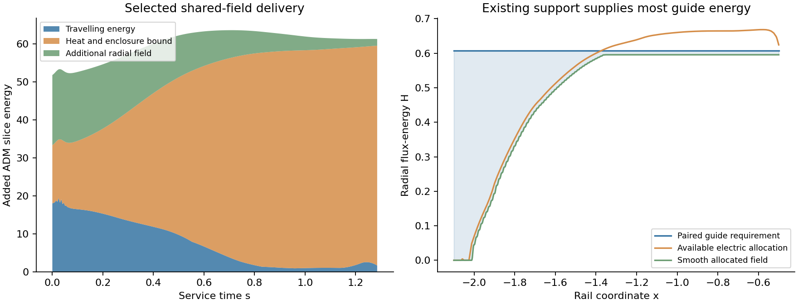

# Finite electromagnetic work delivery on the active rail

Receiver-side electromagnetic delivery reduces the required travelling
preparation and supports a useful allocation of the existing radial field to
its magnetic guides. The selected continuation combines a paired work/return
route, finite distributed taps, complementary electric storage, and the
existing thermal receiving role. A finite-response comparison reduces the
sampled fade negative-null requirement to about 0.204, against 0.263 for the
previous formal enclosed-store control. Its additional startup slice energy
is about 68 units, against 94. Its complete material and curved-turn
realization remains the next physical gate.

## Registered question and architecture

This investigation measures whether supplying electrical work during the
scheduled late operation reduces the finite local reserve identified in the
[converter evaluation](REGENERATIVE_CONVERTER_EVALUATION.md). It retains the
connected pressure fluid, radial electric storage field, thermal receiving
inventory, prescribed material worldlines, and separate standing-support
reaction role. The protected packet and time-dependent metric remain those
of the active rail. The first comparison covers x in [-2.1,-0.5] and service
time s in [0,1.285]. Earlier preparation and subsequent reset retain their
own service constraints.

The work route has finite input and recovery ports at the patch boundaries.
Its initial travelling energy and all boundary energy transfers are counted.
The thermal receiver retains the earlier finite inventory calculation. An
external electrical supply changes the work inventory equation alone;
receiver heat storage, entropy, and terminal reactions remain physical duties.

The causal calculation grants reversible scheduled taps with the nominal
98% conversion efficiency and full electrical recovery already used in the
previous evaluation. Forward and recovery waves occupy distinct channels.
This first gate supplies a necessary geometric-optics stress and reaction
calculation. Plasma current closure, transverse confinement, actual converter
mass, and exterior supply construction require additional tensors.

## Literature basis and adaptations

[Lovelace and Kronberg (2013)](https://arxiv.org/abs/1212.0577) supply the
transmission-line framework: electromagnetic energy, voltage, current,
impedance, time-dependent waves, loads, and reflection. Their reflected-wave
calculation identifies magnetic-insulation loss and particle acceleration as
a failure mode. The rail adaptation uses scheduled finite work ports in its
prepared support plant. The astrophysical generator and jet geometry are
replaced by the rail's own metric and boundary conditions.

[Gralla and Jacobson (2015)](https://arxiv.org/abs/1503.03848) give exact
force-free travelling-field solutions with longitudinal guide fields and
explicit confinement restrictions. Their drift velocity is the minimum
velocity of a frame with vanishing electric field. A propagating disturbance
can consequently have a much faster phase velocity than its minimum material
drift. Guide-field energy and its external support determine the cost of
that separation. The paper's flat-space solutions supply local field
relations; the propagation screen below uses the scheduled curved background.

## Causal wave equation and counted ports

Use the existing metric

    ds_spacetime^2 = -alpha^2 dt^2 + B^2(dx+beta dt)^2 + R^2 dOmega^2,

where t is the archived service coordinate s.

For direction sigma=+1 or -1, a wave has orthonormal stress
(mu,mu,sigma mu,0), with mu nonnegative. Let D_wave=B R^2 mu,
v_sigma=-beta+sigma alpha/B, and v=B beta/alpha be the prescribed material
velocity. Its energy equation with a positive absorbed material-rest power q is

    partial_s D_wave + partial_x(v_sigma D_wave)
      = (alpha K_l - sigma alpha_x/B) D_wave
        - alpha B R^2 q/[Gamma(1-sigma v)].

The Doppler factor follows from projecting the null exchange four-force onto
the material rest frame. Emitted recovered power has the opposite sign.
The least prepared absorption solution has zero future inventory and zero
outgoing wave at its downstream boundary. Integrating that problem backward
determines both the necessary initial wave energy and its scheduled input.
Recovery evolves forward from empty initial and incident states.

The numerical method is a conservative finite-volume scheme with limited
linear reconstruction and SSP RK2 time stepping. Its positivity follows from
positive source terms in the chosen integration direction and a bounded CFL.
Independent spatial resolutions and analytic transport controls measure
numerical error. Each interval records boundary transfer, geometric work,
absorbed or emitted power, and the inventory balance.

Local tap momentum follows the same null four-force: absorbing rest power q
delivers radial rest force sigma q. The thermal inventory carries its own
holding force. Their combined force is compared with the archived endpoint
requirement; the standing plant receives the remaining mechanical duty.

## Guide and storage selection gates

A single travelling wave of rest-frame energy u_wave has E^2=B_wave^2 in
units c=1. Requiring minimum plasma drift at most v_d gives

    u_guide >= (v_d^-2-1) u_wave/2.

The comparisons v_d=0.2, 0.5, and 0.8 expose the velocity/stress tradeoff;
they represent operating comparisons rather than universal feasibility caps.
A flux-conserving radial guide has u_guide=H_guide/R^4 with constant H_guide
on each unbranched leg. Its maximum required flux across time and position
sets the prepared guide energy. Transverse magnetic return and end-turn
stress remain additional physical costs. An instantaneous local guide bound
is retained separately from that constant-flux construction.

For a coherent reflected voltage amplitude fraction r, the worst phase gives

    u_guide/u_incident >= [(1+r)^2/v_d^2-(1-r)^2]/2.

This provides a load-matching sensitivity before selecting switching hardware.
The principal calculation grants matched taps and counts recovered work in a
separate route, preserving the distinction between intended recovery and
unwanted reflection.

A useful continuation must reduce local electrical inventory while retaining
a quantified field, receiving, and mechanical burden. Any positive result at
this gate precedes the complete source comparison with exterior supply,
plasma, converter, confinement, and the independently calculated quantum
stress. The main technical disclosure remains the established design record.

## Route comparison and guide topology

The first route comparison uses the same 128-cell material history for every
transport resolution. The table gives 256 transport cells, with energies in
the ADM slice/boundary accounting of the covariant wave equation.

| Feed arrangement | Initial travelling energy | Incident boundary energy | Recovered boundary energy | Travelling energy remaining at fade |
| --- | ---: | ---: | ---: | ---: |
| Left end | 53.9253 | 1.92648 | 0.356118 | 80.6395 |
| Receiver-side right end | 18.1236 | 17.0542 | 2.70271 | 1.67144 |
| Split at x=-1.3 | 31.9189 | 18.9764 | 3.05883 | 1.77345 |

The direction matters through the active lapse, expansion, and timing of the
work. Leftward recovery in the left-fed case gains 75.8575 units from the
time-dependent geometry while remaining in the patch. Consequently its wave
stress and guide requirement grow strongly. The receiver-side feed instead
has 0.270723 units of geometric work on its recovery stream. Its absorption
stream receives 13.4727 units of geometric work. These terms appear explicitly
in the energy balance alongside prepared and incident energy.

At 1024 transport cells the selected initial travelling energy is 18.0194
in the ADM frame and 16.5045 as the integral of material-frame energy on the
same initial slice. The latter compares with 58.7090 units of prepared local
electrical charge in the nominal converter-bank construction. Its incident
and recovered boundary energies are 17.1141 and approximately 2.7027 units.
The thermal capacity remains 44.1212 units. All the route's worldtubes stay
within the registered non-live interval; the nearest boundary has packet
clearance 0.15 throughout this late patch.

A single radial guide's constant flux carries its peak requirement along its
whole length. Separately terminated branches offer a concrete alternative:
each load zone has its own feed and equal-area magnetic return leg, and each
guide pair ends at that zone's downstream edge. One, two, four, and eight
uniform load zones were compared at 256 cells. For minimum drift comparison
0.5, their initial guide energies are 468.973, 824.055, 906.044, and 1040.348.
Independent peak requirements along overlapping branches outweigh the saved
downstream guide volume in this arrangement. The single pair therefore
provides the selected topology. The evidence retains each branch's terminal
traction and the field-energy coefficient per unit of proper turn length.

## Allocation within the existing radial field

Radial electric and magnetic fields both supply the orthonormal moments
(u,-u,0,u). The useful alternative to adding every guide on top of the
existing support is therefore to divide its electromagnetic role between
electric storage and magnetic guidance. Write the archived radial flux-energy
as H(t,x), allocate a static share S(x), and let G be the constant paired-guide
flux-energy requirement:

    H_electric = H-S, H_magnetic = G,
    H_electric+H_magnetic = H+(G-S),
    partial_t H_electric = partial_t H.

Thus the original electrical work history is preserved, and only G-S adds
radial Maxwell stress. The calculation uses separate electric-storage cells
and plasma-guide volumes with a common averaged radial tensor. This supplies
a material-layout requirement: electric isolation of the guide plasma avoids
placing the storage electric field along its guiding magnetic field. The
finite separators, guide turns, and local stress departures need a resolved
electromagnetic/material construction.

The allocation retains at least 10% of the original minimum electric energy
and the earlier bidirectional exponential rate ceiling. If d is the archived
interval decay factor, its two rate constraints require

    S <= (H_i-d H_(i-1))/(1-d),
    S <= (H_(i-1)-d H_i)/(1-d).

The minimum over all intervals gives a time-independent allocation cap.
Conservative interval minima and quintic interpolation produce a C2 spatial
profile below that cap, with an additional 2% allocation margin. The selected
guide includes a 3% wave-energy margin. Independent electric/magnetic tensor,
rate, and covariant-force tests accompany this construction.
The allocation cap includes the union of the original material knots and
transport cell centers. This preserves tight original-knot rate constraints
that a cell-center-only representation can miss.

The added radial field's material-rest power vanishes in the interior. Its
rest force is -partial_x(G-S)/(Gamma B R^4), which joins the tap momentum and
thermal holding force in the remaining standing-support duty. This allocation
preserves the work port while making its changed mechanical load explicit.

## Shared-field result and finite power taps

The matched-load allocation with drift comparison 0.5 retains the original
electric rate ceiling, a positive electric energy floor, and the same
electrical charging/discharging work. Approximately 500.7 units of initial
magnetic-guide energy include about 482.2 units reallocated from the existing
electric support. The resulting added guide energy is about 18.5 units.
Together with travelling energy and the thermal/enclosure control, the added
startup slice energy is about 51.8 units. Its sampled fade negative-null
requirement is approximately 0.199.

The minimum travelling solution reaches zero energy at its last absorption
event. A physical tap with finite absorption requires a positive field there.
Define its local material-rest absorption coefficient by chi=q/u_incident.
A transparent positive travelling field supplies the additional inventory
needed to keep chi finite. Its amplitude is the smallest multiple of a
registered source-free reference field that covers the sampled q/chi floor,
with a 3% energy margin. Original material knots, transport centers, and five
times in each archived interval enter this check.

The transparent field returns through the paired leg after a lossless local
bend at the left end. The returning wave has its material-frame energy
matched to the incident wave, including the Doppler factor at the fixed
coordinate boundary. Its boundary energy, geometric work, and final travelling
inventory are counted. The bend is a zero-length control in this propagation
calculation; its wave reaction and the energy coefficient for a finite proper
transit time are recorded as separate physical completion quantities.

| Finite tap comparison | Added startup slice energy | Fade negative-null requirement |
| --- | ---: | ---: |
| Absorption ceiling chi=1 | about 33,300 | about 4.43 |
| Absorption ceiling chi=10 | about 2,900 | about 0.563 |
| Absorption ceiling chi=100 | about 68 | about 0.204 |
| Previous nominal formal enclosed stores | 93.9352 | 0.262788 |

Here chi is in inverse model proper time. If one model length is L metres,
its SI value is chi*c/L. These values compare finite coupling strengths;
they assign no universal material or engineering limit. The selected
comparison requires an absorption time scale of order 0.01 model proper
time. A microscopic converter must supply this coupling and the nominal
98% work-conversion efficiency together. The opacity model prescribes their
necessary macroscopic response.

The chi=100 comparison adds approximately 0.046 units of initial transparent
wave energy. About 0.405 units remain travelling at fade, including geometric
work. The additional wave has yet to complete the whole return path at that
time. Its peak ideal-bend reaction pressure is about 0.00364. The bend's
additional travelling-energy coefficient is about 0.195 per unit of proper
transit time, alongside the magnetic turn energy and its supporting stress.
These quantities provide explicit finite-turn requirements for the next
field construction.

The earlier branch comparison and this finite-tap comparison use different
controls. Independent branches increased prepared guide energy, while a
small transparent field retained finite absorption on the selected single
pair. Thus a simpler shared guide with a fast distributed converter remains
the preferred continuation of the tested arrangements.

## Current availability and physical realization

For the remaining electric field, Q=sqrt(2 H_electric) determines its Maxwell
charge and current. In the ADM frame,

    rho_charge = Q_x/(B R^2),
    j_charge = -Q_t/(alpha R^2)+v rho_charge.

Consequently its charge continuity equation reduces to Q_xt-Q_tx=0. The
material-frame current is -Q_t/(N_lapse R^2). Conserved co-moving ion
inventories can be chosen to cover the full charge history, with the
electrons providing the complementary current. The numerical construction
keeps electron speed below approximately 0.1981 relative to the material and
the prescribed ion speed below approximately 0.202 in the ADM frame.
Its extra cold-carrier null stress is about 3e-19 in model units. The
charge-continuity residual is of order 2e-13 relative to its derivative scale.
This supplies finite conserved number currents and their kinematic tensor;
their force and energy exchange with a working converter require their own
material equations.

The travelling plasma has a complementary literature test.
[Chen, Yuan, Beloborodov, and Li](https://arxiv.org/abs/2010.15619) analyse
current-starved Alfvén waves with a cold two-fluid model and kinetic
simulations. Their result connects insufficient background charge to particle
acceleration and dissipation. The local rail screen uses a compact transverse
profile psi=A(1-r_perp^2/a^2)^3, with its longitudinal current returning within
the profile. Its peak current is sqrt(120*u_wave_mean)/a in rationalized
field units. Choosing background density to keep |j|/(e n0 c) at 0.1 or 0.2
provides an explicit current-availability comparison.

Extending the cold longitudinal equations to unequal species masses preserves
m_+ q_+ + m_- q_-=m_+ + m_-, where q=gamma(1-beta). In the electron-proton
comparison at current ratio 0.2, the largest longitudinal electron speed is
about 0.250 and the proton speed is about 0.000159. A transverse radius
0.01 L gives a reference background mass energy around 1e-14 of the peak
mean wave energy. The local strong-guide approximation and its kinematic
current budget leave transverse motion, instabilities, and actual converter
losses to a kinetic calculation. The minimum drift parameter used for the
guide is a field-frame comparison; it is distinct from a proven maximum
speed for all plasma particles.

Two additional primary sources make that next calculation concrete.
[VanDevender and colleagues](https://doi.org/10.1103/PhysRevSTAB.18.030401)
analyse magnetically insulated transmission lines, including load coupling,
electron retrapping, plasma formation, and losses. Their engineering examples
identify finite electrodes and material interfaces as part of the power
route. Meanwhile [Evstatiev and colleagues](https://arxiv.org/abs/2408.12053)
develop a time-dependent one-dimensional electromagnetic model checked
against two-dimensional particle-in-cell simulations. Its emitted-charge
fields change losses along the line and affect surface heating. These supply
appropriate physical ingredients for evaluating a finite plasma coupler with
the measured work and heat duties.

## Verification and construction decision

The fixed-history initial travelling energy changes from 18.1236 at 256 cells
to 18.0411 at 512 and 18.0194 at 1024. The last change is 0.12%. An independent
characteristic integrating-factor calculation agrees with the 1024-cell
initial density within about 0.11% on seven selected rays. Its step-halving
control changes the weakest edge ray by 0.24%; the other ray changes are
smaller. Doubling temporal sampling at 256 cells has a much smaller effect
than spatial refinement. Finite-tap source requirements at 512 and 1024
cells agree at approximately the one-percent level.

The retained wave equations satisfy their conservative energy ledgers to
floating-point precision. The focused suite passes 57 tests, including
analytic gravitational redshift, positive causal propagation, supplied
boundary flux, paired-return inventory, original-knot allocation limits,
electromagnetic stress sharing, and an independent covariant force identity.
The [audit](data/poynting_delivery/audit/verification.json) records the input
and output hash checks. Transport refinement holds the existing material
history fixed. The three geometric stress comparisons remain s=0, 0.5, and
1.285; coupled-material refinement and full-cycle geometry receive their own
validation.

The selected construction target is a receiver-side paired plasma guide that
shares the radial electromagnetic support, a distributed bidirectional work
converter, and the separate thermal receiving plant. The counted late-patch
benefit survives finite absorption and finite-current checks. The thermal
inventory of about 44 units remains the dominant late added energy duty.
Unwanted reflected amplitudes also consume guide margin: in the matched-load
control, margins of 0.05 and 0.1 raise added startup energy to roughly 102
and 189 units. This sensitivity makes impedance matching a material design
requirement. The combined finite-opacity/reflection response remains to be
calculated.

The physical completion gate is now the finite curved guide/return,
electrically isolated storage layout, converter force and loss law, and a
thermal receiver with a supplied stress tensor. The current calculation
uses a formal heat-enclosure energy bound and prescribed macroscopic tap
response. Exterior feed preparation, earlier packet-safe arming, full reset,
and absolute quantum stress remain parts of the complete rail construction.
The new result selects a coordinated electromagnetic assembly for that work;
it supplies no complete An-T-Le source solution by itself.
