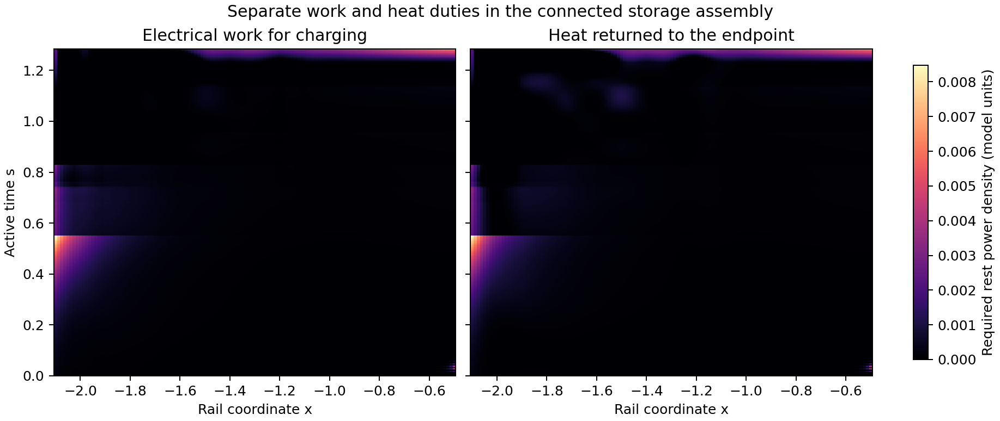

# Connected pressure paths for distributed electrothermal storage

The connected fluid and radial field close their interior energy and force
equations at a small stress burden when the electrical stores can charge
and discharge. The refined finite-rate history requires negative null stress
0.104 at carrying-flow fade, with the fluid's thermal pressure included.
Its physical completion is an interface that delivers electrical work and
returns heat simultaneously, together with specified terminal reactions.
The archived endpoint tensor fixes the net exchange; the separate work and
heat duties require their own constitutive and receiving-capacity calculation.

The short confined-fluid couplings in the [graded-storage study](GRADED_ELECTROTHERMAL_ASSEMBLY.md)
leave loaded pressure ends and a thermal exchange. This investigation connects
the pressure-bearing material across the tested storage patch and includes its
thermal pressure in the coupled conservation equations. The calculation keeps
the active geometry, fitted endpoint heat/current tensor, and scheduled protected
packet. It addresses the late patch, from preparation at s=0 to carrying-flow
fade at s=1.285, with a reset extension conditional on the first result.

The standing support and receiver/reset plant already have mechanical and
thermal interfaces in component cards 002, 005, and 006. Their physical load
capacity remains an explicit construction requirement. Consequently, the first
comparison records the two end tractions. A stronger control balances the
fluid and field radial pressures at both ends, removing their net traction
from the patch's external mechanical ports.

## Registered construction

The radial electric field retains H=R^4 u_E and stress
(u_E,-u_E,0,u_E). A connected material phase carries conserved rest mass n
and isotropic thermal pressure p, with rest energy density rho=n+3p. This
gamma-law model represents a pressure-bearing thermal constituent and cold
inertia at a common velocity. It supplies a concrete thermal-pressure response;
an actual mixture requires its own opacity, charge-carrier, and transport laws.
The adiabatic sound speed is c_s^2=4p/[3(n+4p)], bounded by 1/3.

The model follows the usual relativistic ideal-fluid stress construction and
gamma-law thermodynamics; finite charge-current and heat-current dynamics
require additional constitutive equations. Relevant primary frameworks are
[Pandya, Most, and Pretorius](https://arxiv.org/abs/2209.09265) and
[Andersson's charged multifluid construction](https://arxiv.org/abs/1204.2695).
Their existence motivates these constitutive choices; the numerical rail
results below come from the repository's active metric and endpoint tensor.

With prescribed coordinate-fixed material motion,

    v = B beta/alpha, Gamma = (1-v^2)^(-1/2), N_lapse = alpha/Gamma,
    D = Gamma B R^2, N_mass = D n, U = 3D p, lambda = partial_s ln D,

N_mass is conserved on each worldline. The coupled equations are

    U_s + lambda U/3 + (Gamma B/R^2) H_s = S,
    H_x - R^4 p_x - R^2 a_s [N_mass + 4U/3]
        - (4/3)(v R^2/N_lapse) U_s = B R^4 F_endpoint,
    S = -alpha Gamma B R^2 (P_endpoint-v F_endpoint).

These equations include the fluid's compression heating, inertia, pressure
gradient, and the electromagnetic work. Every interior momentum equation is
retained. The field and fluid may exchange force locally along the full path;
their tensor sum supplies the reaction that the previous construction exposed
at three internal contacts. There is no independent adjustable thermal sink
in this first completion test. Net heat exchange is exactly the complementary
exchange with the archived endpoint medium. The receiver/reset export path
remains a distinct possible extension.

The new initial thermal energy first equals the earlier allocated buffer heat.
A preparation control allows extra positive initial heat and optimizes its
profile. Both controls preserve the same rest-mass profile. Field energy stays
positive, decreases passively, and has proper reduced discharge rate at most
one in the principal comparison. The rate is a registered response comparison,
with the unit conversion set by the eventual physical length scale.

The objective minimizes the largest supplied null projection over all null
directions. A secondary energy objective selects among equally good peak
solutions when its bounded solver completes. Exposed-end and balanced-end
variants distinguish interior pressure transmission from external reaction.
Balanced ends require p=u_E; their individual material and electromagnetic
interfaces still require physical charge carriers and containment.

## Bounded decision and verification

The first round compares fixed and adjustable preparation with exposed or
balanced end tractions. A successful low-burden candidate receives separate
space and time refinement, an independent full-tensor divergence audit, and
the remaining-source diagnostic against G/(8 pi). A failed class receives a
bounded relaxation or force-balance witness sufficient to identify its cause.
An unresolved solver result remains a numerical outcome.

The strongest completion would supply positive material/field histories,
finite rates, internal force closure, tolerable quantified end reactions, and
a source burden comparable to the earlier local coupling estimate. A large
pressure-transmission cost or incompatible joint energy history would identify
the limitation of a continuous, co-moving pressure link. The study retains the
separate remaining quantum-source, material stability, earlier preparation,
and full-cycle gates of the rail assembly.

Independent computations run in four processes, each with one BLAS thread.
Tests compare the scalar fluid and field equations to covariant tensor
divergence on a time-dependent metric, check manufactured flat-space pressure
transmission and closed-end force obstruction, and verify compression work.
Reports are written manually at the numerical milestones.

## First round: the cost appears along the connection

The initial four 32-cell cases establish one feasible joint history: extra
thermal preparation with exposed end tractions. It has initial slice energy
68,073.78 and peak supplied null stress 8.73223. Its remaining negative null
requirements are 8.20130 at startup and 8.72294 at fade. The retained initial
heat profile and both balanced-end cases are infeasible in this discretization.
The feasible case's independent tensor residuals are 0.201% for energy and
0.363% for force, measured against the sums of equation-term magnitudes.

A separate extension of the archived short couplings makes the load-path
mechanism explicit. For the rho=3p fluid on a slice with partial_s p=0,

    p_x + 4 Gamma B a_s p = Gamma B F_required.

The minimum positive solution connects all three archived force contacts
through the full patch. Its two end pressures remain measured loads. At
startup it requires peak pressure 221,216.7 and slice energy 30,913,090; at
fade, peak pressure 56.4225 and slice energy 7,015.13. The earlier isolated
pieces at those phases cost 158.34 and 16.69 in slice energy. The pressure
link transmits each contact's load and also supports the intervening fluid.
The integrating factor accumulates that self-weight across the large clock
gradient. The 513-to-1025-point comparison changes pressure by at most
0.0034% and energy by at most 0.0080%.

Thus the earlier small local coupling cost supplies a component estimate;
completing it as a continuous pressure column introduces a substantial new
cost. Joint redistribution of field and thermal energy reduces the raw
column cost, while its first solution still requires much more source stress
than the local construction. The next bounded checks refine that joint
solution and derive the balanced-end force obstruction with the time and
shift terms retained.

## Refinement and the reaction requirement

The 64- and 128-cell refinements, with 128 and 256 time intervals, are all
infeasible at the principal discharge rate. Thus the first coarse history
supplies no converged candidate at that rate. Allowing unrestricted passive
discharge restores a 32-cell history even with the original thermal allocation,
at peak supplied null stress 11.63855 and maximum interval-averaged reduced
discharge rate 290.775. Its initial slice energy is 90,902.04. These results
motivate a final rate control at finer resolution and an optimistic reversible
field-charging control. The latter tests the significance of passive discharge;
its conversion entropy and charge-current laws remain additional requirements.

The balanced-end obstruction has an independent integrated form that retains
the active time dependence. Put q=p-u_E, b=4v/(3N_lapse R^2),
r=-H_s/H, and C=4 Gamma B a_s-b lambda D. The coupled equations give

    q_x + C q + [C-4(ln R)_x+b D r] u_E
        = -B F_endpoint-Gamma B a_s n-b S.

For passive conversion with reduced conductivity at most sigma,
0 <= r <= 2 sigma N_lapse. With W=exp(integral C dx), integration yields

    W_right q_right - q_left = I - integral W K u_E dx,
    I = integral W [-B F_endpoint-Gamma B a_s n-b S] dx.

At fade, the 2049-point evaluation gives I=-2.1946573 and a positive minimum
K=0.4446935 over the allowed rate interval, for both sigma=1 and sigma=10.
The 1025-to-2049 refinement changes I by 0.00037%; the positive coefficient
margin persists. Therefore balanced q=0 ends conflict with the integrated
force equation in this constitutive class. Field energy is nonnegative, so
its contribution strengthens the required boundary reaction. The finite
shift terms enter the displayed identity and numerical witness.

The obstruction identifies a reaction-bearing role. Fluid pressure and field
redistribution can transmit internal loads, while this co-moving assembly
still needs a supplied external reaction. Additional divisions of the same
fluid and field leave the summed force balance intact. A physical wall or
support adds its own tensor and can change that balance; its capacity is
precisely the remaining construction requirement.

## Bidirectional conversion changes the interior result

The final rate controls recover 64-cell passive histories at peak supplied
null stress 7.24840 for rate ten and 7.11498 with unrestricted discharge.
The 128-cell, 256-interval rate-ten control remains infeasible. Increasing
the discharge rate therefore supplies no converged low-burden passive history.

In contrast, permitting both charging and discharging produces a 64-cell
history with peak supplied null stress 0.0913135, initial slice energy 625.359,
and fade slice energy 43.9036. The remaining negative-null requirement at fade
is 0.102688. The left and right peak terminal-traction magnitudes are 0.010383
and 0.043245. The fluid carries its actual thermal pressure, and all interior
force equations are present. Its sampled speed remains the prescribed
coordinate-fixed target, at most 0.202141c.

This control identifies a useful constitutive distinction: a field that can
recharge locally has substantially more freedom to match the changing fluid
pressure and geometry than a passively discharging store. Its unconstrained
interval-averaged charging and discharge rates reach 228 and 423. The next
comparison imposes finite rates in both directions and refines the grid.

Local charging also has a thermodynamic requirement. Define C=H_s/(N_lapse R^4)
and E=-Gamma(P_endpoint-v F_endpoint). Positive C stores work in the electric
field; the fluid receives E-C as nonmechanical energy. Directly assigning
incoming endpoint energy to electrical work requires C <= max(E,0).
Where E<0, the endpoint can instead be a heat-dump port for a heat engine:
heat extracted from the fluid is C-E, electrical work is C, and dump heat
is -E. The required efficiency is C/(C-E). Its physical temperature ratio
and entropy balance still require the endpoint medium's constitutive law.

Two additional inverse controls isolate this requirement. The direct-work
control limits charging to incoming endpoint energy. The optimistic heat-engine
control also allows fluid heat extraction where the endpoint exports energy,
while requiring direct work elsewhere. These controls use a single net-energy
port, granting all incoming endpoint energy as usable work. The rail's distinct
work-current and heat-current channels also permit simultaneous work delivery
and heat return with positive net incoming power. Their separate physical
response and stress therefore remain a larger construction class than either
restricted control.

## Coefficient-retention audit

The finite bidirectional comparison converges to a small supplied-null peak:
0.0938878 at 64 cells and 0.0937354 at 128 cells with twice as many time
intervals. The refined initial slice energy is 632.965; the independent force
residual is 0.0529% of the summed equation-term magnitudes.

However, the first heat-engine solver status conflicts with the feasible-set
ordering: its constraints include every direct-work history, and a direct-work
history succeeds on the same grid. Direct substitution of that accepted history
into the heat-engine problem gives maximum scaled equality residual
9.45e-9 and inequality violation 1.29e-14. This warrants a numerical audit of
the infeasibility statuses before they support a physical conclusion.

HiGHS deletes coefficients at or below 1e-9 by default, as documented in its
[matrix-size options](https://ergo-code.github.io/HiGHS/dev/options/definitions/#small_matrix_value).
The large volume-weighted stores can give small shift coefficients a measurable
product. The audit therefore uses the supported 1e-12 retention threshold for
both optimization stages and checks the original matrices after solving.
A manufactured regression verifies a small coefficient multiplying a large
store. Earlier infeasibility labels remain archived solver outcomes; the
retained-coefficient rerun determines the final comparison.

## Final comparison and the missing interface

The retained-coefficient run preserves the finite bidirectional result and
recovers a feasible heat-engine control. The passive rate-one 64-cell case,
passive rate-ten joint refinement, balanced-end case, and direct-net-work
control retain infeasible solver outcomes. The analytic reaction witness and
the explicit work/heat decomposition provide the physical conclusions; these
solver outcomes concern their registered discrete constitutive restrictions.

| Retained comparison | Peak supplied null | Initial slice energy | Required negative null at fade |
| --- | ---: | ---: | ---: |
| Finite bidirectional stores, 128 cells / 257 intervals | 0.0937354 | 632.9654 | 0.103982 |
| Single-net-port heat-engine control, 64 cells / 129 intervals | 5.60987 | 43,659.09 | 5.63087 |

The refined bidirectional history has slice energies 632.9654 at startup,
371.9845 at s=0.5, and 44.8306 at fade. Its remaining negative-null requirements
at those phases are 0.073106, 0.070556, and 0.103982. The secondary energy
optimization reaches its time limit in this run, so these are the retained
primary history's energies. The minimax peak has a primal-dual gap below 7e-16.
The maximum original scaled equation residual is 6.96e-9; the maximum unscaled
residual is 2.69e-6. Independent reconstructed-tensor residuals are 0.559% for
energy and 0.0529% for force relative to summed term magnitudes.

The essential interface can be written explicitly. Let W=max(C,0) be
electrical work delivered from the endpoint current system into charging
stores, and let Q=E-W be heat delivered from that system to the fluid.
Discharging field energy heats the fluid locally in this particular split.
Then the endpoint exchange is exactly W+Q=E, and the fluid receives E-C,
as required by the coupled equations. Thus W>0 and Q<0 describe concurrent
electrical delivery and heat return. A positive E can coexist with both.

For the refined history, integrating local rest power over the proper
worldtube gives the following duties:

| Interface duty | Processed energy in model units |
| --- | ---: |
| Electrical work delivered for charging | 46.9435 |
| Heat returned to the endpoint medium | 46.7339 |
| Heat delivered from the endpoint to the fluid | 0.55334 |
| Net endpoint energy delivered | 0.76287 |
| Heat return occurring during positive net endpoint delivery | 21.7676 |

These are throughputs for this history. Initial work-reserve capacity depends
on preparation, recovery, incoming work currents, and the separate storage
law. Likewise, the time-dependent geometry gives local proper-work integrals
rather than a global conserved Killing energy. The 64-cell comparison processes
43.8512 units of charging work and 43.6401 units of returned heat. Their roughly
7% variation exceeds the 0.16% change in peak supplied null stress; the port
duties remain preliminary sizing data. Neither optimization minimizes
converter throughput.

The largest refined charging and return-heat densities are each 0.008485 in
model units. The integrated work/heat split agrees with the prescribed net
exchange to floating-point precision. Supplying those gross currents still
requires finite stored free energy or an incoming work route, a receiving
entropy capacity, carrier inertia, current relaxation, and the full tensor
of any added converter or storage material. The earlier Comer particle and
entropy construction supplies a relevant constitutive framework; its separate
reference evolution supplies no temperature or capacity certificate for this
archived active endpoint tensor.

The mechanical completion also remains explicit. Peak end-traction magnitudes
are 0.0101422 on the left and 0.0444561 on the right. The integrated reaction
witness extends to charging and discharging with |r| <= 2 sigma N_lapse:
replace its field coefficient minimum by
C-4(ln R)_x-|bD|2 sigma N_lapse. It remains positive at fade for sigma one
and ten, while the weighted drive remains -2.1946573. The existing standing
support therefore needs a specified reaction-bearing connection. Its tensor
and capacity remain separate from the completed interior force balance.

## Construction decision and limits

The useful continuation is a bidirectional electrical converter with separately
counted work and heat-return ports, connected to the existing regulated
heat/current and receiver infrastructure. The confined fluid supplies the
pressure response and transmits interior loads. The standing support receives
the terminal reactions. This division preserves the rail's component duties
and identifies a concrete interface law and duty map to construct next.

The current result is an inverse supplied-stress construction on the late
non-live patch, which covers 35.75% of the earlier full-interval exchange
weight. Material motion is prescribed with maximum speed 0.202141c; its free
evolution and feedback stability remain to be demonstrated. The EOS has
positive conserved rest mass and nonnegative thermal energy, with some cells
reaching zero thermal reserve. Physical temperature margins, entropy flow,
finite current response, earlier packet-safe preparation, and a complete
reset cycle consequently remain acceptance conditions. The independently
supplied negative-stress sector also remains open.

This round stops at the physical work/heat-interface and terminal-reaction
gate. The small stress estimate includes the connected thermal fluid and field;
it acquires further contributions when the required converter, carrier, and
support tensors are supplied. A measured net endpoint exchange alone provides
insufficient information to select their capacities.

The focused fluid, field, local-pressure, and existing covariant-tensor tests
total **40 passing cases**. Four computation workers were used throughout.
The artifact audit verifies **178 source/input and output hash comparisons**
across five stages, retaining historical source revisions where needed. Numeric
comparisons, port histories, work/heat maps, and the reaction witness are in
[`data/pressure_linked_storage/derived`](data/pressure_linked_storage/derived/).

The subsequent [finite-converter evaluation](REGENERATIVE_CONVERTER_EVALUATION.md)
supplies explicit work and thermal inventories for this duty. It identifies a
local prepared-work requirement near 43 units under ideal recovery and a
decisive material-mass burden for the benchmark capacitor implementation.
The formal field/enclosure control retains physical thermal and mechanical
completion requirements, so the small interface estimate above remains
conditional on supplying those additional components.
