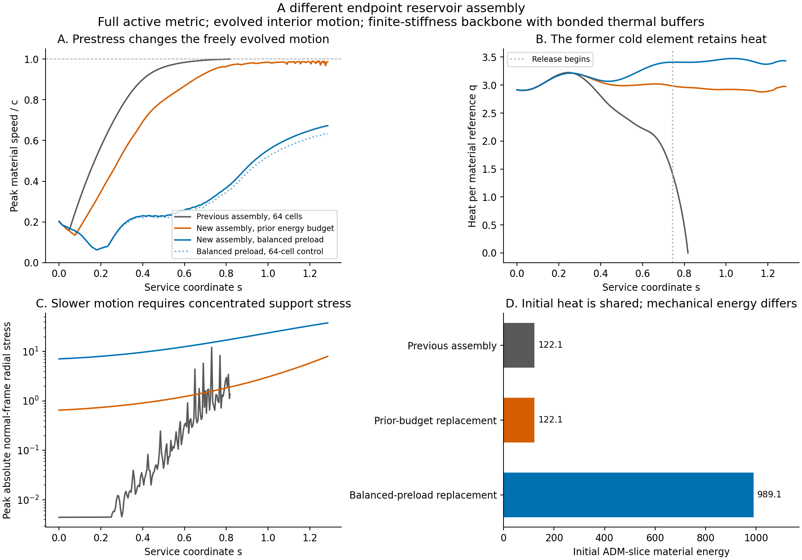

# Prestressed support and the reservoir's material velocity

Date: 10 September 2026.

A different mechanical assembly substantially reduces the material speed
through release on the same active metric. A prestressed causal backbone
with finite stiffness throughout and bonded heat buffers reaches the
carrying-flow fade at \(s=1.285\), with peak speed 0.63–0.67 and
positive heat. Its initial ADM-slice energy is about 8.1 times the
previous assembly's, and its concentrated radial stress is much larger.
At the previous energy budget, the replacement retains heat through the
completed interval but develops local speeds close to 0.99.

The near-light-speed material history therefore depends strongly on the
tested mechanical construction. The present replacement trades that
history for a substantial support-energy and stress requirement. It
establishes a mechanical alternative while leaving an acceptable complete
source construction open.

The [previous conducting-reservoir trial](ACTIVE_RESERVOIR_CAUSAL_TRANSPORT.md)
retains the archived material
motion, including a cold-element speed of 0.999776 relative to the local
normal frame. This investigation changes the mechanical assembly and
evolves its momentum. The objective is to determine whether the extreme
speed can be reduced while retaining heat, admissible stress, and an
explicit energy and reaction-force budget.

## Force audit and assembly choice

In the archived thermal-only 64-cell body, the material label 0.5 starts
at \(\ell=-1.3\), with \(\alpha=185.53\), \(B=239.13\), and
normal-frame speed \(-1.68\times10^{-5}\). The initial canonical
force terms at that node are:

| Contribution | Momentum rate |
|---|---:|
| Neighboring material traction | 129.5491 |
| Lapse gradient | −102.3763 |
| Radial metric gradient | −51.9635 |
| Shift gradient | \(3.71\times10^{-8}\) |
| Direct endpoint forcing | −0.01450 |

The geometric and material force imbalance dominates this initial
acceleration. At \(s=0.5\), the same element already has speed
−0.94948. Its traction, lapse-gradient, radial-gradient, and endpoint
contributions are 13.4663, −25.7789, 7.6910, and −0.7323.
Thus the mechanical stress preparation is a direct target for changing
the acceleration.

Coordinate-fixed paths across the declared body have maximum normal
speed 0.20214 at startup, 0.000624 at 0.5, and approximately
\(3.44\times10^{-6}\) at 0.81756. These are kinematically available
slow paths on the same active metric. Supplying the stress and work
needed to follow them is the material construction question.

The alternative assembly is a prestressed longitudinal backbone with
attached local thermal buffers. The two components share their motion
through a longitudinal bond. The backbone carries pressure and tension;
the buffers retain the prior material reference amounts, rest mass,
heat capacity, initial heat, and endpoint exchange. This replaces the
previous soft elastic/relaxing support. The endpoint medium, protected
packet, and other rail components retain their existing roles.

## Constitutive law and coupled motion

The backbone uses the causal limiting elastic law

\[
 \epsilon_b=\frac{K_b}{2}(n_b^2+1),\qquad
 p_b=\frac{K_b}{2}(n_b^2-1),\qquad K_b=0.001.
\]

This is the one-dimensional elastic law developed in
[Natário's relativistic rod and string analysis](https://arxiv.org/html/1406.0634).
Its longitudinal signal speed is unity and it satisfies the dominant
energy condition. Here the bonded thermal material adds inertia. With
buffer number density \(n_t\), unit rest mass, and heat per reference
\(q\), the composite has

\[
 \epsilon=n_t(1+q)+\epsilon_b,\qquad p=p_b,
 \qquad c_L^2=\frac{K_b n_b^2}{n_t(1+q)+K_b n_b^2}<1.
\]

The physical radial tensor carries the same line-to-volume factor
\(A/R^2\), with \(A=0.4\). Both component energies, their common
momentum, and the backbone's stress are included in the material
action. [Brown's variational treatment](https://arxiv.org/abs/2004.03641)
provides the general framework; the bonded specialization and its
discretization are derived here.

For a material cell of width \(h_i\), conserve thermal reference
\(\mu_i\) and backbone reference \(\nu_i\). The corresponding
densities are \(n_t=\mu_i/(B\Gamma h_i)\) and
\(n_b=\nu_i/(B\Gamma h_i)\). At a node with thermal quadrature
weight \(M\), let

\[
 a_b=\frac{1}{4B}\sum_{i\sim j}\frac{K_b\nu_i^2}{h_i},
 \qquad b_b=\frac{K_bB}{2}V_j.
\]

The nodal Lagrangian and momentum are

\[
 L_j=-A\alpha\left[\frac{M(1+q)}{\Gamma}
                   +\frac{a_b}{\Gamma^2}+b_b\right],
 \qquad \pi_j=ABv\left[M(1+q)\Gamma+2a_b\right].
\]

Interior positions and momenta evolve from this action. The active
lapse, shift, radial scale, areal radius, and temporal derivatives
remain in the supplied tensor, force, heat, and work calculations.
The two exterior ends retain their measured reaction ports. Their
support material tensors and a responding endpoint contact law remain
additional requirements.

## Initial equilibrium and equal-energy comparison

At startup the cell weights \(X_i=K_b\nu_i^2\) enter the interior
force balance linearly. Solve for positive \(X_i\) such that the
canonical momentum derivative equals that required for zero initial
coordinate acceleration. The calculation includes the actual shift
and its derivative, changing metric, thermal inertia, prescribed heat
rate, and endpoint force. Among these equilibria, minimize initial
ADM-slice energy. The registered positivity floor is \(X_i=10^{-12}\).

At 64 cells, the equilibrium residual is below \(6\times10^{-13}\).
Its initial energy is 762.298, compared with 122.130 for the earlier
thermal-only assembly. The backbone contributes 727.909. Thus a
mechanically balanced starting state is available within this model,
with a measured initial energy multiplier of 6.242.

The second assembly scales the equilibrium backbone weights to recover
the prior total initial energy, while preserving the same material
heat and buffer rest mass. At 64 cells it retains 11.947% of the full
equilibrium weights. Its initial force imbalance is then allowed to
drive the material. This control tests how much velocity reduction
survives at the existing energy budget.

## Registered dynamic comparison

The two assemblies start with the same coordinate-rest material
positions in \(-2.1\leq\ell\leq-0.5\), with 32 and 64 cells.
Both subsequently evolve freely in their interiors. The target interval
extends through the carrying-flow fade at \(s=1.285\), with the
existing physical-domain stops retained. Maximum step is 0.0005 and
the material-wave Courant factor is 0.05. Four independent workers
receive at most 240 seconds per run.

The comparison records peak speed throughout the body and at material
label 0.5, Lorentz factor, heat minimum, dilution, density, radial
stress, backbone energy, and end reactions. The independent canonical
energy, material momentum, and thermal balances remain acceptance
checks. Initial energy equality and full-body stress accounting expose
any transfer of the original velocity burden into another component.

Six analytic controls check the common-deformation sound speed,
Hamiltonian force and velocity derivatives, active metric work and
end reactions, a static-lapse equilibrium with freely evolving interior
nodes, convergence toward its continuum preload, and preservation of
heat under the equal-energy allocation. These controls precede the
registered active evolutions. The main design disclosure retains its
established content; this report records the bounded assembly trial.

## First dynamic milestone

Both equal-energy assemblies complete the carrying-flow fade at 1.285.
Their minimum heat stays at 0.25, and the previously depleted material
label retains heat about 3.0. This thermal improvement occurs with
evolved mechanical motion and the same initial heat and total energy.
Their peak whole-body speeds are 0.992935 and 0.992801 at 32 and
64 cells, respectively. The Lorentz factor remains much lower than
the prior cold-element value near 47, while highly relativistic local
motion persists.

The fully equilibrated versions keep speeds below 0.293 at 32 cells
and 0.210 at 64 cells before reaching a compression-resolution limit
at 0.57736 and 0.49926. Their canonical energy errors remain below
\(1.5\times10^{-10}\). The compressed cell is precisely the cell
whose optimized backbone weight equals the \(10^{-12}\) floor:
cell 24 of 32 or cell 49 of 64, near \(\ell=-0.86\). Thus the
minimum-energy initial equilibrium contains a weak section. Its
compression, alongside the measured sixfold energy burden, limits
this first assembly.

The equal-energy solutions also develop rapidly oscillating local
velocities. At 1.285 the label-0.5 velocities are −0.2804 and +0.2159
at 32 and 64 cells, although their temperatures remain close. The
full supplied stress and local motion therefore require further
resolution and an adequately stiff response through the weak section.

The next bounded refinement requires an initial composite longitudinal
signal speed of at least 0.5 at every cell endpoint quadrature value.
This gives a positive lower bound on each backbone weight before
minimizing the initial equilibrium energy. Its associated equal-energy
control scales that completed profile to the prior budget; its actual
minimum signal speed is measured after scaling. The two versions are
registered at 64 and 128 cells with the same time-step and duration
controls. This addresses the identified weak section without adding a
new force port or changing the endpoint load.

## Finite-stiffness result

The refined preload solves the same force-balance equations with the
additional requirement

\[
 X_i\geq \frac{c_{\min}^2}{1-c_{\min}^2}
 \max_{j\in i}\{\mu_i(1+q_j)h_iB_j\Gamma_j\},
 \qquad c_{\min}=0.5.
\]

This fixes the weak-section failure in the registered interval. The
interior dynamics remain generated by the material action, with finite
wave speeds and the existing measured end reactions.

| Assembly | Cells | Reached \(s\) | Peak \(|v|\) over the run | Minimum heat | Initial energy / prior assembly |
|---|---:|---:|---:|---:|---:|
| Balanced preload, finite stiffness | 64 | 1.285 | 0.632952 | 0.25 | 8.11494 |
| Balanced preload, finite stiffness | 128 | 1.285 | 0.672800 | 0.25 | 8.09594 |
| Prior energy budget, finite stiffness | 64 | 1.285 | 0.989890 | 0.25 | 1 |
| Prior energy budget, finite stiffness | 128 | 1.102673 | 0.986516 | 0.25 | 1 |

The last run reaches its registered 240-second computation budget with
positive heat; its data cover the stated partial interval. The full
128-cell preload completes 1.285 with maximum Lorentz factor 1.35167.
At material label 0.5, its final velocity is +0.57525 and heat is
3.43184. The starting heat at that label is approximately 2.91, shared
with the preceding thermal-only preparation.

The equal-energy 64-cell version also retains heat at the formerly cold
element, ending at 3.01184. Its remaining fast motion is spatially
localized: up to 12.5% of thermal reference material exceeds speed 0.9
at an output. The peak occurs at material label 0.546875, near
\(\ell=-1.55174\) at \(s=1.245\). Thus this allocation preserves
the thermal duty while retaining the user's material-velocity concern.

## Energy, stress, and reaction costs

The finite-stiffness balanced preload at 128 cells starts with ADM-slice
energy 989.088, compared with 122.171 in the corresponding prior
assembly. It ends at 4127.142, with its energy and momentum changes
accounted by the active metric and endpoint exchange. Initial canonical
energy is 25777.281, compared with about \(3.47\times10^4\) for the prior
assembly. The lapse and shift weight canonical energy differently from
local slice energy; both budgets are therefore retained.

The initial preload concentrates support toward the lower-lapse end.
At 64 cells, the following comparisons use the same active phase and
the maxima of the respective material tensors across the body:

| Service coordinate | Balanced-preload peak density / prior peak | Balanced-preload peak radial stress / prior peak | Prior-budget replacement peak radial stress / prior peak |
|---:|---:|---:|---:|
| 0 | 646.34 | 1619.06 | 147.12 |
| 0.5 | 105.15 | 253.27 | 23.94 |
| 0.815 | 14.62 | 15.70 | 1.69 |

The startup comparison directly compares the prepared initial tensors.
Later ratios inherit the prior assembly's known end-region compression
and spatial-resolution limitations.

At startup the balanced preload's peak density is 7.17804 and its
peak absolute radial stress is 7.16850. The prior assembly's
corresponding peaks are approximately 0.01111 and 0.004428.
The density increase is substantially more concentrated than its
eightfold total-energy increase. The equal-energy replacement also
redistributes its available energy into a much larger initial stress
peak.

By the end of the full 128-cell preload run, peak density and absolute
radial stress reach 37.8908 and 37.8687. The maximum measured end
reaction force reaches 320.143 in the inherited force normalization.
These are supplied material stress and reaction requirements for this
trial. Matching them to the geometry's complete component ledger,
including physical anchor tensors, remains part of source completion.

The conserved backbone reference makes this concentration consequential:
the backbone must support the buffers and its own stress-energy while
the active radial metric changes. Preparing a sufficient pressure
gradient changes the acceleration, and the energy stored in that
gradient remains in the material tensor. The low-speed result therefore
comes with a measured mechanical source burden.

## Numerical assessment

For the full preload at 1.285, the 64/128-cell comparison gives position
RMS difference 0.0005104, velocity RMS difference 0.04347, and heat RMS
difference 0.03137 on common material labels. Density and radial-stress
relative RMS differences are 0.5066% and 0.5023%. End regions contain
approximately 89% and 90% of their respective squared differences.
The change in peak speed, from 0.633 to 0.673, sets the precision of
the present velocity result. The strong separation from the original
near-light-speed history persists at both resolutions.

The lower-energy solution has larger short-scale velocity differences.
At the common phase 1.0, the finite-stiffness 64/128-cell comparison
gives velocity RMS difference 0.2283 and density/radial-stress relative
RMS differences of 9.05% and 9.37%. Its complete continuum stress
therefore remains less well resolved than the full preload's.

The maximum independent canonical-energy errors are
\(8.7\times10^{-9}\) and \(5.8\times10^{-7}\) for the full
64- and 128-cell preloads. Momentum-balance errors remain below
\(4.8\times10^{-12}\), and thermal-balance errors below
\(1.8\times10^{-14}\). The prior-budget runs have canonical errors
below \(2.6\times10^{-5}\). All evolutions retain their positive
rest-energy and causal longitudinal domains. Packet clearance remains
at least 0.15 within the declared post-startup body.

A seventh analytic control verifies that the stiffness floor enforces
the requested sound speed while retaining static-lapse equilibrium under
free interior evolution. All seven assembly controls pass. The archived
force decomposition closes to \(3.6\times10^{-14}\).

The figure also has a
[standalone PDF](figures/prestressed_buffer_velocity.pdf).

## Selection consequence and stopping point

This assembly changes the velocity history directly. It also shows why
energy inventory alone is insufficient for selecting the replacement:
an equal initial energy can conceal a much larger local stress peak,
while the balanced, slower construction requires both more initial
energy and a concentrated load-bearing tensor.

The bounded comparison ends at this mechanical load-path tradeoff.
The registered longitudinal assembly has yet to combine low material
speed with the prior source burden. Its successful runs cover release
and the carrying-flow fade; reset through 3 and the earlier preparation
interval remain additional duties. No full Einstein-source or physical
anchor completion is claimed by the material evolution.

The constructive information concerns how load is supported and where
it accumulates. Further selection can use the existing distributed
substrate and angular support roles to examine alternative load paths,
with their own added tensors and reciprocal forces. The present result
supplies a quantitative benchmark for that comparison. Increasing
thermal conductivity around the earlier near-light-speed trajectory
would leave this mechanical question unresolved.

The [data directory](data/prestressed_buffer_assembly/) preserves eight
active evolutions, both preload constructions, the force/kinematic audit,
and spatial and stress comparisons. Input and implementation hashes
identify each committed stage. The
[integrity audit](data/prestressed_buffer_assembly/integrity.json)
verifies all 120 recorded source references against their current or
committed versions. This supporting report was written
manually; the numerical scripts emit measured records and plots.
