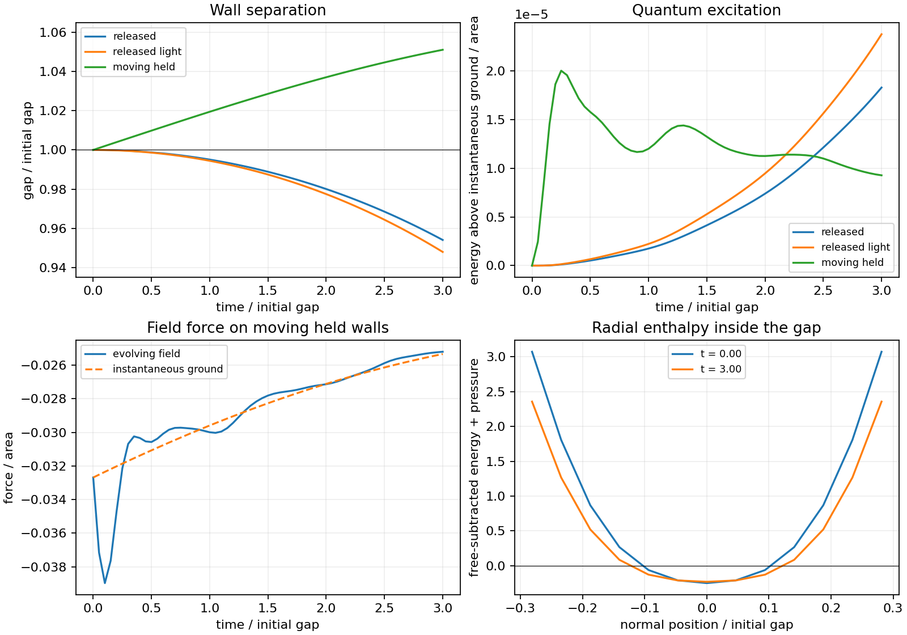

# Quantum Field with Moving Material Boundaries

Date: 8 September 2026.

The explicit Gaussian field has positive canonical kinetic energy while
its finite-cutoff gap stress has negative radial enthalpy. All sixteen
coupled field-and-wall evolutions complete their three light-crossing
times, with independently verified energy balance. This supplies an
explicit alternative to the negative kinetic coefficient of the preceding
local elastic identification.

The complete assemblies retain positive energy, and their field dressing
and local stresses vary with the ultraviolet cutoff. Consequently this
round establishes a bounded quantum response; the material matching and
the full rail source construction remain open.

## Registered question and model

The [vacuum support comparisons](VACUUM_SUPPORT_SELECTION_ROUNDS.md) match the
initial rail tensor algebraically, while their local elastic identification
has negative radial kinetic energy. This round retains independent quantum
field degrees of freedom and lets their radiation pressure determine the
motion of material boundaries.

The bounded model is a real scalar field in 3+1 dimensional flat spacetime,
with translational symmetry parallel to two partially transmitting planar
walls. The normal direction includes the gap and its exterior. Transverse
Fourier modes reduce the calculation to independent one-dimensional quantum
oscillator systems. The wall positions are \(z=\pm a(t)/2\); each has
positive bare mechanical mass per area \(\sigma\). Their separation has bare
wall reduced mass \(\mu_W=\sigma/2\). The field starts in the two-wall Gaussian ground
state. Subsequent mode functions and the wall separation evolve together.

This is a local source-model calculation. The retained curved rail metric
and its service conditions provide the subsequent stress requirements;
the present evolution takes place in the planar model. Its scope includes
the field inside and outside the gap and the mechanical boundary work.
Mirror force fluctuations and a quantum wave function for the wall motion
remain beyond this semiclassical mean-force approximation.

The partially transmitting scalar-wall interaction follows the model class
of [Fosco, Giraldo, and Mazzitelli](https://arxiv.org/abs/1704.07198).
We resolve a finite Gaussian thickness in place of the singular wall.
The need to retain field back-reaction and its energy balance is also
developed in [Butera](https://arxiv.org/abs/2603.13932v1). Our numerical
Hamiltonian keeps the Gaussian field explicitly instead of truncating a
time-derivative expansion of its force. These source papers motivate the
interaction and balance conditions; the finite regulator and numerical
implementation below are specified for this investigation.

In units \(\hbar=c=a(0)=1\), the normal box has length 12 and periodic
boundaries. Each wall contributes
\[
V_j(z,a)=\frac{8}{\sqrt{2\pi}\,0.16}
\exp\left[-\frac{(z-z_j)^2}{2(0.16)^2}\right].
\]
The positive potential gives reflection at low frequency and increasing
transparency at high frequency. It carries a finite physical thickness.
The two-dimensional transverse integral is
\(\int_0^8 k\,dk/(2\pi)\). A real Fourier basis includes normal harmonics
through \(m_{\max}\), giving \(2m_{\max}+1\) canonical oscillators.
The registered levels use
\((m_{\max},N_k,h)=(16,8,0.02),(24,12,0.01),(32,16,0.005)\).
The finite field bandwidth is explicit. These levels compare the normal
cutoff and integration accuracy; temporal convergence is checked separately
using the middle bandwidth at steps 0.02, 0.01, and 0.005 for the released
and moving-held cases. Static transverse cutoffs 8 and 12 are compared
through normal harmonic 48. Their interaction observables and one-wall
dressing energies are recorded separately.

Four scenarios run for at most three gap light-crossing times:

| Scenario | Wall mass per area | Holding stiffness | Initial separation velocity |
|---|---:|---:|---:|
| Equilibrium control | 1 | 0.5 | 0 |
| Released walls | 1 | 0 | 0 |
| Released lighter walls | 0.25 | 0 | 0 |
| Moving held walls | 1 | 0.5 | 0.02 |

For held walls the spring's natural separation balances the calculated
initial quantum force. The spring's stored energy is included. Its holding
mass per area is \(M_H=4K(1.20)^2\), supplying a nominal longitudinal speed
\(a\sqrt{K/M_H}\leq1/2\) over the permitted range and a separately
checked axial-energy margin. Uniform extension contributes \(M_H/12\)
to the separation's reduced inertia. This specifies the single mechanical
mode retained for the holding structure; its full internal modes remain
outside the calculation.
Released cases have neither a holding force nor that allowance.

Each evolution stops if the separation leaves \([0.65,1.20]\), either
wall's speed exceeds 0.10, a field operator loses positivity, or the
registered numerical budget is reached. The speed limit bounds corrections
to the finite-width wall shape and the single-mode representation of the
holding structure.

## Coupled Hamiltonian and energy accounting

The wall interaction retains the proper-time factor
\(\chi=\sqrt{1-\dot a^2/4}\). For Gaussian mode matrices \(F_k,P_k\),
let \(U=\frac12\sum_k w_k\operatorname{tr}(F_k^\dagger V(a)F_k)\)
denote the positive expectation of the two wall potentials. With
\(\mu_0=\sigma/2+M_H/12\), \(M_0=4\mu_0\), and separation momentum
\(p_a\), the finite mean-field Hamiltonian per area is
\[
H=E_{\mathrm{free}}[F,P]+B+\tfrac12 K(a-a_\mathrm{nat})^2+2M_H/3,
\qquad B=\sqrt{(M_0+U)^2+4p_a^2}.
\]
Here \(E_{\mathrm{free}}[F,P]\) contains the canonical scalar kinetic
and gradient energies. The last constant restores the rest energy of the
holding structure after its separation-mode inertia has been included.
The equations are
\[
\dot a=\frac{4p_a}{B},\qquad
\dot p_a=-\frac{\chi}{2}\sum_k w_k
  \operatorname{tr}(F_k^\dagger V_a F_k)-K(a-a_\mathrm{nat}),
\]
\[
\dot F_k=P_k,\qquad
\dot P_k=-[K_{\mathrm{free}}+k^2+\chi V(a)]F_k,
\qquad \chi=(M_0+U)/B.
\]
The positive interaction expectation adds \(U/4\) to the rest separation
inertia. The scalar kinetic term and the bare mechanical kinetic term
are positive. Positive scalar wall coupling contributes a cutoff-dependent
mirror mass in the underlying wall model as well; the discussion around
equation 14 of Fosco, Giraldo, and Mazzitelli gives this dependence explicitly.

The discrete-gradient integrator pairs an exact Gaussian field step at an
averaged operator with the same averaged force in the wall equation.
Its common difference quotient of \(B\) preserves the total Hamiltonian;
quantum mode normalization is preserved by the oscillator step. Time-step
refinement separately tests the resulting trajectory. Free-subtracted
spatial stresses use the actual instantaneous coupling \(\chi V\).
Excitation and the force lag compare the evolved state with the ground
state of that same instantaneous operator.

For a normal Fourier wave-number difference \(d\), the pair-potential
element is \(2A\cos(da/2)\). Its divided difference is evaluated as
\(-Ad\sin[d(a_1+a_2)/4]\operatorname{sinc}[d(a_2-a_1)/4]\),
where \(\operatorname{sinc}(x)=\sin(x)/x\). This continuous expression
preserves force accuracy at release from rest and at turning points.

Energy histories split \(H\) into \(E_\mathrm{free}+U\) and
\(B-U+K(a-a_\mathrm{nat})^2/2+2M_H/3\). These two complementary
bookkeeping components exchange energy while their sum stays fixed.
The physical scalar profile energy at nonzero velocity uses
\(E_\mathrm{free}+\chi U\), also recorded separately.

The static Casimir interaction is
\(E_\mathrm{int}=E_g[V_1+V_2]-2E_g[V_1]+E_g[0]\).
The total free-subtracted field energy instead retains both one-wall
dressing contributions. A finite barrier width regulates spatial shape;
the scalar one-body energy still depends on the field bandwidth.
Matching a microscopic material's measured mass, dispersion, and
renormalized stress would supply further physical input. The present
positive-bare-mass calculation makes this dependence explicit.

The finite-width profile is translated at fixed laboratory width with the
proper-time coupling retained. The mechanical coordinate follows a
semiclassical mean force. These are the specified approximations of this
local planar prototype.

The tests require conservation of field-plus-mechanical energy, preservation
of quantum mode normalization, and improving temporal and spatial
agreement. Static ground-state forces are checked against energy
derivatives. The final rail comparison includes both wall masses, the
one-wall field dressing, the vacuum interaction energy, and the holding
contribution. It tests the sign of the energy of locally homogenized
complete cells against the retained initial rail profile. Placing negative
gaps and positive boundaries in spatially distinct parts of a curved
construction requires a separately resolved geometry.

Four worker processes and single-thread numerical libraries are used.
The main calculation has a 600-second allowance, 1,536 MiB address space
per worker, and a 40 MB evidence allowance. State summaries are retained
at 61 times, with spatial field profiles at five times and complete final
mode functions and momenta. Initial states follow from the retained
operators and their ground-state spectra. The narrative report is written
manually.

## Field response and boundary motion

At the highest evolution level, the initial interaction energy per area is
\(-0.009181\) and the separation force is \(-0.032688\). The
free-subtracted scalar stress at the gap center has
\(E=-0.137327\), \(P_r=-0.113874\), and
\(P_\perp=0.745777\), giving \(E+P_r=-0.251201\).
The field's canonical kinetic term is positive, and the positive wall
coupling contributes 2.795271 to the separation inertia. The negative
local enthalpy therefore coexists with positive primitive kinetic terms
in this regulated field-and-boundary model.

The following results use normal harmonic 32, sixteen transverse nodes,
cutoff 8, and time step 0.005. Energies are per area in
\(\hbar=c=a(0)=1\) units.

| Scenario | Gap at time 3 | Separation velocity | Largest excitation above instantaneous ground | Complete free-subtracted energy |
|---|---:|---:|---:|---:|
| Equilibrium | 1.000000 | Within \(2\times10^{-13}\) of zero | Within \(2.4\times10^{-11}\) of zero | 16.744871 |
| Released | 0.954012 | −0.031977 | \(1.8281\times10^{-5}\) | 13.863802 |
| Released, lighter walls | 0.947892 | −0.036450 | \(2.3753\times10^{-5}\) | 12.363802 |
| Moving held walls | 1.051154 | 0.011708 | \(2.0010\times10^{-5}\) | 16.745578 |

Released walls approach one another under the attractive field force.
The mechanical motion gains approximately 0.001685 in the energy split
defined above, while the field component loses the same amount. A positive
excitation remains above the instantaneous ground state. Moving held walls
transfer approximately 0.001483 in the opposite direction. Their largest
force departure from the instantaneous ground occurs at time 0.10:
the actual force is −0.038977 and the ground-state comparison is −0.032350.
The approximately 20% transient force difference is substantially larger
than the numerical errors. By time 3 that difference has decreased to
0.000136. This is a finite-time response with quantum excitation and
back-reaction; the periodic model retains the emitted field degrees of
freedom within its box.

The equilibrium controls stay at their prepared separations. All cases
retain positive field frequencies and separation inertia, and all stay
inside the displacement and speed guards. The held cases retain positive
axial-energy margins for the specified holding mode. These results cover
the registered three light-crossing times and the retained mechanical mode.



## Cutoff dependence and the rail comparison

The interaction energy and force change moderately as the normal bandwidth
increases. The one-wall dressing and the local stress change substantially:

| Normal harmonic | Transverse cutoff | Interaction energy | Separation force | One-wall dressing energy | Center energy | Center radial enthalpy |
|---:|---:|---:|---:|---:|---:|---:|
| 24 | 8 | −0.009626 | −0.033826 | 5.096865 | −0.196823 | −0.267792 |
| 32 | 8 | −0.009181 | −0.032688 | 5.936492 | −0.137327 | −0.251201 |
| 48 | 8 | −0.008903 | −0.032011 | 7.175954 | −0.088871 | −0.267803 |
| 32 | 12 | −0.009613 | −0.034269 | 11.084406 | −0.052541 | −0.120590 |
| 48 | 12 | −0.009092 | −0.032997 | 13.766884 | 0.053799 | −0.192527 |

At cutoff 8 the force changes by about 2.1% between harmonics 32 and 48.
At harmonic 48 the transverse-cutoff change shifts it by about 3.1%.
The one-wall dressing nearly doubles under that transverse change, and
the central energy crosses zero. Finite width and high-frequency
transmission therefore coexist with a substantial one-body ultraviolet
dependence in this scalar model. Free subtraction defines the displayed
regulated stresses; a continuum material stress requires matched
counterterms and a microscopic optical response. The local energy values
in this table consequently carry their displayed regulators.

The influence on motion is already visible. Increasing the normal
harmonic from 24 to 32 changes the released final gap from 0.945301 to
0.954012. This change accompanies a larger field contribution to inertia.
With the bandwidth held fixed, halving the time step reduces successive
gap and velocity differences by factors 3.20–3.26. The separation between
temporal accuracy and changing field dressing is therefore explicit.

For the highest evolution level, one wall contributes 5.936492 of
free-subtracted dressing energy. The complete two-wall field has
\(2(5.936492)-0.009181\simeq11.863802\). Adding the two bare wall masses
gives 13.863802 for the released assembly; the held assembly also includes
its support rest energy and spring energy. The smallest complete energy
among all sixteen cases is 8.498000, in the coarse lighter-wall run.

There is also an exact sign bound within the specified finite model.
Every normalized field state satisfies
\(E_\mathrm{free}[F,P]\geq E_g[0]\), and positivity of the barrier gives
\(U\geq0\). Since \(B\geq M_0+U\),
\[
H-E_g[0]\geq 2\sigma+M_H+\tfrac12 K(a-a_\mathrm{nat})^2>0.
\]
An array formed by locally homogenizing complete copies of these cells
thus has positive energy density, including all field and boundary
contributions. Positive ordinary preload preserves that sign. The
retained initial rail instead requires negative energy at 1,651 of 2,049
sampled radii and negative radial enthalpy at every sampled radius.
The complete-cell architecture fails this initial energy-sign condition.
This comparison uses signs, independently of any conversion between the
cavity units and the rail's curvature scale.

A spatially resolved arrangement could place negative gap regions and
positive boundaries at different radii. Its counted stress tensor,
material response, curved-space quantum state, and boundary matching would
then determine its admissibility. The present result identifies those
inputs as the remaining construction problem. The Comer two-current
evolution and the repaired rail reference retain their existing status.
The bounded investigation ends with this explicit field response and the
complete-cell obstruction.

The subsequent [matched-mass boundary comparison](RENORMALIZED_BOUNDARY_SUPPORT_ROUNDS.md)
uses disjoint scalar sheets with fixed isolated physical masses. It retains
continuum negative gap stress and the finite surface binding energy.
An analytic bound makes the ordinary holding cost exceed the interaction
binding throughout that positive-coupling family. The accompanying rail
placement comparison distinguishes the positive proper energy of the
annulus from its negative increment in enclosed mass, while preserving
the full radial and angular stress requirements.

## Verification and retained evidence

The independent audit reconstructs the barrier matrices by real-space
quadrature, using the final quantum mode functions and momenta to rebuild
the Hamiltonian, force, frequency spectrum, normalization, and spatial
stress. All sixteen cases pass. The largest matrix difference is
\(1.14\times10^{-13}\), the largest reconstructed scalar difference is
\(6.82\times10^{-13}\), and the largest spatial-profile difference is
\(8.53\times10^{-14}\). Quantum normalization errors stay below
\(3.56\times10^{-13}\). The largest total-energy drift is
\(4.43\times10^{-11}\), while the static force/energy derivative
comparisons agree within \(9.88\times10^{-10}\).

The direct force quotient in the first implementation lost precision at
the second release step, where \(a=0.9999970828\). The analytic
sine/sinc quotient above resolves that cancellation. A regression checks
coincident separations, finite displacements, and release from rest.
The complete harness passes **324 tests** with four existing multiprocessing
deprecation warnings in 36.26 seconds. The nine quantum-boundary tests cover
positive potentials, translation symmetry, energy-derived forces,
Hamiltonian motion, quantum normalization, transparent-wall controls,
temporal refinement, and spatial-energy accounting.

The completed main run takes 53.08 seconds with four workers. Its largest
worker resident memory is approximately 137.1 MiB, below the registered
1,536 MiB limit. The independent audit takes 0.89 seconds. The retained
evidence occupies approximately 19 MB before Git storage. It contains
sixteen final quantum states, sixteen histories, sixteen spatial-profile
files, twenty-four static comparisons, and the independent audit.

The source kernel, reference tensor ledger, and reference interpolation
retain their frozen hashes. The implementation is registered in `8987ffa`,
with the analytic force correction and independent audit in `7a1aed0`.
The [run manifest](data/quantum_boundary/manifest.json),
[evolution summaries](data/quantum_boundary/summaries.csv),
[cutoff comparisons](data/quantum_boundary/static_cutoffs.csv),
[audit](data/quantum_boundary/audit.json), and
[rail energy screen](data/quantum_boundary/rail_screen.json) retain the
numerical evidence and source hashes.

Reproduction uses an empty output directory:

```bash
PYTHONPATH=toolkit/adm_harness_cli \
OPENBLAS_NUM_THREADS=1 OMP_NUM_THREADS=1 MKL_NUM_THREADS=1 \
MPLCONFIGDIR=/tmp/quantum-boundary-matplotlib \
python toolkit/adm_harness_cli/scripts/run_quantum_boundary.py \
  --workers 4 --output /tmp/quantum-boundary-repeat

PYTHONPATH=toolkit/adm_harness_cli \
OPENBLAS_NUM_THREADS=1 OMP_NUM_THREADS=1 MKL_NUM_THREADS=1 \
python toolkit/adm_harness_cli/scripts/audit_quantum_boundary.py \
  --workers 4 --output /tmp/quantum-boundary-repeat

OPENBLAS_NUM_THREADS=1 MPLCONFIGDIR=/tmp/quantum-boundary-matplotlib \
python toolkit/adm_harness_cli/scripts/plot_quantum_boundary.py \
  --output /tmp/quantum-boundary-repeat
```
