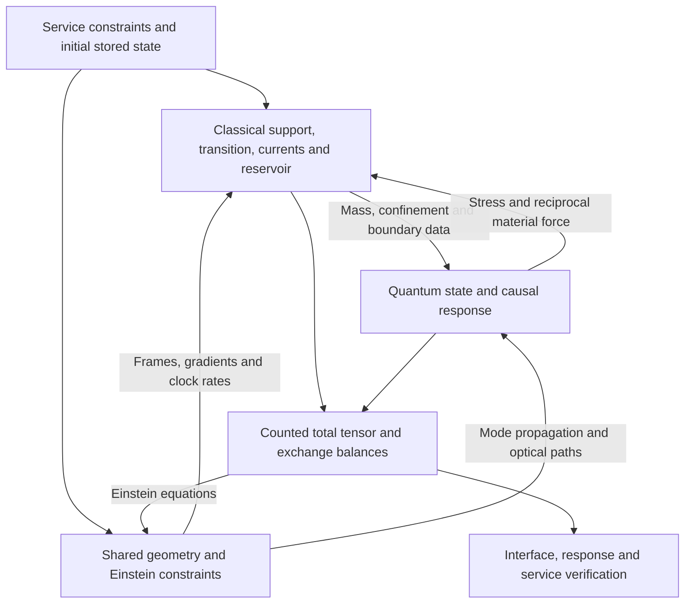

# Rail component decomposition and joint coordination

Date: 9 September 2026.

The active rail's source construction remains organized around a standing
radial backbone, angular-capacity support, endpoint and live-handoff response,
current relaxation, and a support reservoir. The subsequent tests identify
constraints on how these jobs interact: opening requires a signed null source;
terminating radial support requires transverse stress or exchange; the tested
static-start paths require an earlier material response or revised initial and
boundary conditions; and optical confinement
changes the material force and energy budget. A coupled construction must
preserve these responsibilities while deriving their stresses from specified
fields and constitutive laws.

The recent condensate-plus-neutral-scalar calculation restricted the allocation
too far. Its classical material supplies 0.612% of the demanded throat tension,
leaving the quantum remainder responsible for 99.388%. Restoring bulk support
addresses that allocation. The same scalar's negative-null-stress deficit
remains a separate constraint on retaining its quantum mechanism near the
tested geometry. The [allocation audit](COUPLED_SOURCE_ROLE_AUDIT.md) supplies
the reproducible numerical evidence.

## Architecture recovered from the disclosure

Four descriptions have different jobs. The metric controls prescribe service
targets. The source-role ledger assigns the resulting stresses by location,
phase, and channel. Physical components supply tensors and interactions.
Their state variables determine response, storage, and evolution.

The disclosure's metric controls are lapse \(\alpha\), carrying shift \(\beta\),
radial metric capacity \(\gamma_{ll}\), and angular capacity
\(\gamma_{\Omega\Omega}\). Their derivatives enter several Einstein-tensor
channels simultaneously. A single physical component can affect several metric
controls, and several components can contribute to one geometric requirement.

The [original component ledger](STAGE2_COMPONENT_SOURCE_LEDGER_PROMOTED_PAIR.md)
already required a coupled plant with overlapping assignments. It separated
infrastructure support A/B, live angular/current and radial adjustments C/E/F,
angular capacity G, and current handling. Its later target grammar is
\(S_0+J+R+C_{\rm live}+G+D_H\), with reservoir exchange completing the endpoint
balance. Here \(R\) names a residual target, distinct from the areal radius used
in the static source calculations.

| Existing component or role | Physical responsibility to retain | Cross-reference to the later tests |
| --- | --- | --- |
| Standing substrate and \(S_0\) | Pre-existing energy, dominant radial tension, radial direction, and continuous load paths | Ideal radial tension carries bulk load with zero radial null stress. Its finite termination needs angular stress or an exchange partner. The latest condensate branch leaves this bulk role largely unfilled. |
| Angular jacket and G | Broad throat/angular support and response to radial deformation | Angular pressure sets part of the clock curvature. The tested rail also needs negative angular null stress in some regions; ordinary angular support and that signed contribution have separate budgets. |
| Endpoint J | Support-edge shoulder, reset cap, radial trim, internal angular response, and current handling | The early angular startup mismatch and the later current/enthalpy mismatch require a responding initial state and coordinated evolution. The regulated medium provides an explicit fitted tensor. |
| Live handoff \(C_{\rm live}\) | Entry/catch angular and current response, radial-pressure trim, and radial-null trim around the packet | Retain the separate C/E/F outputs and packet-exclusion rules for hard infrastructure. Static support tests leave these active duties to the service evolution. |
| Current relaxation \(D_H\) | Distributed/reset current handling and transfer to storage or exterior channels | Independent particle and entropy currents provide a working local dynamical basis, with explicit resistance and entropy production. |
| Support reservoir and receiver memory | Stored energy and strain, power and radial-force exchange, release history, and reset readiness | A fitted exchange current leaves the reservoir's tensor and energy cost to be specified. Preload, inertia, relaxation, and cycle-end storage must belong to its constitutive model. |
| Finite transition and quantum environment | Match mechanical stress, screening/confinement, optical spectrum, and both exterior completions | The smooth condensate provides a regular material candidate. Quantum support still requires its absolute radial and angular tensor and the reciprocal force on that material. |
| Metric actuator and service controller | Coordinate allowed inputs, service timing, readiness, and carrier margins | Schedules become admissible forcing and boundary data for a joint solve. Their work and transferred momentum enter the plant or exterior flux budget. |

The [component cards](../component_design/README.md) add engineering analogs for
stiffness, routing, impedance matching, pulse handling, and distributed sensing.
Those analogs describe controllable responses. Gravitational source selection
uses the actual stress, scale, and coupling of a candidate material. In
particular, a mechanical lattice's architectural resemblance to a radial
backbone leaves its achievable energy-to-tension ratio to be established.

## Evidence across the testing sequence

| Test family | Result that carries forward | Constraint on a coupled construction |
| --- | --- | --- |
| [Le pre-flight and classifier](LE_BOUNDARY_GATE_PREFLIGHT.md), [repair](LE_CLASSIFIER_REPAIR.md) | The geometric tensor and fitted endpoint tensor are reproducible; the corrected classifier handles signed enthalpy and degenerate cases. | Supply independent tensors for every physical sector, retain endpoint replacement error, and reevaluate rest-frame-dependent claims with the repaired classifier. |
| [Metric regularity and slowdown](LE_BOUNDED_METRIC_REPAIR.md) | Identified metric joins admit finite, convergent repairs. Active Type IV demand persists near static enthalpy zeros. | Coordinate current with diagonal stresses and evolution; taper smoothing and uniform slowing alone leave this mismatch. |
| [Reset inverse search](LE_RESET_INVERSE_SEARCH.md) | Moving support improves the initially supplied ordinary density. | On the prescribed startup paths, angular demand appears as \(u^{n-2}\), while the initially empty moving sector responds as \(u^{2n-2}\). Select preload and response dynamics together. |
| [Quadratic Comer fit](COMER_ANDERSSON_SPHERICAL_STARTUP_ATTEMPT.md) and [independent currents](COMER_TWO_CURRENT_EVOLUTION_ROUND.md) | Independent currents and responding geometry remove the earlier forced gravitational kinetic cancellation and give controlled local evolution. | The effective radial-tension support still fails the initial rail junction. Retain the transport framework alongside a separately adequate signed support sector. |
| [Radial/angular vacuum plus host](VACUUM_SUPPORT_SELECTION_ROUNDS.md) | All 24 two-orientation comparisons fit the full initial tensor with a positive-energy pressure-bounded host; every radial-only comparison has infeasible points. Holding forces are explicit. | Preserve control of both null directions. The negative kinetic result belongs to the common-label local elastic realization; an explicit quantum state needs its own dynamics and material exchange. |
| [Moving quantum boundaries](QUANTUM_MOVING_BOUNDARY_ATTEMPT.md) and [counted planar assemblies](RENORMALIZED_BOUNDARY_SUPPORT_ROUNDS.md) | Negative local radial enthalpy can coexist with positive primitive kinetics. Counted field/material energy exchange works in the finite-cutoff model. | Wall dressing, holding energy, and quantum excitation matter. Complete independent planar cells have the wrong total energy sign for the proposed homogenized source and lack the required angular null response. |
| [Curved boundary placement](CURVED_QUANTUM_BOUNDARY_SEARCH.md) | The enclosing arrangement gives the useful radial and angular response signs at all registered relevant witnesses. | Retain placement as a tensor-selection variable. A finite boundary-induced difference still requires absolute vacuum stress and the counted enclosing material. |
| [Spherical matching](SPHERICAL_BOUNDARY_MATERIAL_CLOSURE.md) and [smooth wall](SMOOTH_QUANTUM_MATERIAL_ATTEMPT.md) | Mechanical matching and a smooth material/optical profile become explicit. | A thin ideal sheet creates a neighboring bulk divergence. A compressed smooth wall can match static load while its angular corrugations have negative stiffness. |
| [Charged screening](SCREENED_CHARGED_WALL_RESPONSE.md) and [gravitating atmosphere](GRAVITATING_SCREENING_ATMOSPHERE.md) | Screening gives a restoring contribution; a broad gravitating atmosphere admits positive-energy static matches. | Restoring response has a counted load. The relaxed atmosphere's local response is adverse in the tested controlled modes, so equilibrium and coupled shape response need separate checks. |
| [Screened condensate](SCREENED_SCALAR_CONDENSATE.md) and [joint material continuation](CONDENSATE_JOINT_CONTINUATION.md) | A common interior/exterior boundary-value problem resolves the exterior-first inward runaway and supplies a regular branch. | Keep the global field matching and finite transition. Small added radial-null burden does not establish bulk-tension adequacy or a small angular-null burden. |
| [Supplied optical stress](CONDENSATE_SUPPLIED_QUANTUM_STRESS.md) | The smooth material profile retains useful optical response signs. | The absolute-source calculation exposes an additional curvature-matching requirement: a classically shell-free join can still have a damaging curvature step. Component signs and absolute scale remain required. |
| [Smooth semiclassical update](SEMICLASSICAL_JOINT_INVESTIGATION.md) | Quantum stress and material force share a renormalization prescription; the material responds regularly at fixed charge. | The tested neutral scalar remains short by about 186,000–204,000 in the optimistic integrated opening comparison. The signed quantum contribution opposes opening overall on that seed. |
| [Longitudinal source comparison](LONGITUDINAL_QUANTUM_SOURCE_LITERATURE.md) | Magnetic or vortex-confined modes provide specified tension-plus-quantum mechanisms. | Their complete optical path and lapse curvature control the quantum sign. The ideal long-loop family has the wrong throat sign on the retained profile. |
| [Source-role allocation audit](COUPLED_SOURCE_ROLE_AUDIT.md) | Bulk tension and opening can be measured separately; 96.69% of the static negative radial-null balance lies outside \(|x|\leq2\). | Restore bulk support explicitly and assess the full transition tensor. A successful throat match alone leaves most of the integrated opening requirement elsewhere. |

The tests use several backgrounds. The archived V5 service ledger covers an
active spacetime; the reset studies use an areal annulus and prescribed or
source-driven reset evolution; the curved-boundary work freezes the phase-0.745
spatial/lapse profile; and the final semiclassical seed adds a condensate
exterior and proper-distance smoothing. Numerical weights, clocks, coordinate
labels, and gravitational normalizations belong to those registered problems.
The historical 94.03% A/B/I target burden and the later 0.612% material share of
throat tension therefore measure different quantities. Their common implication
is the need to keep bulk support explicit.

## Why the separate jobs are coupled

On a static proper-distance metric
\(ds^2=-A^2dt^2+dl^2+R^2d\Omega^2\), write \(\rho,p_r,p_t\) in geometric
source units, equal to \(G_{\rm phys}\) times the physical stress. A strict
throat requires

\[
p_r\big|_0=-\frac{1}{8\pi R_0^2},\qquad
(\rho+p_r)\big|_0=-\frac{R''_0}{4\pi R_0}<0.
\]

The first expression supplies the bulk-tension scale. The second supplies the
opening condition. Their distinction explains why unloading radial strings
can change the bulk budget without changing the negative-null requirement.
For the canonical material used here, \(\rho+p_r=2(K+D)\geq0\), with kinetic
and gradient energies in the same units. Reallocating ordinary bulk support
preserves the optimistic quantum opening bound at fixed geometry and quantum
profile. Jointly changing those fields and the geometry changes the inputs
to that bound.
Clock shaping and force balance add

\[
(R^2A')'=4\pi R^2A(\rho+p_r+2p_t),\qquad
p_r'+\frac{A'}A(\rho+p_r)+2\frac{R'}R(p_r-p_t)=0.
\]

Thus changing the radial load, changing the clock profile, and terminating the
source all involve angular response. During active service, radial current
also enters the time-radial block. Where the declared source gate requires a
material rest frame, \(\Delta=(\rho+p_r)^2-4j_r^2\) must admit the appropriate
causal eigensystem. Near an enthalpy zero, a small current can change that
classification. A source-derived trajectory must evolve this ratio along with
its preload, strain, and stored energy.

The canonical condensate illustrates a second coupling. Its Higgs field sets
potential energy, contributes positive gradient energy, and controls the
spectator quantum field's mass. Improving confinement therefore changes both
mechanical load and quantum stress. An additional physical degree of freedom
earns a place in the model when it separates a required response currently
locked by that coupling, with its energy and force included.

## What is supplied, fitted, and still required

The implementation review establishes the following accounting:

- [The component ledger](../toolkit/adm_harness_cli/adm_harness/component_source_ledger.py)
  repeats the full demanded tensor on channel-assignment rows. Those rows label
  responsibilities. The S0/J/core partition reconstructs its declared subset,
  approximately 34% of the full pre-flight grid.
- [The radial backbone](../toolkit/adm_harness_cli/adm_harness/radial_string_cloud.py)
  has a parameterized tensor \((\rho,p_r,j_r,p_t)=(\Phi/R^2,-\Phi/R^2,0,0)\).
  Its microscopic realization, dynamics, and finite-end forces remain separate
  source-model inputs.
- [The regulated endpoint medium](../toolkit/adm_harness_cli/adm_harness/endpoint_medium_covariant_audit.py)
  supplies a covariantly reconstructed fitted tensor. Its regulator is already
  included. The completed-medium replacement differs from geometric J by
  49.62% and 47.98% on the two pre-flight surfaces in the stated J-normalized
  channel norm, or 2.99% and 2.87% against the full geometric-source norm.
- [The support closure](../toolkit/adm_harness_cli/adm_harness/endpoint_support_total_closure.py)
  compares endpoint divergence with the complementary fitted exchange current.
  A separately evaluated reservoir tensor is still required. Adding a
  divergence-free tensor preserves the exchange equation while changing the
  reservoir's energy and stress.
- [The effective operator package](../toolkit/adm_harness_cli/adm_harness/beta075_source_family_validation.py)
  specifies storage, derivative, damping, and P/F-driven response equations.
  Its effective coefficients and block characteristic speeds are chosen from the
  fixed-background data. The implemented 1+1 transport evolves a rapidity
  increment; the 3+1 extension supplies constraint-driver proxies. A complete
  microscopic coupled evolution remains to be derived.

The seven-state vector
\((h,\psi,\chi_\Omega,\pi_\Omega,\Phi_{\rm support},\Pi_{\rm support},n_l)\)
contains effective enthalpy, current, angular, reservoir, and director
variables. Its \(h\) differs from the condensate's Higgs amplitude. Similarly,
the signed bounded ratio \(q=2j_r/|H|=\tanh\psi\), with \(H=\rho+p_r\),
differs from a physical rest-frame boost. In the code's current convention,
for a resolved non-diagonal Type I block,

\[
v_L=\frac{2j_r}{H+\operatorname{sgn}(H)\sqrt{H^2-4j_r^2}},
\qquad \eta_L=\tfrac12\operatorname{sgn}(H)\psi.
\]

Diagonal blocks use \(v_L=0\). The \(H=j_r=0\) degeneracy has no
proxy-defined rapidity.

The earlier effective advection choice based on the heat ratio belongs to its
constitutive model. The corrected causal eigensystem determines the rest frame.
Consequently the archived cone and energy estimates remain evidence for their
specified effective operators; physical admissibility and the coupled
perturbation operator require their own evaluation.

## A common interaction and accounting contract

The next construction assigns each interaction term and finite counterterm
once, in one common physical normalization. With that assignment,

\[
T_{\rm total}^{ab}=\sum_i T_i^{ab},\qquad
\nabla_aT_i^{ab}=F_i^b,\qquad \sum_iF_i^b=0,
\]

and the Einstein residual is

\[
\mathcal R_G^{ab}=\frac{G^{ab}}{8\pi G_{\rm phys}}-T_{\rm total}^{ab}.
\]

Local gravitational counterterms may equivalently be assigned to the left
side under a fixed convention. The residual measures missing source; its name
or localization supplies no additional stress. In particular, both the core
remainder R and the endpoint replacement error \(\Delta T_J\) remain visible
until a component supplies them.

| Interaction | Shared data and reciprocal response |
| --- | --- |
| Backbone ↔ angular jacket / transition | Radial traction, strain, director orientation, and transverse restoring response; ending or diverting flux gives a force to the receiving material. |
| Transition material ↔ quantum state | The same fields determine mass, confinement, and spectrum; quantum stress and polarization determine force on those fields. |
| Endpoint currents ↔ reservoir | Power P and radial force F change counted reservoir energy, momentum, and strain; damping transfers energy to a specified thermal or exterior channel. |
| Particle ↔ entropy currents | State-dependent resistance/entrainment gives opposite momentum exchange and a checked entropy-production law. |
| Live handoff ↔ prepared plant | Packet trim, release, and catch exchange momentum with the plant through the same constitutive fields and retain the live-exclusion constraints on hard support. |
| Plant ↔ exterior / controller | Energy, charge, and momentum crossing the domain boundary are recorded; control hardware inside the domain contributes to its stress budget. |
| Every source ↔ geometry | A common metric determines local frames, lapse, gradients, optical paths, and field propagation; the assembled source determines the metric constraints and evolution. |

The existing semiclassical implementation already provides one concrete
reciprocal interaction. For the portal mass \(V_\chi\),

\[
\nabla_a\langle T_Q^{ab}\rangle_{\rm ren}
=-\frac12\langle\chi^2\rangle_{\rm ren}\nabla^bV_\chi.
\]

The Higgs equation receives the opposite force under the same subtraction and
finite renormalization conditions. This relation should survive an expanded
source model. The condensate tensor already contains Higgs potential, scalar
gradients, matter kinetics, and electric stress. Reassigning one of these to a
named support role partitions that existing tensor; adding another field
requires an additional physical field and its coupling. A hydrodynamic
description of the same material likewise needs a matching prescription before
being combined with its microscopic stress.

[Comer, Andersson, Celora, and Hawke](https://arxiv.org/html/2606.17686v1)
provide an action-based framework with independent particle and entropy
currents and constitutive dependence on material state and its rates. The
second law constrains the chosen constitutive specialization. This framework
is a basis for the endpoint/transport/reservoir dynamics; the local two-current
rail result supplies a tested starting specialization.

The static quantum ground state remains a reference for a stationary support
configuration. Active service requires evolution of its state or a justified
causal response approximation, including excitations and work. The
[closed-time-path construction of Calzetta and Hu](https://journals.aps.org/prd/abstract/10.1103/PhysRevD.35.495)
provides real causal expectation-value equations for quantum backreaction.
That is the appropriate type of quantum interaction law for a time-dependent
joint construction.

## Coordinating the joint solve

The useful first problem is a standing assembly with distinct, counted bulk
support and transition material, a quantum candidate assessed in both null
directions, and initialized transport/reservoir state. The
[Ishihara–Ogawa material model](https://arxiv.org/html/2409.07818v3) remains a
finite transition and screening candidate. Radial flux or a tension-bearing
medium remains a bulk candidate. These roles can share fields if their joint
action supplies the needed responses. The selection criterion is their full
tensor and exchange under the required load.

First, specify the fields, charge/flux content, couplings, quantum state,
normalization, both asymptotic completions, and allowed geometry freedom. Assign
each component its intended bulk, angular, current, and interface duties. Use
the original role map as a coverage target, and retain a full tensor residual
for the source actually supplied.

Second, apply inexpensive algebraic and integral screens to that assembly.
Measure actual bulk-load shares and both residual null directions, including
the material gradients and every outer transition. For longitudinal quantum
modes, include the complete return path and clock profile. For finite enclosing
media, include the actual optical and mechanical response. Stop a specified
candidate when a necessary sign, normalization, or integrated balance fails.

Third, solve the standing metric and material boundaries together, with quantum
stress and force recomputed consistently. Smooth internal cuts through the same
fields and action share field values and normal derivatives. General material
interfaces match canonical normal fluxes under their specified interaction
laws; the metric obeys the corresponding junction and regularity conditions.
Boundary tractions or surface actions, when used, carry
their own counted source. Pre-existing current and reservoir states must meet
the initial constraints. A successful material block or an exchange fit leaves
the other equation residuals to be closed on that same configuration.

Fourth, evaluate the coupled response before admitting a service trajectory.
Perturb radial and angular material modes, the current and reservoir states,
and the quantum/metric response together at the accuracy of the chosen model.
The thin-wall and atmosphere trials show why equilibrium pressure balance alone
leaves this response unresolved. The earlier fixed-background transport tests
remain useful regression controls for their particular subsystem.

Finally, evolve a short startup/hold/release/reset segment with the independent
currents and shared geometry. The prescribed rail profiles provide operational
constraints and comparison targets. Source-derived evolution determines which
trajectory is attainable. Evaluate the complete tensor's causal eigensystem,
the packet and carrier gates, charge and entropy balances, external fluxes,
and the reservoir's final state together. Readiness for another service follows
from that state and its accounted reset process.

This order preserves the original architecture while placing the additional
degrees of freedom where the tests identify a missing response. It provides
a bounded selection and coordination problem before another nonlinear search.

## Review scope and verification

This report cross-references the disclosure, seven component cards, the source
ledger and coupling implementations, and the testing reports linked above.
It introduces a joint-system specification and source-selection order. The
quantitative observations retain their original backgrounds and evidence.
The report is written manually; this review runs no new matter or quantum
solve. The disclosure and its PDF carry the corresponding current architecture
and physical source-accounting scope.
