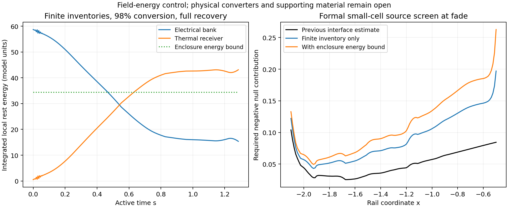

# Finite regenerative conversion and thermal return

Finite electrical and thermal inventories reproduce the required energy
exchange, with a nominal 98%-efficient converter adding 1.05 units of heat.
The direct local capacitor-bank implementation encounters a much larger
source cost from its material mass. Even a lossless converter with unrestricted
capacitor voltage swing requires a bank whose benchmark material alone raises
the necessary negative-null contribution to about 1.9e11, against the previous
0.104 estimate. This terminates that hardware implementation at the mass gate.

An optimistic enclosure calculation based on stored field and thermal energy
gives a much smaller source requirement, about 0.22–0.26. Its saturating
wall material, thermal response, converter, and external reaction still need
physical construction. Thus regenerative conversion supplies useful energy
bookkeeping while the complete supplied interface remains open.

The [connected pressure/field history](PRESSURE_LINKED_STORAGE_COMPLETION.md)
requires simultaneous electrical work delivery and heat return. This bounded
evaluation tests distributed finite capacitor reservoirs, a bidirectional power
converter, and local receiving capacity connected to the endpoint heat/current
plant. It retains the scheduled active geometry, protected packet separation,
prescribed material motion, and separate standing-support reaction role.
The evaluated late patch is x in [-2.1,-0.5], s in [0,1.285].

## Registered physical and numerical screen

The input is the retained-coefficient 128-cell, 257-interval history. Its
64-cell finite-rate predecessor supplies a resolution comparison. The field
and pressure-fluid histories remain fixed while their gross ports receive
finite inventories. This first gate measures the necessary storage, mass,
and reaction costs before attempting converter switching dynamics or a new
joint material evolution.

Let C=H_s/(N_lapse R^4) be the local reversible charging power and let E be
the net endpoint power delivered to the field and pressure fluid. For
converter efficiency eta and recovery fraction f of the available field
discharge, define C_+=max(C,0), C_-=max(-C,0). The work drawn from the bank,
converter dissipation, and heat entering the pressure fluid are

    W_bank = C_+/eta - eta f C_-,
    L_converter = (1/eta-1) C_+ + (1-eta) f C_-,
    Q_fluid = E - C_+ + f C_-.

Consequently, the thermal receiver gains W_bank-E, including conversion
losses. Field discharge sent to the bank must be replaced by heat when the
archived pressure-fluid history requires that energy. The receiving plant
therefore has separate electrical and thermal inventories even during
regeneration.

Every coordinate-fixed material label has a finite bank and thermal receiver.
Write D=Gamma B R^2 and use local rest-energy inventories per label. With
Y=integral N_lapse D W_bank ds and Z=integral N_lapse D(W_bank-E) ds,

    bank = bank_initial-Y, heat = heat_initial+Z,
    bank_capacity = (max Y-min Y)/(1-r_V^2),
    bank_initial = max Y+r_V^2 bank_capacity,
    heat_initial = -min Z, heat_capacity = max Z-min Z.

The initial zero prefix is included. Here r_V=V_min/V_max for fixed
capacitance. The principal voltage comparison is r_V=0.5, with full discharge
as an optimistic control. The registered efficiency comparisons are 1, 0.98,
and 0.95, and recovery fractions are 0 and 1. Independent cases run in four
processes. Their numerical outputs are separate from this manual report.

The banks receive their electrical preparation before the tested interval;
the finite thermal receivers retain their heat through its end. A receiver
with continuing export or a bank with an external feed changes these
inventory equations and requires a supplied transport path. The existing
receiver/reset infrastructure remains the architecture for that larger class.

Full recovery also supplies a lower bound for every time-dependent local
recovery policy: it minimizes each withdrawal prefix. Every policy requires
at least max Y_full as initially prepared work and max Y_full/(1-r_V^2) as
rated bank capacity. This bound grants arbitrary heat return and ideal
converter mechanics.

## Counting the component tensors

Small, internally equilibrated closed cells have an averaged stress dominated
by their complete rest energy. Their internal field and wall stresses are
included together before averaging. The local small-cell approximation gives
T=rho u u with rho=(bank+heat+wall energy+cold hardware energy)/D. Its
external holding-force density remains rho a. The integrated stress and
energy-momentum conditions for closed systems are treated by
[Giulini](https://arxiv.org/abs/1808.09320); applying that approximation to
the prepared rail cells is a construction assumption of this screen.

An optimistic isotropic field/radiation enclosure control assigns wall energy
(bank_capacity+heat_capacity)/3. This follows from the contents' integrated
spatial stress trace U and the wall bound |sum p_i| <= 3 rho. It is a necessary
energy bound for separate internally supported cells, with a saturating
material response still to be constructed. Real capacitor hardware receives
its measured mass independently. Converter switches, interconnects, and an
actual thermal transport medium add further material and field requirements.

The archived endpoint and pressure-fluid/field tensors already have cancelling
divergences. Hence the finite cells are assessed as a proposed constituent of
the endpoint realization. Their summed energy equation matches the archived
endpoint energy projection. Their force projection generally differs; the
remaining endpoint component must supply that difference and its own tensor.
Source comparisons use pressure-fluid/field plus finite cells against the
geometry, granting replacement of the abstract endpoint. They also measure
the tensor left for the endpoint completion. This avoids counting an already
balanced endpoint exchange a second time.

The hardware benchmark uses the manufacturer's XL60 capacitor data: 3000 F,
3 V, with the lighter 515 g threaded-cell mass in the July 2020 datasheet.
Rated energy is calculated directly as CV^2/2=13,500 J; the table's Wh entry
is rounded. The comparison grants this cell-level energy per mass before
adding converter, cabling, or receiver mass.
[Eaton datasheet](https://www.eaton.com/content/dam/eaton/products/electronic-components/resources/data-sheet/eaton-xl60-supercapacitors-cylindrical-cells-data-sheet.pdf).

A bidirectional dual-active-bridge converter has a concrete engineering
analogue in [TI's TIDA-010054](https://www.ti.com/tool/TIDA-010054), with
98% full-load efficiency at its specified operating conditions. The 0.98
rail comparison supplies a nominal efficiency sensitivity; the rail waveform,
voltage matching, switching frequency, and current limits require their own
validation. The capacity/stress gate can reject a hardware realization before
that more detailed calculation becomes useful.

The gate advances when finite work and heat inventories preserve a small
source burden and leave a concrete mechanical/thermal completion. A large
lower bound from unavoidable hardware mass terminates the direct hardware
implementation. Field-dominated constructions and supplied external routes
retain their own acceptance requirements. Physical length remains free;
source ratios and mc^2 per unit of stored energy are invariant under uniform
rescaling of this rail history.

## Finite duty and the recovery limit

The refined history processes 46.9435 units of electrical charging work and
offers 4.64725 units of electrical discharge for recovery. The earlier large
drop in field/fluid slice energy includes geometric and mechanical work;
the electrical discharge port measures the recoverable part of this fixed
history directly. At 98% efficiency, full recovery returns 4.55430 units to
the bank. The charging and recovery losses together are 1.05097 units.

| Refined history, full recovery | Rated bank capacity | Initially stored electrical energy | Thermal receiving capacity | Initial thermal energy | Converter loss |
| --- | ---: | ---: | ---: | ---: | ---: |
| Lossless, full voltage swing | 43.3342 | 42.9003 | 43.1476 | 0.59193 | 0 |
| Lossless, half-voltage floor | 57.7790 | 57.3450 | 43.1476 | 0.59193 | 0 |
| 98% efficient, half-voltage floor | 59.0919 | 58.7090 | 44.1212 | 0.53093 | 1.05097 |
| 95% efficient, half-voltage floor | 61.1819 | 60.8613 | 45.6716 | 0.45318 | 2.70307 |

The table uses integrated local rest-energy inventories in model units.
Initial conditions and extrema are calculated separately at each material
label. The peak capacities include local timing differences. In particular,
the bank's rated capacity and its initial charge have distinct values.

With 98% efficiency, the thermal plant receives 47.5909 units and releases
5.00662 units over the interval, including converter losses in the receiving
duty. The pressure fluid itself returns 46.6342 units of heat and receives
5.10088 units. Regeneration redirects some field discharge into the electrical
bank, increasing the complementary heat supply needed by the pressure fluid.
The peak absolute bank and thermal-receiver power densities are 0.008658
and 0.012623. These duties require finite work and heat ports even though
the integrated net endpoint delivery is only 0.762867.

The lower bound covering every local time-dependent recovery policy is
42.9003 units of initially available work for a lossless converter. With a
half-voltage floor its rated-capacity lower bound is 57.2004 units. At 98%
efficiency those bounds become 43.9361 and 58.5814. The explicit full-recovery
bank capacity of 59.0919 lies within 0.9% of that last necessary bound. Thus
a more elaborate recovery schedule has little room to reduce the local
capacitor requirement of this archived history.

## Hardware mass and the source comparison

The benchmark capacitor stores 26,213.6 J/kg. Its cold material therefore
carries approximately 3.43e12 units of rest energy per unit of rated electrical
storage. The following source comparison grants an ideal massless converter,
free thermal routing, and the most favorable local recovery schedule. It
counts only the unavoidable capacitor-bank material and the already supplied
pressure-fluid/field tensor, allowing the abstract endpoint to be replaced.

| Lossless, full-swing control | Coarse history | Refined history |
| --- | ---: | ---: |
| Minimum initially available local work | 43.0330 | 42.9003 |
| Necessary negative null contribution at fade from bank mass and pressure-fluid/field | 1.93101e11 | 1.90318e11 |
| Previous interface estimate at fade | 0.104079 | 0.103982 |

The measured burden is about 1.8 trillion times the previous estimate. Any
additional component with nonnegative null projection increases the negative
contribution required in that direction. Ordinary converter, interconnect,
and thermal-receiver mass consequently strengthen this specific rejection.
The normal force density needed to hold the lossless lower-bound bank reaches
3.48e10 in model units. The failure is already present before choosing a
switching law or a detailed heat exchanger.

Uniformly enlarging the prescribed geometry leaves this ratio intact. With
one model length unit equal to L metres,

    E_SI = (c^4 L/G) E_model,
    E_cold,model = (c^2/epsilon_store) E_rated,model,

where epsilon_store is the bank's electrical energy per kilogram. Local
densities scale together as L^-2. Moving the storage to a separate region or
supplying an ongoing work current changes the construction and its geometry;
that possibility requires a counted delivery route.

For comparison, matching the bank material's maximum null projection to the
previous pressure-fluid/field peak would require approximately 5.3e16 J/kg
in the optimistic lossless full-swing case. The nominal 98% half-voltage
case gives 8.1e16 J/kg. These are comparisons with an existing tensor budget,
with no universal engineering ceiling assigned. They place the local
reservoir in a regime where stored field energy is comparable to its material
rest energy, far beyond the benchmark capacitor construction.

## What the field-energy control establishes

Counting just the finite electrical and thermal inventories gives a refined
fade source requirement of 0.197139 for the nominal case. Adding the isotropic
enclosure energy bound raises it to 0.262788. Its auxiliary slice energy is
93.9352 at startup and 92.8815 at fade. The formal enclosure includes 34.4044
units of integrated wall rest energy; a physical material generally carries
more energy than this trace bound. With lossless full-swing operation, the
corresponding fade source requirement is 0.217966.

The held cells' nominal force density reaches 0.0218795 when that wall energy
is included. The remaining endpoint component must carry the difference
between this force and the archived endpoint force. At the left edge, the
archived endpoint tensor vanishes while these prepared cells require a
holding force. At fade, matching the original endpoint tensor after inserting
the formal cells would require an additional negative-null contribution up
to 0.178329 within that endpoint remainder. Thus the stored energy cannot
simply be hidden inside the previous fitted endpoint tensor.

The source comparison grants the other components nonnegative null
contributions. It consequently identifies the total negative stress a
completion must supply, while a separate quantum source still requires an
absolute calculated stress. The old terminal-traction requirements remain
part of the standing-support interface. The small-cell force calculation
exposes the additional reaction instead of treating cell supports as free.

Thermal inventories provide necessary energy capacities. Temperature floors,
entropy balance, finite conductance, and the endpoint medium's receiving
equation of state remain open. The inventory minimum reaches zero at some
labels. The formal radiation/enclosure control grants that limiting energy
state; physical temperature margins add preparation and material requirements.
It therefore supplies a lower-cost construction target, with mechanical and
thermal realization still to be established.

## Verification and bounded decision

The 64- and 128-cell histories give nominal rated bank capacities 58.6088 and
59.0919, and thermal capacities 43.7586 and 44.1212. Their differences are
about 0.8%. The ideal local initial-work lower bounds agree within 0.31%.
The available discharge differs more substantially, 1.40986 versus 4.64725;
the two histories constrain initial storage more consistently than gross
recovery. Likewise, the formal enclosure source peaks are 0.206198 and
0.262788, so this cheaper construction has a preliminary peak estimate.
The ideal benchmark mass lower bounds agree within 1.5% and remain decisive.

Separate quadrature controls subdivide every archived time interval twice
and four times while preserving its piecewise-linear field history. Between
those subdivisions, capacities and source lower bounds change by less than
0.0005%. This isolates integration error from the differences between the
two inverse histories.

The discrete work/heat identities close below 8e-15. Independent covariant
divergence checks of the complete-cell tensor agree with its reduced energy
and holding-force laws within 1.5e-11 on 169 points per resolution. Matching
its bilinearly reconstructed energy divergence to the original endpoint gives
sum-relative residuals 3.20% at 64 cells and 0.943% at 128 cells. Their maximum
absolute residuals are 5.86e-4 and 1.78e-4. These interpolation errors remain
visible alongside the exact discrete bookkeeping.

The sampled material speed retains the prescribed maximum 0.202141c and a
minimum packet clearance of 0.15. This late patch covers 35.75% of the earlier
full-interval exchange weight. Earlier packet-safe preparation, full reset,
free material evolution, and an independently supplied negative-stress sector
remain requirements of the complete active rail construction.

All **51** focused converter, pressure-fluid, field, local-coupling, and
covariant-reservoir tests pass. Four workers run the 14 registered cases and
the quadrature controls. The production audit verifies **77** source/input
and output hashes. The registered scope is preserved in commit `c8c6eeb`;
the [numerical results](data/regenerative_converter/) and
[quadrature/integrity controls](data/regenerative_converter/derived/) occupy
approximately 20 MB together. The main technical disclosure is unchanged.

This round sets aside a direct local implementation using the benchmark
capacitor technology. The useful engineering distinction is between the
bidirectional switching function and the origin and location of its finite
work reserve. A field-dominated reservoir or an explicitly supplied work route
could change the mass cost, provided its complete tensor, heat return, and
support reaction are included jointly. Each is a further physical
construction, while the present result supplies a concrete local-capacity
requirement and a decisive benchmark mass barrier. The bounded investigation
stops here.
