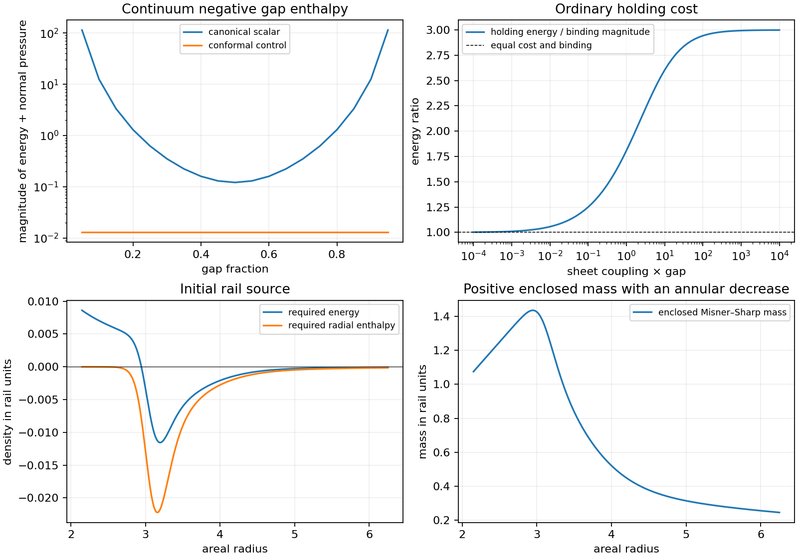

# Matched Wall Masses and the Remaining Support Cost

Date: 9 September 2026.

The continuum thin-sheet calculation retains negative energy and negative
radial enthalpy in the empty gap after the isolated wall masses are fixed.
The ordinary holding contribution exceeds the negative binding energy
throughout the positive-coupling family, including unequal optical
responses. All 154 sampled response pairs and the independent analytic
bound give a positive complete held assembly, including the optimistic
zero-wall-mass limit.

The initial rail has positive proper energy and positive enclosed mass at
both ends of the annulus, together with a negative annular mass increment.
These different geometric weights leave a spatially extended construction
open. Its source must also supply negative radial enthalpy throughout the
annulus and negative angular enthalpy at 1,162 sampled radii. The result
narrows the construction problem to a counted field-and-material geometry
with the required angular structure and boundary response.

## Registered questions

The [moving-boundary investigation](QUANTUM_MOVING_BOUNDARY_ATTEMPT.md)
produces negative gap radial enthalpy with positive primitive kinetic
terms. Its one-wall field dressing and local energy depend on the cutoff.
This follow-up separates the physical wall masses from the finite
interaction energy and tests the holding contribution across an extended
family of optical responses. A second comparison uses the retained rail
slice to determine what the complete-cell sign test implies for spatially
extended boundary placement.

The scalar interaction is specified by two disjoint sheets,
\(V=\lambda_1\delta(z)+\lambda_2\delta(z-a)\), with positive couplings.
This thin-sheet specialization changes the preceding Gaussian shape;
the empty gap and its continuum scattering problem are exact. Each
isolated sheet has a specified measured mass per area \(M_i\). Its
isolated field self-energy is included in \(M_i\). The finite binding
energy and its boundary contribution remain in the two-sheet calculation.
The measured mass is the integrated mass of the isolated dressed wall;
its local material stress requires the matched wall action. Interior
field profiles and the total-mass formula are complementary descriptions
of that same energy accounting.
The optical couplings and measured masses remain fixed when differentiating
the separation. A microscopic material that realizes both parameters
would supply additional constitutive input.

The scattering expression follows equation 3.10 of
[Milton and Wagner](https://arxiv.org/abs/0712.3811). The isolated-mass
prescription and the distinction between bulk and surface energies follow
equations 1.23 and 4.4–4.5 of
[Milton, Shajesh, Fulling, and Parashar](https://arxiv.org/abs/1401.0784).
The canonical stress uses \(\xi=0\), as in the preceding model. A
\(\xi=1/6\) control explicitly changes the scalar's curvature coupling;
its local tensor and surface partition are recorded separately.

The response grid combines 81 equal-coupling pairs over
\(\lambda_i a=10^{-4}\) through \(10^4\), an independent nine-by-nine
decade grid of unequal pairs, and the preceding nominal coupling 8.
Duplicate pairs are removed. Three logarithmic quadratures use 128, 256,
and 512 nodes. An independent adaptive integral checks the finest values.
Interior stress profiles for couplings 0.01, 1, 8, and 100 retain isolated
sheet polarization tails and avoid the singular sheet locations.

The static assembly screen includes measured wall masses 0.25 and 1 per
wall, together with an optimistic zero-wall-mass holding bound. The
released zero-energy mass threshold is recorded as an accounting
condition. This calculation tests initial source requirements and static
holding cost. The preceding field-and-wall trajectories remain a separate
finite-cutoff dynamical result.

For the second comparison, the frozen initial rail profile is sampled at
513, 1,025, and 2,049 points. Coordinate mass, proper energy, lapse-weighted
slice energy, radial enthalpy, and the locations of positive energy are
retained. The lapse-weighted integral describes this slice; the evolving
rail has no assumed globally conserved Killing energy.

Four independent worker processes, single-thread numerical libraries,
1,536 MiB address space per worker, a 300-second main allowance, and an
8 MB evidence allowance bound these comparisons. All narrative findings
are written manually after the computations and independent checks.

## Finite interaction and the analytic holding bound

For imaginary wave number \(\kappa\), the reflection magnitudes are
\(r_i=\lambda_i/(2\kappa+\lambda_i)\). With
\(t=r_1r_2e^{-2\kappa a}\),
\[
E_C=\frac{1}{4\pi^2}\int_0^\infty
\kappa^2\log(1-t)\,d\kappa,
\qquad
P=-\frac{1}{2\pi^2}\int_0^\infty
\frac{\kappa^3t}{1-t}\,d\kappa.
\]
The gap makes both integrals ultraviolet finite. Let \(e=-E_C>0\),
\(f=-P>0\), and let \(D\) denote the derivative of \(e\) when both
dimensionless optical couplings increase by the same logarithmic amount.
Dimensional scaling gives \(af+D=3e\).

An independent pointwise inequality bounds \(D\). Its integrand relative
to the logarithm is \((2-r_1-r_2)t/(1-t)\). Since
\(r_1+r_2\geq2\sqrt{r_1r_2}\geq2\sqrt t\),
\[
0<\frac{(2-r_1-r_2)t}{1-t}
\leq\frac{2t}{1+\sqrt t}
<2[-\log(1-t)].
\]
Consequently \(0<D<2e\) and \(1<af/e<3\) for finite positive
couplings. An ordinary axial holding structure satisfying the dominant
energy condition has energy per area at least \(af\): the material's
energy density is at least the magnitude of its axial stress, integrated
over the gap. Therefore
\[
E_\mathrm{held}\geq M_1+M_2+af-e
=M_1+M_2+(af/e-1)e>0.
\]
This bound applies to the specified static planar family at every positive
optical coupling, including unequal sheets. The positive assembly result
survives the isolated-mass prescription. Its assumptions overlap the
equilibrium support conditions examined by
[Costa and Matsas](https://arxiv.org/abs/2112.08881); the inequality here is
derived for the finite-transparency scalar sheets above.

The finite surface contribution is also retained. For curvature coupling
\(\xi\), it is \(E_\mathrm{surface}=-(1-4\xi)D\), while the bulk
interaction energy across the gap and exterior is
\(aP/3-4(\xi-1/6)D\). Their sum equals \(E_C\).
The canonical bulk profile includes the finite vacuum polarization from
each isolated sheet at every interior point. Absorbing a sheet's total
self-energy into its measured mass preserves those exterior tails.

## Continuum field and support results

The 154 distinct optical pairs produce 462 interaction comparisons over
the three quadratures. The held energy floor is positive in every case.
All 456 sampled interior profiles have negative radial enthalpy. The
results below use equal couplings, separation one, and the finest
quadrature; energies are per area in \(\hbar=c=a=1\) units.

| Sheet coupling | Binding energy magnitude | Minimum holding energy | Holding/binding ratio | Held energy floor with zero wall mass |
|---:|---:|---:|---:|---:|
| 0.0001 | \(3.161193\times10^{-11}\) | \(3.165655\times10^{-11}\) | 1.001411 | \(4.461659\times10^{-14}\) |
| 0.01 | \(2.943279\times10^{-7}\) | \(3.107110\times10^{-7}\) | 1.055663 | \(1.638307\times10^{-8}\) |
| 1 | 0.000701448 | 0.001267974 | 1.807652 | 0.000566526 |
| 8 | 0.003852512 | 0.009785144 | 2.539939 | 0.005932632 |
| 100 | 0.006465502 | 0.019029576 | 2.943248 | 0.012564074 |
| 10000 | 0.006849782 | 0.020545239 | 2.999400 | 0.013695457 |

At coupling 8, the canonical central stress is approximately
\((E,P_r,P_\perp)=(-0.111863,-0.009785,+0.111863)\), giving
\(E+P_r=-0.121648\). The conformal control gives
\((-0.003262,-0.009785,+0.003262)\) and radial enthalpy −0.013047.
Both calculations have a finite continuum limit at these interior points.
The canonical value includes the polarization tails of the individual
sheets, and its scalar curvature coupling agrees with the previous model.
The differing local tensors retain the same interaction energy after the
surface contribution is included.

For the canonical stress at coupling 8, the bulk interaction energy is
−0.002080120 and the surface binding contribution is −0.001772392.
Their sum is −0.003852512. With conformal coupling, those contributions
are −0.003261715 and −0.000590797. The finite boundary energy accounts
for the difference between the integral of the bulk stress and the full
interaction energy.

With measured mass 0.25 per wall, the released assembly starts with energy
0.496147488 and the held assembly has a minimum energy of 0.505932632.
For measured mass one per wall, these become 1.996147488 and 2.005932632.
The isolated-mass prescription greatly reduces the apparent one-body
cost relative to counting the old cutoff-dependent dressing on top of a
fixed bare mass. The remaining holding obstruction follows from finite
interaction observables.

The released zero-total-energy threshold at coupling 8 is a measured mass
of 0.001926256 per wall. It specifies the optical-response and mass relation
that a microscopic released-wall model would have to justify. Its
constitutive stability, preparation, and subsequent quantum back-reaction
require the coupled material action. The present continuum calculation
supplies the static interaction and initial energy threshold.



## Why the Gaussian cutoff comparison needs further material input

The previous Gaussian profiles overlap at every finite separation. Their
overlap integral is
\[
\int V_1V_2\,dz=
\frac{\lambda^2}{2\sqrt\pi\,w}
\exp[-a^2/(4w^2)],
\]
which is approximately 0.006476 at \(\lambda=8,w=0.16,a=1\).
For a jointly increasing three-momentum cutoff, the local large-momentum
expansion of the scalar zero-point energy contains
\(-\int V^2dz\,\log\Lambda/(32\pi^2)\). Subtracting the isolated
walls leaves a separation-dependent cross term
\[
-\frac{\log\Lambda}{16\pi^2}\int V_1V_2\,dz.
\]
Its coefficient at the initial separation is approximately
\(-4.10\times10^{-5}\). This calculation identifies a specific local
counterterm required by the overlapping-wall model. The single-wall
mass subtraction alone leaves that coefficient to be fixed by material
matching. The background-field treatment of
[Graham and collaborators](https://arxiv.org/abs/hep-th/0309130) discusses
the material information retained in such boundary limits.

The disjoint-sheet calculation avoids this overlap term. The comparison
therefore strengthens the evidence for negative stress in an actual
empty gap while retaining a clearly specified change of wall profile.
The previous Gaussian trajectories remain valid for their stated finite
regulator. A renormalized continuation of those trajectories would also
match the velocity-dependent material terms in their action.

## Extended placement on the retained rail

On the initial spherical slice,
\[
m(r)=\tfrac12r[1-f(r)],\qquad
\Delta m=\int 4\pi r^2\rho\,dr,
\qquad
E_\mathrm{proper}=\int\frac{4\pi r^2\rho}{\sqrt f}\,dr.
\]
The computed quantities over \(r\in[2.15,6.25]\) are:

| Quantity | Positive-density contribution | Negative-density contribution | Total |
|---|---:|---:|---:|
| Annular coordinate mass | 0.361211 | −1.191152 | −0.829941 |
| Proper energy | 45.302492 | −1.948122 | 43.354370 |
| Lapse-weighted slice energy | 2747.912674 | −2.284087 | 2745.628587 |

The enclosed mass falls from 1.074991640 at the inner edge to 0.245050964
at the outer edge. Both enclosed masses are positive. The coordinate-mass
integral agrees with this endpoint difference within
\(5.45\times10^{-11}\). The proper radial length of the annulus is
95.908757 in rail units.

The measure relation is \(dm=\sqrt f\,dE_\mathrm{proper}\). In this
reference, the positive proper-energy contribution has an effective
\(\sqrt f\) weight of 0.007973, while the negative contribution has
weight 0.611436. Their ratio is approximately 76.69. Thus positive total
proper energy can coexist with the required annular decrease in enclosed
mass. A complete flat-cell energy bound constrains local homogenization;
the extended curved source must be assessed with its own spatial tensor
and geometry.

Positive density occupies the inner 398 sampled radii, ending near
\(r=2.945503\). Every one of those radii still requires
\(\rho+p_r<0\), as do the remaining 1,651 radii. Ordinary boundary
material therefore needs a compensating quantum contribution even when
placed in the positive-density region. The location of positive density
alone provides insufficient stress room for an ordinary wall.

There is a further angular constraint. Planar vacuum symmetry gives
\(E+P_\perp=0\) throughout the gap for either scalar curvature coupling
used here. Adding material with nonnegative angular enthalpy preserves a
nonnegative total in that channel. The retained rail instead has
\(\rho+p_\perp<0\) at 1,162 of 2,049 sampled radii. A radial planar
field and ordinary material therefore fail that part of the initial
tensor requirement. An extended quantum construction needs angular
structure as well as radial stress and admissible material boundaries.

The [spherical continuation](CURVED_QUANTUM_BOUNDARY_SEARCH.md) computes
these angular modes on the complete frozen holding geometry. An enclosing
outer sheet supplies both negative null channels wherever the retained
angular witnesses require them. Its
[material-closure calculation](SPHERICAL_BOUNDARY_MATERIAL_CLOSURE.md)
finds ordinary surface stress requirements and a conditional causal fluid
response, together with the ideal sheet's divergent nearby bulk stress.
The remaining source construction requires a resolved material layer and
the absolute curved quantum tensor on its coupled geometry.

These are necessary placement and source-shape conditions. The next
construction would specify the field state, material response, and
boundary locations on the curved geometry, with local conservation and
the full angular tensor included. The current evidence supplies a
continuum negative-stress component and an analytic exclusion of the
held planar-cell family; the active-rail matter construction remains open.

## Verification, evidence, and reproduction

An independent adaptive integral checks all 154 response pairs. Its
normalization resolves both the product scaling of two weak sheets and
the single weak-sheet scaling opposite a strong reflector. Energy and
pressure agree with the production quadrature within
\(8.1\times10^{-15}\) and \(8.3\times10^{-15}\), respectively.
The 128-, 256-, and 512-node calculations agree within
\(6.6\times10^{-15}\) over the full response grid.

A direct two-by-two Green-function resolvent independently reconstructs
32 interior stress tensors, agreeing within \(4.3\times10^{-12}\) of
their local tensor scales. The explicit sheet Green functions reproduce
the surface binding within \(1.2\times10^{-14}\) of the total interaction
scale. All 462 bulk/surface partitions close their interaction energies
within \(1.2\times10^{-15}\). The copied rail profile is numerically
identical to the frozen initial profile under round-trip CSV conversion.

The complete harness passes **331 tests**, with four existing
multiprocessing deprecation warnings, in 25.56 seconds. Seven new tests
cover the ideal and weak limits, pressure from virtual work, scale
covariance, sheet interchange, local curvature-coupling controls, surface
accounting, positive holding floors, and Gaussian overlap.

The main comparisons take 4.43 seconds with four workers, whose largest
resident memory is approximately 114.1 MiB. The independent audit takes
approximately one second. Retained evidence occupies approximately
0.55 MB before Git storage. The source kernel, reference ledger, reference
interpolation, and previous quantum-boundary evidence preserve their
recorded hashes. The registered implementation is committed in `26728fa`.

The [manifest](data/casimir_mass_matching/manifest.json),
[interaction comparisons](data/casimir_mass_matching/interaction_summaries.csv),
[local gap profiles](data/casimir_mass_matching/gap_profiles.csv.gz),
[boundary partitions](data/casimir_mass_matching/boundary_partitions.csv),
[rail placement measures](data/casimir_mass_matching/rail_placement.json),
and [independent audit](data/casimir_mass_matching/audit.json) retain the
numerical evidence. Reproduction uses an empty output directory:

```bash
PYTHONPATH=toolkit/adm_harness_cli \
OPENBLAS_NUM_THREADS=1 OMP_NUM_THREADS=1 MKL_NUM_THREADS=1 \
MPLCONFIGDIR=/tmp/casimir-matching-matplotlib \
python toolkit/adm_harness_cli/scripts/run_casimir_matching.py \
  --workers 4 --output /tmp/casimir-matching-repeat

PYTHONPATH=toolkit/adm_harness_cli \
OPENBLAS_NUM_THREADS=1 OMP_NUM_THREADS=1 MKL_NUM_THREADS=1 \
python toolkit/adm_harness_cli/scripts/audit_casimir_matching.py \
  --workers 4 --output /tmp/casimir-matching-repeat
```
