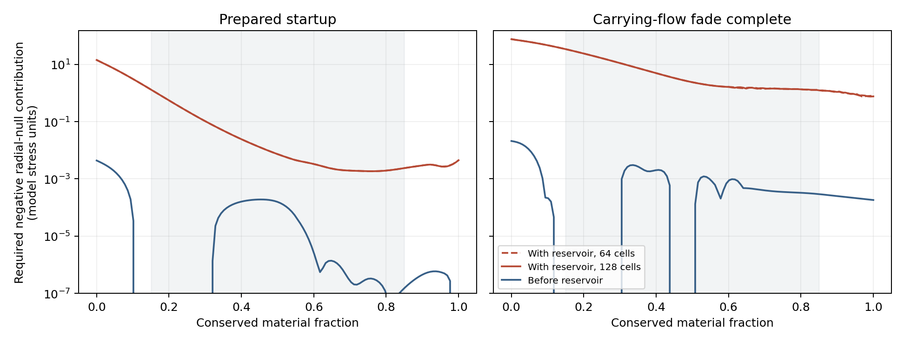

# Physical response and source compatibility of the prepared reservoir

Date: 10 September 2026.

The slower [prestressed assembly](PRESTRESSED_BUFFER_VELOCITY_INVESTIGATION.md)
admits a local magnetic-compression interpretation of its main restoring
term. The complete source comparison identifies a more restrictive
requirement: its positive radial-null stress demands a large compensating
negative contribution from the remaining sectors. This contribution persists
in the interior, survives metric and material refinement, and remains large
after optimization over the registered initial equilibrium family.

The resulting feasibility condition couples buffer inertia, restoring
response, bulk velocity, and the independently supplied source allowance.
The previous energy and stress multipliers remain assembly comparisons.
Physical scale is retained as a free conversion, while the tensor mismatch
has a scale-invariant ratio to the geometry's demanded source.

## Registered scope

The study uses the archived freely evolving interiors at 64 and 128 cells,
the 64-cell prior-energy control, and the preceding thermal reservoir. The
full active lapse, shift, radial and angular scales, time derivatives,
endpoint tensor, and protected packet separation remain in the comparison.
Each registered phase samples every material node. Material fractions
0.15 through 0.85 also receive an interior diagnostic. The phases are startup,
0.5, and fade completion at 1.285; the older reservoir's last comparison is
0.815, within its completed history.

Four independent workers evaluate the original regularized metric with
curvature steps 0.0025 and 0.00125. A separate curvature calculation uses
the interpolated metric that drove the reservoir. This tests both curvature
resolution and the source effect of metric interpolation. The numerical
output comprises tensors, source requirements, dimensional coefficients,
and optimization certificates. This report is maintained manually.

## Local field construction

Write the backbone energy and pressure as

\[
 u_B=\frac{A K_b n_b^2}{2R^2},\qquad
 u_s=\frac{A K_b}{2R^2},\qquad
 (\epsilon_b,p_b,p_{\Omega b})=(u_B+u_s,u_B-u_s,0).
\]

Equal transverse magnetic orientation energies have the averaged Maxwell
tensor \((u_B,u_B,0,0)\), in the order energy, radial pressure, current,
and angular pressure. Flux freezing under radial compression gives
\(B_\perp\propto (R B\Gamma h)^{-1}\), supplying the quadratic
compression term. A radial string contribution supplies
\((u_s,-u_s,0,0)\). The latter retains the disclosed standing-tension
source role and its physical-realization requirement.

The attached buffers have rest energy density
\(w_b=A n_t(1+q)/R^2\). The common radial compression mode has

\[
 c_f^2=\frac{2u_B}{w_b+2u_B},\qquad \sigma=\frac{2u_B}{w_b}.
\]

This is a local perpendicular magnetic compression response. Its stress
direction and angular average are evaluated explicitly. Global return
paths, confinement, currents, field stability, and the inertia of their
hardware require a physical assembly. The Maxwell and material equations
are developed in [Hernandez and Kovtun](https://arxiv.org/html/1703.08757);
the original elastic law is given by
[Natário](https://arxiv.org/html/1406.0634). The tensor decomposition and
its application to the archived reservoir are calculations of this study.

If the pressure-free heat buffers are instead interpreted as a free
relativistic gas, their pressure follows a gas equation of state. The
Taub--Mathews approximation gives

\[
 p_g=\rho_{\rm rest}\frac{(1+q)^2-1}{3(1+q)}.
\]

This counterfactual diagnoses the additional radial and angular pressure
of that interpretation. A pressure-free composite heat store instead needs
its internal confinement and associated stresses counted. The gas law and
its range of approximation are described by
[Mignone and McKinney](https://arxiv.org/html/0704.1679).

## Source and scale requirements

Let \(D=G[g]/8\pi\) and let \(M\) and \(S\) denote the fitted endpoint
and the supplied reservoir tensors. Their remaining source requirement is
\(D-M-S\). For the two local radial null vectors
\(k_\pm=n\pm e_r\), the required magnitude of a negative contribution is

\[
 Q_\pm=\max\{0,(M+S-D)_{\mu\nu}k_\pm^\mu k_\pm^\nu\}.
\]

Any additional sector obeying the radial null energy condition contributes
nonnegative stress to this projection. Thus \(Q_\pm\) is a lower bound on
the total negative contribution required from the remaining sectors under
that completion assumption. The quantum allowance is unspecified; the
calculation measures the allowance a construction would have to supply.
Standing radial tension has zero radial null projection. Its allocation
can change density and radial pressure individually while preserving this
particular requirement.

A linear program searches the full discrete initial equilibrium family
for the smallest maximum \(Q_\pm\), using initial signal-speed floors
0, 0.3, and 0.5. These are response comparisons. Its primal and dual
objectives bound the best source burden available within this family,
without assigning a numerical feasibility ceiling to quantum stress.

The disclosure's physical length conversion remains free. If one model
length unit is \(L\) metres, the full uniform metric scaling gives

\[
 T_{\rm SI}=\frac{c^4}{G L^2}\widehat T,\qquad
 B_{\rm SI}=\frac{1}{L}\sqrt{\frac{2\mu_0c^4}{G}\widehat u_B},\qquad
 E_{\rm slice,SI}=\frac{c^4L}{G}\widehat E_{\rm slice}.
\]

The slice energy is the proper-volume integral of local normal-frame
energy. It has a different meaning from asymptotic ADM mass and recoverable
electrical energy. Ratios between the geometrical demand and supplied
classical tensors remain invariant under this uniform scaling. A particular
material or quantum realization introduces further physical scales.

## Results: a field mechanism with a measured source requirement

The Maxwell/string/buffer decomposition reproduces all four averaged tensor
moments to absolute error below \(2.9\times10^{-14}\) on the sampled
prestressed states. The successful 128-cell assembly begins with nodal
magnetization between 0.336 and 1495.9, reaching 13.17 through 3434.5 by
fade completion. Thus the registered minimum response of 0.5 coexists with
much stronger field domination elsewhere. The field interpretation supplies
the local longitudinal restoring mechanism; its finite spatial assembly
still requires returns, confinement, current carriers, and stability.

At 128 cells the source requirements are:

| Phase | Largest required negative radial-null contribution | Largest interior requirement | Largest absolute geometric radial-null stress |
| --- | ---: | ---: | ---: |
| Startup, 0 | 14.2101 | 1.18158 | 0.00437484 |
| 0.5 | 21.8325 | 2.60329 | 0.00704685 |
| Fade complete, 1.285 | 75.7805 | 32.5971 | 0.0209960 |

All entries use the same normalized orthonormal stress convention. The last
column is a geometric comparison, and supplies no quantum feasibility
ceiling. The largest initial requirement is about 3248 times that geometric
comparison; the large interior values establish that the mismatch extends
beyond the end reactions. Every sampled material node requires a negative
radial-null contribution from the remaining source.

The corresponding 64-cell requirements are 14.3509, 22.0645, and 76.6318.
Their interior values are 1.18212, 2.60425, and 32.6045. The two material
resolutions agree on the burden and its location. The maximum curvature
step difference is \(1.34\times10^{-5}\). Replacing the original metric
by the spline metric that drove the reservoir changes the negative-null
requirement by at most \(9.54\times10^{-5}\) on these samples.

The remainder's negative normal-frame energy also has a large proper-volume
integral. At 128 cells its magnitude is 921.421 at startup against reservoir
slice energy 989.088, and 4117.532 at fade completion against 4127.142.
These are necessary net source cancellations within the sampled body. They
are local slice integrals, with no identification as extractable energy or
asymptotic mass. Contributions from further positive-energy supports can
increase the negative-source requirement.



The shaded interval marks material fractions 0.15 through 0.85. The blue
curve retains the reconstructed endpoint and measures the remaining
negative-null requirement before adding the reservoir. The red curves add
the supplied reservoir. A [standalone PDF](figures/reservoir_feasibility_source.pdf)
is also available.

## Results: the bounded preload alternative

Minimizing the largest required negative-null contribution gives the
following 128-cell equilibria:

| Initial minimum signal speed | Minimum peak negative-null requirement | Initial reservoir slice energy |
| --- | ---: | ---: |
| Positivity floor only | 10.9035 | 762.205 |
| 0.3 | 11.8846 | 829.522 |
| 0.5 | 14.2101 | 989.088 |

The 0.5 result returns exactly the archived minimum-energy weights. At 64
cells the three optima are 10.9905, 11.9875, and 14.3509. The maximum
primal/dual objective difference is \(1.76\times10^{-11}\), and the
maximum raw equilibrium residual is \(1.11\times10^{-9}\). These are
numerical lower bounds within the stated discrete initial-equilibrium
family. Allowing weaker initial response reduces the source requirement
by about 23%, leaving a large burden. The positivity-only profile also
recovers the weak section that collapsed in the preceding dynamic study.
The 0.3 profile receives an initial-state result here.

The previous energy budget gives another useful comparison. Its 64-cell
replacement requires negative-null contributions 1.31670 at startup,
2.10257 at 0.5, and 20.3824 at fade completion; its prior mechanical run
still reaches speed 0.98989. The older thermal assembly requires 0.0132303
at startup, 0.284496 at 0.5, and 4.65601 at 0.815. These controls identify
the tradeoff between added preparation and the fast material history.

## A coupled feasibility bound

For this local field/buffer construction, the larger of the two supplied
radial-null projections obeys the identity

\[
 \max_\pm S_{k_\pm k_\pm}
 =\frac{w_b}{1-c_f^2}\frac{1+|v|}{1-|v|}.
\]

The string contribution cancels from both projections. The identity holds
on all 777 sampled field-decomposed nodes with maximum relative error
\(1.08\times10^{-13}\). It supplies a direct selection rule: each
directional source allowance must accommodate the corresponding buffer,
field, and motion contribution. Increasing field stiffness and reducing
bulk motion can compete through this same bound. Once a negative-stress
source has a calculated capacity, this expression turns that capacity into
an admissible range of buffer inertia and mechanical response.

This rule also keeps the heat-buffer interpretation explicit. The
Taub--Mathews gas pressure reaches 32.8% of buffer energy and, at startup,
1.95 times the magnetic pressure in a weak-field region. Replacing the
pressure-free buffers with free plasma therefore changes a consequential
radial and angular stress. A free-gas replacement requires a new coupled
evolution. A composite heat store instead requires its internal support
stress and mass in the accounting.

## Conditional physical sizes

For the 128-cell assembly, the sampled peak comoving magnetic field has
\(B_{\max}L=4.64654\times10^{19}\) tesla metres at startup and
\(1.07325\times10^{20}\) tesla metres at fade completion. The latter
gives the following conditional conversions:

| Imposed field ceiling | Minimum conversion \(L\) | Reservoir slice energy at fade completion at that conversion |
| --- | ---: | ---: |
| 100 tesla | \(1.07325\times10^{18}\) metres | \(5.3607\times10^{65}\) joules |
| \(4.414\times10^9\) tesla | \(2.43146\times10^{10}\) metres | \(1.2145\times10^{58}\) joules |

These are conditional scale examples. The first field ceiling is a chosen
comparison value. The second marks the electron quantum-critical magnetic
scale, where strong-field quantum effects require explicit treatment;
[Harding and Lai](https://arxiv.org/abs/astro-ph/0606674) review this regime.
It is a physical-regime marker, with no implied engineering acceptance.
The conversion \(L\) sets the model's coordinate length unit; proper
dimensions also contain the metric factors. No physical size is selected.

Rescaling lowers local classical field strengths while increasing the
slice-energy inventory. It preserves the relative classical source
mismatch. Quantum state capacity has its own scale dependence and must
be evaluated for a proposed state and boundary construction.

## Disposition and evidence

The user has set this assembly aside from the active search. The
[source-construction selection constraints](SOURCE_CONSTRUCTION_SELECTION.md)
prioritize alternatives without string matter or ideal string-cloud sources;
reconsideration requires a substantial assembly-level viability benefit.

The local field interpretation strengthens the case that the mechanical
response has a recognizable physical basis. Completing this particular
assembly on the retained active geometry requires an independently supplied
negative-stress sector of the measured magnitude, together with returns,
confinement, and a consistent heat store. The existing construction supplies
no verified capacity for that cancellation. The round therefore stops at
the source-completion requirement. Its necessary condition applies to this
assembly, prescribed endpoint, and geometry; the quantum allowance remains
an open physical calculation.

Six new controls and the seven existing backbone controls pass. Four
workers completed 12 phase comparisons across 972 material-node samples,
with three geometric evaluations per node and six initial preload
optimizations. Numerical data occupy approximately 0.7 MB before the
derived figure and scale examples. Input, software, and output hashes are
recorded in [the evidence directory](data/reservoir_feasibility/).

Reproduction uses one BLAS thread per worker and
`PYTHONPATH=toolkit/adm_harness_cli`:

```sh
python -m pytest -q -p no:cacheprovider toolkit/adm_harness_cli/tests/test_reservoir_feasibility.py toolkit/adm_harness_cli/tests/test_prestressed_buffer_assembly.py
python toolkit/adm_harness_cli/scripts/audit_reservoir_feasibility.py --workers 4
python toolkit/adm_harness_cli/scripts/summarize_reservoir_feasibility.py
```
