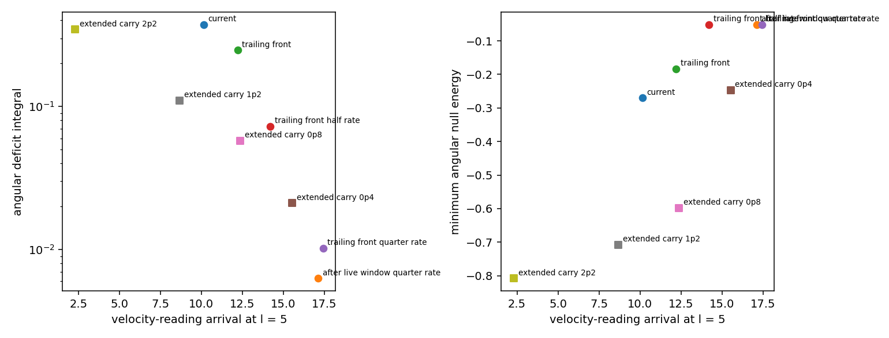

# Reset Schedule Options on the Constant-Radius Track

Date: 2026-09-23. Geometry: the C∞ [constant-radius track](CONSTANT_RADIUS_TRACK.md)
carrying the beta075 service. Data: [data/reset_schedule_options](data/reset_schedule_options/).

## Result

Both reset options preserve the gate structure. Every variant is certified
Type I at all 21,384 budget points with zero radial current and zero radial
null energy, because the areal radius stays constant wherever the service
metric evolves. The schedule therefore acts through three channels: the
angular null energy \(\rho+p_\Omega = 1/(8\pi R^2)-K/8\pi\), packet delivery
and the packet norm margin.

A decompression front trailing the packet is the balanced schedule. At half
the current local rate it lowers the integrated angular deficit by 80% and
raises the minimum angular null energy from −0.270 to −0.052. That value is
the floor set by the catch-phase packet windows, which every slow schedule
shares. The cost is a 4.1-unit delay in velocity-reading delivery at
\(\ell=5\). At the current local rate the same front gives a 34% reduction for
a 2.1-unit delay, and at a quarter of the rate it gives 97% for 7.3 units.

Extended carry trades local depth for delivery time. Moving the catch 1.2
later delivers the packet 1.5 units earlier than the current schedule. In
exchange the minimum angular null energy deepens to −0.707, the peak service
curvature rises from 7.1 to 18.1, and the live packet norm margin narrows from
−9.94 to −4.09. The carry at \(V=5\) stays timelike only over strong support.
At a shift of 2.2, three live points become spacelike (norm up to +6.82) where
the support weight has fallen to 0.21–0.28. The feasible shift therefore ends
between 1.2 and 2.2.



## Variants

Every variant keeps the track, the string cloud, the service cutoff and the
static end transitions of the constant-radius track. Each one regenerates its
ledger stage, region and live-packet labels, so the live windows follow any
moved choreography.

| Variant | Change | Reset complete at \(\sigma\) |
|---|---|---:|
| current | uniform decompression, \(q_{t0}=-0.4\), \(q_{Tr}=3\) | 2.60 |
| after live window, quarter rate | uniform decompression from 0.4 after the live window (\(\sigma=2.045\)), duration 12 | 14.05 |
| trailing front | the support at \(\ell\) relaxes once a front leaving \(\ell=-1.4\) at \(\sigma=-0.4\) with speed 1 has passed it, with a C∞ onset ramp of 0.25; local duration 3 | 8.88 |
| trailing front, half rate | the same front, local duration 6 | 11.88 |
| trailing front, quarter rate | the same front, local duration 12 | 17.88 |
| extended carry \(d\) | catch and release (\(x_{catch,\beta}\), \(x_{catch,packet}\), \(x_\beta\)) moved later by \(d\in\{0.4,0.8,1.2,2.2\}\) at unchanged \(V=5\); quarter-rate reset from 0.4 after the live window | 14.45–16.25 |

The front is implemented in `service_fields` as a position-dependent onset
\(\sigma_{on}(\ell)=\sigma_0+w\,I((\ell-\ell_0)/w)/v\), where \(I\) is the
integral of the C∞ step. The front is therefore C∞ in \(\ell\), and each
point decompresses with the flattened minimum-jerk profile of the chosen
local duration.

## Angular null-energy budget

The budget samples \(\sigma\in[-1.5,20]\), \(|\ell|\le4.9\) at spacing 0.1.
The deficit integral is \(\sum\max(-(\rho+p_\Omega),0)\,\Delta\sigma\,\Delta\ell\).
The delivery column lists the velocity-reading arrival at \(\ell=5\) and its
shift relative to the current schedule.

| Variant | Minimum \(\rho+p_\Omega\) at \((\sigma,\ell)\) | Violating fraction | Deficit integral (reduction) | Live minimum | Delivery at \(\ell=5\) | Live packet norm maximum |
|---|---|---:|---:|---:|---:|---:|
| current | −0.270 at (1.6, 2.1) | 2.06% | 0.3727 | −0.065 | 10.14 | −9.94 |
| after live window, quarter rate | −0.052 at (−0.6, −0.5) | 0.97% | 0.0063 (98%) | −0.052 | 17.13 (+6.99) | −11.92 |
| trailing front | −0.183 at (2.4, −1.4) | 2.19% | 0.2471 (34%) | −0.052 | 12.21 (+2.07) | −11.92 |
| trailing front, half rate | −0.052 at (−0.6, −0.5) | 2.68% | 0.0727 (80%) | −0.052 | 14.20 (+4.06) | −11.92 |
| trailing front, quarter rate | −0.052 at (−0.6, −0.5) | 0.93% | 0.0102 (97%) | −0.052 | 17.42 (+7.28) | −11.92 |
| extended carry 0.4 | −0.247 at (1.9, 2.4) | 1.05% | 0.0211 (94%) | −0.081 | 15.53 (+5.39) | −8.48 |
| extended carry 0.8 | −0.598 at (2.3, 2.8) | 1.12% | 0.0575 (85%) | −0.082 | 12.37 (+2.24) | −5.88 |
| extended carry 1.2 | −0.707 at (2.6, 3.1) | 1.23% | 0.1099 (71%) | −0.113 | 8.67 (−1.47) | −4.09 |
| extended carry 2.2 | −0.808 at (3.7, 4.2) | 1.72% | 0.3448 (7%) | −0.183 | 2.29 (−7.84) | +6.82 |

Under the current schedule, 95% of the deficit integral (0.3545 of 0.3727)
lies after the live window, at the steep end of the decompression, with its
centroid at \(\sigma=2.15\). The trailing front spreads that local rate along
the track and moves the worst point to (2.4, −1.4), the trailing end of the
support. At half and quarter rate the service curvature stays below the
string-cloud cushion \(1/R^2=0.327\) over most of the reset. The residual
minimum −0.052 at (−0.6, −0.5) then belongs to the catch inside the live
window and is common to all slow schedules.

The extended carry places its worst points 0.5 ahead of the window centre,
just outside the live mask, where the leading packet windows decelerate over a
weakened support. The peak service curvature there grows with the shift: 7.1,
6.5, 15.4, 18.1 and 20.6 for shifts 0, 0.4, 0.8, 1.2 and 2.2. The live-window
minimum deepens in step, to −0.081, −0.082, −0.113 and −0.183. Its lower
deficit integrals at shifts 0.4 to 1.2 come from the slow post-window reset
that accompanies it.

## Delivery under the two kinematic readings

The beta075 service moves its packet windows along \(\ell=\sigma\), while its
shift carries the packet at the coordinate speed \(U_{packet}/B\). Inside the
compressed support \(B=8\), so that speed is 0.625 before the catch and
0.0625 after it, while the windows advance at unit speed. The two readings
therefore place the packet differently. When the live window closes at
\(\sigma=1.645\), the velocity reading puts the packet at \(\ell=0.853\) under
the current schedule and 0.757 under the slow ones, while the window centre
stands at 1.645. The windows lead the packet by 0.8–0.9, more than twice the
window radius 0.35.

Each audit adopts one reading. The packet-safety audit evaluates the packet
velocity field at window points. The scheduled centerline probes follow the
velocity field. Under the window reading the packet reaches \(\ell=5\) at
\(\sigma=5\) in every variant, so the reset schedule changes delivery only
under the velocity reading, which the delivery column reports. Aligning the
two readings is a service-construction task: either the window centres follow
the packet worldline, or \(U_{packet}\) scales with \(B\) so that
\(U_{packet}/B=1\) along the window track.

The service ledger ends at \(\sigma=15\), and the probes exit at \(|\ell|=6\).
Centerline probes still inside the track at \(\sigma=15\) end at the time
limit. That applies to 21 of 24 probes under the half- and quarter-rate
schedules, 18 under extended carry 0.4 and 5 under extended carry 0.8. Their
velocity-reading arrivals at \(\ell=5\), between 12.4 and 17.4, place the
exit at \(|\ell|=6\) beyond that horizon.

## Service audits

| Audit | current | after window, quarter | front | front, half | front, quarter | carry 0.4 | carry 0.8 | carry 1.2 | carry 2.2 |
|---|---:|---:|---:|---:|---:|---:|---:|---:|---:|
| live packet points | 238 | 238 | 238 | 238 | 238 | 273 | 301 | 336 | 413 |
| spacelike live packet points | 0 | 0 | 0 | 0 | 0 | 0 | 0 | 0 | 3 |
| radial escape (escaped/expected) | 1696/1696 | 1632/1632 | 1696/1696 | 1693/1693 | 1637/1637 | 1646/1646 | 1660/1660 | 1674/1674 | 1686/1686 |
| entry reachability hits | 0 | 0 | 0 | 0 | 0 | 0 | 0 | 0 | 0 |
| scheduled probes escaped | 224/235 | 187/235 | 224/235 | 201/235 | 190/235 | 186/231 | 195/228 | 197/224 | 193/215 |
| traces entering both-shrinking | 0 | 0 | 0 | 0 | 0 | 0 | 0 | 0 | 0 |
| dense-bundle crossings | 0 | 0 | 0 | 0 | 0 | 0 | 0 | 0 | 0 |
| dense-bundle minimum width ratio | 0.181 | 0.234 | 0.181 | 0.234 | 0.234 | 0.155 | 0.118 | 0.117 | 0.117 |
| schedule-factor advantage | 2.569 | 2.569 | 2.569 | 2.569 | 2.569 | 2.851 | 3.075 | 3.256 | 3.589 |
| packet-coordinate proxy advantage | 1.233 | 1.195 | 1.195 | 1.195 | 1.195 | 1.274 | 1.354 | 1.432 | 1.676 |

Escape, reachability, trace-expansion and dense-bundle results agree across
all schedules. The dense-bundle audit sets a caustic-like flag on one or two
bundles in the four slow or front schedules. Each flagged bundle starts with
an areal-radius width of \(2.2\times10^{-16}\), a single rounding unit on the
constant-radius track, so its radius-width ratio falls to zero. The same
bundles keep l-width and adjacent-gap ratios of 0.37 and 0.19, above the
unflagged minima, and record no crossings.

Under extended carry 1.2, two null-branch probes seeded at (−0.36, −0.7)
cross points where the packet velocity field is spacelike (norm up to
\(1.7\times10^4\)). There the carry speed \(U_{packet}=5\) persists outside the
packet windows. The centerline and packet-edge probes along the same schedule
stay at norm −0.75.

The service-time ratios follow the carry distance. The schedule-factor ratio
depends on the choreography alone. The packet-coordinate proxy moves from
1.233 to 1.195 when the reset leaves the live window, and it rises with the
carry shift.

## Transfer to the axis model

The [axial track](AXIAL_TRACK.md) holds the same service in a core whose
transverse plane is flat. There the transverse null energy equals
\(p_\Omega=-K/8\pi\), without the \(1/(8\pi R^2)\) cushion of the spherical
track. The \(p_\Omega\) columns carry the schedule comparison into that core.

| Variant | Minimum \(p_\Omega\) | Negative fraction | \(p_\Omega\) deficit integral |
|---|---:|---:|---:|
| current | −0.283 | 6.0% | 0.440 |
| after live window, quarter rate | −0.065 | 21.9% | 0.135 |
| trailing front | −0.196 | 7.2% | 0.324 |
| trailing front, half rate | −0.065 | 11.7% | 0.178 |
| trailing front, quarter rate | −0.065 | 21.1% | 0.124 |
| extended carry 0.4 | −0.260 | 22.4% | 0.152 |
| extended carry 0.8 | −0.611 | 23.2% | 0.191 |
| extended carry 1.2 | −0.720 | 24.1% | 0.248 |
| extended carry 2.2 | −0.821 | 26.1% | 0.499 |

In the axis core the slow schedules lower the deficit integral by 60–72%.
Every point with \(K>0\) contributes there, including the weak curvature that
the spherical cushion absorbs.

## Schedule choice

The trailing front at half rate reaches the catch floor −0.052, lowers the
integrated angular deficit by 80% and keeps the live packet margin at −11.92,
at a velocity-reading delay of 4.1. The quarter-rate schedules add about three
more units of delay for a further 17 points of reduction. The feasible
extended carries leave the local minimum between −0.247 and −0.707, which is
4.7 to 13.6 times the floor that the slow fronts reach, and they narrow the
packet margin. Their earlier delivery at a shift of 1.2 comes from carrying
the packet at \(V\) through more of the support. The angular source must meet
the local minimum, so the comparison favours the trailing front at half rate.

## Reproduction

```bash
OPENBLAS_NUM_THREADS=1 python toolkit/adm_harness_cli/scripts/run_reset_schedule_options.py --workers 6
python toolkit/adm_harness_cli/scripts/run_reset_schedule_options.py --figures-only
```

The run takes about 12 minutes with six workers on an idle machine. The manifest records the
parameters, the reference ledger SHA-256 (`4c63e7bf…`), the audit command
lines and the software hashes. Tests for the reset front are in
`toolkit/adm_harness_cli/tests/test_constant_radius_track.py`.
