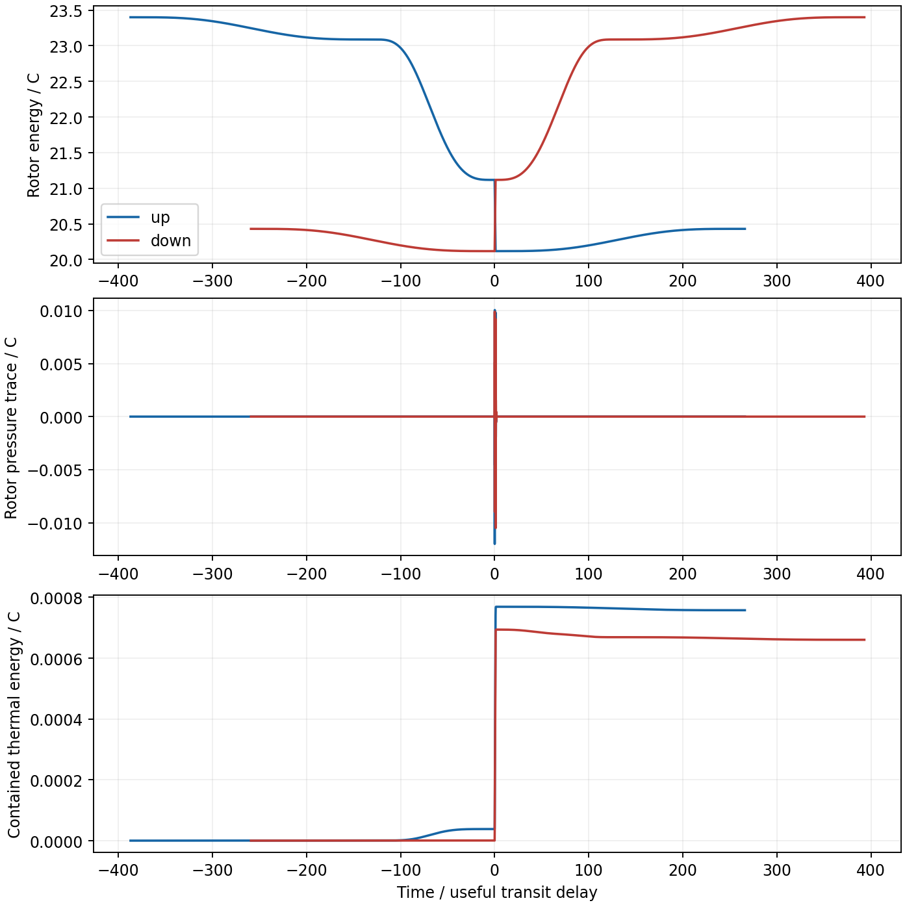
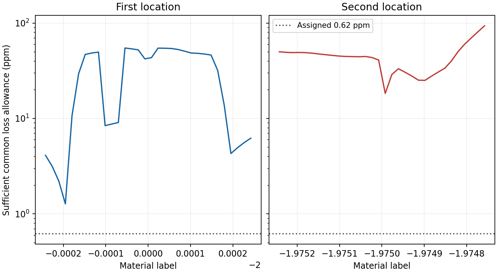

# Scheduled transfer and mechanical holding

16 September 2026.

Scheduled guide operation and a mechanical holding store give a positive
energy screen for all four inherited material histories. In the two fine
histories, guide throughput falls to **0.600–0.623%** and **0.477–1.185%**
of the previous continuously loaded guide throughput. Counting the
converter's recirculating light, routing allowance, preparation and loss
replacement leaves sufficient common loss allowances of **1.273 ppm** at
the first location and **18.300 ppm** at the second. An assigned 0.62 ppm
loss per counted exposure fits both budgets.

The construction separates storage, transfer and control. Counterrotating
elastic rings hold energy as rotation and strain. A small optical pilot
supplies incident light, smooth guide ramps follow the required transfer
envelope, and a finite converter loop supplies the larger instantaneous
reflection powers. The local step calculations preserve the prescribed
receipt timing and count both photon flight energy and radial heat.
Material realization, finite actuator slew, spectral losses and the
assembly's full spatial stress remain physical design requirements.

## Mechanical store and its material law

Use the previous normalization: useful peak power \(P_*\), useful
flight time \(\delta\), energy unit \(C=P_*\delta\), and \(c=1\).
Times below are in \(\delta\). The rotor has fixed reference inventory
\(M=18C\), reference radius \(R_0=\delta/(12\pi)\), and initial
energy \(H_0=1.3M\). Equal opposed rotors share this total inventory
and receive opposed torques. Their total angular momentum cancels.

The cold material uses the stiff elastic string law
\(U=U_0(1+n^2)/2\), \(T=U_0(1-n^2)/2\), where \(n\) is inverse
proper stretch. For an axisymmetric embedding with radius \(R=xR_0\),
radial speed \(v\), and material angle \(\Phi\), its Lagrangian is

\[
L=-\frac M2\left[(x+x^{-1})\sqrt{1-v^2}
 -\frac{xR_0^2\dot\Phi^2}{\sqrt{1-v^2}}\right].
\]

Let \(p=p_R/M\), \(j=J/(MR_0)\), and \(b\) be thermal action.
The Hamiltonian and velocities are

\[
V=\frac12\left[x+\frac{1+j^2+2b}{x}\right],\quad
h=H/M=\sqrt{p^2+V^2},\quad
v=p/h,\quad \gamma=h/V,\quad v_\theta=j/\gamma.
\]

The proper stretch is \(x/\sqrt{1-j^2}\). At cold equilibrium,
\(x=h=\sqrt{1+j^2}\), giving \(j_0=\sqrt{0.69}=0.830662\)
and proper stretch 2.3349. The material's local tension-to-energy ratio
is 0.69. Rotation therefore carries a substantial local tensile
requirement even though the equilibrium integrated pressure vanishes.

[Natário, Queimada and Vicente](https://arxiv.org/html/1712.05416v5)
derive the corresponding relativistic string law and rotating-loop
equilibria, including the radius relation in their equation 63. Their
flat-space perturbation analysis supports linear stability of the stiff
law at nonzero subluminal rotation. The present driven, paired assembly
also requires its own stability analysis with ports, dissipation and the
prescribed spacetime geometry. The paper supplies a continuum model;
a laboratory material with this constitutive response remains to be
identified.

The thermal specialization is an independent, radially comoving,
countercirculating radiation population with zero net tangential angular
momentum. Its energy is \(M\gamma b/x\), and its equilibrium entropy
is proportional to \(\sqrt b\). This specifies a separate member of
the component ensemble. Its trapping and coupling to the rotating
material require a microscopic construction.

For net rotor power \(q\) and radial damping coefficient \(k=0.4\),

\[
\dot x=\frac v{R_0},\qquad
\dot p=\frac{1+j^2+2b-x^2}{2\gamma x^2R_0}
 +\frac{vq}{M}-\frac{kp}{R_0},
\]
\[
\dot j=\frac{xq}{\gamma Mj},\qquad
\dot b=\frac{\gamma xkpv}{R_0}\ge0.
\]

These equations give \(M\dot h=q\) exactly. The integrated pressure
trace includes the viscous contribution from radial damping:

\[
\frac\Pi M=hv^2+
\frac{(j^2/2+b)/x-\tfrac12(x-x^{-1})}{\gamma}-kxp.
\]

At equilibrium with \(q=0\), radial velocity and radial dissipation
vanish. Useful storage therefore has a mechanical holding mode. Real
rotational drag, thermal relaxation and their causal constitutive laws
remain additional properties to specify.

## Reflective conversion and the finite loop

Tangential reflective facets provide a local energy and angular-momentum
exchange. For positive spin, the incident and outgoing powers crossing
the moving interaction are

\[
P_{\rm in}=\frac{|q|+jq}{2j},\qquad
P_{\rm out}=\frac{|q|-jq}{2j}.
\]

Thus \(P_{\rm in}-P_{\rm out}=q\) and their sum is \(|q|/j\).
The matched rays have radial direction cosine \(v\) and tangential
direction cosine \(\pm1/\gamma\). The resulting radial force
\(vq\) and torque \(Rq/(\gamma j)\) generate the rotor equations
above. A smooth circular wall has radial normals; tangential facets and
their supports are explicit interface requirements.

Discharge uses incident seed light. The guide retains a pilot of
\(0.001P_*\). A local finite-pulse calculation deducts its
\(0.0000625C\) seed from rotor energy, propagates the packet through
counted \(\delta/16\) flights, and applies exact finite recoil at
each reflection. Starting near \(h=1.3\), four reflections produce
a \(0.3125C\) packet in \(0.25\delta\); starting near \(h=1.12\),
eight reflections take \(0.5\delta\). The last partial reflection
retains its unreflected branch in the ledger.

The continuous construction also carries a converter loop with flight
time \(\ell=\delta/16\). Let \(B(t)\) be its outgoing power,
\(A(t)\) the prescribed useful receipt, \(Q\) the guide output,
and \(U\) the guide input. Then

\[
C_{\rm in}=A(t-1)+Q(t-\tfrac12)-A(t),\quad
C_{\rm out}=U(t+\tfrac12),\quad N=C_{\rm in}-C_{\rm out},
\]
\[
q=N+B(t-\ell)-B(t),\qquad
W(t)=\int_{t-\ell}^{t}B(s)\,ds,\qquad q+\dot W=N.
\]

Available incident light is \(I=C_{\rm in}+B(t-\ell)\). The test
\(I\ge P_{\rm in}\) supplies a nonnegative bypass, and
\(P_{\rm out}+I-P_{\rm in}=C_{\rm out}+B\) completes the output
allocation. Thus the photon inventory and its finite delay enter the
same energy identity as the rotor.

The selected loop reaches \(5P_*\), giving \(W\le0.3125C\).
Septic fill and drain ramps take \(256\delta\); the full-power
plateau covers the useful step and guide transition. Between events,
a small constant loop level covers the bounded within-panel derivative
of \(A\). Its largest node-level value is 0.612% of \(P_*\) in the
first fine history and 0.166% in the second. Loop light, including the
bypass at nearly zero rotor power, contributes to the loss calculation.

The local allocation still uses instantaneous reflected/bypass fractions
when \(A\) jumps. Finite phase-actuator response must be connected to
the component receipt law. Likewise, constant flight time and matched
pickup directions require a moving-interface and routing construction.
Initial single-pass Doppler ratios reach approximately 10.8, and repeated
seed amplification broadens the frequency requirement. Optical losses
must ultimately be qualified across those frequencies, directions and
moving-frame powers.

## Guide scheduling and counted preparation

For each panel, a rigorous upper bound on positive receipt sets the guide
plateau, with the pilot added. The delivered output reaches its rising
plateau by a receipt increase and starts falling when the receipt decreases.
The guide radius follows

\[
x(P)=(1-0.4P)^{-1/2},\qquad
f(s)=35s^4-84s^5+70s^6-20s^7,
\]

over \(128\delta\). The first three endpoint derivatives of \(f\)
vanish. With \(a=\gamma^2xR_g^2\ddot x\), the guide's inverse
dynamics gives

\[
w=\frac{\theta+ae}{1-a},\qquad
h_g=\frac{\gamma x}{1-a},\qquad
Q=\frac{M_gw}{2\pi R_gx},\qquad U=Q+M_g\dot h_g.
\]

Here \(M_g=10C/3\), \(R_g=\delta/(3\pi)\), and
\(e=(x+x^{-1})/2\), \(\theta=(x-x^{-1})/2\).
The acceleration correction to \(Q\) is at most
\(1.03371\times10^{-5}P_*\), leaving a positive receipt-envelope
margin of \(0.00098966P_*\). Guide input is bounded above by
\(1.022432P_*\). A grid of 101 incoming plateau levels, 101 outgoing
levels and 1,001 ramp phases checks positive guide input and photon
action. Input positivity currently has this numerical admission check.

| Prepared component | Energy in units of \(C\) |
| --- | ---: |
| Mechanical rotor, including rotation and strain | 23.400000 |
| Guide at pilot loading | 3.334000 |
| Filled pilot feed/output paths | 0.001000 |
| Static routing-wall allowance | 7.962500 |
| **Total** | **34.697500** |

The routing allowance uses the previous static wall cost of 2.6 times
photon-path capacity, applied to \(2.75C+0.3125C\). Converter photons
are filled from the rotor during operation. Reserving their maximum
inventory, the useful flight, feed/output flights and maximum guide
energy gives a quasistatic rotor floor \(h=1.117001\). With the chosen
spin floor \(j=0.3\), this corresponds to thermal action capacity
0.078846 and thermal energy capacity **1.270566C**. Variable-load
routing-wall evolution remains a constitutive requirement.

## Full-history energy and thermal screens

Each history keeps its inherited donor and receiver powers. Preparation
is deducted once from the joint model's reserve. Exposure includes the
guide circuit, feed and output paths, useful delivery, both reflective
ports, converter circulation, and fill/drain energy. Full upcoming ramp
costs are charged early for within-panel reserve bounds. Endpoint pilot
operation also covers the longer converter preparation and drainage.

For assigned loss fraction \(0\le\alpha<j_{\min}\), optical replacement through the
same matched converter costs at most
\(\alpha E_{\rm exposure}/(1-\alpha/j_{\min})\) under the stated
exposure convention. This includes the repeated optical loss of the
replacement itself.

| History | Minimum reserve after preparation | Sufficient common loss allowance | Minimum reserve after assigned 0.62 ppm |
| --- | ---: | ---: | ---: |
| First, 16 labels × 2,057 samples | 0.00045838 | 1.924 ppm | 0.00031064 |
| First, 32 labels × 4,113 samples | 0.00032818 | 1.273 ppm | 0.00016830 |
| Second, 16 labels × 1,029 samples | 0.00300435 | 30.475 ppm | 0.00294575 |
| Second, 32 labels × 2,057 samples | 0.00236748 | 18.300 ppm | 0.00228728 |

Reserves in this table use the inherited normalized energy units. The
0.62 ppm assignment is a comparison with the absorption scale discussed
in the [previous optical-assembly study](OPTICAL_STORE_SPLITTER_ROUTING_AND_LOSSES.md).
Qualification of a complete optical network includes all encounters and
their spectra. The present allowance also leaves electrical control,
material inventory beyond the priced components, and additional heat
handling to be charged against the remaining reserve.

For radial heating, the audit bounds the derivative of each inherited
receipt law within every panel and separately counts its interface jump.
This bounds the delayed-source term \(A(t-1)-A(t)\), the guide
transition terms, and \(B(t-\ell)-B(t)\). Linearizing at fixed
equilibrium \(h\), the zero-initial-state induced heat gain is

\[
G_H=\frac{R_0}{Mkh[1-(kh)^2/4]},\qquad 0<kh<\sqrt2.
\]

Using the largest frozen gain over the selected equilibrium interval
gives maximum node-level heat estimates of **0.90261C** and **0.28777C**
for the fine histories, including loop fill/drain forcing. These fit
the 1.27057C quasistatic allowance. The smaller \(M=14C\) store has
0.28678C of thermal capacity; its frozen upper heat bound exceeds that
capacity in the first history. The chosen inventory and damping
therefore pay for appreciable thermal margin.

This heat calculation is a frozen linear diagnostic. A nonlinear history
must track the varying \(\gamma x\) weighting of thermal action,
initial radial perturbations and spin throughout the evolution. The
diagnostic addresses radial damping; retained optical absorption and
rotational drag need their own component-level heat allocation.

After the assigned 0.62 ppm optical cost, the energy-only holding-drag
ceilings are approximately \(1.85\times10^{-9}\) and
\(3.21\times10^{-8}\) of total prepared rotor energy per useful
transit time in the fine histories. These ceilings also require local
thermal and spin headroom when the dissipated energy stays in a rotor.
Mechanical holding makes the required loss mechanism explicit; low
optical duty alone supplies no rotational-drag specification.

## Evidence and remaining assembly work

The [numerical archive](data/scheduled_optical_transfer/summary.json)
contains the four verified histories, inventory/damping comparisons,
23 local transition trials, finite-pulse startup, guide and loop admission
grids, and timestep refinements. The source snapshots and manifest bind
the results to their optical, joint and macro inputs. Independent trials
run on four workers. The focused suites pass **100 tests**.

| Finite-loop transition | Minimum spin | Peak contained heat | Peak pressure-trace magnitude |
| --- | ---: | ---: | ---: |
| Cold store, receipt 0 → \(P_*\) | 0.498927 | 0.000769C | 0.011988C |
| Cold store, receipt \(P_*\) → 0 | 0.499023 | 0.000694C | 0.010491C |
| Warm store, initial thermal action 0.06, receipt \(P_*\) → 0 | 0.359198 | 0.966359C | 0.010491C |

All three remain tensile and retain a positive incident-light margin.
Their photon inventory stays at or below 0.3125C. The complete energy
identity error stays below \(3.6\times10^{-12}C\); four timestep
refinements agree in state to within \(9.8\times10^{-11}\). These are
sampled trajectory measurements. Thermal action increases in the warm
trial while expansion lowers the final thermal energy to 0.831430C.





The next coupled construction is the finite-slew converter and splitter
connected to the full nonlinear rotor, thermal and receipt evolution.
Its routing supports must then carry the varying local reactions and
contribute their complete tensor and macro work. The physical stiff
material, thermal population, broad-frequency reflective interface and
existing separate-current-host requirement remain component-level
research. This study belongs to the supporting research record; the
technical disclosure continues to contain established design elements.

Reproduction uses a fresh output directory:

```sh
env PYTHONPATH=toolkit/adm_harness_cli OPENBLAS_NUM_THREADS=1 OMP_NUM_THREADS=1 \
  MPLCONFIGDIR=/tmp/scheduled_optical_matplotlib \
  python toolkit/adm_harness_cli/scripts/audit_scheduled_optical_transfer.py \
  --workers 4 --output /tmp/scheduled_optical_replay

env PYTHONPATH=toolkit/adm_harness_cli OPENBLAS_NUM_THREADS=1 OMP_NUM_THREADS=1 \
  python -m pytest -q \
  toolkit/adm_harness_cli/tests/test_scheduled_optical_transfer.py \
  toolkit/adm_harness_cli/tests/test_optical_assembly.py \
  toolkit/adm_harness_cli/tests/test_controlled_optical_transfer.py \
  toolkit/adm_harness_cli/tests/test_constitutive_joints_and_optics.py \
  toolkit/adm_harness_cli/tests/test_material_reconfiguration.py \
  toolkit/adm_harness_cli/tests/test_distributed_reconfiguration.py \
  toolkit/adm_harness_cli/tests/test_containment_ensemble.py \
  toolkit/adm_harness_cli/tests/test_finite_containment.py
```
