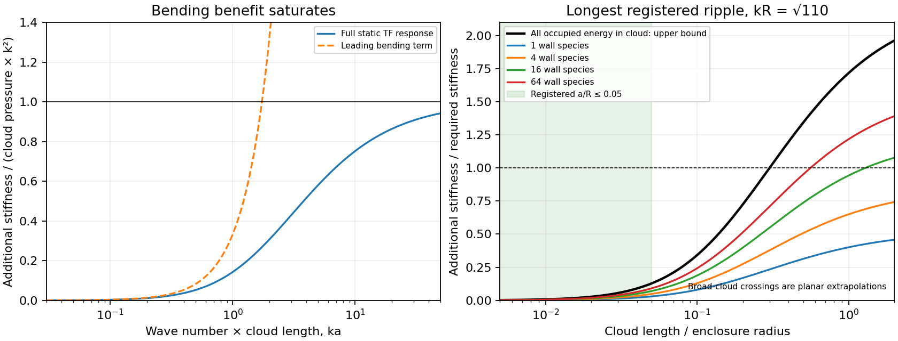

# Screened Charged Wall Response

Date: 9 September 2026.

A relativistic screening cloud supplies positive bending resistance to the
charged version of the [smooth Fermi wall](SMOOTH_QUANTUM_MATERIAL_ATTEMPT.md).
Its full planar static response also sets a finite ceiling on that benefit.
Counting the cloud in the enclosing junction leaves a negative deformation
energy for the registered thin-cloud regime. Increasing the number of
charged wall species moves the formal stabilization threshold toward an
atmosphere whose thickness is a substantial fraction of the enclosure radius.

## Material and thermodynamic specification

[Yoshida, Ogure and Arafune](https://arxiv.org/abs/hep-ph/0210062), section IV,
describe charged wall fermions surrounded by screening electrons using a
Thomas--Fermi free-energy functional. Their curvature correction supplies
positive shape resistance in a range of parameters. The present calculation
specializes the screening matter to a cold, massless Dirac gas with zero
chemical potential at infinity and derives its response at arbitrary planar
wave number. This specialization has finite total particle and electric-field
energy per unit area. A finite-temperature atmosphere would also contribute
its background thermal stress to the gravitational source.

The optical profile remains the finite-width scalar wall. Its charge is
represented by its integrated sheet density at leading order in \(d/a\)
and \(kd\), where \(d\) is the material width, \(a\) the cloud length,
and \(k\) the tangential wave number. The screening calculation uses flat
proper coordinates across the composite layer. The hierarchy \(a/R\ll1\)
permits its stress to enter the existing junction as a surface integral.

There are \(F\) identical charged wall species, each with one positive-energy
surface branch, and one screening Dirac species with two spin states.
The charge magnitude is \(e\); the registered numerical benchmark is
\(e^2/(4\pi)=1/137\). The cloud equations use \(\hbar=c=1\).
Conversion to the rail's geometric energies multiplies them by the same
\(\eta=G\hbar/L^2\) used for the wall material.

The local-density approximation also requires gradients small relative to
the screening Fermi momentum. At the wall, \(p_F a=c_e\simeq25.41\), so
\(ka/c_e\) measures the tangential gradient scale. The extended response
curve records this ratio alongside its formal large-wave-number limit.

## Counted planar cloud

Let \(n\) be the number of positively charged wall particles per area and
\(u=eA_0\) their positive electrostatic potential energy. The cold
Thomas--Fermi equation and its symmetric solution are
\[
u''=\frac{e^2u^3}{3\pi^2}-e^2n\delta(z),\qquad
u(z)=\frac{c_e}{|z|+a},\qquad
c_e=\frac{\sqrt6\pi}{e},\quad
a^2=\frac{2c_e}{e^2n}.
\]
The screening number density is \(u^3/(3\pi^2)\), and its integral equals
\(n\). The local electric energy is \(u^4/(12\pi^2)\); the occupied
screening gas contributes three times this amount. Gas pressure and electric
radial tension cancel in the normal channel. Their tangential pressures add.
Consequently, the complete cloud has
\[
\epsilon_c=\frac{8\pi^2}{e^4a^3}=\frac23nu(0),\qquad
P_c=\frac{\epsilon_c}{2},\qquad \int p_z\,dz=0.
\]
Its energy outside \(|z|>za\) is the fraction \((1+z)^{-3}\); thus
90 percent lies within \(|z|<1.154435a\). The parameter \(a\) describes
a decaying atmosphere with a tail.

The physical cloud energy is the integral of positive electric and particle
energy. Its stationary potential representation is
\[
\mathcal F[u]=\int d^3x\left[-\frac{(\nabla u)^2}{2e^2}
-\frac{u^4}{12\pi^2}\right]+\int_{
\text{wall}}n u\,dS.
\]
Extremizing over \(u\) enforces Gauss's law and gives the same counted
energy. This functional supplies an independent deformation-energy check.

## Response to a normal ripple

For \(h=A\cos(kx)\), write the first-order potential perturbation on the
positive side as \(h w(z)\); reflection gives its odd continuation on the
negative side. Continuity at the displaced wall gives \(w(0)=c_e/a^2\).
In dimensionless variables \(s=z/a\), \(q=ka\), the normalized perturbation
\(W=a^2w/c_e\) satisfies
\[
W''=\left[q^2+\frac6{(1+s)^2}\right]W,\qquad
W(0)=1,\quad W(\infty)=0,
\]
with solution
\[
W(s)=e^{-qs}\frac{q^2+3q/(1+s)+3/(1+s)^2}{q^2+3q+3}.
\]
At \(q=0\), this is translation of the cloud. The mean electric field at
the displaced charge sheet determines its normal force \(-K_c h\):
\[
K_c=-P_c k^2\frac{3(q+1)}{q^2+3q+3}
=-P_c k^2+P_c k^2 f(q),\qquad
f(q)=\frac{q^2}{q^2+3q+3}.
\]
Here the first term is the cloud's already-counted local compression; the
second is its positive additional response. The function \(f\) rises from
zero toward one. At long wavelength its leading term is \(q^2/3\), giving
the bending coefficient \(D_c=\epsilon_c a^2/6\) in a stiffness
\(D_c k^4\). Extrapolating this quartic term to \(ka\gtrsim1\) overstates
the available resistance. The full cloud contribution \(K_c\) stays
negative while becoming smaller in magnitude relative to its local limit.

An independent energy expression uses \(V=W-(1+s)^{-2}\) in coordinates
following the wall. The second variation of the stationary functional gives
\[
\frac{K_c}{P_c k^2}=-\frac3{q^2}\int_0^\infty
\left[V'^2+q^2W^2+\frac{6V^2}{(1+s)^2}\right]ds.
\]
This integral checks the force calculation without evaluating the force at
the sheet. A separate numerical boundary-value solve checks the analytic
potential profile and its wall derivative.

## Junction and material coupling

The integrated neutral composite has
\[
\Sigma=\tau+\epsilon_f+\epsilon_c,\qquad
P=-\tau+\frac{\epsilon_f+\epsilon_c}{2}.
\]
Thus the rail junction fixes \(\tau=(\Sigma-2P)/3\) and
\(\epsilon_f+\epsilon_c=2(\Sigma+P)/3\). Charging redistributes this
occupied energy between the wall gas and the atmosphere. Their common
particle number fixes
\[
\epsilon_f=\frac{4\sqrt\pi}{3\sqrt F}n^{3/2},\qquad
\gamma\equiv\frac{\epsilon_c}{\epsilon_f}
=\sqrt{\frac{\sqrt3 e}{4\sqrt2}}\sqrt F.
\]
The same identity gives \(u(0)/k_F=\gamma\). A charged wall eigenstate must
therefore include this potential: the approximate escape condition is
\(k_F+u(0)<m_{\rm bulk}\) when the potential varies slowly through the
wall. A confined charged spectrum requires its own Dirac calculation.

For the specified static cloud relaxation the combined deformation energy
per projected area is \(\Delta E=K A^2/4\), with
\[
K=k^2[-P+P_c f(ka)].
\]
This is a static energy condition. Cloud inertia and the frequency-dependent
response belong to the dynamical problem. Negative \(K\) supplies a
downhill energy direction even after allowing the cloud to relax.

For the area-stationary flat Fermi ball, the leading total pressure is zero.
The same calculation then gives \(K=P_c k^2f(ka)>0\), recovering the
stabilizing role of screening in that equilibrium. The rail's positive
required pressure creates the additional term that the cloud has to overcome.

## Bound over the enclosing branch

For the retained analytic rail tail and Schwarzschild exterior, direct
minimization of the Israel stresses gives
\[
\min_M\frac P\Sigma=\frac b{2(R-b)},\qquad
M_* =\frac{Rb}{R+b}.
\]
Allowing all occupied energy to reside in the cloud gives the optimistic
bound
\[
\frac{P_c}{P}\le\frac{\Sigma+P}{3P}
\le B_{\max}=\frac{2R-b}{3b}.
\]
For \(R=6.8\), \(b=1.75\), these are \(M_*=1.3918128655\) and
\(B_{\max}=2.2571428571\). A necessary crossing requires
\[
ka\ge q_*=
\frac{3+\sqrt{12B_{\max}-3}}{2(B_{\max}-1)}
=3.145115856.
\]
The longest ripple in the registered local window has
\(kR=\sqrt{110}\). Its necessary cloud length is therefore
\(a/R\ge0.299875031\), even in the limit of complete transfer of occupied
energy to the cloud. At \(a/R=0.05\), the maximum additional response
reaches less than 13 percent of the required value; at \(a/R=0.1\), it
reaches less than 35 percent. Finite wall-fermion fractions strengthen
these restrictions.

The thin neutral-composite approximation therefore retains the original
normal-deformation barrier. A broad charged atmosphere changes both bulk
geometries and the material equilibrium; its apparent planar crossing is
a scale requirement for a new curved construction. Finite electron mass,
thermal background, charged confinement, and the full curved quantum stress
remain separate physical requirements of that construction.

This bound uses the leading classical allocation of the junction stress.
Quantum dressing of comparable magnitude would enter both the equilibrium
allocation and its deformation response. The finite-width scalar wall's
absolute curved quantum tensor remains part of the complete source problem.

The [gravitating-atmosphere construction](GRAVITATING_SCREENING_ATMOSPHERE.md)
solves a compact, massive, one-sided screening gas together with its
Einstein--Maxwell field and charged material junction. Its registered
family includes positive-energy matches with a tensile wall, while the
coupled deformation response remains a separate requirement.

## Numerical results and verification

The [retained run](data/screened_charged_wall/manifest.json) scans 2,001
exterior masses for each of 1, 4, 16, and 64 charged wall species. The
8,004 rows include 4,116 with positive material components and positive
conditional radial frequency squared. The latter uses the original
prescribed-bulk diagnostic, including its momentum flux, and the total
adiabatic occupied-sector pressure law. The normal response supplies the
additional exclusion established above.

At the analytically optimal exterior mass, the finite-species bounds are:

| Charged wall species | Maximum additional response / required response, as \(ka\to\infty\) | Formal \(a/R\) crossing for \(kR=\sqrt{110}\) |
|---:|---:|---:|
| 1 | 0.526894 | No crossing |
| 4 | 0.854353 | No crossing |
| 16 | 1.239531 | 1.282913 |
| 64 | 1.600263 | 0.557954 |
| All occupied energy assigned to cloud | 2.257143 | 0.299875 |

The final row relaxes the material composition to establish an upper bound.
Every finite crossing in the table lies beyond the thin-cloud approximation.
The cloud length is a proper normal scale, while \(R\) is the enclosure's
areal radius; the table compares their scales in the local construction.

At exterior mass 1.5, the original 65 local wavelength/width combinations
are crossed with the four species counts and \(a/R=0.01,0.025,0.05,0.1\).
All 1,040 cases have negative static deformation stiffness. Of these, 420
meet the registered hierarchy
\[
a/R\le0.05,\quad d/a\le0.2,\quad kR\ge10,\quad kd\le0.2.
\]
The sign holds in all 420 cases. Extrapolating the quartic bending term
would instead produce 72 apparent passes within that hierarchy. The full
response resolves these through its saturation with increasing \(ka\).



Eleven wave numbers and three numerical tolerances give 33 independent
Poisson boundary-value checks. At tolerance \(10^{-10}\), the maximum
absolute discrepancy in \(K_c/(P_c k^2)\) is \(2.47\times10^{-10}\).
The independent energy integral agrees within \(3.4\times10^{-16}\), and
direct charge/energy/stress integrals agree within \(4.5\times10^{-16}\).
The [audit](data/screened_charged_wall_audit/audit.json) also locates the
formal crossings through energy quadrature and checks them with the
numerical Poisson response. A pressure-free control has positive
deformation energy throughout the sampled wave-number range.

All 41 focused tests and 41 audit checks pass. The retained run and audit
use four workers and take 2.44 and 1.06 seconds, respectively. The peak
reported worker memory is about 154 MiB. Their complete retained evidence
occupies 984,919 bytes. Numerical CSV input uses exact floating-point round
trips so that the near-horizon control masses preserve their written values.
An external single-worker replay reproduces all numerical table entries
exactly, and its separate four-worker audit passes all 41 checks.

## Reproduction

Both commands accept fresh output directories. The audit accepts an
external run directory through `--input`.

```bash
export OPENBLAS_NUM_THREADS=1 OMP_NUM_THREADS=1 MKL_NUM_THREADS=1
export PYTHONPATH=toolkit/adm_harness_cli
export MPLCONFIGDIR=/tmp/active-rail-mpl-cache
python toolkit/adm_harness_cli/scripts/run_screened_wall.py --workers 4 --output /tmp/rail-screened-replay
python toolkit/adm_harness_cli/scripts/audit_screened_wall.py --workers 4 --input /tmp/rail-screened-replay --output /tmp/rail-screened-audit-replay
python -m pytest -q toolkit/adm_harness_cli/tests/test_screened_wall.py toolkit/adm_harness_cli/tests/test_smooth_mirror.py toolkit/adm_harness_cli/tests/test_smooth_mirror_material.py toolkit/adm_harness_cli/tests/test_spherical_support.py toolkit/adm_harness_cli/tests/test_curved_boundary.py
```
