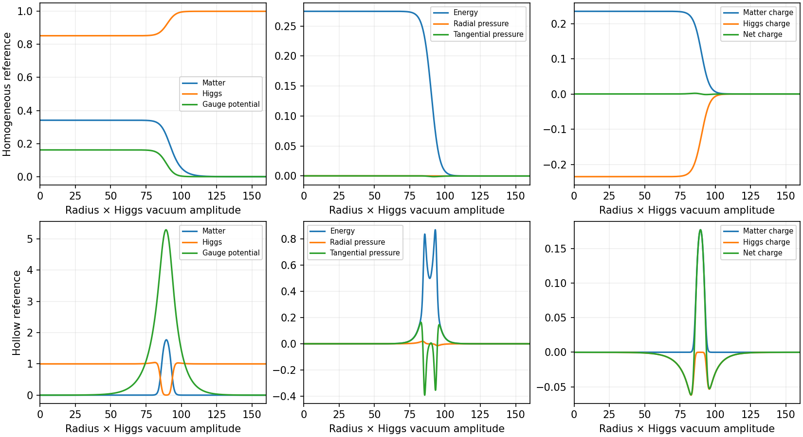
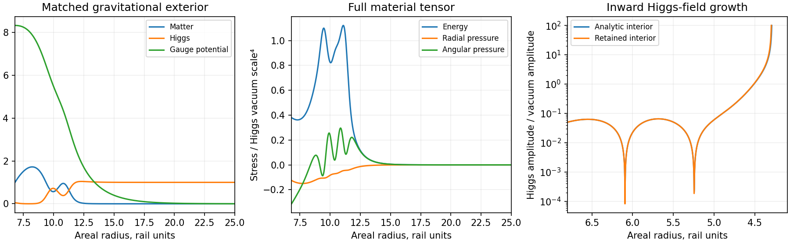

# Screened scalar condensates for rail support

A self-gravitating screened condensate exterior matches the retained rail's mass, lapse gradient, and radial pressure at areal radius 6.8. Its scalar and gauge fields carry equal and opposite integrated charges, and their outer profiles approach the Higgs vacuum. The selected exterior's inward material continuation develops pole-like scalar growth near areal radius 4.293. Tolerance controls and nine nearby boundary choices reproduce that obstruction. The resulting boundary data support an exterior equilibrium while failing the regular stationary material continuation through the retained rail.

## Material model and reference solutions

The Ishihara–Ogawa construction supplies a concrete material alternative to the charged wall and Fermi atmosphere. A complex matter field, a complex Higgs field, and a common gauge field form localized configurations. Their opposite charge densities screen the total electric charge, while the scalar potential and gradients determine the material boundary. Thus the same action specifies the material density, screening, and mechanical stress. The published families include approximately uniform balls and hollow condensate shells [1, 2]; their gravitational extension supplies the coupled Einstein–matter equations [3].

In units with the Higgs vacuum amplitude \(v=1\), the action is

\[
\mathcal L=-|D\psi|^2-|D\phi|^2-
\frac{\lambda}{4}(|\phi|^2-1)^2-\mu|\psi|^2|\phi|^2
-\frac14F_{ab}F^{ab}.
\]

The stationary ansatz uses \(\psi=u(r)e^{i\omega t}\), \(\phi=h(r)\), and \(A_t=a(r)\). The metric is

\[
ds^2=-\sigma^2N\,dt^2+N^{-1}dr^2+r^2d\Omega^2,
\qquad N=1-2m/r.
\]

Here radius and mass are measured in units of \(v^{-1}\), fields in units of \(v\), and stress in units of \(v^4\). The independent gravitational parameter is \(g=Gv^2\). The registered couplings are \(\lambda=1\), \(\mu=1.4\), and either \(e=1\) for the uniform reference or \(e=0.1\) for the hollow reference.

Define the positive constituent energies

\[
K=\frac{(\omega-ea)^2u^2+e^2a^2h^2}{\sigma^2N},\quad
D=N(u'^2+h'^2),\quad
V=\frac\lambda4(h^2-1)^2+\mu u^2h^2,\quad
E=\frac{a'^2}{2\sigma^2}.
\]

The complete orthonormal tensor follows directly from the action:

\[
\rho=K+D+V+E,\qquad p_r=K+D-V-E,\qquad
p_t=K-D-V+E.
\]

Consequently, \(\rho+p_r=2(K+D)\) and \(\rho+p_t=2(K+E)\). This classical material obeys the null and dominant energy conditions. Its role in the rail construction is supporting material alongside the quantum sector responsible for the required negative null stress.

### Reproduction and tensor checks

The flat controls impose regular derivatives at the origin and the Higgs vacuum at large radius. A coarse solve at the published, rounded frequency locates each branch. Refinement then fixes the conserved matter number and solves for the frequency. This removes the large radius sensitivity of the hollow shell to rounding in its quoted frequency. The retained reduced numbers \(\mathcal N/(4\pi)\) are 58,000 and 85,600, respectively.

| Quantity | Uniform reference | Hollow reference |
| --- | ---: | ---: |
| Frequency \(\omega\) | 1.1700008 | 0.8108910 |
| Energy / free-particle energy | 0.989303 | 0.685378 |
| Radius containing 50% of the energy | 71.8601 | 90.1305 |
| Radii containing 5% and 95% | 33.3528, 91.5390 | 82.0673, 97.3765 |
| \(\int p_t\,dr/\int\rho\,dr\) | 0.000456877 | 0.00192324 |
| Minimum local \(p_t\) | −0.001068 | −0.392795 |
| Maximum local \(p_t\) | 0.000245 | 0.164387 |

Both references reproduce the expected material localization and charge screening. Their energies lie below the energy of the same number of free matter particles. That comparison establishes binding against dissociation into those particles; the spectrum of coupled material and gravitational perturbations remains a separate calculation.

The local stress has both tension and compression. In particular, the negative angular pressure in the hollow profile occupies only part of its material layer. The complete radial tensor satisfies

\[
p_r'=\frac{2}{r}(p_t-p_r),\qquad
\int_0^\infty r^2(p_r+2p_t)\,dr=0,\qquad
\int_0^\infty p_t\,dr=\frac12\int_0^\infty p_r\,dr.
\]

The last identity follows by integrating \(r p_r'=2(p_t-p_r)\) and using the vanishing boundary term. Both retained column pressures are positive. Therefore selecting only the negative local portion would omit part of the same condensate's mechanical stress.

For comparison, the previously derived thin junction at \(R=6.8\), \(b=1.75\), requires \(P/\Sigma\ge b/[2(R-b)]=0.173267\). The unmodified flat reference columns are substantially below that value, and a common material normalization preserves their ratios. This comparison motivates solving the loaded, finite gravitational configuration with its boundary conditions. The finite profiles have curvature and internal stress structure which a column ratio alone cannot represent.



### Homogeneous fluid limit

The locally screened stationary branch has \(ea=[(\mu-\lambda)\omega+\sqrt{\mu(2\lambda+\mu)\omega^2-\mu\lambda(4\mu-\lambda)}]/(4\mu-\lambda)\), \(h=(\omega-ea)/\sqrt\mu\), and \(u^2=ea(\omega-ea)/\mu\). It reaches zero pressure at \(\omega=\sqrt{2\sqrt{\lambda\mu}-\lambda}=1.1689448\). A narrow interval of negative bulk pressure extends toward the stationary-branch endpoint at 1.1631600.

The rail boundary demands negative radial pressure. For an isotropic positive-density static fluid with positive enclosed mass, the TOV equation gives \(p'=-\rho m/(r^2N)<0\) at a zero-pressure surface. A solution beginning with negative pressure on the inside cannot first reach that free surface by increasing outward through zero. Accordingly, the scalar gradients and gauge stresses are essential to a finite condensate construction surrounding this boundary. They provide the anisotropic terms absent from a homogeneous fluid equation of state.

### Reproducibility

The retained eight runs use tolerances \(10^{-5},10^{-7},10^{-9}\) and an outer-domain extension from 250 to 300. All charge cancellation errors are below \(2.8\times10^{-9}\), and the integrated virial errors are below \(1.0\times10^{-8}\). Nine unit and reference tests check the stationary equations, thermodynamic derivative, null contractions, gravitational limits, charge cancellation, and integrated stress balance. The independent finite-difference stress-conservation check is limited by its sampling interval; the CSV records it separately from the collocation residual.

The four-worker reference run took 3.02 seconds and retained 0.78 MB. Its inputs and outputs are hashed in [the manifest](data/screened_condensate/manifest.json), with detailed results in [the reference table](data/screened_condensate/reference_checks.csv). Reproduction from the repository root:

```bash
PYTHONPATH=toolkit/adm_harness_cli OPENBLAS_NUM_THREADS=1 OMP_NUM_THREADS=1 python toolkit/adm_harness_cli/scripts/run_screened_condensate.py --workers 4 --output /tmp/rail-condensate-reference
PYTHONPATH=toolkit/adm_harness_cli OPENBLAS_NUM_THREADS=1 OMP_NUM_THREADS=1 pytest -q toolkit/adm_harness_cli/tests/test_screened_condensate.py
```

## Gravitational exterior matched to the rail

### Equations and boundary conditions

The Einstein equations accompanying the material equations are

\[
m'=4\pi g r^2\rho,\qquad
(\log\sigma)'=\frac{8\pi g r(K+D)}{N},\qquad
(\log\alpha)'=\frac{m+4\pi g r^3p_r}{r^2N},
\quad \alpha=\sigma\sqrt N.
\]

The scalar equations retain both lapse and radial metric derivatives. For \(C=2/r+(\log\sigma)'+N'/N\),

\[
u''=-Cu'+\frac{\mu h^2-(\omega-ea)^2/(\sigma^2N)}N u,
\]
\[
h''=-Ch'+\frac{\mu u^2+\lambda(h^2-1)/2-e^2a^2/(\sigma^2N)}N h,
\]
\[
a''=-\big[2/r-(\log\sigma)'\big]a'
+\frac{2e^2a(u^2+h^2)-2e\omega u^2}N.
\]

The retained geometry is the phase-0.745 snapshot used by the curved quantum-boundary harness. Its coordinate \(x\) has line element \(-A(x)^2dt^2+B(x)^2dx^2+R(x)^2d\Omega^2\). At \(R=6.8\), the exterior receives

\[
N_R=(R'/B)^2,\qquad m_R=\tfrac12R(1-N_R),\qquad
\frac{d\log\alpha}{dR}=\frac{A'/A}{R'}.
\]

The numerical geometry gives \(m_R=0.225187391\) in rail units, compared with 0.225183824 for the analytic tail approximation. The calculation uses the tabulated geometry and its derivatives consistently. The interior clock is multiplied by a constant to match the exterior lapse; this preserves the interior lapse gradient.

The chosen material scale places the join at dimensionless radius 20, so \(v=20/6.8=2.94117647\). At that join the conditional material data are \(u_R=1\), \(h_R=0.05\), \(a'_R=0\), and \(p_{r,R}=-0.125\) in condensate units. The radial Einstein equation fixes \(g\) from the retained mass and lapse gradient. At large radius the conditions are \(u=0\), \(h=1\), \(a=0\), and \(\sigma=1\). These nine boundary conditions determine the eight first-order fields and the frequency eigenvalue.

A fixed-Schwarzschild scalar solve supplies the numerical starting profile. Continuation of the material gravitational coupling from zero to its full value takes 24 accepted stages. Intermediate coupling fractions serve as numerical starting problems. The final stage satisfies the full Einstein–matter equations above. Newton trial values receive a chart safeguard; the accepted solution is checked against the original equations at quarter-cell points away from the collocation equations.

### Exterior result

| Quantity | Retained exterior |
| --- | ---: |
| Frequency \(\omega\) | 0.96281356145 |
| Gravitational coupling \(g=Gv^2\) | \(5.2705421\times10^{-5}\) |
| Common conversion \(\eta=g/v^2\) in rail units | \(6.0927467\times10^{-6}\) |
| ADM mass in rail units | 2.39030163 |
| Minimum \(N\) | 0.62898034 |
| Lapse at the join | 0.7525440 |
| Radial pressure at the join, in geometric rail units | \(-5.6991156\times10^{-5}\) |
| Exterior energy radii containing 5%, 50%, and 95% | 7.76499, 10.39536, 12.36135 |
| Matter charge; opposite Higgs charge | approximately +13,075.4; −13,075.4 |

The exterior's density remains positive and its radial pressure starts negative. Its angular stress changes across the material layer. The mass and lapse-gradient conditions match both independent components of the junction's extrinsic curvature, giving zero distributional surface stress at the metric join. The electric derivative vanishes on the inner side; the asymptotic outer flux tends to zero with increasing numerical domain. Thus the screening charges belong to the scalar–Higgs material itself.

The physical qualification concerns the scalar boundary conditions: \(u_R\) and \(h_R\) specify values at an interior cut through the material. Their solved normal derivatives also have to continue into the rail. A rigid surface holding those values would contribute an additional material force and require its own action. The continuation calculation below enforces the derivatives supplied by the exterior.

Four refinements use tolerances \(10^{-6},10^{-8},10^{-10}\), with the outer dimensionless radius extended from 160 to 200. The finest off-collocation equation error is \(1.33\times10^{-10}\); boundary errors are below \(10^{-15}\). Independent integration reproduces the mass increment to relative error \(3.1\times10^{-14}\) and Gauss's law, including the finite outer electric flux, to \(1.9\times10^{-13}\). The net charge fraction falls from \(1.47\times10^{-8}\) at radius 160 to \(4.91\times10^{-11}\) at radius 200. The independently sampled radial force balance,

\[
p_r'=-(\rho+p_r)(\log\alpha)'+2(p_t-p_r)/r,
\]

has relative finite-difference error \(1.2\times10^{-5}\) for the primary profile. The table records this separately from the collocation checks.

## Interior regularity obstruction

### Continuation of the actual material data

The matter derivatives at the join are \(u'_R=0.315935334\) and \(h'_R=-0.028520951\), with \(a_R=8.31965578\). On the negative rail branch, increasing \(x\) points inward. Normal-derivative continuity therefore supplies

\[
\partial_x(u,h,a)_R=-v B_R\sqrt{N_R}\,\partial_r(u,h,a)_R.
\]

The inward calculation evolves the stationary field equations on the retained snapshot. It carries all three fields and their derivatives, including the Higgs phase's electric stress. It also repeats the calculation on the analytic ultrastatic tail as a geometry control. The target is coordinate \(x=0\); each solve stops early if either scalar amplitude reaches its registered threshold.

| Higgs amplitude reached | Areal radius, retained geometry | Estimated limiting radius |
| --- | ---: | ---: |
| 10 | 4.328147 | 4.291666 |
| 100 | 4.296173 | 4.292530 |
| 1,000 | 4.292896 | 4.292531 |

The fields initially oscillate as they extend inward. Subsequently, the Higgs field grows positive and the matter amplitude grows negative. Their quartic interaction then dominates the finite frequency and gauge contributions. The leading large-field equations admit the local behavior

\[
h\simeq\frac{\sqrt{2/\mu}}{Bv(x_* -x)},\qquad
\frac{|u|}{h}\longrightarrow\sqrt{1-\frac{\lambda}{2\mu}}=0.80178373,
\]

\[
\frac{h'}{h^2}\longrightarrow Bv\sqrt{\mu/2}.
\]

The observed amplitude ratio at threshold 1,000 is 0.801764, and the normalized slope ratio is 1.000032. The inferred pole position converges as the amplitude threshold increases. This behavior identifies a nonlinear material runaway at finite radius. It occurs before the continuation reaches the rail core and persists in the analytic-tail control, whose estimated limiting radius is 4.287053.

Sixteen checks combine two exterior tolerances, both interior geometries, amplitude thresholds 10–1,000, and the independent DOP853 and Radau integration methods. All reach the amplitude event before coordinate zero. A local boundary grid with \(u_R\in\{0.9,1,1.1\}\) and \(h_R\in\{0.03,0.05,0.07\}\) gives nine converged gravitational exteriors. Every inward continuation on that grid reaches amplitude 100 at an areal radius between 4.14589 and 4.40976. Thus the selected solution's immediate neighborhood shares the regularity obstruction.



### Construction consequence and scope

This model supplies a computable material action with distributed screening, scalar boundary structure, and a gravitational exterior capable of carrying the required radial load. Its selected boundary data fail the next necessary stationary regularity condition. Extending this branch by attaching the already-solved exterior to the retained rail would require a new interface source to change its scalar derivatives.

A further construction using the same fields would instead have to select inner and outer data together in a global boundary-value problem. The interior regularity conditions would participate in determining the frequency, amplitudes, and material scale. The present grid covers a local patch at fixed couplings, scale, and inner radial pressure. It establishes the failure of that patch; the larger parameter space and fully time-dependent fields remain open. The stationary snapshot omits the rail's time derivatives, so the result applies to this proposed equilibrium attachment.

The [joint-selection synthesis](CONDENSATE_JOINT_SELECTION_DIRECTION.md) combines this grid's monotone mass and event-radius trends with the earlier quantum placement and material constraints. It identifies the potential-dominated inner branch and the pressure-to-potential loading condition as concrete starting information for that global solve.

The exterior Einstein equations here contain the classical condensate stress. The supporting quantum sector, its common normalization, and the coupled angular perturbation spectrum still require a complete regular background. Those calculations remain beyond the regularity gate reached by this branch. In particular, the screened-condensate calculation alone supplies no new validation of the An–T–Le connection.

### Retained evidence and checks

The four-worker gravitational and inward audit took 14.19 seconds and retained 0.75 MB. Together with the flat references, the evidence occupies approximately 1.54 MB. The recorded maximum worker resident memory is about 333 MiB. Fourteen tests pass across the two condensate modules, including coordinate-transform consistency, integrated gravitational and electric sources, normal-derivative matching, and the observed large-field asymptotics.

The [manifest](data/condensate_rail/manifest.json) hashes the code, geometry, and numerical outputs. The [exterior refinements](data/condensate_rail/exterior_refinements.csv), [interior controls](data/condensate_rail/interior_regularities.csv), and [boundary neighborhood](data/condensate_rail/boundary_neighborhood.csv) retain the individual outcomes. Reproduction from the repository root:

```bash
PYTHONPATH=toolkit/adm_harness_cli OPENBLAS_NUM_THREADS=1 OMP_NUM_THREADS=1 MPLCONFIGDIR=/tmp/rail-condensate-mpl python toolkit/adm_harness_cli/scripts/run_condensate_rail.py --workers 4 --output /tmp/rail-condensate-matching
PYTHONPATH=toolkit/adm_harness_cli OPENBLAS_NUM_THREADS=1 OMP_NUM_THREADS=1 pytest -q toolkit/adm_harness_cli/tests/test_screened_condensate.py toolkit/adm_harness_cli/tests/test_condensate_rail.py
```

## References

1. H. Ishihara and T. Ogawa, “Homogeneous Balls in a Spontaneously Broken U(1) Gauge Theory” (2019), [arXiv:1901.08799](https://arxiv.org/abs/1901.08799).
2. H. Ishihara and T. Ogawa, “A Variety of Nontopological Solitons in a Spontaneously Broken U(1) Gauge Theory — Dust Balls, Shell Balls, and Potential Balls” (2021), [arXiv:2103.13732](https://arxiv.org/abs/2103.13732).
3. T. Ogawa and H. Ishihara, “Gravastars as nontopological solitons” (2024), [arXiv:2409.07818](https://arxiv.org/abs/2409.07818).
