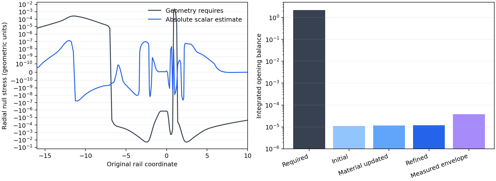

# Smooth joint condensate and quantum source

The quantum/material update at fixed physical couplings preserves a roughly five-order deficit in the integrated negative radial stress required by the two-ended rail. The material block admits a regular solution with the quantum Higgs force and fixed particle number. Its recalculated vacuum supplies too little negative radial stress for a nearby alternating geometry update. The bounded continuation therefore encounters an Einstein-source solvability barrier.

The joint source problem uses one smooth proper-distance chart,

\[
ds^2=-A(l)^2dt^2+dl^2+R(l)^2d\Omega^2,
\]

with the radius, lapse, condensate amplitudes, gauge potential, and quantum state determined consistently. The starting fields are the regular nodeless condensate. A Gaussian mollifier of proper width 0.25 gives a smooth numerical seed through its former geometric join. Its Einstein tensor is recomputed from the smoothed metric.

## Fixed model and renormalization conditions

The material couplings retain \(e=0.1\), \(\lambda=1\), \(\mu=1.4\), \(v=12/6.8\), and \(G=\eta=2.4127904527582454\times10^{-5}\) in rail length units. The quantum sector contains one real minimally coupled scalar in the static ground state, with \(V_\chi=\kappa v^2h^2\) and \(\kappa=1.4\). Its stress and Higgs force follow from a common renormalized effective action. The material number of the initial branch, approximately 48,954.28, supplies the conserved-charge target for a joint continuation.

An absolute source also requires finite renormalization conditions. Here the subtraction scale satisfies \(\mu_R^2=\kappa v^2\). The flat \(h=1\) vacuum has zero quantum energy and force, and its Higgs mass retains the registered value. More precisely, the added quantum potential and its first two derivatives with respect to \(V_\chi\) vanish there; higher derivatives retain the scalar's loop corrections. The vacuum Newton coefficient is fixed to the existing \(\eta\). Finite coefficients of \(R_{ab}R^{ab}\), \(\mathcal R^2\), and \(V_\chi\mathcal R\) are zero at this scale. These are explicit physical model choices for this round.

Writing \(m_0^2=\mu_R^2\), the homogeneous quantum potential is

\[
F(V)=\frac{V^2[\log(V/m_0^2)-3/2]+2m_0^2V-m_0^4/2}{64\pi^2},
\qquad \langle\chi^2\rangle_{\rm flat}=2F_V.
\]

Thus both the stress and force vanish at the flat exterior vacuum. A finite \(-m_0^2\mathcal R/(192\pi^2)\) action term fixes the vacuum Newton coefficient in the same convention.

## Coupled equations

Let \(r=\log R\), \(a=\log A\), and let a prime denote proper distance. For the complete orthonormal source \((\rho,p_r,p_t)\),

\[
r''=\frac{e^{-2r}-3r'^2-8\pi\rho}{2},\qquad
a''=8\pi p_t-a'^2-a'r'-r''-r'^2,
\]

while the radial constraint is

\[
\frac{-e^{-2r}+r'^2+2a'r'}{8\pi}=p_r.
\]

The source is \(\eta[v^4T_{\rm material}+\langle T_\chi\rangle]\). Material fields use the dimensionless distance \(s=vl\). The Higgs amplitude equation receives

\[
\delta h_{ss}=\frac{\kappa h\langle\chi^2\rangle}{2v^2}.
\]

The factor of two follows from the complex Higgs amplitude's kinetic term. This force supplies the exchange required by

\[
p_{r,Q}'+a'(\rho_Q+p_{r,Q})+2r'(p_{r,Q}-p_{t,Q})
=-\tfrac12\langle\chi^2\rangle V_\chi'.
\]

The matter equation supplies the opposite exchange. Consequently the complete source conserves stress and propagates the radial Einstein constraint. The implementation retains that constraint independently from the two metric evolution equations.

## Absolute-source calculation and acceptance

The numerical control uses Pauli–Villars squared masses \(V_\chi+iM^2\), \(i=0,1,2,3\), with weights \((1,-3,3,-1)\). Their sums cancel the quartic, quadratic, and logarithmic ultraviolet orders. Spherical Euclidean modes use the reduced field \(\sqrt A R\chi\), with potential

\[
U=\frac{\zeta^2}{A^2}+\frac{j(j+1)}{R^2}+V_\chi+
\frac{R''}{R}+\frac{A''}{2A}+\frac{A'R'}{AR}-\frac{A'^2}{4A^2}.
\]

An exact flat-space Bessel reference at each observation removes the large common homogeneous contribution before summation. Its physical, renormalized value is restored analytically. The remaining heavy-field action terms through the second heat-kernel coefficient are removed covariantly, including their curvature-squared and variable-potential variations. The local action is varied before setting the radial metric coefficient to unity, preserving the radial-pressure equation.

The heat-kernel construction follows [Vassilevich's account](https://arxiv.org/abs/hep-th/0306138). The common effective-action treatment of stress and variable-mass force is developed by [Franchino-Viñas, Mantiñan, and Mazzitelli](https://arxiv.org/abs/2110.14692). The mode representation follows the static spherical construction of [Arrechea and collaborators](https://arxiv.org/html/2607.07583v1).

The registered checks independently vary the radial mesh, frequency quadrature, angular range, regulator mass, and smooth-seed representation. Known flat-space modes, homogeneous vacuum conditions, local action variations, and constraint propagation provide analytic controls. Four workers perform independent angular calculations. A finite regulator value becomes eligible for geometric feedback only when these controls establish its limit and the quantum stress–force conservation identity is resolved. A failed numerical source check stops geometric feedback and yields a computational limitation for this round.

Ten focused tests pass. They include an independent high-precision Bessel comparison, second-order radial convergence, the local Ward identity, radial-constraint propagation with quantum material exchange, exact product-space modes, and the integrated two-ended Einstein balance.

## Integrated condition on the metric update

The radial null equation supplies a useful solvability condition for the entire joint system:

\[
\left(\frac{R'}A\right)'=-4\pi\frac RA(\rho+p_r).
\]

Consequently the transition from a decreasing radius at the negative end to an increasing radius at the positive end requires

\[
B_{\rm opening}=\left[\frac{R'}A\right]_-^+
=-4\pi\eta\int\frac RA
\left[v^4(\rho_{\rm material}+p_{r,\rm material})+
\rho_Q+p_{r,Q}\right]dl.
\]

The scalar–Higgs–gauge action has
\(\rho_{\rm material}+p_{r,\rm material}=2(K+D)\geq0\)
for every material configuration. Its quantum force changes the fields while preserving this algebraic property. Therefore, for a given quantum profile, an upper bound on its ability to open the geometry is

\[
B_Q^- =4\pi\eta\int\frac RA\max[-(\rho_Q+p_{r,Q}),0]dl.
\]

This deliberately generous bound omits every opposing quantum contribution and the complete positive material null stress. A necessary condition for the metric block is \(B_Q^-\geq B_{\rm opening}\). It tests the complete radial profile, including the enclosing material transitions.

The initial smooth seed has \(B_{\rm opening}=2.1765897951\) between the coordinate-40 observations. Independent geometric integration reproduces the endpoint difference. A shared mode calculation evaluates 141 observations with four workers. At regulator masses 4 and 8, its maximum quantum opening balances are \(1.09094\times10^{-5}\) and \(9.63362\times10^{-6}\), respectively. Thus the necessary ratio is approximately \(5.0\times10^{-6}\) or \(4.4\times10^{-6}\). The signed quantum integral is negative in both controls: its opposing contributions outweigh its helpful ones on this seed.

A fixed-charge material-block solve then includes the calculated quantum polarization in the Higgs equation. It preserves \(N=48954.28276875792\), selects \(\omega=0.8528237074\), and has independent equation residual \(2.50\times10^{-6}\). The largest amplitude change from the smoothed starting fields is 0.0595. The absolute vacuum is recalculated on these adjusted amplitudes before evaluating the subsequent metric step.

Recomputing that vacuum through harmonic 192 gives required-to-available opening ratios of approximately 189,694 and 213,708 at regulator masses 4 and 8. The material response changes the available quantum support by a few percent. The signed quantum opening balance remains negative. Thus the first quantum/material update preserves the large deficit in the metric equation.

The final refinement doubles the observation count, halves the radial spacing, and extends the angular and frequency calculations. It uses 133,684 radial nodes, 281 observations, harmonics through 256, and 320 frequency nodes. The resulting balances are:

| Calculation | Regulator mass | Maximum helpful quantum balance | Fraction of required opening |
| --- | ---: | ---: | ---: |
| Initial smooth seed | 4 | \(1.09094\times10^{-5}\) | \(5.01217\times10^{-6}\) |
| Initial smooth seed | 8 | \(9.63362\times10^{-6}\) | \(4.42602\times10^{-6}\) |
| After the material update | 4 | \(1.14742\times10^{-5}\) | \(5.27164\times10^{-6}\) |
| After the material update | 8 | \(1.01849\times10^{-5}\) | \(4.67929\times10^{-6}\) |
| Refined updated source | 4 | \(1.17052\times10^{-5}\) | \(5.37778\times10^{-6}\) |
| Refined updated source | 8 | \(1.06956\times10^{-5}\) | \(4.91395\times10^{-6}\) |

The final required-to-available ratios are 185,950 and 203,502. The signed quantum balances are \(-1.79137\times10^{-5}\) and \(-2.10925\times10^{-5}\), so the opposing quantum contributions exceed the helpful ones on the updated material. The geometric integral agrees with its independent endpoint value to \(4.95\times10^{-12}\) fractionally.

An empirical envelope combines the differences across these material, regulator, and numerical refinements with the fitted angular tails. Its opening integral is \(3.77917\times10^{-5}\), or \(1.73628\times10^{-5}\) of the requirement. Even doubling the geometric integration weight with this envelope supplies only \(3.47256\times10^{-5}\) of the required balance. The envelope measures the observed sensitivity; the finite-regulator calculations retain an unresolved continuum extrapolation error beyond these comparisons.



For a metric update with the quantum profile held fixed, the inequality applies to every classical material configuration, including a fully relaxed material solution. A step that increases the reference-coordinate measure \(R\,dl/A\) by at most a factor of two can at most double the available integral. The measured deficit exceeds this allowance by several orders. This supplies the stopping condition for the bounded alternating update.

A fully nonlinear fixed point also changes the quantum profile itself. Such a solution would have to generate a substantially larger negative quantum integral while preserving the rail requirements. The present calculation establishes the failed local update and the size of that remaining requirement; distant nonlinear branches retain an open existence question.

## Verification and scope

The absolute-source controls include a complete local-action subtraction through the curvature-squared ultraviolet order. Flat-space Bessel modes supply an exact reference. Regulator masses 2, 4, 8, and 16, angular sums through 192 and 384, frequency extensions, and local mesh refinement resolve the selected annulus estimates. Large-angular-order tails are fitted with inverse odd powers and compared against directly extended sums. These fitted tails carry a measured spread, retained in the numerical audit.

At coordinate \(-4\), the radial null source after the extended sum is approximately \(-2.38\times10^{-4}\) for regulator mass 8 and \(-2.42\times10^{-4}\) for mass 16, in one-field units. The finite regulator remains a numerical auxiliary. Its value is independent of the physical field count and of the fixed gravitational conversion \(\eta\).

The local conservation test at that annulus includes pressure gradients, lapse acceleration, angular anisotropy, and the material exchange term. At regulator masses 4 and 8, the relative residuals are \(3.56\times10^{-5}\) and \(3.26\times10^{-4}\). The throat controls instead give a small positive radial null stress, approximately \(5.35\times10^{-7}\) at regulator masses 2 and 4. Their available tail spreads preserve this sign. The integrated opening condition supplies the stronger profile-wide test.

Separate proper-distance stencils at the Higgs transition include a substantial quantum/material exchange term. Their relative conservation residuals are \(1.08\times10^{-4}\) and \(2.38\times10^{-4}\). Direct differentiation of the widely spaced profile observations retains large local truncation errors around rapid transitions; the [broad-stencil diagnostic](data/semiclassical_joint/audit/profile_ward_identity.csv) records its unconverged result. The [local conservation checks](data/semiclassical_joint/audit/ward_identity.csv) use independently evaluated nearby points.

The material solve uses the preceding quantum polarization. Recomputing the vacuum on the changed amplitudes provides the next block of the alternating iteration. The complete Einstein–material–quantum fixed point remains a further requirement. The stopping condition already follows from an optimistic integral that grants the classical material zero opposing null stress.

The recalculated polarization changes the Higgs-equation right-hand side by at most \(7.47\times10^{-5}\). Thus the material solve and the vacuum recalculation form one alternating iteration, with their remaining reciprocal residual recorded separately. The neutral scalar's lowest mode stays positive: its frequency changes from 0.211415 to 0.210714 across the material update. Three radial resolutions check this mode calculation. These frequencies describe the spectator field; coupled material and metric stability remains a subsequent problem.

The retained manifests identify numerical parameters, source hashes, artifact hashes, worker memory, and run time. Earlier source versions are checked against the staged commits. The numerical audit compares the regulator choices, the material response, and the final mesh and mode refinement. Its empirical envelope summarizes these observed changes and the fitted angular tails; it is distinct from a mathematical error bound on the continuum quantum theory.

Forty-nine relevant tests pass, covering the new joint equations and the existing condensate, vacuum-response, and curved-boundary calculations. The coupled-action tests verify the Higgs-force coefficient, quantum/material exchange, radial-constraint propagation, exact product-space modes, and the two-ended integrated Einstein identity.

The scripts retain numerical arrays, tables, and a scientific figure. This narrative report is written manually. The complete active An–T–Le construction remains contingent on an adequate self-consistent source, followed by stability and rail-evolution checks.

The eleven retained mode runs total 28.04 minutes. They use two or four workers per run, with a maximum of six during overlap. The largest measured mode-worker resident memory is 206.5 MiB. Retained evidence occupies approximately 10 MB. The [opening comparisons](data/semiclassical_joint/audit/opening_comparisons.csv), [local source controls](data/semiclassical_joint/audit/local_source_controls.csv), [spectral checks](data/semiclassical_joint/audit/spectral_gap.csv), and [audit](data/semiclassical_joint/audit/audit.json) retain the numerical details and source provenance.

## Reproduction

The research dependencies are available through the harness's `semiclassical` optional dependency group. From the repository root, a fresh numerical sequence is:

```bash
export PYTHONPATH=toolkit/adm_harness_cli
export OPENBLAS_NUM_THREADS=1 OMP_NUM_THREADS=1
python toolkit/adm_harness_cli/scripts/run_semiclassical_feedback.py --output /tmp/rail-joint-repeat/initial_profile
python toolkit/adm_harness_cli/scripts/run_semiclassical_material.py --source /tmp/rail-joint-repeat/initial_profile --output /tmp/rail-joint-repeat/material_update
python toolkit/adm_harness_cli/scripts/run_semiclassical_feedback.py --output /tmp/rail-joint-repeat/updated_192 --material /tmp/rail-joint-repeat/material_update/material.npz --angular-max 192 --frequency-nodes 256 --local-frequency-upper 192
python toolkit/adm_harness_cli/scripts/run_semiclassical_feedback.py --output /tmp/rail-joint-repeat/updated_fine --material /tmp/rail-joint-repeat/material_update/material.npz --spacing .0025 --angular-max 256 --frequency-nodes 320 --local-frequency-upper 256 --witness-refinement 2
```

The control manifests retain their individual frequency, angular, regulator, and proper-offset arguments for `run_semiclassical_control.py`. The committed evidence can be checked and its numeric tables and figure rebuilt with:

```bash
PYTHONPATH=toolkit/adm_harness_cli OPENBLAS_NUM_THREADS=1 OMP_NUM_THREADS=1 MPLCONFIGDIR=/tmp/rail-joint-mpl python toolkit/adm_harness_cli/scripts/audit_semiclassical_feedback.py
PYTHONPATH=toolkit/adm_harness_cli OPENBLAS_NUM_THREADS=1 OMP_NUM_THREADS=1 pytest -q toolkit/adm_harness_cli/tests/test_semiclassical_joint.py toolkit/adm_harness_cli/tests/test_condensate_vacuum.py toolkit/adm_harness_cli/tests/test_curved_boundary.py toolkit/adm_harness_cli/tests/test_condensate_joint.py toolkit/adm_harness_cli/tests/test_condensate_rail.py toolkit/adm_harness_cli/tests/test_screened_condensate.py
```
