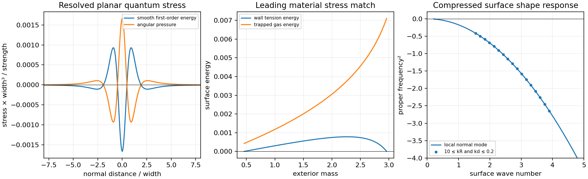

# Smooth Quantum Mirror with Trapped Material

Date: 9 September 2026.

The enclosing boundary selected by the curved scalar calculation requires
positive tangential surface pressure. A resolved scalar wall supplies its
own thickness and tension. Fermions bound to that wall provide a concrete
source of tangential pressure. This attempt examines their common material
description and its first quantum and mechanical conditions.

## Field model and literature basis

[Mazzitelli, Nery and Satz](https://arxiv.org/abs/1110.3554), equations
(2), (12)–(14) and (37)–(38), give a semiclassical scalar mirror model,
its gravitational and material counterterms, and a renormalized stress
for smooth weak potentials. [Franchino-Viñas, Mantiñan and Mazzitelli](https://arxiv.org/abs/2110.14692)
extend the stress and force analysis and establish the common conservation
law. A prescribed mirror profile supplies scattering data; a material
solution additionally satisfies the mirror equation with its quantum force.

The explicit wall profile follows
[Olum and Graham](https://arxiv.org/abs/gr-qc/0205134). The pressure-bearing
component follows the wall-bound fermions of
[Ogure, Yoshida and Arafune](https://arxiv.org/abs/hep-ph/0212332).
The following combined action is the candidate examined here. These papers
establish its individual ingredients; the combined gravitating quantum
solution remains the construction problem.

In the local proper normal coordinate \(z\), use a canonical real wall
field \(\chi\), a quantum real scalar \(\phi\), and a Dirac field with
Yukawa mass \(y\chi\). Their scalar potential is
\[
U(\chi,\phi)=\frac{\lambda_\chi}{4}(\chi^2-v^2)^2
+\frac{g}{2}(v^2-\chi^2)\phi^2+\frac{\beta}{4}\phi^4.
\]
Positive \(\lambda_\chi,\beta\), with
\(\lambda_\chi\beta>g^2\), make this potential bounded below.
At leading order in the quantum backreaction the wall is
\[
\chi=v\tanh(z/d),\qquad
d=\frac{\sqrt2}{v\sqrt{\lambda_\chi}},\qquad
\tau=\int\rho_\chi dz=\frac{4v^2}{3d}.
\]
Its optical potential and integrated strength are
\[
V(z)=g(v^2-\chi^2)=\frac{\Lambda}{2d}\operatorname{sech}^2(z/d),
\qquad \Lambda=2gv^2d.
\]
Thus the same wall profile sets the reflection and the material gradient
energy. The vacuum scalar is massless outside the wall and minimally
coupled at the specified renormalization scale. Curvature counterterms
remain part of the covariant completion. The quartic vacuum interaction
enters beyond the Gaussian vacuum calculation.

The lowest planar fermion branch has dispersion \(E=|\mathbf p_\parallel|\)
and transverse wavefunction proportional to
\(\operatorname{sech}^{yvd}(z/d)\). Its zero-temperature surface gas has
\(p_F=\epsilon_F/2\), so the leading material surface equation of state is
\[
\Sigma=\tau+C n^{3/2},\qquad
P=-\tau+\tfrac12 C n^{3/2},\qquad
\frac{dP}{d\Sigma}=\frac12.
\]
This is a conserved particle-current specialization of a surface fluid.
Independent entropy dynamics can be added when a thermal state is needed.
The occupied modes have to remain confined, and their finite-size and
curvature corrections enter the complete material problem.

The microscopic formulas above use \(\hbar=c=1\). For a physical length
scale \(L\), the conversion to the dimensionless geometric surface stress
contains \(\eta=G\hbar/L^2\). A microscopic parameter match therefore
specifies \(\eta\) together with the field couplings and the occupied
fermion modes. The junction coefficients alone leave that match open.

## Registered calculations

The first calculation resolves the renormalized *planar, first-order*
vacuum stress throughout the smooth wall. With
\(\widehat V(k)=\Lambda(\pi k d/2)/\sinh(\pi k d/2)\), the minimal
scalar energy is
\[
\rho_Q^{(1)}(z)=-\frac{1}{96\pi^2}
\mathcal F^{-1}\!\left[k^2\log(k^2/\mu^2)\widehat V(k)\right],
\qquad p_{z,Q}^{(1)}=0,\quad p_{t,Q}^{(1)}=-\rho_Q^{(1)}.
\]
The inverse Fourier transform includes \(1/(2\pi)\). The small parameter
for this expansion is \(V(0)d^2=\Lambda d/2\). The field variance at
first order fixes a force at second order, so the first-order stress and
that force belong to different truncation orders. The numerical stress
benchmark uses \(\mu d=1\), \(\Lambda d/2=0.05\), and widths
0.025, 0.05 and 0.1. Changing \(\mu\) changes local material couplings
as well as the displayed quantum contribution.

The second calculation matches the leading material equation of state to
the existing \(R=6.8\) junction across its full allowed exterior-mass
range. This gives
\[
\tau=(\Sigma-2P)/3,\qquad \epsilon_F=2(\Sigma+P)/3.
\]
The surface energies at this stage are measured effective coefficients;
matching them to the microscopic action requires the quantum self-energy
and material corrections. The existing nonzero bulk momentum flux is
retained in the conditional radial response. A closed particle-number
evolution requires its own exchange calculation.

Both tangential density waves and normal shape perturbations are checked.
The latter are a separate condition from spherical radial stability.
Any instability in the leading material description stops its promotion
to a full curved vacuum calculation. Required additional bending or bulk
response is quantified without fitting a stabilizing coefficient.

Independent quadrature levels, a direct cosine-integral check, and the
far-wall thin-potential asymptote assess the quantum benchmark. Direct
surface-energy variations assess the mechanical quadratic form. Numerical
cases support one to six workers, with four used for the evidence run.
The evidence allowance is 20 MB and the registered computation allowance
is 600 seconds. The complete curved vacuum, quantum force, finite-width
material equilibrium and Einstein equations remain coupled requirements.

## Smooth stress and surface matching results

The first evidence run uses four workers and takes 2.94 seconds, retaining
0.57 MB. The resolved stress is finite at the wall center and at every
sample through its smooth transition. For width 0.05, strength 2 and
\(\mu=20\), the first-order central energy is -26.5824572 in the
single-field quantum normalization. Positive shoulders and negative
outer tails accompany that central contribution. The profile depends on
the specified local renormalization convention.

At nine locations from the center to 40 widths, the 1,024-node integral
agrees with an independent adaptive cosine integral to a maximum relative
difference of \(5.66\times10^{-11}\). The 512-to-1,024-node change is
\(9.53\times10^{-9}\) of the profile peak and \(4.79\times10^{-4}\)
of the much smaller 40-width tail. The 256-node control under-resolves
the far oscillatory integral; the retained higher levels resolve it.
The \(-\Lambda/(48\pi^2|z|^3)\) tail is the asymptote of the
*first-order coefficient*. At finite strength, a Born approximation in the
exterior also requires \(\Lambda|z|\ll1\); the far-tail coefficient
check supplies a normalization test separately from that physical regime.

Positive wall tension and gas energy reproduce the junction for
\(0.459336278<M<2.963212742\). The specified surface law has positive
conditional radial frequency squared for
\(0.706038106<M<2.338601517\). At \(M=1.5\), the wall tension is
0.00055572145 and the gas energy is 0.00200447860. Their sum is the
required surface energy 0.00256020005, and their combined pressure is
0.000446517848. The gas longitudinal speed squared is 0.5.

The separate normal-shape diagnostic has negative stiffness throughout
the 1,029 scan rows that pass the material and radial checks. Direct
area-dependent energy variations reproduce that sign. This result selects
normal deformations as an additional material gate and blocks promotion
of the leading surface law by radial stability alone.



## Microscopic confinement audit

Let \(F\) count identical Dirac species, each with one positive-energy
massless branch on the wall. In dimensionless microscopic variables,
\[
\epsilon_F=\eta F\frac{k_F^3}{6\pi},\qquad
v^2=\frac{3\tau d}{4\eta},\qquad
\lambda_\chi=\frac{2}{v^2d^2},\qquad
g=\frac{\Lambda}{2v^2d}.
\]
Choosing \(\beta=2g^2/\lambda_\chi\) gives a strictly positive
quartic determinant. Define the normal localization parameter
\(a=yvd\). The squared transverse Dirac operator, with \(u=z/d\), is
\[
d^2 H_\perp^2=-\partial_u^2+a^2-a(a+1)\operatorname{sech}^2u.
\]
Its bound eigenvalues are \(n(2a-n)\), for integers \(0\le n<a\),
and its continuum threshold is \(a^2\). Consequently the single-branch
gas requires
\[
(k_Fd)^2<\begin{cases}a^2,&a\le1,\\2a-1,&a>1.\end{cases}
\]
This condition includes the first excited bound branch as well as escape
into the bulk. An independent centered finite-difference calculation at
normal spacings 0.04, 0.02 and 0.01 converges quadratically to the first
two analytic eigenvalues for \(a=1.5,2.1,4\).

The audit constructs twelve explicit tree-level matches: widths
0.025, 0.05 and 0.1, each with \(F=1,4,16,64\), using
\[
\eta=\frac{2\pi\epsilon_F d^3}{\sqrt3 F},\qquad a=2.1.
\]
These give \(k_Fd=\sqrt3<\sqrt{3.2}\), so the occupied gas remains
in the zero branch. Each match reproduces the stated wall energy, gas
energy and optical strength with positive scalar potential determinant.
The calculation establishes confinement and matching at the planar tree
level. Quantum vacuum dressing and curved equilibrium determine the
corrections to those coefficients.

Confinement also identifies a quantitative limitation on a weak-coupling
expansion. Set \(x=k_Fd\). The minimum required Yukawa coupling is
\[
y_{\min}(x)=\sqrt{\frac{8\pi\epsilon_F}{F\tau}}
\begin{cases}x^{-1/2},&x\le1,\\
(1+x^2)/(2x^{3/2}),&x>1.\end{cases}
\]
Its infimum occurs at \(x=\sqrt3\), with the strict band inequality
approached from above. For the \(M=1.5\) match this gives
\(y_{\min}=8.35374311/\sqrt F\). The corresponding collective measure is
\[
\frac{Fy_{\min}^2}{16\pi^2}
=\frac{2\epsilon_F}{3\sqrt3\pi\tau}=0.441918827.
\]
The explicit \(a=2.1\) cases give 0.487215506. Adding identical species
reduces their individual couplings while preserving this collective
measure. This quantity diagnoses the size of the coupling expansion;
the actual renormalized fermion correction requires its own calculation.

## Normal deformation and the stopping condition

For a local isotropic surface, let \(h\) denote displacement normal to
the layer. The leading extrinsic equation is
\[
\Sigma\,\partial_t^2 h+P\,\nabla_\parallel^2h=0,
\qquad \omega^2=-\frac P\Sigma k^2.
\]
The result follows from the surface stress contracted with extrinsic
curvature. It is equation (56) of
[Mourão, Natário and Vicente](https://arxiv.org/html/2409.10602v1),
and equations (8.6)–(8.11) of
[Emparan, Harmark, Niarchos and Obers](https://arxiv.org/abs/0910.1601).
The first paper also exhibits the distinction between radial and shape
stability for a gravitating spherical membrane. Its Schwarzschild test
membrane has a different bulk geometry from the rail junction; the common
local extrinsic equation is the condition used here.

The rail junction forces \(P>0\) throughout the positive-energy branch.
Writing \(x=M/R\),
\[
\frac{1-x}{\sqrt{1-2x}}\ge1>
\sqrt{1-b^2/R^2}
\]
proves the pressure sign directly for \(0<x<1/2\) and \(b>0\).
Thus positive \(\Sigma\) gives negative normal gradient stiffness.
This is a gradient instability with positive inertia. It persists under
changes of the surface equation of state that keep the required
\(\Sigma,P\), including the preceding quadratic-density surface fluid.

The fixed-particle-number energy supplies an independent check. For a
small corrugation \(h=A\cos(kx)\), its area ratio is
\(\mathcal A=1+A^2k^2/4+O(A^4)\). The energy per original area is
\[
E(\mathcal A)=\tau\mathcal A+
\epsilon_F\mathcal A^{-1/2},\qquad
\Delta E=-\frac{P k^2}{4}A^2+O(A^4).
\]
Increasing area lowers the gas energy enough to outweigh the wall's
additional tension energy. Direct numerical area integration confirms the
negative quadratic coefficient; the relative discrepancy is below
\(2\times10^{-7}\) at amplitude 0.00025. Reducing the gas loading to
a tension-dominated control reverses this sign.

For \(M=1.5\), \(-P/\Sigma=-0.174407406\). The local wavelength
label \(k=\sqrt{12\cdot13}/6.8=1.83676412\) has
\(kd=0.0918382\) at width 0.05 and \(kR=12.4900\).
The leading equation gives \(\omega^2=-0.588398687\), or an
e-folding time 1.30365944 in local proper units. These are local surface
diagnostics; the complete curved-space eigenvalue problem also contains
bulk, gravitational and quantum response.

A positive bending term would change the local dispersion to
\(\omega^2=(-Pk^2+Dk^4)/\Sigma\). At the displayed wavelength its
required coefficient is
\[
D\ge\frac{P}{k^2}=0.000132352470
=20.6785\,\Sigma d^2.
\]
This value specifies the restoring response required at the displayed
wavelength. The material coefficient remains to be computed from its action.
Finite thickness, fermion profile changes and the nonlocal quantum force
can contribute to that response; their magnitude and sign follow from
the microscopic action and state.

The bounded attempt therefore stops at the leading material's normal
instability. Smoothing the optical profile resolves the first-order local
boundary divergence, and the trapped gas supplies the required static
compression. A stable complete source additionally needs its own bending
or bulk-field restoring response. The present surface constitutive law
cannot pass that gate through a change of its gas density or wall tension
while retaining the junction. The full absolute curved quantum tensor and
coupled finite-width equilibrium have consequently remained unevaluated.

The [screened charged-wall calculation](SCREENED_CHARGED_WALL_RESPONSE.md)
derives a positive bending contribution from a surrounding charge cloud.
Its full static response saturates, and counting the cloud's energy and
pressure preserves the normal instability in the thin-cloud regime.
The optimistic crossing for the longest registered local ripple requires
a cloud length at least 0.30 times the enclosure radius, making the
curved atmosphere part of the source construction.

## Reproduction and retained evidence

The numerical outputs are in
[the first run](data/smooth_quantum_material/manifest.json) and
[the independent audit](data/smooth_quantum_material_audit/audit.json).
All 31 audit checks pass, including source hashes, quantum quadrature,
material reconstruction, occupied-mode confinement, spectral refinement
and the negative shape-energy direction. All 25 focused tests pass.
The evidence totals less than 0.7 MB; the two four-worker commands take
2.94 and 1.01 seconds on the current machine. A complete replay in external
temporary directories also passes all checks. Each command accepts a fresh
output directory for replay.

```bash
export OPENBLAS_NUM_THREADS=1 OMP_NUM_THREADS=1 MKL_NUM_THREADS=1
export PYTHONPATH=toolkit/adm_harness_cli
export MPLCONFIGDIR=/tmp/active-rail-mpl-cache
python toolkit/adm_harness_cli/scripts/run_smooth_mirror.py --workers 4 --output /tmp/rail-smooth-replay
python toolkit/adm_harness_cli/scripts/audit_smooth_mirror.py --workers 4 --input /tmp/rail-smooth-replay --output /tmp/rail-smooth-audit-replay
python -m pytest -q toolkit/adm_harness_cli/tests/test_smooth_mirror.py toolkit/adm_harness_cli/tests/test_smooth_mirror_material.py toolkit/adm_harness_cli/tests/test_spherical_support.py toolkit/adm_harness_cli/tests/test_curved_boundary.py
```
