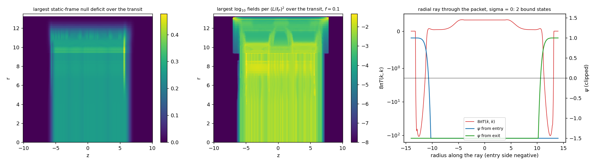

# Source Scaling Test: Supply Against the Transit Demand

Date: 2026-09-25. Context: the [lapse and staging pass](LAPSE_AND_STAGING_PASS.md)
leaves a demand that exists only around the packet during a transit: a
tension without energy on the lapse shoulders, with peak stress 2.9 in rail
units. The shape of that demand is fixed, and its magnitude scales as
\(1/L^2\) with the rail's unit length \(L\). This test measures how candidate
source families scale against it, as the physical-source stage of the
[source-feasibility workflow](SOURCE_FEASIBILITY_WORKFLOW.md). Code:
`adm_harness/source_scaling.py`. Run: `scripts/run_source_scaling_test.py`,
with data in [data/source_scaling_test](data/source_scaling_test/).

## Result

- **Quantum fields.** A quantum inequality fixes how many free fields the
  demand needs: \(N\ge Q\,(L/\ell_P)^2\), with \(Q=0.013\) when the sampling
  time is a tenth of the local curvature scale. That comes to about 560
  fields at the recorded normalization and \(5\times10^{67}\) at a unit
  length of one metre. By the species bound, that field count puts the scale
  where gravity becomes strongly coupled at \(\sqrt Q\,L=0.12\,L\), the
  demand's own sharpest curvature radius. Newtonian gravity holds down to
  52 μm, so quantum fields can supply this rail up to a unit length of about
  0.45 mm, or 3 cm with a sampling fraction of 0.01.
- **Casimir cavities.** A cavity supplies the demand's null-energy deficit
  at a gap of \(a=0.58\sqrt{\ell_P L}\): \(2\times10^{-18}\) m at one metre,
  with modes at 530 GeV. At every gap, the thinnest electron mirror that
  reflects those modes carries about \(10^{7}\) times the deficit it bounds.
  Casimir cavities therefore supply no net deficit at any scale, and the
  Casimir and positive-mass combination proposed in the staging pass has no
  working regime.
- **Curvature-coupled classical fields.** A scalar coupled to curvature
  through \(F(\phi)R\), together with ordinary matter, needs
  \(F''\le8\pi T(k,k)F\) along every light ray. Every radial ray through the
  packet from \(\sigma=-3\) to 2 carries a bound state of
  \(-d^2/d\lambda^2+8\pi T(k,k)\), and so does every ray launched at the
  sixteen deepest deficits. \(F\) must therefore vanish at the inner edge of
  the outer falls, \(r\approx10.65\), where the effective gravitational
  coupling diverges. The test is independent of scale.
- **Light co-moving with the lapse edges.** During the 2.1c lane, light
  along the track rides the plateau's rear edge, where the local light speed
  equals the lane speed. Its frequency changes by \(4.5\times10^{9}\) over
  one transit. Any quantum sector sourcing the rail has to stay regular
  across these surfaces.
- **The open family.** Classical scalars with higher-derivative kinetic terms
  (kinetic braiding, Galileons, beyond-Horndeski theories) produce a
  null-energy deficit classically, and their supply scales with the demand
  as \(1/L^2\). They are the one family that remains open for a rail of
  macroscopic size.



The left panel maps the largest static-frame null deficit reached at each
\((z,r)\) during the transit. The middle panel maps the largest field
requirement per \((L/\ell_P)^2\) there at sampling fraction 0.1. The right
panel follows the radial ray through the packet at \(\sigma=0\). It shows
\(8\pi T(k,k)\) on a symmetric log scale and the two zero-energy solutions,
clipped at \(\pm1.5\).

## The demand as a source target

Source units at fixed \((z,r,\phi)\) exist everywhere during the transit,
and the test measures the demand in their frame. Their proper time runs up
to 256 times the exterior time \(\sigma\). The static-frame null deficit
\(d=\max(0,-T(k,k))\), with \(u\cdot k=-1\), peaks at 0.48 at
\(\sigma=1.65\), \(z=5.6\), \(r=9.49\). That point sits where the outer falls
begin, near the track end as the packet coasts. Integrated over the rail, the
deficit peaks at 141 per unit \(\sigma\), reproducing the staging pass's
negative-null content. Inside the service region the deficit reaches 0.26
during the carry, so part of the demand lies in the packet's path.

## Quantum fields

### Method

For a massless scalar along an inertial worldline with 4-velocity \(u\),
Fewster and Roman (2003, Eq. III.10) bound the sampled null energy:

\[
\int\langle T_{ab}k^ak^b\rangle\,g(\tau)^2\,d\tau\;\ge\;
-\frac{(u\cdot k)^2}{12\pi^2}\int g''(\tau)^2\,d\tau .
\]

For a Gaussian \(g^2\) of standard deviation \(\tau_0\), the right side is
\(-(u\cdot k)^2/(64\pi^2\tau_0^4)\), and \(N\) independent fields multiply
it by \(N\). The flat-space form holds when \(\tau_0\) is short compared
with the curvature radius and the inverse acceleration along the worldline,
so \(\tau_0=f\,\ell\), with \(\ell\) the smaller of the two. A sustained
deficit \(d\) in rail units then requires

\[
N\;\ge\;64\pi^2\,d\,\tau_0^4\,\left(\frac{L}{\ell_P}\right)^2\equiv Q\left(\frac{L}{\ell_P}\right)^2 .
\]

Every quantity here comes from the metric the gate certifies:
- The Riemann tensor is computed from the field jets. Its contraction
  reproduces the generated Einstein tensor to \(10^{-15}\).
- The curvature radius is set by the largest orthonormal Riemann component
  in the static frame.
- The acceleration is that of observers at fixed \((z,r,\phi)\).

The test runs in two stages.
1. **Screen.** It covers every static worldline of a scan with spacing 0.05
   in \(\sigma\) and 0.1 in \(z\), at 193 radial nodes: 6.09 million points.
   Along each worldline the window obeys
   \(\tau_0\le f\times\)(the smallest scale within \(\pm3\tau_0\)), and the
   deficit history is averaged over the Gaussian.
2. **Targeted samplings.** Sixty leading worldlines receive an explicit
   sampling. Ten come from each radial zone of the main demand (deficit
   above 1% of its peak) and ten from the faint outer tail. Each keeps one
   null direction fixed along the worldline, the static-frame minimizing
   direction at the centre, and samples at most \(\tau_0/30\) in proper time
   and 0.005 in \(\sigma\).

### Requirement by zone

| Zone | \(Q\), \(f=0.01\) | \(Q\), \(f=0.1\) | \(Q\), \(f=0.3\) | Governing point at \(f=0.1\), \((\sigma,z,r)\) | Deficit there | \(\tau_0\) there |
|---|---:|---:|---:|---|---:|---:|
| service region | \(9.5\times10^{-7}\) | \(5.1\times10^{-3}\) | 0.17 | \((-2.35,-0.50,0)\) | 0.0099 | 0.17 |
| inner band | \(9.3\times10^{-7}\) | \(5.1\times10^{-3}\) | 0.17 | \((-2.45,-4.10,2.88)\) | 0.0099 | 0.17 |
| sheath rise | \(3.1\times10^{-6}\) | \(6.5\times10^{-3}\) | 0.29 | \((-3.35,-4.90,8.02)\) | 0.011 | 0.18 |
| sheath plateau | \(1.1\times10^{-6}\) | \(7.7\times10^{-3}\) | 0.39 | \((-1.35,0.40,8.81)\) | 0.0099 | 0.19 |
| outer falls | \(2.5\times10^{-6}\) | \(1.3\times10^{-2}\) | 0.82 | \((-3.40,-2.90,9.59)\) | 0.0070 | 0.24 |
| faint outer tail | \(3.0\times10^{-5}\) | \(3.0\times10^{-2}\) | 0.82 | \((2.70,7.80,13.08)\) | \(6\times10^{-7}\) | 14.8 |

Each column gives the largest value in its zone. The governing points of
the main demand carry modest deficits of about 0.01 across broad curvature,
with local scales of 2 to 2.5. They lie where the sheath and the lapse
windows switch on, at \(\sigma\approx-3.4\) to \(-1.35\). The deepest
deficit, 0.48, has a curvature scale of 0.31 and requires only
\(3\times10^{-4}\). The inequality weighs broad, gentle deficits over deep,
sharp ones, since \(Q\propto d\,\tau_0^4\). For the main demand, each
sampled average matches its pointwise value to within 0.5%. That match shows
the windows are short compared with the deficit's variation, and every
targeted value lies at or below its screen value.

The faint outer tail behaves differently. There the deficit arrives as a
brief pulse, \(\Delta\sigma\approx0.3\), along a worldline whose curvature
radius stays near 150. The admissible window is therefore long, and it
registers the pulse's net deficit, which is the quantum-interest effect: the
requirement grows as \(\tau_0^3\). The tail's value follows the shape of the
C\(^\infty\) edges, while the main demand sets the requirement of the
design's working regions.

### Field count and the species bound

| Unit length \(L\) | Fields, \(f=0.1\) | Fields, \(f=0.01\) |
|---|---:|---:|
| recorded normalization, \(204\,\ell_P\) | 560 | 0.13 |
| 1 μm | \(5.1\times10^{55}\) | \(1.2\times10^{52}\) |
| 1 mm | \(5.1\times10^{61}\) | \(1.2\times10^{58}\) |
| 1 m | \(5.1\times10^{67}\) | \(1.2\times10^{64}\) |
| 1 km | \(5.1\times10^{73}\) | \(1.2\times10^{70}\) |

The table uses the main demand. The faint tail raises the \(f=0.1\) counts
by a factor of 2.3.

\(N\) light fields bring gravity to strong coupling at the species length
\(\ell_*\approx\sqrt N\,\ell_P\) (Dvali 2010). With
\(N=Q\,(L/\ell_P)^2\), the species length is \(\ell_*=\sqrt Q\,L\), a fixed
fraction of the unit length at every scale:
- \(0.116\,L\) at \(f=0.1\), or \(0.17\,L\) with the tail;
- \(0.0018\,L\) at \(f=0.01\).

The demand's sharpest curvature radius, where the deficit exceeds 1% of
its peak, is \(0.117\,L\). At \(f=0.1\), then, the species length reaches the
demand's sharpest features. A quantum-sourced rail thus operates at the
gravitational cutoff of its own field content, whatever its size.

Newtonian gravity holds down to 52 μm (Lee et al. 2020), which bounds the
species length and with it the unit length,
\(L\le52\,\mu\mathrm{m}/\sqrt Q\):
- 0.45 mm at \(f=0.1\), or 0.30 mm with the tail;
- 2.9 cm at \(f=0.01\).

The double smeared null energy condition, whose bound grows with the number
of fields and the ultraviolet cutoff (Fliss, Freivogel and Kontou 2023),
carries the same scaling.

### Light surfaces co-moving with the lapse edges

The lapse rises from one in the exterior to \(e^{4}\) and more at the packet.
Along the track, the local light speed therefore passes through the lane
speed of 2.1 at the plateau's rear and front edges, and there light moves
with the pattern. The traced ray `axial_s+0.5_r0` rides the rear surface from
\(\sigma\approx-1.9\) to 0.4. Over that interval its static-frame frequency
falls by \(2.6\times10^{7}\), about 7.4 e-folds per unit \(\sigma\). Over the
whole transit it falls by \(4.5\times10^{9}\), a value that converges:
\(4.46\times10^{9}\) at integration steps 0.02 and 0.005.

Superluminal warp geometries share this structure. For quantum fields, the
renormalized stress at such surfaces grows exponentially with the lane's
duration (Finazzi, Liberati and Barceló 2009). The requirement above
applies to states that stay regular through the transit, and a quantum
source sector keeps that regularity across these surfaces during every
lane.

## Casimir cavities

Between ideal mirrors a gap \(a\) apart, the null-energy deficit along the
normal is \(\pi^2\hbar c/(180a^4)\). Matching the demand's peak deficit gives
\(a=0.58\sqrt{\ell_P L}\).

| Unit length | Gap | Gap over \(\bar\lambda_C\) | Mode energy \(2\pi\hbar c/a\) |
|---|---:|---:|---:|
| recorded normalization | \(1.3\times10^{-34}\) m | \(3.5\times10^{-22}\) | \(9.2\times10^{15}\) TeV |
| 1 μm | \(2.3\times10^{-21}\) m | \(6.1\times10^{-9}\) | 530 TeV |
| 1 mm | \(7.4\times10^{-20}\) m | \(1.9\times10^{-7}\) | 17 TeV |
| 1 m | \(2.3\times10^{-18}\) m | \(6.1\times10^{-6}\) | 530 GeV |
| 1 km | \(7.4\times10^{-17}\) m | \(1.9\times10^{-4}\) | 17 GeV |

A mirror reflects modes below its plasma frequency and must be at least one
skin depth thick. Let the mirror's plasma frequency be \(k\) times
\(2\pi c/a\), and compare the energy of one skin depth of its electrons
with the cavity's null-energy deficit, per unit area. The comparison runs
in two regimes, with \(\bar\lambda_C\) the electron's reduced Compton
wavelength.
- **Non-relativistic electrons**, which requires
  \(a\gtrsim113\,k\,\bar\lambda_C\). Their rest energy exceeds the deficit by
  \[
  \frac{90\,k}{\pi^2\alpha}\left(\frac{a}{\bar\lambda_C}\right)^2\approx1250\,k\left(\frac{a}{\bar\lambda_C}\right)^2 ,
  \]
  which is above \(1.6\times10^{7}\) throughout this regime.
- **Ultra-relativistic electrons**, at smaller gaps. Here
  \(\omega_p^2=(4\alpha/3\pi)\,c^2k_F^2\) and the energy density is
  \(\hbar c\,k_F^4/4\pi^2\). One skin depth then carries
  \(1.2\times10^{7}\,k^3\) times the deficit, independent of the gap.

The two regimes meet within a factor of 1.4, and ions or positrons only add
energy. For every rail below \(3.5\times10^{14}\) m, about 2,300 AU, in
unit length, the demand's gap lies in the ultra-relativistic regime; a
metre-scale rail needs modes at 530 GeV. In both regimes the mirror's energy
exceeds the deficit it bounds by about \(10^{7}\) or more.

## Curvature-coupled classical fields

Take a scalar with action
\((1/16\pi G)R-\tfrac12(\partial\phi)^2-V(\phi)-\tfrac12\xi R\phi^2\) plus
matter, and let \(F=1-8\pi G\xi\phi^2\). The field equations read

\[
F\,G_{ab}=8\pi G\left(T^{\phi}_{ab}+T^{m}_{ab}\right)+\nabla_a\nabla_bF-g_{ab}\Box F ,
\]

with \(T^{\phi}\) the minimally coupled stress. Along an affinely
parametrized null geodesic, \(g(k,k)=0\) and \((k\cdot\nabla)^2F=F''\), so

\[
F''=F\,G(k,k)-8\pi G\left[(k\cdot\partial\phi)^2+T^m(k,k)\right]\;\le\;8\pi T(k,k)\,F ,
\]

with \(T\) the demanded tensor. \(F>0\) keeps the effective coupling
\(G/F\) positive and finite. The same inequality covers any \(F(\phi)R\)
coupling with a healthy kinetic term.

The zero-energy solution \(\psi''=8\pi T(k,k)\,\psi\), started at
\(\psi=1\), \(\psi'=0\) where the ray enters from flat space, bounds every
such \(F\). The Wronskian of \(F\) and \(\psi\) is non-increasing, so
\(F/\psi\) cannot rise before \(\psi\)'s first zero, and \(F\) vanishes by
that point. When \(\psi\) stays positive but leaves the structure with
negative slope, \(F\) stays concave in the flat exterior and reaches zero
there. The count of these zeros equals the number of bound states of
\(-d^2/d\lambda^2+8\pi T(k,k)\) on the ray. The test is therefore
independent of the ray's normalization and of \(L\).

Forty-four rays were traced both ways through the demand:
- integration by RK4 in coordinate arc length with step 0.02;
- null-norm drift at most \(2\times10^{-4}\) of the local static frequency
  squared;
- every ray ends in exact vacuum.

| Ray family | Rays | With bound states | Negative null integral | First zero of \(\psi\) |
|---|---:|---:|---:|---|
| launched at the 16 deepest deficits, minimizing direction | 16 | 16 | 16 | \(r=7.1\)–11.3 |
| radial diameters through the packet, \(\sigma=-3\) to 2 | 8 | 8 | 6 | \(r\approx10.65\) |
| along the track at \(r=0,3,6,9,11\) | 12 | 1 | 1 | \(r=11.4\) |
| faint outer tail | 8 | 1 | 1 | beyond the structure |

The counts from the entry and exit sides agree on every ray. The radial
diameter at \(\sigma=0\) shows the mechanism, in the figure's right panel:
- **Interior.** \(8\pi T(k,k)\) stays near \(+0.3\) through the service
  region and the inner band.
- **Outer falls.** It reaches \(-109\) there. Light leaving the plateau
  gains a factor of about 55 in frequency, and the falls bend \(\psi'\) down
  by about 2.9 on each side.
- **Zero crossing.** The high-lapse interior spans 34 affine units, so
  \(\psi\) crosses zero at \(r\approx10.7\) before the interior's positive
  null energy acts.

For a static radial profile, the falls contribute
\((E/8\pi)\int\alpha'/(r\alpha^2)\,dr\), which is negative wherever the lapse
drops back to one. Every lapse hill that returns to flat space carries this
term.

\(F\) therefore reaches zero on these rays at \(r\approx10.65\) throughout
the carry. There the scalar reaches \(8\pi G\xi\phi^2=1\), and the effective
gravitational coupling diverges and then changes sign. The classical
wormhole results agree:
- Barceló and Visser (2000) found that curvature-coupled scalars reach
  trans-Planckian values in their traversable wormholes.
- Butcher (2015) proved that classical scalars with non-exotic matter
  support no static spherical traversable wormhole while the effective
  Newton constant stays positive and finite.
- Within effective field theory, with the field range below the cutoff,
  curvature-coupled scalars obey the averaged null energy condition (Fliss,
  Freivogel, Kontou and Pardo Santos 2024).

## Classical fields with higher-derivative kinetic terms

Scalar theories whose action contains second derivatives of the field, such
as kinetic gravity braiding, Galileons and beyond-Horndeski theories, can
violate the null energy condition classically without ghosts on suitable
backgrounds (Deffayet, Pujolàs, Sawicki and Vikman 2010; Rubakov 2014). Two
wormhole results mark the boundary:
- Horndeski theories admit no stable static spherical wormhole (Evseev and
  Melichev 2018).
- Beyond-Horndeski theories admit wormholes free of ghost and gradient
  instabilities (Franciolini, Hui, Penco, Santoni and Trincherini 2019).

Perturbations about null-energy-violating backgrounds in these theories
generally propagate faster than light (Dubovsky, Grégoire, Nicolis and
Rattazzi 2006).

Their supply is classical, so it scales as \(M_P^2/L^2\) with field
excursions of order the Planck mass, exactly like the demand. No \(\hbar\)
factor and no curvature-coupling obstruction limits the rail's size. A
construction would do three things:
- specify the action;
- solve for a configuration whose stress supplies the deficit in the outer
  falls and the sheath rise during each transit;
- establish the stability of its perturbations on that time-dependent
  background.

## Consequences for the design

1. **Where the quantum requirement comes from.** The requirement is set by
   broad, gentle deficits during the switch-on phases and in the outer
   falls. With \(d\) scaling as \(1/\ell^2\), \(Q\) scales as \(\ell^2\), so
   briefer switch-ons and thinner falls lower it. The species length has to
   stay below the sharpest of those features.
2. **Where the classical obstruction sits.** It lies in the outer falls,
   where the lapse returns to one, and its sign follows from the lapse hill
   itself.
3. **The service region.** It carries deficits up to 0.26 during the carry,
   in the packet's path.
4. **The static sheath.** It raises the screened requirement to 0.60. Its
   standing \(e^{1}\) sheath holds a weak deficit for long times, which the
   quantum inequality weighs heavily. The time-staged sheath removes it, at
   0.047.

This completes the source understanding the disclosure update waits on:
- the demand's algebraic class and placement;
- quantum sources limited to sub-millimetre unit lengths at the
  conventional sampling fraction;
- Casimir cavities and curvature-coupled scalars excluded;
- classical higher-derivative scalars open.

## References

- C. J. Fewster and T. A. Roman, "Null energy conditions in quantum field
  theory," Phys. Rev. D 67, 044003 (2003), arXiv:gr-qc/0209036.
- L. H. Ford and T. A. Roman, "Quantum field theory constrains traversable
  wormhole geometries," Phys. Rev. D 53, 5496 (1996).
- G. Dvali, "Black holes and large N species solution to the hierarchy
  problem," Fortsch. Phys. 58, 528 (2010), arXiv:0706.2050.
- J. G. Lee, E. G. Adelberger, T. S. Cook, S. M. Fleischer and
  B. R. Heckel, "New test of the gravitational \(1/r^2\) law at separations
  down to 52 μm," Phys. Rev. Lett. 124, 101101 (2020).
- J. R. Fliss, B. Freivogel and E.-A. Kontou, "The double smeared null
  energy condition," SciPost Phys. 14, 024 (2023).
- S. Finazzi, S. Liberati and C. Barceló, "Semiclassical instability of
  dynamical warp drives," Phys. Rev. D 79, 124017 (2009).
- C. Barceló and M. Visser, "Scalar fields, energy conditions and
  traversable wormholes," Class. Quantum Grav. 17, 3843 (2000).
- L. M. Butcher, "Traversable wormholes and classical scalar fields,"
  Phys. Rev. D 91, 124031 (2015).
- J. R. Fliss, B. Freivogel, E.-A. Kontou and D. Pardo Santos,
  "Non-minimal coupling, negative null energy, and effective field theory,"
  SciPost Phys. 16, 119 (2024).
- C. Deffayet, O. Pujolàs, I. Sawicki and A. Vikman, "Imperfect dark
  energy from kinetic gravity braiding," JCAP 10 (2010) 026.
- V. A. Rubakov, "The null energy condition and its violation,"
  Phys. Usp. 57, 128 (2014).
- O. A. Evseev and O. I. Melichev, "No static spherically symmetric
  wormholes in Horndeski theory," Phys. Rev. D 97, 124040 (2018).
- G. Franciolini, L. Hui, R. Penco, L. Santoni and E. Trincherini,
  "Stable wormholes in scalar-tensor theories," JHEP 01 (2019) 221.
- S. Dubovsky, T. Grégoire, A. Nicolis and R. Rattazzi, "Null energy
  condition and superluminal propagation," JHEP 03 (2006) 025.

## Reproduction

```bash
OPENBLAS_NUM_THREADS=1 python toolkit/adm_harness_cli/scripts/run_source_scaling_test.py --workers 4
PYTHONPATH=toolkit/adm_harness_cli:toolkit/adm_harness_cli/scripts python -m pytest toolkit/adm_harness_cli/tests/test_source_scaling.py
```

The run takes about 18 minutes with four workers:
- each design's scan takes about 3 minutes, and its screen under half a
  minute;
- the targeted samplings take 6 minutes;
- the ray survey takes 5 minutes.

The scans are saved in the scratch directory, and `--reuse-scan` loads
them. The manifest records the grids, the sampling fractions, the window
rules, the unit lengths and the software hashes.
