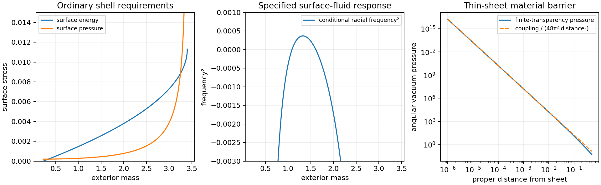

# Material Closure of the Outer Spherical Boundary

Date: 9 September 2026.

The [curved-field search](CURVED_QUANTUM_BOUNDARY_SEARCH.md) selects an
enclosing outer boundary through its simultaneous radial and angular
vacuum response. This follow-up carries that placement into the surface
stress requirement and the field's local material limit.

## Registered junction and material checks

At areal radius \(R=6.8\), the retained initial lapse and radial proper
scale are one to floating-point precision. The analytic asymptotic tail
has interior radial function \(f_-=1-b^2/R^2\), with \(b=1.75\),
and constant lapse. The remaining areal-radius deformation changes the
retained \(f\) there by \(1.05\times10^{-6}\). This junction check
uses the analytic tail.
A Schwarzschild exterior has \(f_+=1-2M/R\). This exterior replaces
the original tail beyond the new wall. Its mass and clock normalization
are therefore additional data in the proposed enclosing construction.

The static Israel conditions give
\[
\sigma=\frac{\sqrt{f_-}-\sqrt{f_+}}{4\pi R},\qquad
P=\frac{(1-M/R)/\sqrt{f_+}-\sqrt{f_-}}{8\pi R}.
\]
These are requirements on the total dressed surface source. The test scans
the full static range \(b^2/(2R)<M<R/2\), locates the dominant-energy
interval, and compares the preceding illustrative measured surface masses
0.25 and 1 with the positive-root junction bound
\(\sigma<\sqrt{f_-}/(4\pi R)\).
The normalization of the shell time matches its induced metric to both
bulks. A globally normalized exterior clock multiplies the interior lapse
by \(\sqrt{f_+}\) at this junction.

A specific local surface-fluid response is also assessed:
\(\sigma(n)=n+K n^2\), \(P(n)=K n^2\), with positive \(n,K\).
At a chosen equilibrium its parameters are
\(n_0=\sigma_0-P_0\) and \(K=P_0/n_0^2\), and its characteristic
speed squared is \(\eta=2P_0/(\sigma_0+P_0)\). The static junction
curves determine the conditional radial frequency
\[
\omega_R^2=\frac{8\pi[P_0'-\eta\sigma_0']}
{1/\sqrt{f_+}-1/\sqrt{f_-}}.
\]
Here a prime varies the junction radius with the exterior mass fixed.
This derivative includes the nonzero interior momentum flux:
\[
\sigma_0'=-\frac{2(\sigma_0+P_0)}{R}+\Xi,\qquad
\Xi=\frac{b^2}{4\pi R^4\sqrt{f_-}}.
\]
The shell formulation and the role of this flux follow
[Lobo and Crawford](https://arxiv.org/abs/gr-qc/0507063).
The calculation specifies a local response of the total surface source
while keeping the two bulk geometries prescribed. A microscopic material
would also determine its optical coupling, particle and heat exchange,
and quantum contribution to the surface response.

## Surface material results

The enclosed tail mass at the wall is 0.225183824. Ordinary surface energy
and pressure satisfying the dominant energy condition occur for exterior
mass between 0.339343399 and 3.248921307. The specified surface-fluid
response has positive conditional radial frequency squared for
\(1.085628969<M<1.611602548\), entirely within that ordinary interval.

For exterior mass 1.5, the surface requirements are:

| Quantity | Value |
|---|---:|
| Surface energy density \(\sigma\) | 0.002560200 |
| Tangential surface pressure \(P\) | 0.000446518 |
| Proper shell mass \(4\pi R^2\sigma\) | 1.487652823 |
| Surface-fluid characteristic speed squared | 0.297013464 |
| Conditional radial frequency squared | 0.000228485 |
| Required momentum-flux coefficient \(\Xi\) | 0.000117953 |
| Exterior lapse at the shell | 0.747545002 |

The corresponding fluid parameters are \(n_0=0.002113682\) and
\(K=99.944625\). This provides a concrete positive-pressure response
to examine for the supporting layer. A surface with pure positive tension
has \(P=-\sigma\); the required compression selects a different
surface constitutive response.

The positive-root mass-density ceiling is 0.011308397. The earlier planar
illustrations with measured mass per area 0.25 and 1 exceed this spherical
junction ceiling by factors 22.11 and 88.43 when their units are identified
with the present rail-length normalization. The shell mass therefore has
to be matched to the enclosing construction. A general physical scaling
also fixes the conversion between the quantum and gravitational units.

The scan contains 2,001 exterior masses. Direct radius differentiation
checks both static stress derivatives, and the full surface conservation
identity closes within \(5.48\times10^{-17}\). The nonzero flux is
retained in the conditional response. The junction's Schwarzschild
exterior specifies a new global quantum mode problem; its vacuum tensor,
optical response, and surface dynamics belong to the same coupled source
calculation.

## Local quantum condition

The scalar remains massless and minimally coupled, with positive proper
sheet coupling \(\lambda\). At proper distance \(d>0\) from a sheet,
the leading local planar stress is
\[
\rho_Q=-C(d),\qquad p_{r,Q}=0,\qquad p_{t,Q}=C(d),
\]
where
\[
C(d)=\frac{1}{6\pi^2}\int_0^\infty
\kappa^3\frac{\lambda}{2\kappa+\lambda}e^{-2\kappa d}\,d\kappa.
\]
This expression retains finite transparency. At fixed positive coupling,
\[
C(d)\sim\frac{\lambda}{48\pi^2d^3}\quad(d\to0^+).
\]
The curved surface has this leading term on a background smooth at the
sheet; curvature corrections enter at lower order. The local planar
expression is consistent with the bulk stress and surface-energy treatment
of [Milton and collaborators](https://arxiv.org/abs/1401.0784).
The more general dependence of stresses on material boundary limits is
discussed by [Graham and collaborators](https://arxiv.org/abs/hep-th/0309130).

The local calculation checks this asymptote at three couplings and three
quadratures. Its consequence is a source condition: a bounded geometric
tensor and finite ordinary bulk stress cannot equal the thin-sheet vacuum
tensor arbitrarily close to the sheet. A counterterm confined to the
surface acts at \(d=0\); the displayed angular pressure occurs at every
positive nearby distance. The boundary-free vacuum on the same locally
smooth geometry supplies a finite term there. Likewise, a distant second
sheet supplies a finite interaction correction at this first sheet.

Consequently, the exact thin-sheet model has a hard barrier at a regular
complete material closure. The finite off-wall response remains a valid
placement calculation. A continuation requires a material layer with
finite thickness, a matched stress and optical response, and a recomputed
absolute quantum tensor on the resulting geometry. Those additions define
a new source construction; changing the present coupling or moving the
ideal sheet preserves its local singularity.

The local comparison uses 81 proper distances from \(10^{-6}\) through
0.5, couplings 1, 8, and 64, and 64-, 128-, and 256-node Laguerre
quadratures. At coupling 8 and distance \(10^{-6}\), the exact pressure
is 0.999996 times its \(d^{-3}\) asymptote. The final two quadratures
differ by at most \(3.63\times10^{-8}\) fractionally across the scan.
Both this singular limit and the ordinary shell requirements survive the
independent checks. The search stops at the complete material closure of
the ideal boundary.
