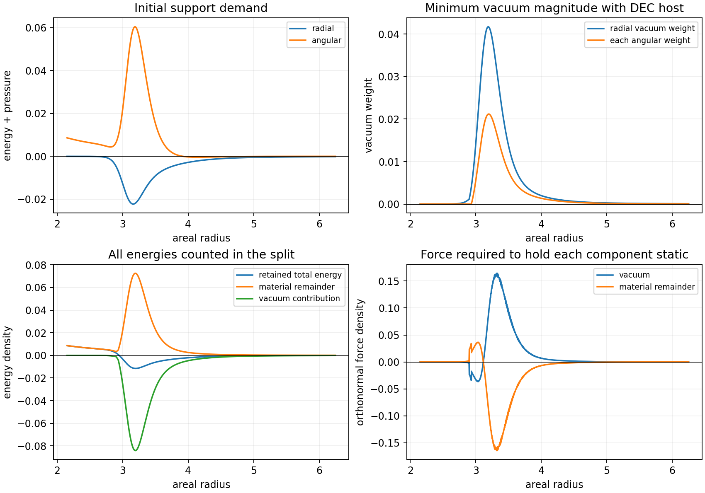

# Vacuum Stress and Supporting Material Selection

Date: 8 September 2026.

## Question and registered comparisons

The [two-current calculation](COMER_TWO_CURRENT_EVOLUTION_ROUND.md) supplies
independent ordinary particle and entropy evolution. Its explicit radial
tension has zero radial enthalpy, while the retained initial rail requires
negative radial enthalpy throughout the annulus. This investigation examines
vacuum stress as the additional signed sector and includes the stress of
the material associated with it.

The initial metric and all three diagonal Einstein-tensor channels remain
fixed. The source reference and its interpolation are the same as in the
two-current calculation. Four initial ordinary states are registered:
zero preload; preload fraction 0.01 with zero drift; fraction 0.01 with
particle drift amplitude 0.04; and fraction 0.1 with drift amplitude 0.04.
The entropy current initially opposes the particle current. Thus the net
initial current is zero in every case.

Round one compares a radial planar Casimir stress, a superposition with two
equal angular orientations, and the mechanical cost of independently
supported planar cells. For each vacuum split, the material remainder must
have nonnegative energy and principal pressures bounded in magnitude by
either its energy or half its energy. The first is the static dominant
energy condition; the second reserves a finite stress margin. Both are
necessary algebraic conditions, with constitutive and characteristic
conditions assessed separately.

The optimization minimizes the magnitude of the negative vacuum energy at
each radius. It uses 513, 1,025, and 2,049 evaluation points. These grids
refine the sampling and quadrature of the retained interpolant. The source
reference itself stays frozen. Independent linear programs will check the
vertex solver, including infeasible cases and controls. All split energies,
pressures, orientation weights, and material margins will be retained.

A second round is conditional on finding complete algebraic tensor fits.
It will examine the local constitutive dynamics of the same vacuum-plus-
material family, using a covariant stored-energy action and its quadratic
perturbations. Any failure of a necessary kinetic condition ends that
family before a new global evolution. Further fitted components and
changes to the rail's initial geometry fall outside these two rounds.

The computation uses four independent worker processes, single-thread
numerical libraries, a 600-second compute allowance, a 1,536 MiB address-space
limit per worker, and a 30 MB evidence allowance. Narrative findings are
written manually after each completed round.

## Source models and scope

[Brown and Maclay](https://www.quantumfields.com/old/brownmaclay.pdf), equations
(6)–(9), give the electromagnetic vacuum stress between ideal, static,
parallel conducting plates. With the plate normal radial, its source-frame
channels are
\[
(E_Q,P_{r,Q},P_{t,Q})=(-C,-3C,C),\qquad
C=\frac{\pi^2\hbar c}{720a^4}>0.
\]
Two equal angular orientations and one radial orientation give the
algebraic family
\[
E_Q=-C_r-2C_t,\quad P_{r,Q}=-3C_r+2C_t,\quad
P_{t,Q}=C_r-2C_t,\qquad C_r,C_t\geq0.
\]
Its radial and angular enthalpies are respectively \(-4C_r\) and
\(-4C_t\). These independent weights provide an optimistic tensor family.
Actual intersecting cavities require their own field calculation; their
vacuum stresses generally depend on the complete boundary geometry.

[Schwartz Perlov and Olum](https://arxiv.org/abs/hep-th/0307067v2) calculate
a minimally coupled scalar vacuum outside a reflecting spherical boundary.
That model has negative radial null projection and nonnegative azimuthal
null projection. Its directional signs make it a useful radial comparison;
regions of negative required angular enthalpy require additional structure.

[Costa and Matsas](https://arxiv.org/abs/2112.08881v3), equations (12)–(16),
include the auxiliary matter sustaining the planar vacuum. The normal
pressure needed to oppose its attraction is \(3C\). Matter satisfying the
dominant energy condition carries at least that much energy, leaving a
positive total energy of at least \(2C\) per cavity volume before adding
further plate mass. We apply this bound to independent static cells in
their locally flat limit. A curved structure carrying external traction
requires its own balance equations and lies beyond that cell argument.

## Round one: tensor fits and mechanical accounting

Let \((e,p_r,p_t)\) be the required support after subtracting the ordinary
currents. The host material carries the remainder after subtracting the
vacuum tensor. Writing \(S=C_r+2C_t\), its channels are
\[
E_H=e+S,\qquad P_{r,H}=p_r+4C_r-S,\qquad
P_{t,H}=p_t+S-2C_r.
\]
The constraints \(E_H\geq0\) and \(|P_{i,H}|\leq q E_H\), for
\(q=1\) or \(1/2\), define a two-variable linear program. Its objective
is \(S\). At \(q=1\), the exact optimum has the closed form
\[
C_r=\max\left(0,-\frac{e+p_r}{4},\frac{p_t-e}{2}\right),\qquad
C_t=\max\left(0,-\frac{e+p_t}{4},\frac{2C_r+p_r-e}{4}\right).
\]
The last lower bounds arise from the material's dominant energy condition.
Consequently the required angular vacuum weight can remain positive even
where the support's angular enthalpy is positive.

All 24 two-orientation comparisons fit every sampled radius. They span four
ordinary states, three grids, and both host pressure caps. The largest
normalized three-channel reconstruction error is below
\(7\times10^{-16}\). The complete initial pressure and mass therefore
match algebraically at both boundaries. This closes the pressure mismatch
at the level of tensor decomposition.

Every radial-only comparison has infeasible points. On the 2,049-point grid,
the radial family admits 391 points with a DEC host and 380 with the
half-energy pressure cap, for each registered ordinary state. In the
low-preload counterflow case, required support angular enthalpy is negative
at 1,165 points. The remaining radial-family failures also include the
material's energy and pressure constraints.

For the low-preload counterflow case, the finest-grid energy accounting is:

| Host pressure cap | Host coordinate mass contribution | Vacuum coordinate mass contribution | Host proper energy | Vacuum proper energy |
|---|---:|---:|---:|---:|
| \(|P_H|\leq E_H\) | 4.81921 | -5.65684 | 54.22076 | -10.87801 |
| \(|P_H|\leq E_H/2\) | 18.21402 | -19.05165 | 86.97820 | -43.63546 |

Coordinate mass contributions use \(4\pi\int r^2E\,dr\); proper energies
use \(4\pi\int r^2E/\sqrt f\,dr\). These are distinct quantities in
the retained curved metric. The ordinary coordinate mass is 0.00768639.
All components sum to the same initial annular mass contribution,
approximately -0.829941. The annular integral excludes the mass enclosed
inside the inner boundary. The table exhibits substantial positive and
negative component cancellation and the additional cost of reserving a
host stress margin.

Independent static force diagnostics use
\[
F_{\hat r}=\sqrt f\left[P_r'+\nu'(E+P_r)
                    +\frac2r(P_r-P_t)\right].
\]
The low-preload DEC split requires a maximum vacuum force magnitude of
approximately 0.16434. Component force sums reproduce the total tensor's
force to below \(6\times10^{-15}\). These are forces required to hold the
split static; a physical boundary and exchange law must supply them.
Pointwise minimum-energy weights can develop derivative kinks where the
active linear constraint changes. Their force profiles are diagnostic
consequences of the algebraic optimum.

The energy bound for independently supported planar cells has an immediate
implication. Each cell has nonnegative total averaged energy, at least
\(2C\), while the required annular energy density is negative over a large
part of the domain. Arrays of such independently supported cells and
ordinary positive-energy matter therefore fail to reproduce this smooth
initial source. Externally loaded structures and a quantum field spread
over multiple boundaries retain a different force-balance problem.

The registered tensor-fit trigger for round two is satisfied. The next
calculation examines a local covariant stored-energy realization of the
same composite and its kinetic matrix. Round one took 4.78 seconds with
four workers and retained 12.12 MB of evidence. The maximum worker resident
memory was approximately 182 MiB. Six focused tests passed, including
independent five-variable linear programs and the closed-form DEC bound.

## Round two: covariant local material response

The conditional constitutive test assigns vacuum and host a common set of
three spatial material labels \(\phi^I\). In a local orthonormal patch,
normalize the static reference state to \(\phi^I=x^I\), and define
\[
B^{IJ}=g^{ab}\partial_a\phi^I\partial_b\phi^J,\qquad
S_{\rm support}=-\int\sqrt{-g}\,\rho(B,\phi)\,d^4x.
\]
Explicit dependence on the material labels permits an inhomogeneous host.
This lowest-derivative continuum construction follows the material-coordinate
description in [Dubovsky, Grégoire, Nicolis, and Rattazzi](https://arxiv.org/abs/hep-th/0512260v2),
section 5. The kinetic result below is derived directly for this
specialization. The same paper discusses more general backgrounds and
exceptions, so its broader claims require their stated assumptions.

Let \(d\) contain the independent entries of \(B-I\), with the three
diagonal entries first. A general local host Taylor law through the order
needed for quadratic perturbations is
\[
\rho_H=E_H+\frac12\sum_i(E_H+P_{i,H})d_i
              +\frac12 d^T H_H d.
\]
Here \(H_H\) is an arbitrary symmetric six-by-six matrix of stiffness and
shear derivatives. For the registered Casimir continuation, use
\[
\rho_Q=-\sum_i C_i(B^{ii})^2,\qquad (C_1,C_2,C_3)=(C_r,C_t,C_t).
\]
Since a principal proper stretch \(\lambda_i\) gives
\(B^{ii}=\lambda_i^{-2}\), the vacuum energy has the planar
\(\lambda_i^{-4}\) dependence. The virtual-work identity
\(P_i=-\rho-\partial\rho/\partial\log\lambda_i\) recovers every
fitted initial pressure. Both host and vacuum energies respond to the
evolving strain in this constitutive test.

Now perturb \(\phi^I=x^I+\pi^I\). At vanishing spatial perturbation
gradient,
\[
\delta B^{IJ}=-\dot\pi^I\dot\pi^J.
\]
Consequently the quadratic time-derivative part of the action is
\[
\mathcal L^{(2)}_{\rm time}=\frac12\sum_i K_i(\dot\pi^i)^2,
\qquad K_i=E_H+P_{i,H}-4C_i=e+p_i.
\]
Terms involving \(H_H\) start at fourth order in these velocities; their
quadratic contributions concern spatial gradients. The background stress
therefore fixes the time kinetic coefficients for any host stiffness in
this action family. State-dependent stiffness and material inhomogeneity
preserve that local identity.

A negative \(K_i\) supplies a direction of negative quadratic kinetic
energy. It fails the positive kinetic-energy criterion before one needs a
wave-speed search or a new Einstein evolution. Changing the gradient
energy can change the equations' growth rates while retaining this negative
kinetic direction. Thus the test distinguishes kinetic admissibility from
observing exponential growth in a particular numerical run.

The ordinary Comer currents retain independent motion and their previous
algebraic resistance. In this specialization, holding their perturbations
fixed leaves the support's negative kinetic direction available. The GR
tensor kinetic term remains unchanged: this issue resides in the proposed
material continuum.

The audit will differentiate the actual local action with three fixed host
stiffness controls and three velocity steps. It will retain all kinetic
matrices and eigenvalues for both host pressure caps and all four ordinary
states on the 2,049-point grid. A symbolic calculation with all 21
independent host stiffness entries verifies their absence from the time
kinetic matrix. Separate positive-material and pure-vacuum controls check
the signs. An independent five-variable linear program will also replay
selected feasible and infeasible first-round points while the complete
saved tensors and ordinary currents are reconstructed.

This constitutive test treats the vacuum contribution as a local stored
energy moving with the host. A quantum expectation value between physical
boundaries has additional field-state and boundary dynamics. Its negative
local stress does not itself identify a propagating negative-kinetic
material degree of freedom. Such a field calculation belongs to a broader
construction than the local action tested here.
